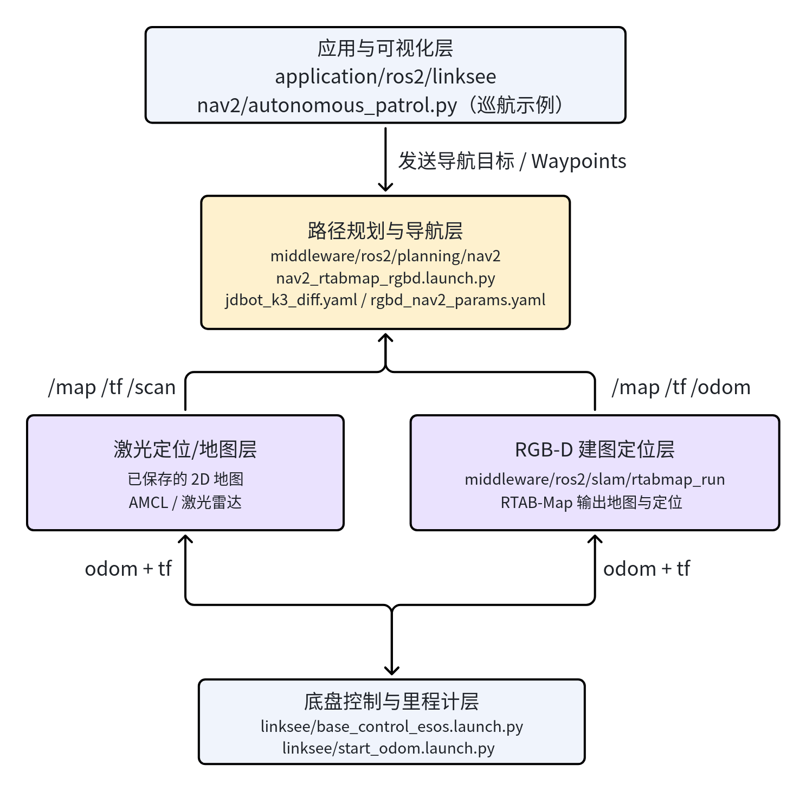
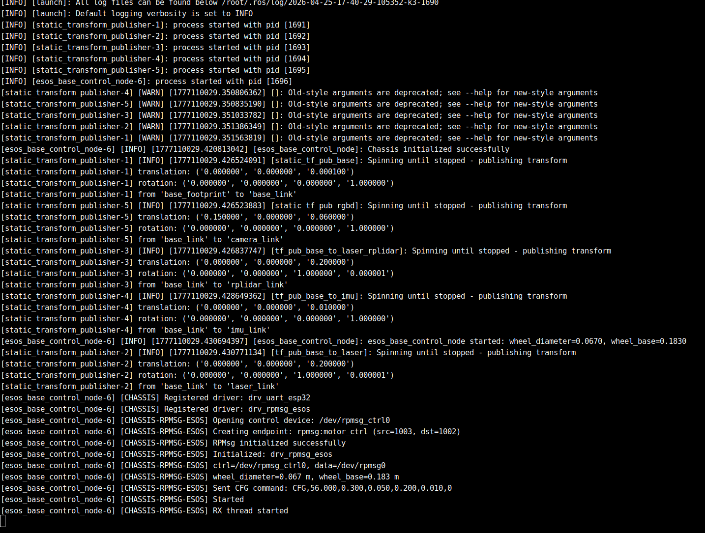
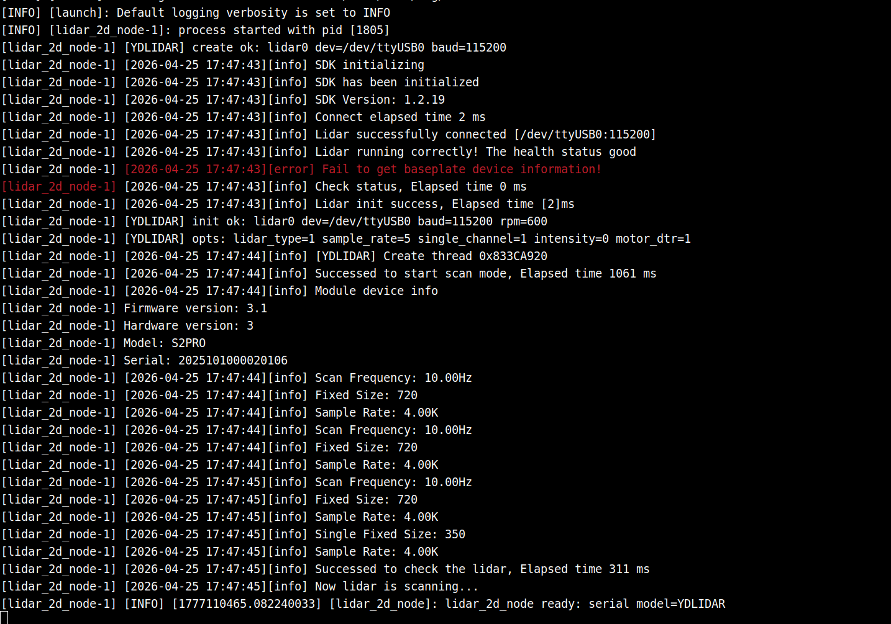
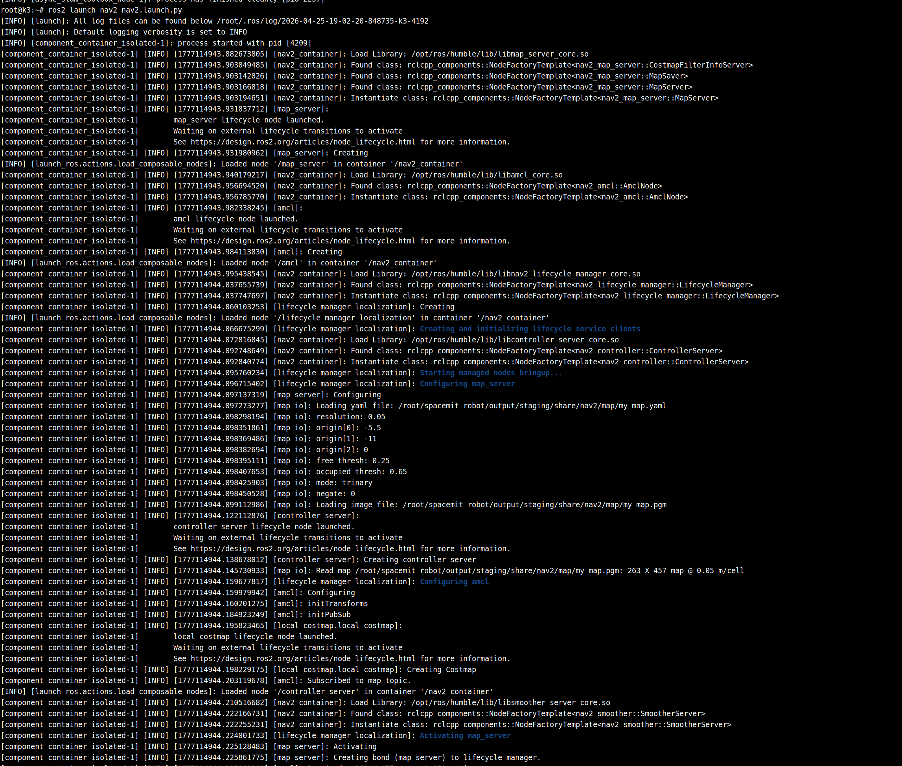
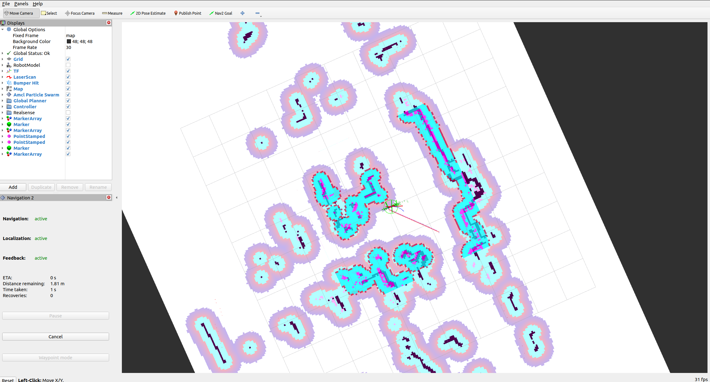

# 路径规划 · nav2

## 1. 模块概述

- **主要功能**：`nav2` 模块位于 `middleware/ros2/planning/nav2`，是当前项目中面向移动机器人自主导航的启动封装层。它基于 ROS 2 Nav2 导航栈，为 `linksee` 等差速机器人提供两类导航入口：一类是基于 2D 激光雷达地图的常规导航，另一类是结合 `rtabmap` 的 RGB-D 导航。模块本身不负责建图，而是负责组织地图、导航参数和 Nav2 bringup 启动流程。
- **规格或特性**：
  - 基于 ROS 2 Humble 与 Nav2 导航栈；
  - 支持 2D 激光雷达定位导航，默认入口为 `nav2.launch.py`；
  - 支持基于 RTAB-Map 的 RGB-D 导航，默认入口为 `nav2_rtabmap_rgbd.launch.py`；
  - 默认参数文件：`config/jdbot_k3_diff.yaml`、`config/rgbd_nav2_params.yaml`；
  - 默认地图文件：`map/my_map.yaml`；
  - 2D 导航支持通过 `map`、`params`、`use_sim_time` 等参数覆盖；
  - 内置 DWB 局部规划器与代价地图参数配置，面向差速底盘场景。
- **软件框图**：当前工程中，`nav2` 在整机导航链路中的位置如下：



- **相关目录结构**：

| 路径 | 职责 |
| --- | --- |
| `middleware/ros2/planning/nav2/launch/nav2.launch.py` | 2D 激光地图导航启动入口 |
| `middleware/ros2/planning/nav2/launch/nav2_rtabmap_rgbd.launch.py` | 基于 RTAB-Map 的 RGB-D 导航启动入口 |
| `middleware/ros2/planning/nav2/config/jdbot_k3_diff.yaml` | 差速底盘 2D 导航参数 |
| `middleware/ros2/planning/nav2/config/rgbd_nav2_params.yaml` | RGB-D 导航参数 |
| `middleware/ros2/planning/nav2/map/` | 默认地图文件目录 |
| `middleware/ros2/planning/nav2/nav2/autonomous_patrol.py` | 基于话题控制的巡航示例节点 |
| `middleware/ros2/planning/nav2/README.md` | 模块中文说明 |

## 2. 环境准备

### 2.1 前置条件

- **确认代码下载**

  SDK 源码获取和基础编译环境配置统一参考 [Linksee参考方案](../../03-参考方案/3.2-移动机器人Linksee.md)。完成 SDK 初始化后，回到本文继续执行

- **运行环境**：
  - K3 Com260 + Bianbu26 LXQT
  - ROS 版本：ROS 2 Humble；

- **依赖与外部资源**：

  - 2D 激光导航需要准备地图文件，路径 `middleware/ros2/planning/nav2/map/my_map.yaml`；

- **环境变量与初始化**：

  ```bash
  source ~/spacemit_robot/output/staging/setup.bash
  ```

### 2.2 构建编译

- **本模块编译**：

  SDK 全量编译：

  ```bash
  cd ~/spacemit_robot
  source build/envsetup.sh
  lunch # 选择k3-com260-linksee
  m
  ```

- **产物说明**：
  - SDK 产物位于 `output/staging/`；
  - 单独工作区安装产物位于 `install/nav2/`；
  - 模块主要提供 launch 文件、参数文件和 Python 示例节点。
- **常见差异说明**：
  - `nav2.launch.py` 用于 2D 激光地图导航；
  - `nav2_rtabmap_rgbd.launch.py` 用于 RGB-D 导航；
  - 2D 导航依赖已有地图文件，RGB-D 导航则通常依赖 `rtabmap_run` 提供定位结果。

## 3. 示例使用

### 3.1 2D 激光地图导航

- **所有终端均需要加载运行环境**

  ```bash
  source ~/spacemit_robot/output/staging/setup.bash
  ```

  **预期现象**：无报错，可识别 `linksee` 与 `nav2` 功能包。

**步骤 1：启动底盘控制**

```bash
ros2 launch linksee base_control_esos.launch.py
```

**预期现象**：底盘驱动节点启动，终端持续输出底盘相关日志。

终端输出：



**步骤 2：启动雷达**

```bash
ros2 launch linksee start_ydlidar.launch.py
```

**预期现象**：开始持续发布 `/scan` 。

终端输出：



**步骤 3：启动里程计**

```bash
ros2 launch linksee start_odom.launch.py
```

**预期现象**：开始发布 `/odom` 与基础 TF，机器人运动状态可被导航栈使用。

终端输出：


**步骤 4：启动导航**

```bash
ros2 launch nav2 nav2.launch.py
```

**预期现象**：Nav2 各节点正常启动，终端可看到导航栈 bringup 日志；若地图文件存在，将加载默认 `map/my_map.yaml`。

终端输出



**步骤 5：PC 端启动可视化**

```bash
source ~/visual_ws/install/setup.bash
ros2 launch visualization display_navigation.launch.py
```

**预期现象**：RViz 中可看到地图、机器人姿态、激光数据和导航相关显示项。



### 3.2 基于 RTAB-Map 的 RGB-D 导航

**前置**：默认 RGB-D 相机、`rtabmap_run`、底盘里程计与 TF 链路已准备完成。

**步骤 1：加载运行环境**

```bash
source ~/spacemit_robot/output/staging/setup.bash
```

**预期现象**：无报错，可识别 `rtabmap_run` 和 `nav2` 包。

**步骤 2：启动底盘控制和里程计**

```bash
ros2 launch linksee base_control_esos.launch.py
```

```bash
ros2 launch linksee start_ydlidar.launch.py
ros2 launch linksee start_odom.launch.py
```

**预期现象**：`/odom` 与 TF 链路正常。

**步骤 3：启动 RTAB-Map 定位或建图链路**

```bash
ros2 launch rtabmap_run rgbd_slam.launch.py localization:=true
```

**预期现象**：`rtabmap` 进入定位模式，开始输出地图与定位结果。

**步骤 4：启动 RGB-D 导航**

```bash
ros2 launch nav2 nav2_rtabmap_rgbd.launch.py
```

**预期现象**：Nav2 根据 `rgbd_nav2_params.yaml` 启动，可基于 RTAB-Map 提供的地图和定位进行导航。

**步骤 5：PC 端可视化**

```bash
source ~/visual_ws/install/setup.bash
ros2 launch visualization display_navigation.launch.py
```

**预期现象**：RViz 中可看到机器人姿态、地图、代价地图与导航状态。

## 4. 应用开发

- **对外 API 或接口形态**：
  - 启动入口：`ros2 launch nav2 nav2.launch.py`、`ros2 launch nav2 nav2_rtabmap_rgbd.launch.py`；
  - 可配置参数：`map`、`params`、`use_sim_time`；
  - 相关输入：`/map`、`/odom`、TF、激光或 RGB-D 相关话题；
  - 示例节点入口：`autonomous_patrol = nav2.autonomous_patrol:main`。
- **调用方式与注意点**：
  - 2D 导航模式应保证地图文件路径正确，否则 bringup 后无法正常定位与规划；
  - 运行导航前必须先保证 `/odom` 和 TF 链路正常；
  - RGB-D 导航模式下，应避免同时启用多个会发布地图或定位结果的模块；
  - 若需要扩展巡航、定点导航等能力，可基于 `nav2_simple_commander` 方式新增 Python 节点。
- **参考 demo 或示例路径**：
  - `middleware/ros2/planning/nav2/launch/nav2.launch.py`
  - `middleware/ros2/planning/nav2/launch/nav2_rtabmap_rgbd.launch.py`
  - `middleware/ros2/planning/nav2/nav2/autonomous_patrol.py`
  - `middleware/ros2/planning/nav2/README.md`

## 5. 调试指南

- 优先检查 `/odom`、`/tf`、`/map` 是否完整，Nav2 对底层定位与坐标系链路依赖较强。
- 2D 导航异常时，先确认地图文件存在且 `map:=...` 参数路径正确。
- RGB-D 导航异常时，先确认 `rtabmap_run` 是否已经正常输出定位与地图，再检查 `nav2_rtabmap_rgbd.launch.py` 是否正确启动。
- 可结合 RViz 观察全局路径、局部代价地图、机器人 footprint 与传感器数据是否匹配。
- 与硬件/底盘侧联调时，建议收集以下信息：底盘型号、`/odom` 频率、TF 树、激光/深度相机话题名、地图文件路径、当前使用的参数文件。

## 6. 常见问题

| 现象 | 可能原因 | 处理 |
| --- | --- | --- |
| `ros2 launch nav2 nav2.launch.py` 启动后无法定位 | 地图文件缺失或路径错误 | 检查默认 `map/my_map.yaml` 是否存在，或通过 `map:=/absolute/path/to/map.yaml` 指定正确路径 |
| 导航节点启动但机器人不动 | 底盘控制链路或 `/cmd_vel` 下发异常 | 检查 `linksee` 底盘控制是否正常，确认底盘能响应速度指令 |
| 启动导航时报 TF 相关错误 | `/odom`、`base_footprint`、`map` 等坐标链不完整 | 先启动里程计节点，使用 RViz 或 TF 工具检查 TF 树 |
| RGB-D 导航启动后效果不稳定 | RTAB-Map 定位输出不稳定或与导航参数不匹配 | 先单独验证 `rtabmap_run`，再检查 `rgbd_nav2_params.yaml` 和输入话题 |
| 巡航示例无法运行 | Python 入口名称或话题控制不匹配 | 检查 `setup.py` 中 `autonomous_patrol` 入口是否已安装，并确认控制话题名称正确 |
