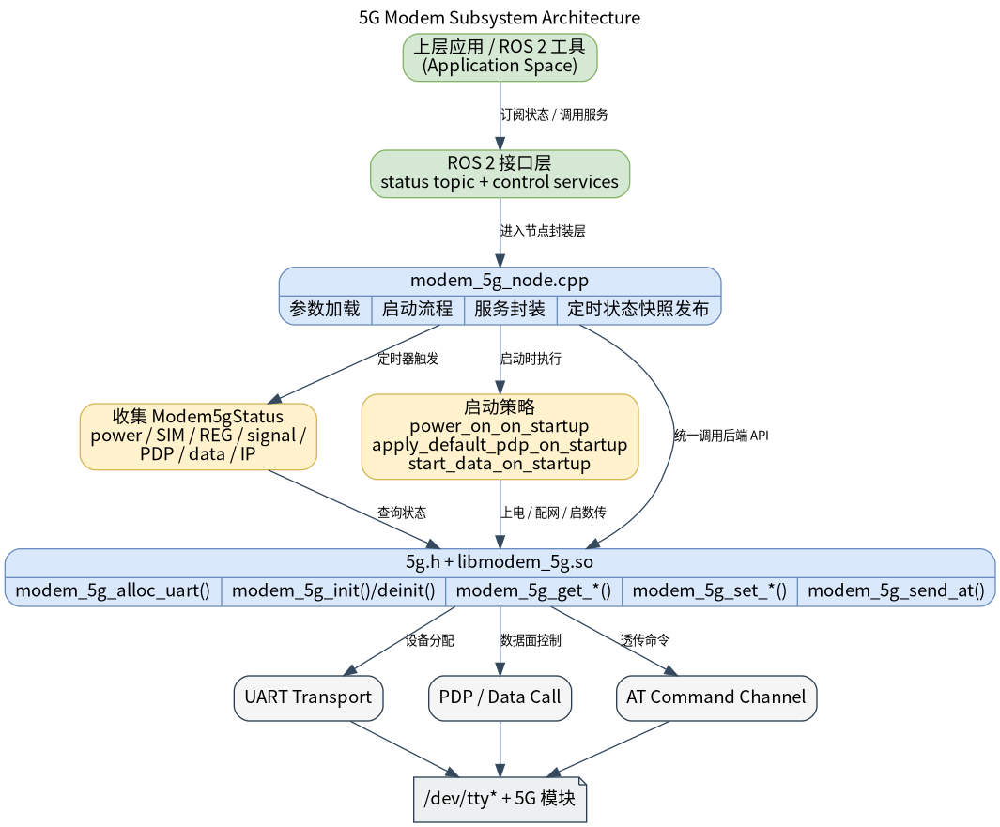

# 基础传感器 · 5G

## 1. 模块概述
 
- 主要功能：5G 模块位于机器人开发层的基础传感器能力中，对下封装 `components/peripherals/5g` MR880A 5G 模组组件，对上提供 ROS 2 节点 `modem_5g_node`。模块用于统一完成 5G 模组的上电、下电、复位、飞行模式、RAT 偏好设置、PDP 配置、数据拨号和 AT 透传，并周期发布当前模组状态快照。  
- 规格或特性（接口形态、速率、分辨率、算法版本等）：当前节点采用“状态话题 + 控制服务”的混合接口。状态输出消息为 `peripherals_5g_node/msg/Modem5gStatus`，默认话题 `/modem_5g/status`；控制面通过多个 ROS 2 service 暴露，包括 `/modem_5g/power_on`、`/modem_5g/power_off`、`/modem_5g/reset`、`/modem_5g/set_flight_mode`、`/modem_5g/set_prefer_rat`、`/modem_5g/set_pdp_context`、`/modem_5g/get_pdp_context`、`/modem_5g/data_call` 和 `/modem_5g/send_at`。默认状态发布周期为 `2000 ms`；默认 UART 设备为 `auto`，默认波特率为 `9600`；支持启动时按参数自动上电、设置默认 PDP 和启动数据连接。  
- 软件框图：  



- 相关目录结构：  

| 路径 | 职责 |
| --- | --- |
| `middleware/ros2/peripherals/5g/src/modem_5g_node.cpp` | ROS 2 5G 节点实现，负责参数校验、设备初始化、状态发布和服务接口 |
| `middleware/ros2/peripherals/5g/params/modem_5g_node.yaml` | 默认参数文件，包含设备名、服务名、默认 PDP、AT 超时等配置 |
| `middleware/ros2/peripherals/5g/CMakeLists.txt` | `peripherals_5g_node` 包构建文件，查找 `5g.h`、`libmodem_5g.so` 并生成 `modem_5g_node` |
| `middleware/ros2/peripherals/5g/msg/Modem5gStatus.msg` | 5G 状态快照消息定义 |
| `middleware/ros2/peripherals/5g/msg/Modem5gPdpContext.msg` | PDP 上下文消息定义 |
| `middleware/ros2/peripherals/5g/msg/Modem5gIpInfo.msg` | IP 信息消息定义 |
| `middleware/ros2/peripherals/5g/srv/Modem5gTrigger.srv` | 上电、下电、复位服务定义 |
| `middleware/ros2/peripherals/5g/srv/Modem5gSetFlightMode.srv` | 飞行模式服务定义 |
| `middleware/ros2/peripherals/5g/srv/Modem5gSetPreferRat.srv` | RAT 偏好设置服务定义 |
| `middleware/ros2/peripherals/5g/srv/Modem5gSetPdpContext.srv` | PDP 配置服务定义 |
| `middleware/ros2/peripherals/5g/srv/Modem5gGetPdpContext.srv` | PDP 查询服务定义 |
| `middleware/ros2/peripherals/5g/srv/Modem5gDataCall.srv` | 数据拨号/断开服务定义 |
| `middleware/ros2/peripherals/5g/srv/Modem5gSendAt.srv` | 原始 AT 透传服务定义 |
| `components/peripherals/5g/include/5g.h` | 底层 5G 组件 C API |
| `components/peripherals/5g/test/test_5g_mr880a.c` | 底层 MR880A 测试程序 |

## 2. 环境准备

### 前置条件

- 运行环境：推荐板端环境 `k1-deb1` 配套系统镜像。 构建侧需要 CMake、C++ 编译器、`ament_cmake`、`rclcpp` 和 SDK 统一构建脚本。  
- 硬件与连接：目标板需要通过 USB 连接 MR880A 5G 模组，SIM 卡已插入且套餐可用，天线已连接，模组上电并完成 USB 枚举。

### 构建编译

- **获取代码**：详见 [2.3-配置编译](../../02-%E5%BF%AB%E9%80%9F%E5%85%A5%E9%97%A8/2.3-%E9%85%8D%E7%BD%AE%E7%BC%96%E8%AF%91.md#21-代码获取) 章节，使用 `repo` 工具克隆完整 SDK。以下编译测试命令均在sdk内执行。
- 本模块编译：按依赖顺序先编译底层 5G 组件，再编译同仓库内自带 `msg/srv` 定义的 ROS 2 节点包。   

```bash
source build/envsetup.sh

./build/build.sh package components/peripherals/5g
./build/build.sh package middleware/ros2/peripherals/5g
```

预期产物包括：`output/staging/lib/peripherals_5g_node/modem_5g_node`、`output/staging/share/peripherals_5g_node/params/modem_5g_node.yaml`、`output/staging/lib/libmodem_5g.so`，以及 `peripherals_5g_node` 下的 5G `msg/srv` ROS 2 接口安装文件。若当前目标不是 `riscv64`，请以实际 `output/<target>/staging` 或 `output/staging` 为准。  
- 常见差异说明：`peripherals_5g_node` 的 `CMakeLists.txt` 会查找 `5g.h` 和 `libmodem_5g.so`；如果未先构建 `components/peripherals/5g`，会报 `5g.h or libmodem_5g not found`。参数文件顶层键必须写成实际节点名 `modem_5g_node`，不是包名 `peripherals_5g_node`。  

## 3. 示例使用（从 0 跑通）

本节为读者**按步骤复现**的主线：

### 3.1 【示例一：启动 5G 节点并查看状态快照】

**前置**：模组已经被系统枚举，默认参数中的 `name`、`uart_device`、`baud` 与当前设备一致；若使用自动识别，请确认 `uart_device: "auto"` 可在当前系统上找到正确的 AT 口。  

**步骤 1**：进入 SDK 源码目录并加载运行环境。  

```bash
source output/staging/setup.bash
```

预期现象：`ros2 pkg executables peripherals_5g_node` 能看到 `peripherals_5g_node modem_5g_node`。  

**步骤 2**：启动 5G 节点。  

```bash
ros2 run peripherals_5g_node modem_5g_node \
  --ros-args \
  --params-file output/staging/share/peripherals_5g_node/params/modem_5g_node.yaml
```

预期现象：终端打印 `modem_5g_node ready`，并带出设备名、UART 设备、波特率和状态话题名。如果 `modem_5g_alloc_uart()` 或 `modem_5g_init()` 失败，节点会直接抛异常退出。  

**步骤 3**：另开终端观察状态话题。  

```bash
source output/staging/setup.bash
ros2 topic echo /modem_5g/status
```

预期现象：如果读取成功，会看到 `snapshot_ok=true`，并带出 `power_state`、`sim_state`、`reg_state`、`rat`、`rssi_dbm` 等状态信息；若某一步状态采集失败，会看到 `snapshot_ok=false`、`snapshot_status_code` 和 `snapshot_message` 说明失败点。  


## 4. 应用开发

- **对外 API 或接口形态**（头文件、库名、服务/话题）：状态通过 `/modem_5g/status` 发布 `peripherals_5g_node/msg/Modem5gStatus`；控制通过多个 ROS 2 service 暴露，分别为 `peripherals_5g_node/srv/Modem5gTrigger`、`peripherals_5g_node/srv/Modem5gSetFlightMode`、`peripherals_5g_node/srv/Modem5gSetPreferRat`、`peripherals_5g_node/srv/Modem5gSetPdpContext`、`peripherals_5g_node/srv/Modem5gGetPdpContext`、`peripherals_5g_node/srv/Modem5gDataCall` 和 `peripherals_5g_node/srv/Modem5gSendAt`。  
- **调用方式与注意点**（线程、权限、资源释放等）：推荐调用顺序为“启动节点 -> 观察状态 -> `set_pdp_context` -> `data_call(start=true)` -> 使用业务网络 -> `data_call(start=false)`”。`cid=0` 在若干服务里表示回退到参数 `default_cid`；`pdp_type=0` 表示回退到参数 `default_pdp_type`；节点内部对底层 API 调用加了互斥锁，但不会创建后台 URC 线程；状态采集失败不会立刻让节点退出，而是通过 `snapshot_ok` 与 `snapshot_message` 上报。当前 `rat_from_request()` 接受 `SA/NSA/LTE/WCDMA/GSM` 枚举值，但底层 MR880A 实现真正支持的 RAT 切换能力仍以组件实现为准。  
- **参考 demo 或示例路径**：`middleware/ros2/peripherals/5g/README.md`、`middleware/ros2/peripherals/5g/params/modem_5g_node.yaml`、`middleware/ros2/peripherals/5g/src/modem_5g_node.cpp`、`components/peripherals/5g/test/test_5g_mr880a.c`。  

主要消息和服务字段如下：  

| 接口 | 字段 | 含义 |
| --- | --- | --- |
| `Modem5gStatus` | `snapshot_ok` | 本次状态采集是否整体成功 |
| `Modem5gStatus` | `power_state` | `0=OFF`、`1=ON`、`2=RESETTING` |
| `Modem5gStatus` | `sim_state` | `0=UNKNOWN`、`1=ABSENT`、`2=READY` 等 |
| `Modem5gStatus` | `reg_state` | 注册状态，如 `HOME`、`SEARCHING`、`ROAMING` |
| `Modem5gStatus` | `rat` | `0=UNKNOWN`、`1=NR5G_SA`、`2=NR5G_NSA`、`3=LTE` 等 |
| `Modem5gStatus` | `pdp_context` | 当前 CID、PDP 类型、APN、用户名和是否有密码 |
| `Modem5gStatus` | `ip_info` | 当前 IP、网关、DNS 信息 |
| `Modem5gSetPdpContext` | `cid/pdp_type/apn` | 配置 PDP 上下文，`cid=0` 表示用默认值 |
| `Modem5gDataCall` | `start` | `true=拨号`、`false=断开` |
| `Modem5gSendAt` | `command/timeout_ms` | 原始 AT 命令和超时，`timeout_ms=0` 表示用默认值 |

## 5. 调试指南

- 先用底层组件验证链路：如果底层 `test_5g_mr880a` 都无法完成信息查询、PDP 设置或拨号，优先检查模组、SIM 卡、USB 枚举和系统网络配置，而不是先怀疑 ROS 2 层。  
- 观察节点启动日志：正常启动会打印 `modem_5g_node ready`；若 `modem_5g_alloc_uart()` 返回 `null` 或 `modem_5g_init()` 返回失败，节点会直接退出。  
- 使用 `/modem_5g/status` 排查状态采集问题：`snapshot_ok=false` 且 `snapshot_message=get_sim_info: ...`、`get_reg_info: ...` 等时，可以快速定位卡在模组、SIM 还是注册阶段。  
- 如果 `set_pdp_context`、`data_call` 或 `send_at` 返回失败，先记录 `status_code` 和 `message`，再对照底层 5G 组件文档和 MR880A AT 手册排查。  
- 若自动识别 AT 口失败，建议暂时把 `uart_device` 改为显式设备路径，例如 `/dev/ttyUSB2`，先排除自动识别逻辑差异。  

## 6. 常见问题
暂无
