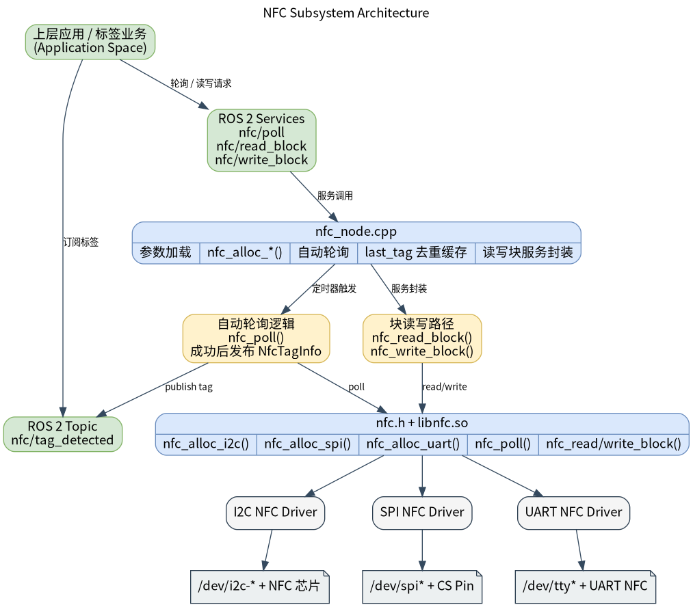

# 基础传感器 · NFC

## 1. 模块概述

- 主要功能：NFC 模块位于机器人开发层的基础传感器能力中，对下封装 `components/peripherals/nfc` 读卡组件，对上提供 ROS 2 节点 `nfc_node`、标签检测话题以及块读写服务。模块用于检测 NFC 标签、发布 UID/标签类型等信息，并向上层应用提供按块读取和写入的请求-响应接口。  
- 规格或特性（接口形态、速率、分辨率、算法版本等）：对外同时提供 ROS 2 话题和服务。默认话题为 `/nfc/tag_detected`，消息类型为 `peripherals_nfc_node/msg/NfcTagInfo`；默认服务为 `/nfc/poll`、`/nfc/read_block`、`/nfc/write_block`，服务类型分别为 `peripherals_nfc_node/srv/NfcPoll`、`peripherals_nfc_node/srv/NfcReadBlock`、`peripherals_nfc_node/srv/NfcWriteBlock`；节点名固定为 `nfc_node`；默认后台自动轮询周期 `100 ms`，单次轮询超时 `50 ms`；支持通过参数选择 `i2c` / `spi` / `uart` 传输方式。需要特别注意：当前节点接口层支持三种传输参数，但当前仓库中实际注册的底层驱动只有 I2C 的 `SI512`，因此默认可跑通路径是 `i2c + SI512 + /dev/i2c-5 + 0x28`。  
- 软件框图：  



- 相关目录结构：  

| 路径 | 职责 |
| --- | --- |
| `middleware/ros2/peripherals/nfc/src/nfc_node.cpp` | ROS 2 NFC 节点实现，负责加载参数、创建底层设备、自动轮询、发布标签话题以及处理读写服务 |
| `middleware/ros2/peripherals/nfc/params/nfc_node.yaml` | 默认节点参数文件，包含传输方式、设备路径、话题名、服务名和轮询参数 |
| `middleware/ros2/peripherals/nfc/CMakeLists.txt` | `peripherals_nfc_node` 包构建文件，查找 `nfc.h`、`libnfc.so` 并生成可执行文件 `nfc_node` |
| `middleware/ros2/peripherals/nfc/package.xml` | ROS 2 包元数据和依赖声明 |
| `middleware/ros2/peripherals/nfc/msg/NfcTagInfo.msg` | NFC 标签信息消息定义 |
| `middleware/ros2/peripherals/nfc/srv/NfcPoll.srv` | 主动轮询标签服务定义 |
| `middleware/ros2/peripherals/nfc/srv/NfcReadBlock.srv` | 按块读取标签数据服务定义 |
| `middleware/ros2/peripherals/nfc/srv/NfcWriteBlock.srv` | 按块写入标签数据服务定义 |
| `components/peripherals/nfc/include/nfc.h` | 底层 NFC 组件 C API、标签结构体和工厂函数声明 |
| `components/peripherals/nfc/src/nfc_core.c` | 底层设备对象、驱动注册和 `nfc_alloc_i2c/spi/uart()` 分发实现 |
| `components/peripherals/nfc/src/drivers/drv_i2c_SI512/drv_i2c_SI512.c` | SI512 I2C 驱动实现 |
| `components/peripherals/nfc/test/test_nfc_i2c.c` | 底层 I2C 自测程序，可用于先排除设备、地址和卡片交互问题 |

## 2. 环境准备

### 前置条件

- 运行环境：推荐板端环境 `k1-deb1` 配套系统镜像，系统具备 I2C 控制器和对应设备节点；ROS 2 环境建议使用 Humble；构建侧需要 CMake、C++17 编译器、`ament_cmake`、`rclcpp` 和 SDK 统一构建脚本。  
- 依赖与外部资源：I2C 模式依赖内核导出的 `/dev/i2c-*` 设备节点，不额外依赖第三方动态库；本仓库当前未随 `nfc` 组件提供 SPI/UART 驱动源文件，因此若只使用本目录代码，实际可跑通路径是 I2C + SI512。  
- 硬件与连接：需要一块 SI512 NFC 模块，并通过 I2C 连接到目标板。请确认供电、SCL、SDA 正确连接，模块 I2C 地址与程序参数一致，且待测试卡片为驱动当前示例路径支持的 Type A 类卡片。  

### 构建编译

- **获取代码**：详见 [2.3-配置编译](../../02-%E5%BF%AB%E9%80%9F%E5%85%A5%E9%97%A8/2.3-%E9%85%8D%E7%BD%AE%E7%BC%96%E8%AF%91.md#21-代码获取) 章节，使用 `repo` 工具克隆完整 SDK。以下编译测试命令均在sdk内执行。
- 本模块编译：按依赖顺序先编译底层 NFC 组件，再编译同仓库内自带 `NfcTagInfo.msg` 与三个 `srv` 定义的 ROS 2 节点包。  

```bash
source build/envsetup.sh
cd components/peripherals/nfc/
mm -DSROBOTIS_PERIPHERALS_NFC_ENABLED_DRIVERS=drv_i2c_SI512
cd -
./build/build.sh package middleware/ros2/peripherals/nfc
```

预期产物包括：`output/staging/lib/peripherals_nfc_node/nfc_node`、`output/staging/share/peripherals_nfc_node/params/nfc_node.yaml`、`output/staging/lib/libnfc.so`，以及 `peripherals_nfc_node/msg/NfcTagInfo` 和三个 `peripherals_nfc_node/srv/*` ROS 2 接口安装文件。若当前目标不是 `riscv64`，请以实际 `output/<target>/staging` 或 `output/staging` 为准。  
- 常见差异说明：`peripherals_nfc_node` 的 `CMakeLists.txt` 会查找 `nfc.h` 和 `libnfc.so`；如果未先构建 `components/peripherals/nfc`，会报 `nfc.h or libnfc not found`。此外，底层 `components/peripherals/nfc` 只会编译 `SROBOTIS_PERIPHERALS_NFC_ENABLED_DRIVERS` 指定的驱动；当前仓库中真正提供的驱动目录是 `drv_i2c_SI512`。如果目标配置没有把该驱动编入 `libnfc.so`，则节点虽然能编译通过，但启动时会因 `nfc_alloc_* failed` 而退出。  

## 3. 示例使用（从 0 跑通）

本节为读者**按步骤复现**的主线：

### 3.1 【示例一：启动 ROS 2 NFC 节点并观察标签检测话题】

**前置**：已完成构建编译；目标板已连接 SI512 等兼容的 I2C NFC 模块；当前参数文件中的 `transport`、`driver`、`device`、`i2c_addr` 与实际硬件一致；当前用户具备设备节点访问权限。  

**步骤 1**：进入 SDK 源码目录并加载运行环境。  

```bash
source output/staging/setup.bash
```

预期现象：`ros2 pkg executables peripherals_nfc_node` 能看到 `peripherals_nfc_node nfc_node`。  

**步骤 2**：确认或修改参数文件。默认安装后的参数文件路径如下：  

```bash
output/staging/share/peripherals_nfc_node/params/nfc_node.yaml
```

默认内容等价于：  

```yaml
nfc_node:
  ros__parameters:
    transport: "i2c"
    driver: "SI512"
    name: "nfc0"
    device: "/dev/i2c-5"
    i2c_addr: 40
    cs_pin: 0
    baud: 115200
    frame_id: "nfc"

    tag_topic: "nfc/tag_detected"
    poll_service: "nfc/poll"
    read_service: "nfc/read_block"
    write_service: "nfc/write_block"

    auto_poll_enabled: true
    poll_period_ms: 100
    poll_timeout_ms: 50
    publish_duplicates: false
```

预期现象：如果实际模块不是 I2C、不是 `/dev/i2c-5`，或地址不是 `0x28`（十进制 `40`），请先修改参数。对于当前仓库，如把 `transport` 改成 `spi` 或 `uart`，通常还需要同时引入对应底层驱动，否则节点会启动失败。  

**步骤 3**：启动 NFC 节点。  

```bash
ros2 run peripherals_nfc_node nfc_node \
  --ros-args \
  --params-file output/staging/share/peripherals_nfc_node/params/nfc_node.yaml
```

预期现象：终端打印类似日志，表示节点已启动并完成底层设备初始化。  

```text
nfc_node ready: transport=i2c driver=SI512 name=nfc0 device=/dev/i2c-5 tag_topic=nfc/tag_detected auto_poll=true period_ms=100 timeout_ms=50
```

**步骤 4**：另开一个终端，加载同样的 ROS 2 环境并订阅标签检测话题。  

```bash
source output/staging/setup.bash
ros2 topic echo /nfc/tag_detected
```

预期现象：将 NFC 卡片贴近读卡器后，终端能看到 `peripherals_nfc_node/msg/NfcTagInfo` 输出，例如：  

```yaml
header:
  stamp:
    sec: 0
    nanosec: 0
  frame_id: nfc
uid:
- 4
- 162
- 17
- 59
uid_len: 4
tag_type: 1
rssi_dbm: -42
ats: []
ats_len: 0
---
```

**步骤 5**：验证重复标签发布行为。  

预期现象：默认 `publish_duplicates=false` 时，同一张卡持续贴住读卡器，一般只会在首次检测时发布一次；把卡拿开后再次贴回，才会再次发布。需要注意，当前“是否重复”的判定不仅比较 UID，还会比较 `tag_type`、`rssi_dbm` 和 `ATS`；如果 RSSI 在持续贴卡时发生波动，即使是同一张卡，也可能再次发布。  

### 3.2 【示例二：调用 poll/read/write 服务】

**前置**：已确认 `nfc_node` 能正常启动；如果要测试写块，请使用可擦写的测试卡，并确认该卡片和驱动确实支持目标块读写。  

**步骤 1**：确认服务已注册。  

```bash
source output/staging/setup.bash
ros2 service list | grep '^/nfc/'
```

预期现象：能看到 `/nfc/poll`、`/nfc/read_block`、`/nfc/write_block` 三个服务。  

**步骤 2**：主动轮询一次是否有标签。  

```bash
ros2 service call /nfc/poll peripherals_nfc_node/srv/NfcPoll "{timeout_ms: 200}"
```

预期现象：  
- 如果检测到标签，返回 `success: true`、`message: "tag detected"`，并在 `tag_info` 中带回 UID、类型等信息。  
- 如果超时未检测到标签，返回 `success: false`、`message: "no tag"`。  
- 若底层访问失败，`message` 会包含 `poll failed: rc=...`。  

需要注意：服务轮询成功时，节点还会同步向 `/nfc/tag_detected` 话题发布同一张标签的信息。  

**步骤 3**：读取指定数据块，例如读取 4 号块。  

```bash
ros2 service call /nfc/read_block peripherals_nfc_node/srv/NfcReadBlock "{block_addr: 4}"
```

预期现象：如果读取成功，返回 `success: true`、`message: "ok"`，并在 `data` 字段中返回读到的字节数组；如果卡片不支持、块地址无效或底层失败，返回 `success: false` 和对应错误信息。  

**步骤 4**：写入指定数据块。当前实现要求 `data` 必须**恰好 16 字节**。  

```bash
ros2 service call /nfc/write_block peripherals_nfc_node/srv/NfcWriteBlock \
  "{block_addr: 4, data: [1, 2, 3, 4, 5, 6, 7, 8, 9, 10, 11, 12, 13, 14, 15, 16]}"
```

预期现象：  
- 当底层写入成功时，返回 `success: true`、`message: "ok"`。  
- 如果 `data` 长度不是 16 字节，节点会在进入底层前直接返回 `success: false`、`message: "write failed: data must contain exactly 16 bytes"`。  
- 如果目标标签或驱动不支持写块，则会返回 `success: false` 和底层错误信息。  

## 4. 应用开发

- **对外 API 或接口形态**（头文件、库名、服务/话题）：上层应用可订阅 ROS 2 话题 `/nfc/tag_detected`，消息类型为 `peripherals_nfc_node/msg/NfcTagInfo`；也可调用服务 `/nfc/poll`、`/nfc/read_block`、`/nfc/write_block`，服务类型分别为 `peripherals_nfc_node/srv/NfcPoll`、`peripherals_nfc_node/srv/NfcReadBlock`、`peripherals_nfc_node/srv/NfcWriteBlock`。话题适合广播“检测到标签”的异步事件，服务适合表达“现在检测一次”“读取某块”“写入某块”的请求-响应语义。  
- **消息与服务字段**：  
  - `NfcTagInfo` 包含 `header`、`uid`、`uid_len`、`tag_type`、`rssi_dbm`、`ats`、`ats_len`。节点会把 UID 最多截断到 16 字节，把 ATS 最多截断到 32 字节。  
  - `NfcPoll` 请求字段为 `uint32 timeout_ms`；响应字段为 `bool success`、`string message` 和 `NfcTagInfo tag_info`。  
  - `NfcReadBlock` 请求字段为 `uint8 block_addr`；响应字段为 `bool success`、`string message` 和 `uint8[] data`。  
  - `NfcWriteBlock` 请求字段为 `uint8 block_addr` 和 `uint8[] data`；响应字段为 `bool success` 和 `string message`。当前节点在进入底层前就要求 `data.size() == 16`。  
- **调用方式与注意点**（线程、权限、资源释放等）：  
  - 节点内部的标签话题不是依赖底层 `nfc_set_callback()` 推出来的，而是通过定时器主动调用 `nfc_poll()` 得到检测结果后发布的。  
  - 自动轮询、`poll` 服务、`read_block` 服务和 `write_block` 服务都共享同一个底层设备句柄；节点内部用 `std::mutex` 串行化这些访问，因此不会出现读写与轮询同时并发进入驱动的问题。  
  - `transport` 参数只做语义校验，允许 `i2c` / `spi` / `uart` 三个值；但当前仓库实际注册的驱动只有 I2C 的 `SI512`。因此接口“允许”不等于当前源码“已实现”。  
  - `driver` 和 `name` 会组合成底层实例名，例如默认组合后是 `SI512:nfc0`。如果 `driver` 找不到，`nfc_alloc_*()` 会失败，节点会抛出 `nfc_alloc_* failed`。  
  - `poll_period_ms` 必须大于 `0`，`poll_timeout_ms` 必须大于等于 `0`，`i2c_addr` 必须在 `[0, 127]`，`cs_pin` 必须大于等于 `0`，`baud` 必须大于 `0`。  
  - 默认 `publish_duplicates=false` 时，节点只在“当前检测结果与上一次检测到的标签信息不完全相同”时发布话题；由于比较项包含 `rssi_dbm`，同一张卡在信号强度变化时也可能再次触发发布。  
  - `poll` 服务成功时，节点除了返回 `tag_info` 外，还会同步向话题发布同一张标签；如果业务侧同时订阅话题并调用服务，需要考虑这一点，避免重复处理。  
- **参考 demo 或示例路径**：`middleware/ros2/peripherals/nfc/README.md`、`middleware/ros2/peripherals/nfc/params/nfc_node.yaml`、`middleware/ros2/peripherals/nfc/src/nfc_node.cpp`、`components/peripherals/nfc/test/test_nfc_i2c.c`。  

## 5. 调试指南

- 先用底层组件排除总线和卡片问题：在 `robotics_sdk` 根目录执行 `./build/build.sh package components/peripherals/nfc`，然后在目标板运行 `sudo output/staging/bin/test_nfc_i2c /dev/i2c-5 0x28 4`。如果底层 `test_nfc_i2c` 都无法检测标签，优先检查 I2C 总线号、地址、供电、天线连接以及卡片类型和距离。  
- 使用 `i2cdetect -y 5`、`i2cget` 等工具确认设备是否出现在预期总线上；如果节点启动时报 `nfc_init failed`，常见原因是设备路径错误、地址错误、权限不足，或底层 SI512 驱动初始化失败。  
- 观察节点日志：正常启动应看到 `nfc_node ready`。如果参数非法，程序会在标准错误输出打印 `nfc_node exception: ...`，常见内容包括 `transport must be one of: i2c, spi, uart`、`poll_period_ms must be > 0`、`i2c_addr must be in [0, 127]`。  
- 观察 ROS 2 图和接口：使用 `ros2 node list` 确认存在 `/nfc_node`，使用 `ros2 topic list | grep nfc` 确认话题存在，使用 `ros2 service list | grep '^/nfc/'` 确认三个服务存在，使用 `ros2 topic echo /nfc/tag_detected` 和 `ros2 service call /nfc/poll ...` 验证功能链路。  
- 如果节点一启动就抛出 `nfc_alloc_* failed`，除了检查 `device`、`driver` 和 `transport`，还要重点检查底层库是否真的编入了 `drv_i2c_SI512`。当前组件代码默认不会自动把所有驱动都编进 `libnfc.so`。  
- 如果 `read_block` 或 `write_block` 一直失败，但标签检测正常，先不要假设“节点坏了”。更常见的原因是当前卡片类型、目标块地址或硬件驱动能力不支持读写操作；可以先用 `test_nfc_i2c` 对同一块地址做底层验证。  

## 6. 常见问题
暂无
