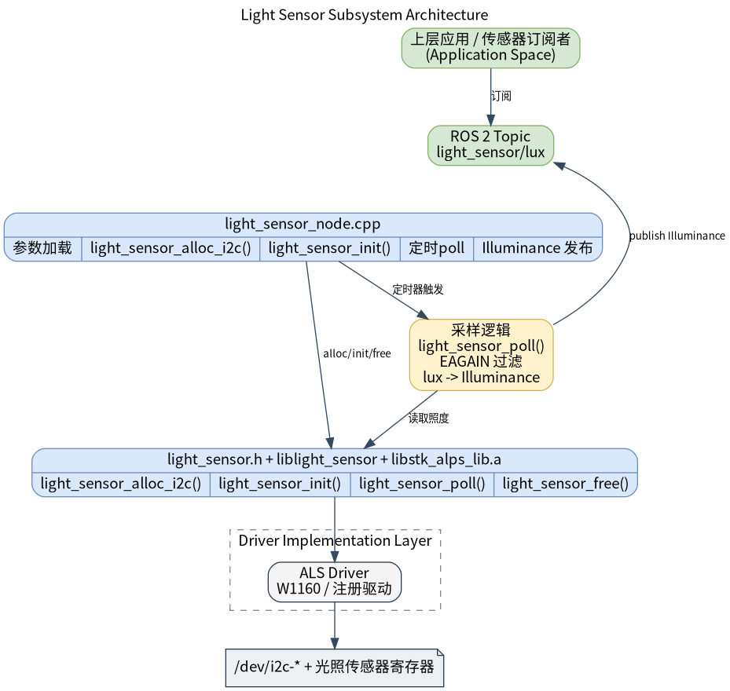

# 基础传感器 · 光感

## 1. 模块概述

- 主要功能：光感模块位于机器人开发层的基础传感器能力中，对下封装 `components/peripherals/light_sensor` I2C 光照传感器组件，对上提供 ROS 2 节点 `light_sensor_node` 和光照话题。模块用于周期性读取传感器 lux 值，并以标准 ROS 2 传感器消息发布给上层应用、感知算法或环境自适应逻辑订阅使用。  
- 规格或特性（接口形态、速率、分辨率、算法版本等）：对外直接复用标准消息 `sensor_msgs/msg/Illuminance`，默认话题名为 `/light_sensor/lux`；节点名固定为 `light_sensor_node`；发布 QoS 使用 `rclcpp::SensorDataQoS()`；默认采样与发布频率 `5 Hz`；默认驱动名为 `W1160`，默认 I2C 设备节点 `/dev/i2c-5`、默认地址 `0x48`；支持通过参数配置 `frame_id`、话题名、方差和轮询频率。该模块没有自定义私有 `msg/srv`，因此不依赖共享接口包。底层依赖 `light_sensor.h`、静态库 `liblight_sensor.a`、厂商静态库 `libstk_alps_lib.a` 与 I2C 设备节点 `/dev/i2c-*`。  
- 软件框图：  



- 相关目录结构：  

| 路径 | 职责 |
| --- | --- |
| `middleware/ros2/peripherals/light_sensor/src/light_sensor_node.cpp` | ROS 2 光感节点实现，负责加载参数、创建底层设备、定时轮询并发布 `Illuminance` |
| `middleware/ros2/peripherals/light_sensor/params/light_sensor_node.yaml` | 默认节点参数文件，包含驱动名、I2C 节点、地址、话题名和轮询频率 |
| `middleware/ros2/peripherals/light_sensor/CMakeLists.txt` | `peripherals_light_sensor_node` 包构建文件，查找 `light_sensor.h`、`liblight_sensor.a` 和 `libstk_alps_lib.a` 并生成可执行文件 `light_sensor_node` |
| `middleware/ros2/peripherals/light_sensor/package.xml` | ROS 2 包元数据和依赖声明 |
| `components/peripherals/light_sensor/include/light_sensor.h` | 底层光感组件 C API，声明初始化、轮询和 I2C 设备分配接口 |
| `components/peripherals/light_sensor/src/light_sensor_core.c` | 底层设备对象、驱动注册和 `light_sensor_alloc_i2c()` 分发实现 |
| `components/peripherals/light_sensor/src/drivers/drv_i2c_w1160/drv_i2c_w1160.c` | W1160 I2C 光照传感器驱动实现 |
| `components/peripherals/light_sensor/test/test_light_sensor_i2c.c` | 底层自测程序，可用于先排除 I2C、地址和硬件连接问题 |

## 2. 环境准备

### 前置条件

- 运行环境：推荐板端环境 `k1-deb1` 配套系统镜像，系统需要启用 I2C 设备节点接口；ROS 2 环境建议使用 Humble；构建侧需要 CMake、C++17 编译器、`ament_cmake`、`rclcpp`、`sensor_msgs` 和 SDK 统一构建脚本。  
- 依赖与外部资源：本模块依赖 Linux I2C 字符设备接口，不需要额外第三方动态库；W1160 驱动依赖仓库内自带的 `src/drivers/drv_i2c_w1160/libstk_alps_lib.a` 静态库，默认会被 `CMakeLists.txt` 自动链接；若该静态库不在默认位置，可在构建时通过 `-DSTK_ALPS_STATIC_LIB=/path/to/libstk_alps_lib.a` 指定。  
- 硬件与连接：需要一颗通过 I2C 连接的光照传感器；当前实现重点支持 W1160。请确认传感器已正确供电，SCL/SDA 已连接到目标板对应 I2C 控制器，并确认设备节点路径和从设备地址。测试程序默认假设设备节点为 `/dev/i2c-5`、I2C 地址为 `0x48`。  
- 工具与权限：排查问题时建议预装 apt install i2c-tools，使用i2cdetect/i2cdump等工具排查问题。  

### 构建编译

- **获取代码**：详见 [2.3-配置编译](../../02-%E5%BF%AB%E9%80%9F%E5%85%A5%E9%97%A8/2.3-%E9%85%8D%E7%BD%AE%E7%BC%96%E8%AF%91.md#21-代码获取) 章节，使用 `repo` 工具克隆完整 SDK。以下编译测试命令均在sdk内执行。
- 本模块编译：按依赖顺序先编译底层光感组件，再编译 ROS 2 节点包。  

```bash
source build/envsetup.sh

./build/build.sh package components/peripherals/light_sensor
./build/build.sh package middleware/ros2/peripherals/light_sensor
```

预期产物包括：`output/staging/lib/peripherals_light_sensor_node/light_sensor_node`、`output/staging/share/peripherals_light_sensor_node/params/light_sensor_node.yaml`、`output/staging/lib/liblight_sensor.a` 和 `output/staging/lib/libstk_alps_lib.a`。若当前目标不是 `riscv64`，请以实际 `output/<target>/staging` 或 `output/staging` 为准。  
- 常见差异说明：`peripherals_light_sensor_node` 的 `CMakeLists.txt` 会查找 `light_sensor.h` 与 `liblight_sensor.a`；若未先构建 `components/peripherals/light_sensor`，会报 `light_sensor.h or liblight_sensor not found`。此外节点还要求 `libstk_alps_lib.a` 与 `liblight_sensor.a` 位于同一 `lib/` 目录，否则会报 `libstk_alps_lib.a not found`。由于底层库是静态库并依赖驱动注册，节点构建时使用了 `--whole-archive` 和 `-no-pie`；如果后续修改构建脚本，不应删除这两个约束。  

## 3. 示例使用（从 0 跑通）

本节为读者**按步骤复现**的主线：

### 3.1 【示例一：启动 ROS 2 光感节点并观察光照话题】

**前置**：已完成构建编译；目标板已连接 I2C 光照传感器；当前参数文件中的 `device`、`i2c_addr` 与实际硬件一致；当前用户具备 `/dev/i2c-*` 访问权限。  

**步骤 1**：进入 SDK 源码目录并加载运行环境。  

```bash
source output/staging/setup.bash
```

预期现象：`ros2 pkg executables peripherals_light_sensor_node` 能看到 `peripherals_light_sensor_node light_sensor_node`。  

**步骤 2**：确认或修改参数文件。默认安装后的参数文件路径如下：  

```bash
output/staging/share/peripherals_light_sensor_node/params/light_sensor_node.yaml
```

默认内容等价于：  

```yaml
light_sensor_node:
  ros__parameters:
    driver: "W1160"
    name: "als0"
    device: "/dev/i2c-5"
    i2c_addr: 72

    frame_id: "light_sensor"
    topic_name: "light_sensor/lux"
    poll_hz: 5.0
    variance: 0.0
```

预期现象：如果实际 I2C 总线不是 `/dev/i2c-5`，或传感器地址不是 `0x48`（十进制 `72`），请先修改 `device` 和 `i2c_addr`，否则节点会启动失败或持续无数据。  

**步骤 3**：启动光感节点。  

```bash
ros2 run peripherals_light_sensor_node light_sensor_node \
  --ros-args \
  --params-file output/staging/share/peripherals_light_sensor_node/params/light_sensor_node.yaml
```

预期现象：终端打印类似日志，表示节点已启动并完成底层设备初始化。  

```text
light_sensor_node ready: driver=W1160 name=als0 device=/dev/i2c-5 addr=0x48 topic=light_sensor/lux poll_hz=5.000
```

**步骤 4**：另开一个终端，加载同样的 ROS 2 环境并订阅光照话题。由于发布端使用 `SensorDataQoS`，建议显式指定 `best_effort`。  

```bash
source output/staging/setup.bash
ros2 topic echo /light_sensor/lux --qos-reliability best_effort
```

预期现象：终端能看到 `sensor_msgs/msg/Illuminance` 输出，例如：  

```yaml
header:
  stamp:
    sec: 0
    nanosec: 0
  frame_id: light_sensor
illuminance: 126.0
variance: 0.0
---
```

**步骤 5**：改变环境光照，观察数值变化。  

预期现象：遮挡传感器、移动到强光环境或用手电照射后，`illuminance` 字段应发生明显变化。若短时间内没有新消息，但节点也没有报错，可能是底层 `light_sensor_poll()` 暂时返回了 `-EAGAIN`，当前节点会直接跳过本次发布。  


## 4. 应用开发

- **对外 API 或接口形态**（头文件、库名、服务/话题）：上层应用主要订阅 ROS 2 话题 `/light_sensor/lux`，消息类型为 `sensor_msgs/msg/Illuminance`。消息字段包括 `std_msgs/Header header`、`float64 illuminance` 和 `float64 variance`。当前节点不提供 service，也不提供 action；光照值属于连续传感器数据，适合用话题流式分发。  
- **调用方式与注意点**（线程、权限、资源释放等）：  
  - 节点内部通过定时器主动调用 `light_sensor_poll()` 轮询底层数据，而不是由底层中断或回调推动。  
  - 发布端使用 `rclcpp::SensorDataQoS()`；在某些 ROS 2 工具或自定义订阅端上，如果使用默认 `reliable` QoS，可能看不到数据，建议订阅端显式使用与传感器数据兼容的 QoS。  
  - `driver` 和 `name` 会组合成底层实例名，例如默认组合后是 `W1160:als0`。如果 `driver` 不存在，`light_sensor_alloc_i2c()` 会失败，节点会抛出 `light_sensor_alloc_i2c failed`。  
  - `i2c_addr` 必须在 `[0, 127]`，`poll_hz` 必须大于 `0`，`variance` 必须大于等于 `0`；`device`、`driver` 和 `name` 不能为空。  
  - 当前 ROS 2 节点只封装了 `light_sensor_alloc_i2c()`，因此实际支持的是 I2C 传感器路径；当前仓库内置了通用 I2C 包装驱动 `I2C` 和 W1160 驱动 `W1160`，默认和已验证路径是 `W1160`。  
  - 当底层 `light_sensor_poll()` 返回 `-EAGAIN` 时，节点会直接跳过本次发布且不打印告警；只有返回其他错误码时，才会每 `2 s` 节流打印一次 `light_sensor_poll failed`。因此“节点在跑但偶尔没有新消息”不一定代表异常。  
  - 节点析构时会自动调用 `light_sensor_free()` 释放底层资源；应用侧只需正常退出 `light_sensor_node`，不需要直接干预底层生命周期。  
- **参考 demo 或示例路径**：`middleware/ros2/peripherals/light_sensor/README.md`、`middleware/ros2/peripherals/light_sensor/params/light_sensor_node.yaml`、`middleware/ros2/peripherals/light_sensor/src/light_sensor_node.cpp`、`components/peripherals/light_sensor/test/test_light_sensor_i2c.c`。  

## 5. 调试指南

- 先用底层组件排除 I2C 和硬件问题：在 `robotics_sdk` 根目录执行 `./build/build.sh package components/peripherals/light_sensor`，然后在目标板运行 `sudo output/staging/bin/test_light_sensor_i2c /dev/i2c-5 0x48`。如果底层 `test_light_sensor_i2c` 都无法稳定打印 lux 值，优先检查 I2C 总线号、设备地址、供电和接线。  
- 使用 `i2cdetect -y 5`、`i2cget` 等工具确认设备是否出现在预期总线上；如果节点启动时报 `light_sensor_init failed`，常见原因是设备节点错误、地址错误、I2C 权限不足，或底层 W1160 驱动初始化失败。  
- 观察节点日志：正常启动应看到 `light_sensor_node ready`。如果参数非法，程序会在标准错误输出打印 `light_sensor_node exception: ...`，常见内容包括 `i2c_addr must be in [0, 127]`、`poll_hz must be > 0`、`variance must be >= 0`。  
- 观察 ROS 2 图和话题：使用 `ros2 node list` 确认存在 `/light_sensor_node`，使用 `ros2 topic list | grep light_sensor` 确认话题存在，使用 `ros2 topic echo /light_sensor/lux --qos-reliability best_effort` 查看数据，使用 `ros2 topic hz /light_sensor/lux` 粗略观察实际发布速率。  
- 如果节点运行中完全没有消息，但也没有报错，需要考虑底层持续返回 `-EAGAIN` 的情况。这通常意味着驱动当前没有准备好新样本，可先降低 `poll_hz`，再结合底层测试程序观察是否能得到有效数据。  

## 6. 常见问题
暂无
