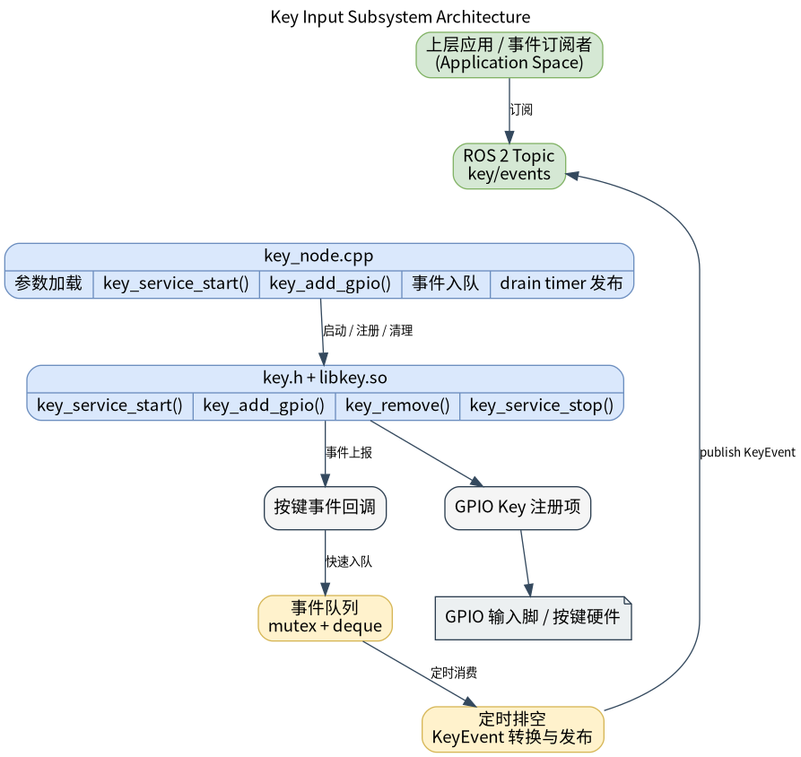
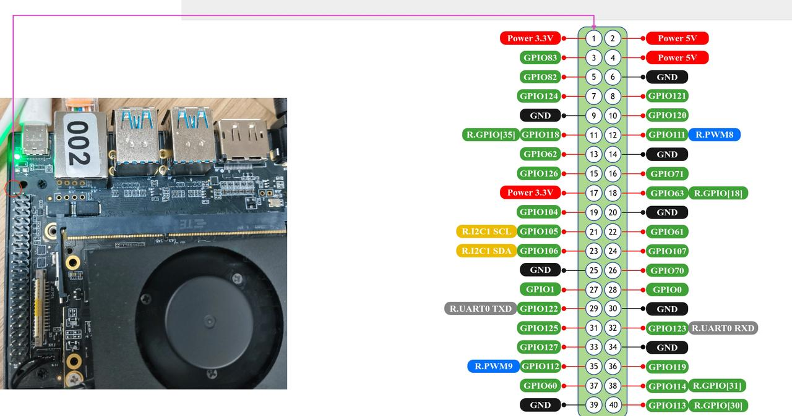

# 基础传感器 · 按键

## 1. 模块概述
 
- 主要功能：按键模块位于机器人开发层的基础传感器能力中，对下封装 `components/peripherals/key` 用户态 GPIO 按键组件，对上提供 ROS 2 节点 `key_node` 和按键事件话题。模块用于把物理 GPIO 电平变化转换为按下、释放、单击、双击、长按和长按连发等离散事件，供上层应用、交互逻辑或状态机订阅使用。  
- 规格或特性：对外接口为 ROS 2 话题 `peripherals_key_node/msg/KeyEvent`，默认话题名为 `/key/events`；节点名固定为 `key_node`；发布队列深度为 `32`；默认事件队列刷出周期为 `10 ms`；支持一次注册多个 GPIO 按键；每个按键可配置逻辑 `key_id`、Linux GPIO 编号、有效电平、长按阈值、双击窗口和日志名称。底层依赖 `libkey.so`、`key.h`、`libgpiod` 与 `/dev/gpiochip*`。  
- 软件框图：  



- 相关目录结构：  

| 路径 | 职责 |
| --- | --- |
| `middleware/ros2/peripherals/key/src/key_node.cpp` | ROS 2 按键节点实现，负责加载参数、注册底层 GPIO 按键、缓存回调事件并发布 `KeyEvent` |
| `middleware/ros2/peripherals/key/params/key_node.yaml` | 默认节点参数文件，包含默认话题、`frame_id`、发布周期和按键数组配置 |
| `middleware/ros2/peripherals/key/CMakeLists.txt` | `peripherals_key_node` 包构建文件，查找 `key.h`、`libkey.so` 并生成可执行文件 `key_node` |
| `middleware/ros2/peripherals/key/package.xml` | ROS 2 包元数据和依赖声明 |
| `middleware/ros2/peripherals/key/msg/KeyEvent.msg` | 按键事件消息定义 |
| `components/peripherals/key/include/key.h` | 底层按键组件 C API、事件枚举和 `key_config_t` 配置结构体 |
| `components/peripherals/key/src/key.c` | 底层 GPIO 读取、去抖和事件识别实现 |
| `components/peripherals/key/test/test_key.c` | 底层按键组件自测程序，可用于先排除硬件和 GPIO 配置问题 |

## 2. 环境准备

### 前置条件

- 运行环境：推荐板端环境 `k3-com260` 配套系统镜像；
- 硬件与连接：目标板需暴露可由 Linux 访问的 GPIO 控制器，并接有机械按键或按键板；确认按键对应的 Linux 逻辑 GPIO 编号、有效电平和上下拉方式。当前演示程序默认使用 `GPIO113` 与 `GPIO114`，两者均配置为高电平有效。  
- 工具与权限：运行用户需要访问 `/dev/gpiochip*` 的权限；如设备节点权限未放开，可使用 `sudo` 运行演示程序。 

### 构建编译

- **获取代码**：详见 [2.3-配置编译](../../02-%E5%BF%AB%E9%80%9F%E5%85%A5%E9%97%A8/2.3-%E9%85%8D%E7%BD%AE%E7%BC%96%E8%AF%91.md#21-代码获取) 章节，使用 `repo` 工具克隆完整 SDK。以下编译测试命令均在sdk内执行。
- 本模块编译：按依赖顺序先编译底层按键组件，再编译同仓库内自带 `KeyEvent.msg` 的 ROS 2 节点包。  

```bash
source build/envsetup.sh

./build/build.sh package components/peripherals/key
./build/build.sh package middleware/ros2/peripherals/key
```

预期产物包括：`output/staging/lib/peripherals_key_node/key_node`、`output/staging/share/peripherals_key_node/params/key_node.yaml`、`output/staging/lib/libkey.so` 以及 `peripherals_key_node/msg/KeyEvent` 的 ROS 2 接口安装文件。若当前目标不是 `riscv64`，请以实际 `output/<target>/staging` 或 `output/staging` 为准。  
- 常见差异说明：`peripherals_key_node` 的 `CMakeLists.txt` 会查找 `key.h` 和 `libkey.so`；如果未先构建 `components/peripherals/key`，会报 `key.h or libkey not found`。ROS 2 参数文件顶层键必须是实际节点名 `key_node`，不是包名 `peripherals_key_node`。  

## 3. 示例使用（从 0 跑通）

本节为读者**按步骤复现**的主线：

### 3.1 【示例一：启动 ROS 2 按键节点并观察事件】

**前置**目标板已连接物理按键；当前参数文件中的 `gpio_nums`、`active_lows` 与实际硬件一致；当前用户具备 `/dev/gpiochip*` 访问权限。 

本实例以k3-com260开发板中的gpio83为例，可通过杜邦线短接到GND，模拟实体的key按键。




**步骤 1**：进入 SDK 源码目录并加载运行环境。  

```bash

source output/staging/setup.bash
```

预期现象：`ros2 pkg executables peripherals_key_node` 能看到 `peripherals_key_node key_node`。  

**步骤 2**：确认或修改按键参数文件。默认安装后的参数文件路径如下：  

```bash
output/staging/share/peripherals_key_node/params/key_node.yaml
```

默认内容等价于：  

```yaml
key_node:
  ros__parameters:
    event_topic: "key/events"
    frame_id: "key"
    publish_period_ms: 10
    key_ids: [0]
    gpio_nums: [83]
    active_lows: [1]
    long_press_mss: [1500]
    double_click_mss: [300]
    key_names: ["power_key"]
```

预期现象：如果实际按键不是 `GPIO83` 或不是低电平有效，请先修改 `gpio_nums` 和 `active_lows`，否则节点可能启动失败或无事件输出。  

**步骤 3**：启动按键节点。  

```bash
ros2 run peripherals_key_node key_node \
  --ros-args \
  --params-file output/staging/share/peripherals_key_node/params/key_node.yaml
```

预期现象：终端打印类似日志，表示节点已启动并完成按键注册。  

```text
registered key: key_id=0 gpio=83 active_low=true long_press_ms=1500 double_click_ms=300 name=power_key
key_node ready: topic=/key/events, keys=1
```

**步骤 4**：另开一个终端，加载同样的 ROS 2 环境并订阅事件话题。  

```bash
source output/staging/setup.bash
ros2 topic echo /key/events
```

预期现象：按下物理按键后会看到 `peripherals_key_node/msg/KeyEvent` 输出，例如：  

```yaml
header:
  stamp:
    sec: 0
    nanosec: 0
  frame_id: key
key_id: 0
event_type: 1
---
```

**步骤 5**：按不同手势验证事件类型。  

| 操作 | 预期事件 |
| --- | --- |
| 短按一次 | 先出现 `event_type=1`（按下），再出现 `event_type=2`（释放），双击窗口超时后出现 `event_type=3`（单击） |
| 快速按两次 | 第二次释放后出现 `event_type=4`（双击） |
| 长按超过 `long_press_mss` | 出现 `event_type=5`（长按触发） |
| 长按后继续保持 | 周期性出现 `event_type=8`（长按连发） |

### 3.2 【示例二：配置多个按键并验证广播订阅】

**前置** :目标板有多个可用 GPIO 按键，且已确认每个按键的 Linux GPIO 编号和有效电平。  

**步骤 1**：准备多按键参数文件，例如 `/tmp/key_node_multi.yaml`。注意 `key_ids`、`gpio_nums`、`active_lows`、`long_press_mss`、`double_click_mss` 必须是等长数组；`key_names` 如果提供，也必须等长。  

```yaml
key_node:
  ros__parameters:
    event_topic: "key/events"
    frame_id: "key"
    publish_period_ms: 10

    key_ids:          [0,        1,         2]
    gpio_nums:        [83,       84,        85]
    active_lows:      [1,        1,         0]
    long_press_mss:   [1500,     2000,      1000]
    double_click_mss: [300,      300,       250]
    key_names:        ["power",  "reset",   "mode"]
```

预期现象：第 `i` 个数组元素组合成第 `i` 个按键配置。例如第一个按键是 `key_id=0`、`gpio=83`、低电平有效、长按阈值 `1500 ms`、双击窗口 `300 ms`。  

**步骤 2**：使用多按键参数文件启动节点。  

```bash
source output/staging/setup.bash

ros2 run peripherals_key_node key_node \
  --ros-args \
  --params-file /tmp/key_node_multi.yaml
```

预期现象：终端分别打印每个按键的 `registered key` 日志，并最终打印 `keys=3`。  

**步骤 3**：另开两个终端同时订阅同一话题。  

```bash
ros2 topic echo /key/events
```

```bash
ros2 topic hz /key/events
```

预期现象：`ros2 topic echo` 能看到每个物理按键对应的 `key_id`；多个订阅者都能收到同一批按键事件，说明按键接口采用广播型话题模型。  


## 4. 应用开发

- **对外 API 或接口形态**：上层应用主要订阅 ROS 2 话题 `/key/events`，消息类型为 `peripherals_key_node/msg/KeyEvent`。消息字段包括 `std_msgs/Header header`、`uint32 key_id`、`uint8 event_type`。
- **调用方式与注意点**（线程、权限、资源释放等）：  
  - 订阅端按 `key_id` 区分物理按键，按 `event_type` 区分事件类型。当前节点会发布 `1=PRESSED`、`2=RELEASED`、`3=CLICK`、`4=DOUBLE_CLICK`、`5=LONG_PRESS_START`、`8=REPEAT`；`KeyEvent.msg` 中的 `6=LONG_PRESS_HOLD` 和 `7=LONG_PRESS_UP` 当前不会由本节点产生。  
  - `header.frame_id` 来自参数 `frame_id`，默认值为 `key`；同一轮队列刷出时，节点对本批事件使用同一个 `now()` 时间戳。  
  - `publish_period_ms` 控制事件队列刷出周期，默认 `10`；建议保持为正整数，不建议设为 `0` 或过小值，避免定时器压力和无意义调度。  
  - 参数数组必须满足长度约束：`key_ids` 非空且每项 `>= 0`，`gpio_nums` 每项 `> 0`，`long_press_mss` 和 `double_click_mss` 每项 `>= 0`。`active_lows` 建议只写 `0` 或 `1`，实际实现中非 `0` 都按低电平有效处理。  
  - `key_names` 只用于日志打印，可以省略；省略时节点会生成 `key_<key_id>_gpio_<gpio_num>` 形式的默认名称。  
  - 底层组件会启动后台扫描线程并在节点析构时释放资源；应用侧只需正常退出 `key_node`，不需要直接调用底层 `key_service_stop()`。  
  - 单击事件需要等待双击窗口超时后才能确认，因此会比物理释放延后约 `double_click_mss`。底层 `key_config_t` 对 `double_click_ms=0` 的语义是使用默认值 `300 ms`，当前版本不应依赖把 `double_click_mss` 设为 `0` 来关闭双击判定。  
- **参考 demo 或示例路径**：`middleware/ros2/peripherals/key/README.md`、`middleware/ros2/peripherals/key/params/key_node.yaml`、`middleware/ros2/peripherals/key/src/key_node.cpp`、`components/peripherals/key/test/test_key.c`。  

事件类型映射如下：  

| 底层事件 | ROS 2 `event_type` | 含义 |
| --- | --- | --- |
| `KEY_EV_PRESSED` | `1` | 物理按下 |
| `KEY_EV_RELEASED` | `2` | 物理释放 |
| `KEY_EV_CLICK` | `3` | 单击 |
| `KEY_EV_DOUBLE_CLICK` | `4` | 双击 |
| `KEY_EV_LONG_PRESS` | `5` | 长按触发 |
| `KEY_EV_HOLD_REPEAT` | `8` | 长按连发 |

## 5. 调试指南

- 先用底层组件排除硬件问题：在 `robotics_sdk` 根目录执行 `./build/build.sh package components/peripherals/key`，然后在目标板运行 `sudo output/staging/bin/test_key`。如果底层 `test_key` 没有事件输出，优先检查 GPIO 编号、有效电平、设备节点权限和硬件接线。  
- 与硬件或内核同事联调时，建议提供：板型和镜像版本、内核版本、按键原理图或接线说明、Linux GPIO 编号和有效电平。  

## 6. 常见问题

暂无
