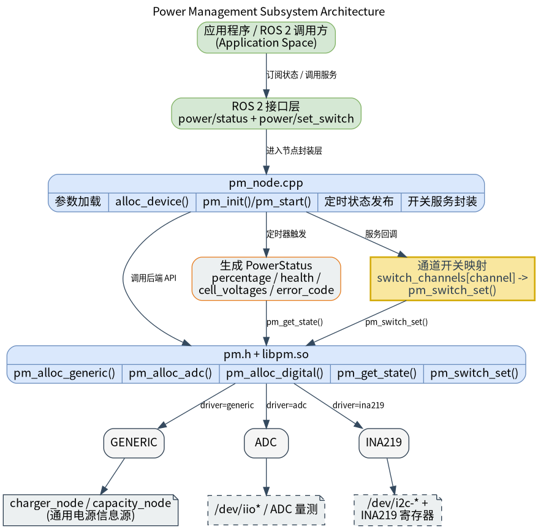

# 基础传感器 · 电源

## 1. 模块概述
 
- 主要功能：电源模块位于机器人开发层的基础传感器能力中，对下封装 `components/peripherals/pm` 电源管理组件，对上提供 ROS 2 节点 `pm_node`。模块用于持续读取电池/供电状态，并以状态话题形式发布；同时向上层暴露电源开关控制服务，供业务节点进行开关请求和结果确认。  
- 规格或特性（接口形态、速率、分辨率、算法版本等）：模块采用“状态话题 + 控制服务”的混合接口。状态输出消息为 `peripherals_pm_node/msg/PowerStatus`，默认话题为 `/power/status`；控制输入为 `peripherals_pm_node/srv/SetPowerSwitch`，默认服务名为 `/power/set_switch`。节点名固定为 `pm_node`；默认轮询与发布频率为 `1.0 Hz`；支持 `generic`、`adc`、`ina219` 三类底层驱动入口，但当前代码路径最完整、最推荐使用的是 `generic`。  
- 软件框图：  



- 相关目录结构：  

| 路径 | 职责 |
| --- | --- |
| `middleware/ros2/peripherals/pm/src/pm_node.cpp` | ROS 2 电源节点实现，负责加载参数、构造底层设备、轮询状态并提供开关服务 |
| `middleware/ros2/peripherals/pm/params/pm_node.yaml` | 默认节点参数文件，包含驱动选择、话题名、服务名、轮询频率和底层配置 |
| `middleware/ros2/peripherals/pm/CMakeLists.txt` | `peripherals_pm_node` 包构建文件，查找 `pm.h`、`libpm.so` 并生成 `pm_node` |
| `middleware/ros2/peripherals/pm/package.xml` | ROS 2 包元数据和依赖声明 |
| `middleware/ros2/peripherals/pm/msg/PowerStatus.msg` | 电源状态消息定义 |
| `middleware/ros2/peripherals/pm/srv/SetPowerSwitch.srv` | 电源开关服务定义 |
| `components/peripherals/pm/include/pm.h` | 底层电源组件 C API、状态结构体和配置结构体 |
| `components/peripherals/pm/src/pm_core.c` | 底层生命周期、驱动分配、状态读取和开关控制公共逻辑 |
| `components/peripherals/pm/src/drivers/drv_generic.c` | 通过 Linux `power_supply` 节点读取充电状态和电量百分比的通用驱动 |
| `components/peripherals/pm/test/test_pm_generic.c` | `generic` 驱动测试程序，用于先验证底层读取链路 |
| `components/peripherals/pm/test/test_pm_adc.c` | ADC 驱动测试程序，用于验证另一类底层接入方式 |

## 2. 环境准备

### 前置条件

- 运行环境：推荐板端环境 `k1-deb1` 配套系统镜像；构建侧需要 C++17 编译器、CMake、`ament_cmake`、`rclcpp` 和 SDK 统一构建脚本。若使用 `generic` 驱动，系统需暴露 `/sys/class/power_supply/<charger>/online` 与 `/sys/class/power_supply/<battery>/capacity`。  
- 硬件与连接：需要板子集成电量计芯片CW2015和充电芯片IP2317，且内核需要打开驱动以及dts配置。 

### 构建编译

- **获取代码**：详见 [2.3-配置编译](../../02-%E5%BF%AB%E9%80%9F%E5%85%A5%E9%97%A8/2.3-%E9%85%8D%E7%BD%AE%E7%BC%96%E8%AF%91.md#21-代码获取) 章节，使用 `repo` 工具克隆完整 SDK。以下编译测试命令均在sdk内执行。
- 本模块编译：按依赖顺序先编译底层电源组件，再编译同仓库内自带 `PowerStatus.msg` 和 `SetPowerSwitch.srv` 的 ROS 2 节点包。  

```bash
source build/envsetup.sh
./build/build.sh package components/peripherals/pm
./build/build.sh package middleware/ros2/peripherals/pm
```

预期产物包括：`output/staging/lib/peripherals_pm_node/pm_node`、`output/staging/share/peripherals_pm_node/params/pm_node.yaml`、`output/staging/lib/libpm.so`，以及 `peripherals_pm_node/msg/PowerStatus` 与 `peripherals_pm_node/srv/SetPowerSwitch` 的 ROS 2 接口安装文件。若当前目标不是 `riscv64`，请以实际 `output/<target>/staging` 或 `output/staging` 为准。  
- 常见差异说明：`peripherals_pm_node` 的 `CMakeLists.txt` 会查找 `pm.h` 和 `libpm.so`；如果未先构建 `components/peripherals/pm`，会报 `pm.h or libpm not found`。参数文件顶层键必须写成实际节点名 `pm_node`，不是包名 `peripherals_pm_node`。  

## 3. 示例使用（从 0 跑通）

本节为读者**按步骤复现**的主线：

### 3.1 【示例一：启动电源节点并观察状态话题】

**前置**：请先确认目标板已经暴露了可读的 `power_supply` 节点；若你的节点名不是默认的 `ip2317-charger` 与 `cw-bat`，请在运行参数中传入实际名称。 

**步骤 1**：进入 SDK 源码目录并加载运行环境。  

```bash
source output/staging/setup.bash
```

预期现象：`ros2 pkg executables peripherals_pm_node` 能看到 `peripherals_pm_node pm_node`。  

**步骤 2**：确认或修改默认参数文件。安装后的默认参数文件路径如下：  

```bash
output/staging/share/peripherals_pm_node/params/pm_node.yaml
```

默认内容等价于：  

```yaml
pm_node:
  ros__parameters:
    driver: "generic"
    name: "main_batt"

    frame_id: "power"
    status_topic: "power/status"
    switch_service: "power/set_switch"
    poll_hz: 1.0
    publish_on_startup: true

    charger_node: "ip2317-charger"
    capacity_node: "cw-bat"
```

预期现象：如果目标系统中的 `power_supply` 节点名称不是 `ip2317-charger` 和 `cw-bat`，必须先修改参数，否则节点启动后会持续读取失败。  

**步骤 3**：启动电源节点。  

```bash
ros2 run peripherals_pm_node pm_node \
  --ros-args \
  --params-file output/staging/share/peripherals_pm_node/params/pm_node.yaml
```

预期现象：终端打印类似日志，表示节点已按 `generic` 驱动启动。  

```text
pm_node ready: driver=generic name=main_batt topic=/power/status switch_service=power/set_switch poll_hz=1.000
```

**步骤 4**：另开一个终端，加载同样的 ROS 2 环境并订阅状态话题。  

```bash
source output/staging/setup.bash
ros2 topic echo /power/status
```

预期现象：如果底层读取成功，会周期性看到 `peripherals_pm_node/msg/PowerStatus` 输出，例如：  

```yaml
header:
  stamp:
    sec: 0
    nanosec: 0
  frame_id: power
status: 1
percentage: 98.0
health: 0.0
cycle_count: 0
error_code: 0
cell_count: 0
cell_voltages: []
---
```

**步骤 5**：做插拔充电器测试。  

| 操作 | 预期现象 |
| --- | --- |
| 未充电 | `status=1`，表示 `DISCHARGING` |
| 插入充电器 | `status=2`，表示 `CHARGING` |
| 电量节点可读 | `percentage` 随 `capacity` 节点变化 |
| 节点名配置错误或节点不可读 | 终端会周期性打印 `pm_get_state failed` 警告 |


## 4. 应用开发

- **对外 API 或接口形态**（头文件、库名、服务/话题）：上层主要通过 ROS 2 话题 `/power/status` 订阅电源状态，消息类型为 `peripherals_pm_node/msg/PowerStatus`；通过 ROS 2 服务 `/power/set_switch` 发起电源开关控制，服务类型为 `peripherals_pm_node/srv/SetPowerSwitch`。`PowerStatus` 当前包含 `status`、`percentage`、`health`、`cycle_count`、`error_code`、`cell_count` 和 `cell_voltages`；服务请求包含 `channel` 和 `enable`，响应包含 `success` 和 `message`。  
- **调用方式与注意点**（线程、权限、资源释放等）：  
  - 状态消息中的 `status` 映射关系为：`0=UNKNOWN`、`1=DISCHARGING`、`2=CHARGING`、`3=FULL`、`4=FAULT`、`5=SLEEP`。  
  - 节点通过定时器周期性调用 `pm_get_state()`，而不是依赖底层回调推送完整状态；这是因为当前底层回调主要覆盖充放电状态变化，不适合作为完整快照通道。  
  - `publish_on_startup=true` 时，节点启动后会立即发布一次状态；之后再按 `poll_hz` 设定的频率继续发布。  
  - 参数校验较严格：`poll_hz`、`capacity_mah`、`max_voltage`、`min_voltage`、`max_temp` 必须大于 `0`；`max_voltage > min_voltage`；`warn_voltage` 和 `crit_voltage` 必须落在 `[min_voltage, max_voltage]` 且 `warn_voltage >= crit_voltage`；`ina219` 的 `i2c_addr` 必须在 `[0, 127]`；`switch_channels` 最多 `256` 项。  
  - `switch_channels` 是从服务通道号到底层通道名的映射数组。`SetPowerSwitch.srv` 的 `channel` 是 `uint8`，节点内部通过 `switch_channels[channel]` 找到底层名字；如果该下标不存在或为空字符串，服务会直接返回失败。  
  - 当前 ROS 2 `PowerStatus.msg` 不能完整承载底层 `pm_state` 中的 `voltage`、`current`、`power`、`temperature` 等字段；如果业务依赖这些数据，需要扩展消息定义或新增专门的电池状态消息。  
  - 当前底层 `generic`、`adc`、`ina219` 驱动的 `pm_switch_set()` 都未形成完整可用能力；其中 `generic` 明确返回 `-ENOSYS`，`adc`/`ina219` 也还是占位实现。因此在现阶段，应将服务视为“接口已预留、是否可用取决于底层后端”。  
- **参考 demo 或示例路径**：`middleware/ros2/peripherals/pm/README.md`、`middleware/ros2/peripherals/pm/params/pm_node.yaml`、`middleware/ros2/peripherals/pm/src/pm_node.cpp`、`components/peripherals/pm/test/test_pm_generic.c`、`components/peripherals/pm/test/test_pm_adc.c`。  

`PowerStatus` 字段说明如下：  

| 字段 | 含义 |
| --- | --- |
| `header` | ROS 标准时间戳和坐标系字段，`frame_id` 来自参数 `frame_id` |
| `status` | 充放电状态枚举 |
| `percentage` | 电量百分比，范围 `0.0-100.0` |
| `health` | 健康度，当前取决于底层驱动是否提供 |
| `cycle_count` | 充放电循环次数 |
| `error_code` | 硬件错误码，`0` 表示无错误 |
| `cell_count` | 单体电芯数量 |
| `cell_voltages` | 单体电芯电压数组，最多 `16` 项 |

## 5. 调试指南

- 先用底层组件验证 `generic` 驱动链路：如果当前构建启用了组件测试程序，可在 `components/peripherals/pm` 下按组件 README 的方式使用 `-DBUILD_TESTS=ON` 编译 `test_pm_generic`，然后运行 `./build/test_pm_generic ip2317-charger cw-bat`。如果该程序都无法稳定输出 `SOC` 和 `status`，优先检查 Linux `power_supply` 节点名称和读取权限。  
- 直接检查 Linux 节点：确认 `/sys/class/power_supply/<charger_node>/online` 和 `/sys/class/power_supply/<capacity_node>/capacity` 是否存在，并可被 `cat` 正常读取；`online` 一般用于判断是否在充电，`capacity` 用于获取百分比。  
- 观察 ROS 2 节点日志：正常启动会打印 `pm_node ready`；如果底层读取失败，会节流打印 `pm_get_state failed`。如果参数校验失败，节点会在启动阶段抛出异常，例如 `poll_hz must be > 0`、`charger_node must not be empty for generic driver`。  
- 观察 ROS 2 图和接口：使用 `ros2 node list` 确认存在 `/pm_node`，使用 `ros2 topic echo /power/status` 查看状态输出，使用 `ros2 service call /power/set_switch ...` 验证服务返回。  
- 如果服务总是失败，要先区分失败来源：未配置 `switch_channels` 时会直接返回 `channel N is not configured`；底层不支持时会返回 `pm_switch_set failed ...` 且伴随错误码，例如当前 `generic` 驱动的 `-ENOSYS`。  
- 与硬件或 BSP 同事联调时，建议一并提供：板型和镜像版本、内核版本、`/sys/class/power_supply` 目录结构、`online` 和 `capacity` 节点的实际路径与示例值、所用 `pm_node.yaml`、节点启动日志、服务调用命令和返回结果。如果是 `adc` 或 `ina219` 路径，还应提供对应设备节点路径、I2C 地址和采样硬件接线。  

## 6. 常见问题
暂无
