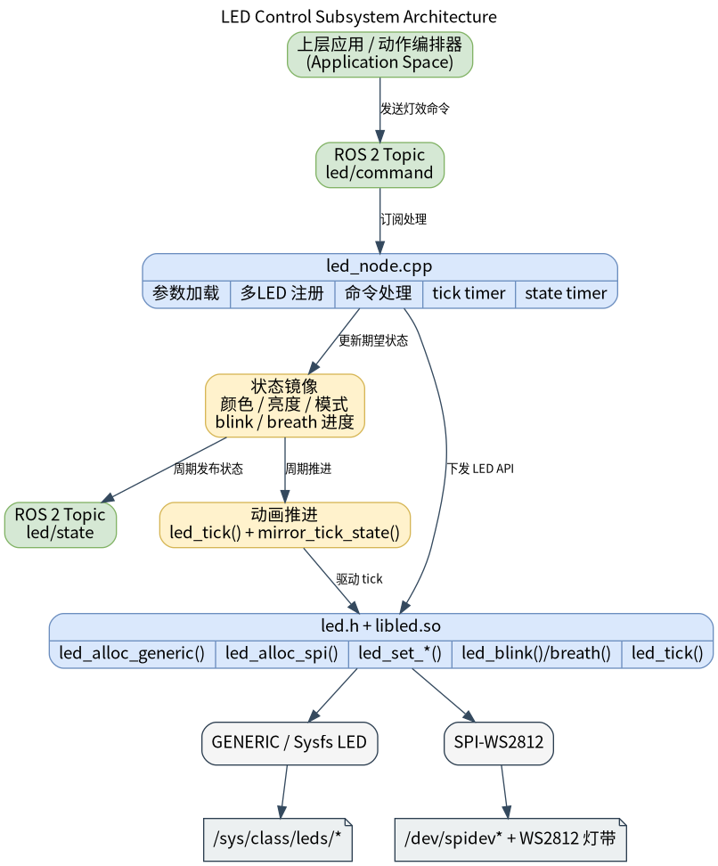

# 基础传感器 · LED

## 1. 模块概述
 
- 主要功能：LED 模块位于机器人开发层的基础传感器能力中，对下封装 `components/peripherals/led` 用户态 LED 组件，对上提供 ROS 2 节点 `led_node`。模块用于统一控制板载 sysfs 指示灯和 SPI WS2812 灯带，并向上层提供颜色、亮度、常亮、闪烁和呼吸三类控制能力。  
- 规格或特性（接口形态、速率、分辨率、算法版本等）：命令输入为 `peripherals_led_node/msg/LedCommand`，默认话题 `/led/command`；状态输出为 `peripherals_led_node/msg/LedState`，默认话题 `/led/state`。当前支持 `mode=0/1/2`，分别表示 `STATIC / BLINK / BREATH`；节点默认以 `50 ms` 周期调用底层 `led_tick()`，以 `100 ms` 周期发布状态；单个节点可同时管理多路 LED，支持 `generic` 和 `spi` 两种传输类型。状态话题使用 `reliable + transient_local` QoS，新订阅者启动后可立即拿到最近状态。  
- 软件框图：  



- 相关目录结构：  

| 路径 | 职责 |
| --- | --- |
| `middleware/ros2/peripherals/led/src/led_node.cpp` | ROS 2 LED 节点实现，负责参数校验、LED 注册、命令处理、tick 状态机和状态发布 |
| `middleware/ros2/peripherals/led/params/led_node.yaml` | 默认参数文件，包含一组 generic LED 示例 |
| `middleware/ros2/peripherals/led/CMakeLists.txt` | `peripherals_led_node` 包构建文件，查找 `led.h`、`libled.so` 并生成 `led_node` |
| `middleware/ros2/peripherals/led/msg/LedCommand.msg` | LED 命令消息定义 |
| `middleware/ros2/peripherals/led/msg/LedState.msg` | LED 状态消息定义 |
| `components/peripherals/led/include/led.h` | 底层 LED 组件 C API |
| `components/peripherals/led/test/test_led_generic.c` | sysfs LED 底层测试程序 |
| `components/peripherals/led/test/test_led_ws2812.c` | SPI WS2812 底层测试程序 |

## 2. 环境准备

### 前置条件

- 运行环境：推荐板端环境 `k1-deb1` 配套系统镜像；构建侧需要 CMake、C++ 编译器、`ament_cmake`、`rclcpp` 和 SDK 统一构建脚本。  
- 硬件与连接：`generic` 类型适用于板载 GPIO LED 或 Linux LED class 设备；`spi` 类型适用于接入 SPI 控制器的 WS2812/SK6812 灯带。需要提前确认 LED 名称、有效电平、SPI 设备节点、灯珠数量、供电和共地连接。

### 构建编译

- **获取代码**：详见 [2.3-配置编译](../../02-%E5%BF%AB%E9%80%9F%E5%85%A5%E9%97%A8/2.3-%E9%85%8D%E7%BD%AE%E7%BC%96%E8%AF%91.md#21-代码获取) 章节，使用 `repo` 工具克隆完整 SDK。以下编译测试命令均在sdk内执行。
- 本模块编译：按依赖顺序先编译底层按键组件和消息接口，再编译 ROS 2 节点。  

```bash
source build/envsetup.sh
cd components/peripherals/led
mm -DBUILD_TESTS=ON -DSROBOTIS_PERIPHERALS_LED_ENABLED_DRIVERS="drv_generic;drv_spi_ws2812"

cd ../../../
./build/build.sh package middleware/ros2/peripherals/led
```

预期产物包括：`output/staging/lib/peripherals_led_node/led_node`、`output/staging/share/peripherals_led_node/params/led_node.yaml`、`output/staging/lib/libled.so`，以及 `LedCommand` / `LedState` 的 ROS 2 接口安装文件。若当前目标不是 `riscv64`，请以实际 `output/<target>/staging` 或 `output/staging` 为准。  
- 常见差异说明：`peripherals_led_node` 的 `CMakeLists.txt` 会查找 `led.h` 和 `libled.so`；如果未先构建 `components/peripherals/led`，会报 `led.h or libled not found`。如果希望在 ROS 2 中使用 `transport=spi`，还需要确认底层 `components/peripherals/led` 构建时启用了 `drv_spi_ws2812`。参数文件顶层键必须写成实际节点名 `led_node`，不是包名 `peripherals_led_node`。  

## 3. 示例使用（从 0 跑通）

本节为读者**按步骤复现**的主线：

### 3.1 【示例一：启动 LED 节点并控制 SPI 灯带】

**前置**：请先把参数文件改成 `spi` 场景，例如 `transports=["spi"]`、`names=["strip0"]`、`spi_dev_paths=["/dev/spidev0.0"]`、`spi_num_leds=[23]`，并确保底层 `components/peripherals/led` 构建时已启用 `drv_spi_ws2812`。`spi_speed_hz` 和 `spi_reset_bytes` 可先使用默认值 `6400000` 与 `80`。  
spi_dev_paths根据当前板子实际的/dev/spidev0.0填写，如下所示：
```
cat output/staging/share/peripherals_led_node/params/led_node.yaml 
led_node:
  ros__parameters:
    frame_id: "led"
    command_topic: "led/command"
    state_topic: "led/state"
    tick_period_ms: 50
    publish_period_ms: 100
    publish_on_command: true
    publish_on_startup: true

    led_ids: [0]
    transports: ["spi"]
    names: ["spi_ws2812"]

    generic_sysfs_names: [""]
    generic_active_levels: [0]

    spi_dev_paths: ["/dev/spidev0.0"]
    spi_num_leds: [1]
    spi_speed_hz: [6400000]
    spi_reset_bytes: [80]
```
确保已接入ws2812设备。

**步骤 1**：另起终端，进入 SDK 源码目录并加载运行环境。  

```bash
source output/staging/setup.bash
```

预期现象：`ros2 pkg executables peripherals_led_node` 能看到 `peripherals_led_node led_node`。  

**步骤 2**：确认或修改参数文件。默认安装后的参数文件路径如下：  

```bash
output/staging/share/peripherals_led_node/params/led_node.yaml
```

默认配置等价于一颗 `generic` LED，展示 SPI 驱动前需要先改成 `spi` 配置。  

**步骤 3**：启动 LED 节点。  

```bash
ros2 run peripherals_led_node led_node \
  --ros-args \
  --params-file output/staging/share/peripherals_led_node/params/led_node.yaml
```

预期现象：终端打印 `led_node ready`，并带出命令话题、状态话题、LED 数量、tick 周期和状态发布周期。  

**步骤 4**：另开终端订阅状态话题。  

```bash
source output/staging/setup.bash
ros2 topic echo /led/state
```

预期现象：打印当前的led状态

**步骤 5**：
发布一条常亮红灯命令:

```bash
ros2 topic pub --once /led/command peripherals_led_node/msg/LedCommand  \
   "{header: {frame_id: 'led'}, led_id: 0, r: 255, g: 0, b: 0, brightness: 128, mode: 0, period_ms: 0, on_ms: 0, count: 0}"

```
发布一条常亮绿灯命令:
```bash
ros2 topic pub --once /led/command peripherals_led_node/msg/LedCommand \
 "{header: {frame_id: 'led'}, led_id: 0, r: 0, g: 255, b: 0, brightness: 128, mode: 0, period_ms: 0, on_ms: 0, count: 0}"

```

预期现象：对应 WS2812 灯带进入常亮红色或者绿色状态；`/led/state` 中 `led_id=0` 的 `r/g/b`、`brightness`、`mode` 和 `is_on` 会同步更新。当前 SPI 实现会把整条灯带刷成同一种颜色和亮度，不支持按单颗灯珠分别控制。  

### 3.2 【示例二：控制闪烁与呼吸效果】

**前置**（与 §2「前置条件」一致可写「见 §2」）：见 §2。LED 节点已启动。  

**步骤 1**：发送闪烁命令。  

```bash
ros2 topic pub --once /led/command peripherals_led_node/msg/LedCommand \
  "{header: {frame_id: 'led'}, led_id: 0, r: 255, g: 255, b: 255, brightness: 255, mode: 1, period_ms: 1000, on_ms: 200, count: 5}"
```

预期现象：WS2812 灯带执行 5 次白色闪烁。节点内部会在 `tick_period_ms` 定时器里调用 `led_tick()` 并镜像状态机，因此 `/led/state` 的 `brightness` 与 `is_on` 会随闪烁变化。在当前实现里，闪烁模式下状态亮度会在 `255/0` 间切换，命令中的 `brightness` 字段不会参与闪烁亮度计算。  

**步骤 2**：发送呼吸命令。  

```bash
ros2 topic pub --once /led/command peripherals_led_node/msg/LedCommand \
  "{header: {frame_id: 'led'}, led_id: 0, r: 0, g: 0, b: 255, brightness: 128, mode: 2, period_ms: 2000, on_ms: 0, count: 0}"
```

预期现象：WS2812 灯带进入蓝色呼吸效果。`/led/state` 中 `mode=2`，`brightness` 会随时间周期性变化。当前实现不会直接使用命令中的 `brightness` 作为呼吸亮度。  

**步骤 3**：发送关灯命令。  

```bash
ros2 topic pub --once /led/command peripherals_led_node/msg/LedCommand \
  "{header: {frame_id: 'led'}, led_id: 0, r: 0, g: 0, b: 0, brightness: 0, mode: 0, period_ms: 0, on_ms: 0, count: 0}"
```

预期现象：LED 熄灭，`/led/state` 中 `is_on=false`，`brightness=0`。如果命令中的 `led_id` 不存在，节点会打印 `unknown led_id` 告警并忽略该命令。  

## 4. 应用开发

- **对外 API 或接口形态**（头文件、库名、服务/话题）：上层应用通过 `/led/command` 发布 `peripherals_led_node/msg/LedCommand` 控制目标 LED；通过 `/led/state` 订阅 `peripherals_led_node/msg/LedState` 获取每路 LED 当前状态。当前节点不提供 service 接口。  
- **调用方式与注意点**（线程、权限、资源释放等）：`LedCommand.led_id` 用于选择目标 LED；`mode` 取值为 `0=STATIC`、`1=BLINK`、`2=BREATH`；闪烁和呼吸模式下 `period_ms` 必须大于 `0`；闪烁模式下 `count=0` 表示无限循环；参数数组 `led_ids`、`transports`、`names`、`generic_sysfs_names`、`generic_active_levels`、`spi_dev_paths`、`spi_num_leds`、`spi_speed_hz`、`spi_reset_bytes` 必须与 `led_ids` 等长，且 `led_ids` 必须唯一。SPI 设备名如果不带驱动前缀，节点会自动补成 `spi-ws2812:<name>`。  
- **参考 demo 或示例路径**：`middleware/ros2/peripherals/led/README.md`、`middleware/ros2/peripherals/led/params/led_node.yaml`、`middleware/ros2/peripherals/led/src/led_node.cpp`、`components/peripherals/led/test/test_led_generic.c`、`components/peripherals/led/test/test_led_ws2812.c`。  

主要消息字段如下：  

| 接口 | 字段 | 含义 |
| --- | --- | --- |
| `LedCommand` | `led_id` | 目标 LED 逻辑 ID |
| `LedCommand` | `r/g/b` | 目标颜色分量，范围 `0..255` |
| `LedCommand` | `brightness` | 目标亮度，范围 `0..255`；当前实现中仅 `STATIC` 模式直接使用，`BLINK/BREATH` 会被节点状态机覆盖 |
| `LedCommand` | `mode` | `0=STATIC`、`1=BLINK`、`2=BREATH` |
| `LedCommand` | `period_ms` | 闪烁或呼吸周期 |
| `LedCommand` | `on_ms` | 闪烁模式下亮灯持续时间 |
| `LedCommand` | `count` | 闪烁重复次数，`0=无限` |
| `LedState` | `is_on` | 当前是否处于亮起状态 |

## 5. 调试指南

- 先用底层组件验证链路：如果构建时启用了测试程序，可先运行 `test_led_generic` 或 `test_led_ws2812`，确认底层 `led.h + libled.so` 能直接控制硬件，再回到 ROS 2 节点排查。  
- 观察节点启动日志：正常启动会打印 `led_node ready`；如果参数数组长度不一致，会抛出 `size mismatch with led_ids`；如果 LED 分配失败，会抛出 `failed to allocate LED device`。  
- 如果 `generic` 模式下无响应，先检查 `/sys/class/leds/<name>/brightness` 是否存在，且当前用户具备写权限。  
- 如果 `spi` 模式下无响应，检查 `/dev/spidevX.Y` 是否存在、当前用户是否可访问、底层组件是否已启用 `drv_spi_ws2812`，并核对 `spi_num_leds`、`spi_speed_hz` 和 `spi_reset_bytes`。  
- 如果闪烁或呼吸效果不变化，确认 `tick_period_ms > 0`，且节点主循环没有阻塞；当前效果推进完全依赖定时器周期调用 `led_tick()`。   

## 6. 常见问题
暂无
