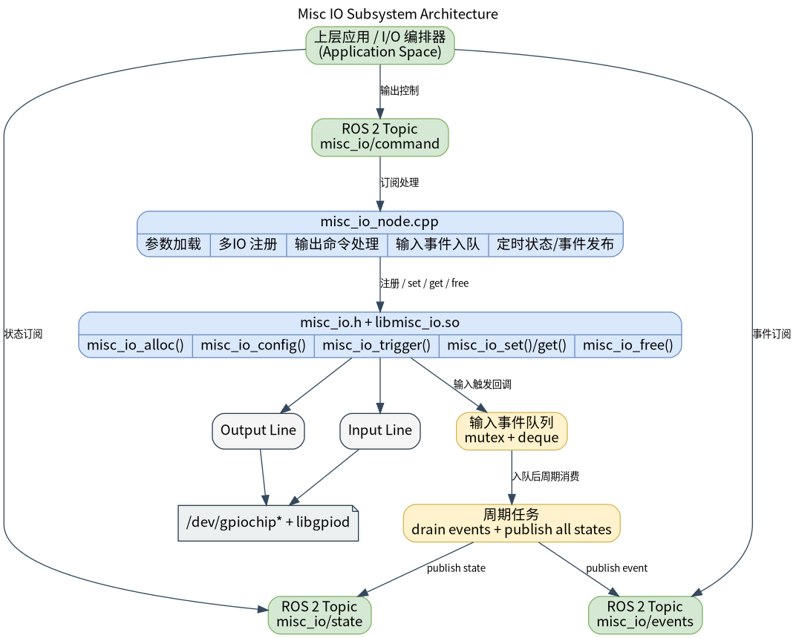

# 基础传感器 · IO

## 1. 模块概述
 
- 主要功能：IO 模块位于机器人开发层的基础传感器能力中，对下封装 `components/peripherals/misc_io` Linux GPIO 组件，对上提供 ROS 2 节点 `misc_io_node`。模块用于统一接入开关、光耦、限位、普通数字传感器、蜂鸣器、继电器和通用 GPIO 输出等零散 IO 外设，并向上层提供命令、状态和事件三类 ROS 2 接口。  
- 规格或特性（接口形态、速率、分辨率、算法版本等）：命令输入为 `peripherals_misc_io_node/msg/MiscIoCommand`，默认话题 `/misc_io/command`；状态输出为 `peripherals_misc_io_node/msg/MiscIoState`，默认话题 `/misc_io/state`；输入事件输出为 `peripherals_misc_io_node/msg/MiscIoEvent`，默认话题 `/misc_io/events`。默认状态发布周期为 `100 ms`；支持一次注册多个 IO；每路 IO 可配置逻辑 ID、类型、方向、有效电平、去抖时间、`gpiochip` 名称、line offset、consumer 名称和日志名称。状态话题使用 `reliable + transient_local` QoS，新订阅者可立即收到最近一次状态快照。  
- 软件框图：  



- 相关目录结构：  

| 路径 | 职责 |
| --- | --- |
| `middleware/ros2/peripherals/misc_io/src/misc_io_node.cpp` | ROS 2 IO 节点实现，负责注册 IO、订阅命令、发布状态和输入事件 |
| `middleware/ros2/peripherals/misc_io/params/misc_io_node.yaml` | 默认节点参数文件，包含三路 IO 示例配置 |
| `middleware/ros2/peripherals/misc_io/CMakeLists.txt` | `peripherals_misc_io_node` 包构建文件，查找 `misc_io.h`、`libmisc_io.so` 并生成 `misc_io_node` |
| `middleware/ros2/peripherals/misc_io/msg/MiscIoCommand.msg` | IO 输出命令消息定义 |
| `middleware/ros2/peripherals/misc_io/msg/MiscIoState.msg` | IO 状态消息定义 |
| `middleware/ros2/peripherals/misc_io/msg/MiscIoEvent.msg` | IO 输入事件消息定义 |
| `components/peripherals/misc_io/include/misc_io.h` | 底层 misc_io C API |
| `components/peripherals/misc_io/test/test_misc_io.c` | 底层组件测试程序 |

## 2. 环境准备

### 前置条件

- 运行环境：推荐板端环境 `k3-com260` 配套系统镜像；构建侧需要 CMake、C++ 编译器、`ament_cmake`、`rclcpp` 和 SDK 统一构建脚本。  
- 硬件与连接：目标板需暴露可由 Linux 访问的 GPIO 控制器，并接有机械按键或按键板；确认按键对应的 Linux 逻辑 GPIO 编号、有效电平和上下拉方式。当前演示程序默认使用 `GPIO113` 与 `GPIO114`，两者均配置为高电平有效。  
- 工具与权限：运行用户需要访问 `/dev/gpiochip*` 的权限；如设备节点权限未放开，可使用 `sudo` 运行演示程序。 

### 构建编译

- **获取代码**：详见 [2.3-配置编译](../../02-%E5%BF%AB%E9%80%9F%E5%85%A5%E9%97%A8/2.3-%E9%85%8D%E7%BD%AE%E7%BC%96%E8%AF%91.md#21-代码获取) 章节，使用 `repo` 工具克隆完整 SDK。以下编译测试命令均在sdk内执行。
- 本模块编译：按依赖顺序先编译底层 IO 组件，再编译同仓库内自带 `MiscIoCommand.msg`、`MiscIoState.msg` 和 `MiscIoEvent.msg` 的 ROS 2 节点包。  

```bash
source build/envsetup.sh

./build/build.sh package components/peripherals/misc_io
./build/build.sh package middleware/ros2/peripherals/misc_io
```

预期产物包括：`output/staging/lib/peripherals_misc_io_node/misc_io_node`、`output/staging/share/peripherals_misc_io_node/params/misc_io_node.yaml`、`output/staging/lib/libmisc_io.so`，以及 `peripherals_misc_io_node` 下的 `MiscIoCommand` / `MiscIoState` / `MiscIoEvent` ROS 2 接口安装文件。若当前目标不是 `riscv64`，请以实际 `output/<target>/staging` 或 `output/staging` 为准。  
- 常见差异说明：`peripherals_misc_io_node` 的 `CMakeLists.txt` 会查找 `misc_io.h` 和 `libmisc_io.so`；如果未先构建 `components/peripherals/misc_io`，会报 `misc_io.h or libmisc_io not found`。参数文件顶层键必须写成实际节点名 `misc_io_node`，不是包名 `peripherals_misc_io_node`。  

## 3. 示例使用（从 0 跑通）

本节为读者**按步骤复现**的主线：

### 3.1 【示例一：启动 IO 节点并观察状态与事件】

**前置**：已完成构建；默认参数文件中的 `chip_names`、`line_offsets`、`dirs` 和 `active_logics` 与实际硬件一致；当前用户具备 `/dev/gpiochip*` 访问权限。  

**步骤 1**：进入 SDK 源码目录并加载运行环境。  

```bash
source output/staging/setup.bash
```

预期现象：`ros2 pkg executables peripherals_misc_io_node` 能看到 `peripherals_misc_io_node misc_io_node`。  

**步骤 2**：确认或修改参数文件。默认安装后的参数文件路径如下：  

```bash
output/staging/share/peripherals_misc_io_node/params/misc_io_node.yaml
```

默认配置等价于两路输入加一路输出。若实际 GPIO 与示例不一致，请先修改参数。  

**步骤 3**：启动 IO 节点。  

```bash
ros2 run peripherals_misc_io_node misc_io_node \
  --ros-args \
  --params-file output/staging/share/peripherals_misc_io_node/params/misc_io_node.yaml
```

预期现象：终端打印每路 IO 的 `registered io` 日志，并最终打印 `misc_io_node ready`。  

**步骤 4**：另开终端订阅状态话题。  

```bash
source output/staging/setup.bash
ros2 topic echo /misc_io/state
```

预期现象：以 `publish_period_ms` 为周期持续看到每个已注册 IO 的状态。输入和输出都会发布 `MiscIoState`。  

**步骤 5**：订阅输入事件话题，并触发输入电平变化。  

```bash
ros2 topic echo /misc_io/events
```

预期现象：输入 IO 进入有效态时发布 `event=0`，离开有效态时发布 `event=1`；输出 IO 不发布输入事件。  

### 3.2 【示例二：通过命令话题控制输出 IO】

**前置**：参数中至少配置一路 `dir=1` 的输出 IO，例如默认示例中的 `io_id=2`。  

**步骤 1**：发布打开命令。  

```bash
ros2 topic pub --once /misc_io/command peripherals_misc_io_node/msg/MiscIoCommand "{io_id: 2, active: true}"
```

预期现象：底层调用 `misc_io_set()`，对应输出 line 切换为 active；`/misc_io/state` 中 `io_id=2` 的 `active` 变为 `true`。  

**步骤 2**：发布关闭命令。  

```bash
ros2 topic pub --once /misc_io/command peripherals_misc_io_node/msg/MiscIoCommand "{io_id: 2, active: false}"
```

预期现象：对应输出 line 切换为 inactive；`/misc_io/state` 中 `io_id=2` 的 `active` 变为 `false`。  

**步骤 3**：尝试向输入 IO 发送命令。  

```bash
ros2 topic pub --once /misc_io/command peripherals_misc_io_node/msg/MiscIoCommand "{io_id: 0, active: true}"
```

预期现象：节点忽略这条命令，并节流打印 `received command for input io_id=0`；输入 IO 的物理状态不会被改写。  

## 4. 应用开发

- **对外 API 或接口形态**（头文件、库名、服务/话题）：上层应用通过 `/misc_io/command` 发布 `peripherals_misc_io_node/msg/MiscIoCommand` 控制输出 IO；通过 `/misc_io/state` 订阅 `peripherals_misc_io_node/msg/MiscIoState` 获取所有 IO 当前状态；通过 `/misc_io/events` 订阅 `peripherals_misc_io_node/msg/MiscIoEvent` 获取输入 IO 边沿事件。当前节点不提供 service 接口。  
- **调用方式与注意点**（线程、权限、资源释放等）：`MiscIoCommand.io_id` 指定目标 IO，`active=true` 表示业务语义上的有效/开启；命令只对 `dir=1` 的输出 IO 生效；`MiscIoState.active` 是按 `active_logic` 解释后的逻辑状态，不是原始 GPIO 电平；`MiscIoEvent.event=0` 表示进入有效态，`event=1` 表示离开有效态；参数数组按下标一一对应，`io_ids` 必须唯一；`publish_period_ms` 必须大于 `0`。  
- **参考 demo 或示例路径**：`middleware/ros2/peripherals/misc_io/README.md`、`middleware/ros2/peripherals/misc_io/params/misc_io_node.yaml`、`middleware/ros2/peripherals/misc_io/src/misc_io_node.cpp`、`components/peripherals/misc_io/test/test_misc_io.c`。  

消息字段说明如下：  

| 接口 | 字段 | 含义 |
| --- | --- | --- |
| `MiscIoCommand` | `io_id` | 目标 IO ID |
| `MiscIoCommand` | `active` | 输出期望状态，`true=有效/开启` |
| `MiscIoState` | `type` | `0=GENERIC`、`1=BUZZER`、`2=RELAY`、`3=SWITCH`、`4=SENSOR` |
| `MiscIoState` | `dir` | `0=INPUT`、`1=OUTPUT` |
| `MiscIoEvent` | `event` | `0=ACTIVE`、`1=INACTIVE` |

## 5. 调试指南
- 配置文件中的只能配置成输入或者输出，需要根据实际的应用场景配置。

## 6. 常见问题
暂无
