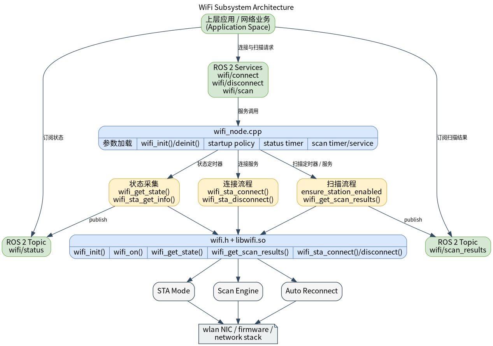

# 基础传感器 · WiFi

## 1. 模块概述
 
- 主要功能：WiFi 模块位于机器人开发层的基础传感器能力中，对下封装 `components/peripherals/wifi` 基于 NetworkManager 的 WiFi 组件，对上提供 ROS 2 节点 `wifi_node`。模块用于统一管理 STA 模式下的扫描、连接、断开和状态广播，并向上层提供 WiFi 当前连接状态和扫描结果。  
- 规格或特性（接口形态、速率、分辨率、算法版本等）：当前节点采用“状态话题 + 命令服务”的混合接口。状态输出消息为 `peripherals_wifi_node/msg/WifiStatus`，默认话题 `/wifi/status`；扫描结果输出为 `peripherals_wifi_node/msg/WifiScanResults`，默认话题 `/wifi/scan_results`；连接服务为 `peripherals_wifi_node/srv/WifiConnect`，默认服务 `/wifi/connect`；断开服务为 `std_srvs/srv/Trigger`，默认服务 `/wifi/disconnect`；扫描服务为 `peripherals_wifi_node/srv/WifiScan`，默认服务 `/wifi/scan`。默认状态发布周期为 `2000 ms`，默认不启用周期扫描。  
- 软件框图：  



- 相关目录结构：  

| 路径 | 职责 |
| --- | --- |
| `middleware/ros2/peripherals/wifi/src/wifi_node.cpp` | ROS 2 WiFi 节点实现，负责状态发布、扫描发布和连接/断开服务 |
| `middleware/ros2/peripherals/wifi/params/wifi_node.yaml` | 默认节点参数文件 |
| `middleware/ros2/peripherals/wifi/CMakeLists.txt` | `peripherals_wifi_node` 包构建文件，查找 `wifi.h`、`libwifi.so` 并生成 `wifi_node` |
| `middleware/ros2/peripherals/wifi/msg/WifiStatus.msg` | WiFi 当前状态消息定义 |
| `middleware/ros2/peripherals/wifi/msg/WifiScanResult.msg` | 单条扫描结果定义 |
| `middleware/ros2/peripherals/wifi/msg/WifiScanResults.msg` | 扫描结果数组消息定义 |
| `middleware/ros2/peripherals/wifi/srv/WifiConnect.srv` | WiFi 连接服务定义 |
| `middleware/ros2/peripherals/wifi/srv/WifiScan.srv` | WiFi 扫描服务定义 |
| `components/peripherals/wifi/include/wifi.h` | 底层 WiFi 组件 C API |
| `components/peripherals/wifi/test/test_wifi_demo.c` | 底层 WiFi 组件测试程序 |

## 2. 环境准备

### 前置条件

- 运行环境：推荐板端环境 `k3-com260` 配套系统镜像；构建侧需要 CMake、C++ 编译器、`ament_cmake`、`rclcpp`、`std_srvs` 和 SDK 统一构建脚本。  
- 硬件与连接：目标板需要可被 NetworkManager 管理的 WiFi 网卡。STA 模式需要可连接的路由器或热点；AP 模式需要无线网卡和驱动支持 hotspot/AP 模式；设置克隆 MAC 需要当前连接存在且硬件/驱动允许修改 MAC。  
- 工具与权限：许多 `nmcli` 操作需要管理员权限或 polkit 授权，建议在开发板上使用具备网络管理权限的账户，必要时使用 `sudo` 运行测试程序。排查时可直接执行 `nmcli device status`、`nmcli radio wifi`、`nmcli device wifi list`、`nmcli connection show`。  

### 构建编译

- **获取代码**：详见 [2.3-配置编译](../../02-%E5%BF%AB%E9%80%9F%E5%85%A5%E9%97%A8/2.3-%E9%85%8D%E7%BD%AE%E7%BC%96%E8%AF%91.md#21-代码获取) 章节，使用 `repo` 工具克隆完整 SDK。以下编译测试命令均在sdk内执行。
- 本模块编译：按依赖顺序先编译底层 WiFi 组件，再编译同仓库内自带 `msg/srv` 定义的 ROS 2 节点包。   

```bash
source build/envsetup.sh

./build/build.sh package components/peripherals/wifi
./build/build.sh package middleware/ros2/peripherals/wifi
```

预期产物包括：`output/staging/lib/peripherals_wifi_node/wifi_node`、`output/staging/share/peripherals_wifi_node/params/wifi_node.yaml`、`output/staging/lib/libwifi.so`，以及 `peripherals_wifi_node` 下的 WiFi `msg/srv` ROS 2 接口安装文件。若当前目标不是 `riscv64`，请以实际 `output/<target>/staging` 或 `output/staging` 为准。  
- 常见差异说明：若本地安装前缀中已有旧版共享 `peripherals` 接口产物，CLI 可能仍会命中旧的 `peripherals/srv/WifiConnect` 类型。此时应先清理旧安装结果，再重编 `middleware/ros2/peripherals/wifi`，确保当前 `peripherals_wifi_node/msg|srv` 接口被重新安装。  

## 3. 示例使用（从 0 跑通）

本节为读者**按步骤复现**的主线：

### 3.1 【示例一：启动 WiFi 节点并观察状态与扫描】

**前置**：目标系统已安装并运行 NetworkManager，`nmcli` 可正常执行。  

**步骤 1**：进入 SDK 源码目录并加载运行环境。  

```bash
source output/staging/setup.bash
```

预期现象：`ros2 pkg executables peripherals_wifi_node` 能看到 `peripherals_wifi_node wifi_node`。  

**步骤 2**：启动 WiFi 节点。  

```bash
ros2 run peripherals_wifi_node wifi_node \
  --ros-args \
  --params-file output/staging/share/peripherals_wifi_node/params/wifi_node.yaml
```

预期现象：终端打印 `wifi_node ready`，并带出状态话题、扫描话题和服务名。  

**步骤 3**：另开终端订阅状态话题。 注意，通过命令行验证，需要用其他的终端方式，比如串口，adb shel，或者网口ssh连接设备。如果板子开启了adb，推荐用adb shell开启终端，如下
```
$ adb shell
# bash

root@k1:/# export HOME=/root/
root@k1:/# source /root/robotic_sdk/output/staging/setup.bash 
root@k1:/# ros2 topic list
/parameter_events
/rosout
root@k1:/# ros2 topic list
/parameter_events
/rosout
/wifi/scan_results
/wifi/status

root@k1:/# ros2 topic echo /wifi/status
```

```bash
source output/staging/setup.bash
ros2 topic echo /wifi/status
```

预期现象：如果已联网，应看到 `connected=true`、`ssid` 为当前网络、`ip_addr` 为有效 IPv4；如果未联网，应看到 `connected=false`、`ssid` 为空、`ip_addr` 为全 `0`。  

**步骤 4**：触发一次扫描。  

```bash
ros2 topic echo /wifi/scan_results
```

```bash
ros2 service call /wifi/scan peripherals_wifi_node/srv/WifiScan "{ssid: '', max_results: 0}"
```

预期现象：服务返回扫描结果，同时节点会向 `/wifi/scan_results` 发布同一批结果。  

### 3.2 【示例二：连接与断开指定 WiFi】

**前置**：已知目标 SSID 和密码，WiFi 节点已启动。  

**步骤 1**：发起连接。  

```bash
ros2 service call /wifi/connect peripherals_wifi_node/srv/WifiConnect "{ssid: '<ssid>', password: '<password>', fast_connect: false, secure: 0, bssid: [0, 0, 0, 0, 0, 0]}"
```

预期现象：服务返回 `success=true` 时，节点会更新状态话题；`/wifi/status` 中应切换为 `connected=true`，并带出目标网络的 `ssid`。  

**步骤 2**：观察连接后状态。  

```bash
ros2 topic echo /wifi/status
```

预期现象：可看到 `connected=true`、`ssid` 为目标网络、`bssid` 和 `ip_addr` 为有效值。  

**步骤 3**：发起断开。  

```bash
ros2 service call /wifi/disconnect std_srvs/srv/Trigger "{}"
```

预期现象：若已连接，返回 `success=true` 且 `message=ok`；若本来已断开，返回 `success=true` 且 `message=already disconnected`。  

**步骤 4**：再次观察状态。  

```bash
ros2 topic echo /wifi/status
```

预期现象：应继续收到状态快照，并切换为 `connected=false`。即使在断开后新开一个订阅者，也应能立刻收到最近一次状态，这是 `transient_local` 的效果。  

## 4. 应用开发

- **对外 API 或接口形态**（头文件、库名、服务/话题）：状态通过 `/wifi/status` 发布 `peripherals_wifi_node/msg/WifiStatus`；扫描结果通过 `/wifi/scan_results` 发布 `peripherals_wifi_node/msg/WifiScanResults`；连接通过 `/wifi/connect` 提供 `peripherals_wifi_node/srv/WifiConnect`；断开通过 `/wifi/disconnect` 提供 `std_srvs/srv/Trigger`；扫描通过 `/wifi/scan` 提供 `peripherals_wifi_node/srv/WifiScan`。  
- **调用方式与注意点**（线程、权限、资源释放等）：`WifiStatus.mode` 取值为 `0=UNKNOWN`、`1=STATION`、`2=AP`、`3=STATION_AP`；`WifiConnect` 请求中的 `ssid` 必填；`bssid` 可全 `0` 表示不指定；`WifiScan.max_results=0` 表示使用节点默认值；`scan_max_results` 合法范围为 `1..256`；`status_period_ms` 必须大于 `0`，`scan_period_ms` 必须大于等于 `0`。如果当前 WiFi 接口也承载 ROS 2 网络通信，断开后 DDS 发现可能受影响，建议使用 `ROS_LOCALHOST_ONLY=1`。  
- **参考 demo 或示例路径**：`middleware/ros2/peripherals/wifi/README.md`、`middleware/ros2/peripherals/wifi/params/wifi_node.yaml`、`middleware/ros2/peripherals/wifi/src/wifi_node.cpp`、`components/peripherals/wifi/test/test_wifi_demo.c`。  

主要消息和服务字段如下：  

| 接口 | 字段 | 含义 |
| --- | --- | --- |
| `WifiStatus` | `connected` | 是否已联网 |
| `WifiStatus` | `ssid` | 当前 SSID |
| `WifiStatus` | `ip_addr` | 当前 IPv4 |
| `WifiScanResult` | `ssid` | 扫描到的 SSID |
| `WifiScanResult` | `rssi_dbm` | 信号强度 |
| `WifiConnect` | `ssid/password` | 目标网络和密码 |
| `WifiScan` | `ssid/max_results` | 扫描过滤条件和返回上限 |

## 5. 调试指南

- 先确认底层环境：执行 `nmcli -t -f RUNNING general`，应返回 `running`；执行 `nmcli device wifi list`，应能列出附近 AP。  
- 观察节点启动日志：正常启动会打印 `wifi_node ready`；如果 `wifi_init()` 失败，会直接抛异常退出。  
- 观察状态话题：如果 `wifi_get_state()` 失败，节点会在状态发布阶段打印告警；如果已连接但 `wifi_sta_get_info()` 失败，会节流打印警告，同时状态话题可能只保留 `connected=true` 的粗粒度信息。  
- 如果连接后 CLI 看不到节点或话题，确认是否是当前 WiFi 接口同时承担 ROS 2 发现流量；必要时设置 `ROS_LOCALHOST_ONLY=1` 再重试。  
- 如果扫描或连接失败，先用底层测试程序 `test_wifi_demo` 直接验证 `scan`、`connect`、`disconnect`、`info`，再回到 ROS 2 节点排查。  

## 6. 常见问题
暂无
