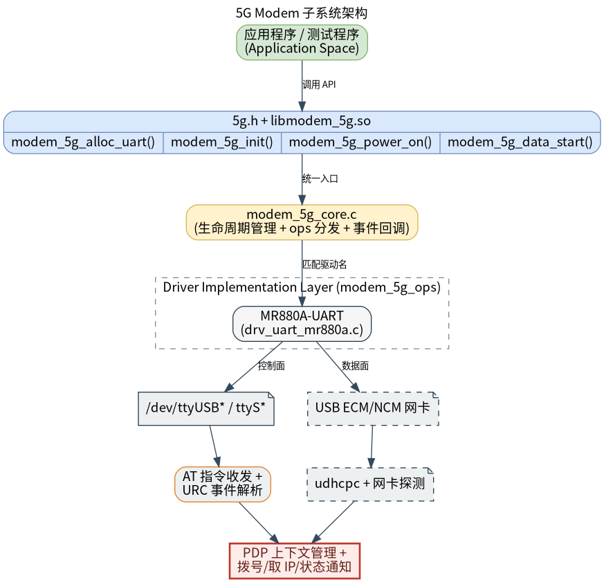

# 外设与驱动 · 5g

## 1. 模块概述
 
- 主要功能：`5g` 模块位于 `components/peripherals/5g`，提供 MR880A 5G 模组的用户态 AT 指令封装与拨号能力。模块通过统一的 `5g.h` C API 管理 UART AT 通道，支持设备初始化、基础信息查询、SIM 信息查询、网络注册信息查询、信号信息查询、PDP 上下文配置、NDIS 数据连接启停、IP 信息查询和原始 AT 指令透传。  
- 规格或特性：对外以 `5g.h` + `libmodem_5g.so` 形式提供 C 接口；当前已注册 `MR880A` UART 驱动；默认 AT 波特率为 `9600`，支持 `9600`、`19200`、`38400`、`57600`、`115200`、`230400`、`460800`、`921600`，未知波特率按 `115200` 配置 termios；AT 命令默认超时 `2000 ms`；PDP CID 支持 `1` 到 `20`；PDP 类型支持 `IP`、`IPV6`、`IPV4V6`；初始化阶段可自动查找 AT 串口，拨号成功后会自动查找 NCM 网口并执行 `udhcpc -i <ifname>`；当前支持 ECM/NCM 内核配置检查，RNDIS 模式返回不支持。  
- 软件框图：见下图。  



- 相关目录结构：  

| 路径 | 职责 |
| --- | --- |
| `components/peripherals/5g/include/5g.h` | 对外公开状态码、枚举、结构体、事件回调类型和 5G modem API |
| `components/peripherals/5g/src/modem_5g_core.c` | 设备对象生命周期、API 分发、驱动注册表和 UART 驱动选择逻辑 |
| `components/peripherals/5g/src/modem_5g_core.h` | 驱动内部类型、ops 表、UART 参数和注册宏定义 |
| `components/peripherals/5g/src/drivers/drv_uart_mr880a.c` | MR880A UART AT 驱动实现，包含串口初始化、AT 指令、PDP、NDIS 拨号、DHCP 与内核配置检查 |
| `components/peripherals/5g/test/test_5g_mr880a.c` | 命令行演示程序，覆盖自动 AT 口识别、信息查询、PDP 配置、拨号、IP 查询和 ping 验证 |
| `components/peripherals/5g/CMakeLists.txt` | 模块构建、`udhcpc` 配置检查、共享库和测试程序目标定义 |
| `components/peripherals/5g/README.md` | 组件说明、快速开始、内核配置要求和常见问题 |

## 2. 环境准备

### 前置条件

- 运行环境：推荐板端环境 `k1-deb1` 配套系统镜像。 
- 硬件与连接：目标板需要通过 USB 连接 MR880A 5G 模组，SIM 卡已插入且套餐可用，天线已连接，模组上电并完成 USB 枚举。

ECM 模式需要内核配置满足：  

```text
CONFIG_NETDEVICES=y
CONFIG_USB_NET_DRIVERS=y/m
CONFIG_USB_USBNET=y/m
CONFIG_USB_NET_CDCETHER=y/m
```

NCM 模式需要内核配置满足：  

```text
CONFIG_USB_SERIAL=y/m
CONFIG_USB_SERIAL_OPTION=y/m
CONFIG_USB_USBNET=y/m
CONFIG_USB_NET_CDCETHER=y/m
CONFIG_USB_NET_CDC_NCM=y/m
```

### 构建编译

- **获取代码**：详见 [2.3-配置编译](../../02-%E5%BF%AB%E9%80%9F%E5%85%A5%E9%97%A8/2.3-%E9%85%8D%E7%BD%AE%E7%BC%96%E8%AF%91.md#21-代码获取) 章节，使用 `repo` 工具克隆完整 SDK。

- **本模块编译**：
    - **方式 1：独立编译**
      ```bash
      cd components/peripherals/5g
      mkdir build && cd build
      cmake .. -DBUILD_TESTS=ON
      make -j$(nproc)
      ```
    - **方式 2：SDK 集成编译 (推荐)**
      ```bash
      source build/envsetup.sh
      cd components/peripherals/5g
      mm     # 仅编译本模块
      ```

- **产物名称**：`libmodem_5g.so` 输出至 `build/`；启用 `BUILD_TESTS` 时同时生成 `test_5g_mr880a`。SDK 编译产物安装至系统 `output/staging/{lib,bin}` 路径。

- **说明**：CMake 配置阶段要求系统已安装 `udhcpc`。`test_5g_mr880a` 帮助信息里 `-b` 的默认值写为 `115200`，但当前源码实际默认初始化波特率为 `9600`。

## 3. 示例使用（从 0 跑通）

本节为读者**按步骤复现**的主线：

### 3.1 【自动识别 AT 口并拨号】

**前置**：MR880A 已上电并完成 USB 枚举，SIM 卡可注册运营商网络，目标系统已安装 `udhcpc`，当前账户有串口和网络管理权限。  

**步骤 1**：构建共享库和测试程序。  

```bash
cd components/peripherals/5g
mkdir -p build
cd build
cmake .. -DBUILD_TESTS=ON
make -j$(nproc)
```

预期现象：`build/` 目录下生成 `libmodem_5g.so` 和 `test_5g_mr880a`。如果系统缺少 `udhcpc`，`cmake` 阶段会提示 `udhcpc not found` 并停止。  

**步骤 2**：确认内核配置和设备枚举。  

```bash
zcat /proc/config.gz | grep -E 'CONFIG_USB_SERIAL|CONFIG_USB_SERIAL_OPTION|CONFIG_USB_USBNET|CONFIG_USB_NET_CDCETHER|CONFIG_USB_NET_CDC_NCM|CONFIG_NETDEVICES|CONFIG_USB_NET_DRIVERS'
ls /dev/ttyUSB* /dev/ttyACM* 2>/dev/null
cat /sys/class/net/*/device/interface 2>/dev/null
```

预期现象：NCM 模式下能看到 `CONFIG_USB_SERIAL`、`CONFIG_USB_SERIAL_OPTION`、`CONFIG_USB_USBNET`、`CONFIG_USB_NET_CDCETHER`、`CONFIG_USB_NET_CDC_NCM` 为 `y` 或 `m`，并存在可用 AT 串口；如果网口已枚举，`interface` 文本中应能看到 `NCM Network Control Model`。  

**步骤 3**：使用自动 AT 口识别拨号。以下 APN 以中国电信 `ctnet` 为例，实际请替换为 SIM 卡运营商要求的 APN。  

```bash
cd components/peripherals/5g
sudo ./build/test_5g_mr880a -d auto -a ctnet
```

预期现象：程序先打印 `AT dev: auto (driver auto-detect), baud: 9600`，随后出现 `[MR880A] scanning AT port in /sys/bus/usb/devices`、`[MR880A] AT port match: ...`、`[MR880A] kernel cfg: ECM=... NCM=...`、`[MR880A] AT port: ...` 等日志。初始化成功后会打印 `Manufacturer`、`Model`、`IMEI`、`SIM state`、`Reg state`、`RSSI`、`RSRP`、`RSRQ` 等信息。  

**步骤 4**：观察数据连接、IP 和 ping 验证。  

预期现象：`modem_5g_data_start()` 成功后驱动执行 `AT^NDISDUP=<cid>,1`，自动刷新 NCM 网口并打印 `[MR880A] running: udhcpc -i <ifname>`。测试程序随后打印 `Data state: 2`、`IP: <addr>, GW: <addr>`、`DNS1: <addr>, DNS2: <addr>`，并执行 `ping -c 3 www.baidu.com`。  

### 3.2 【指定 AT 串口和 PDP 参数】

**前置**：已确认 AT 串口路径，例如 `/dev/ttyUSB0`，并确认 SIM 卡 APN、用户名、密码和 PDP 类型。  

**步骤 1**：指定串口、波特率、CID 和 APN 拨号。  

```bash
cd components/peripherals/5g
sudo ./build/test_5g_mr880a -d /dev/ttyUSB0 -b 9600 -c 1 -a ctnet -t IPV4V6
```

预期现象：程序打印 `AT dev: /dev/ttyUSB0, baud: 9600`。如果打开指定串口失败，驱动会再尝试自动识别 AT 口并打印 `[MR880A] retry AT port: ...`；若仍失败，则测试程序打印 `Init failed`。  

**步骤 2**：需要用户名和密码的 APN 可增加 `-u`、`-p`。  

```bash
sudo ./build/test_5g_mr880a -d /dev/ttyUSB0 -b 9600 -c 1 -a <apn> -u <user> -p <password> -t IP
```

预期现象：测试程序调用 `modem_5g_set_pdp_context()` 后，驱动发送 `AT+CGDCONT=<cid>,"IP","<apn>"`；启动数据连接时，如果用户名或密码非空，会发送 `AT^NDISDUP=<cid>,1,"<apn>","<user>","<password>",1`。  

**步骤 3**：在业务程序中调用 API。  

```c
#include <stdio.h>
#include "5g.h"

int main(void)
{
    struct modem_5g_dev *dev = NULL;
    struct modem_5g_pdp_context ctx = {0};
    struct modem_5g_ip_info ip = {0};

    dev = modem_5g_alloc_uart("MR880A:mr880a0", "auto", 9600);
    if (!dev)
        return -1;

    if (modem_5g_init(dev) != MODEM_5G_STATUS_SUCCESS)
        goto out;

    ctx.cid = 1;
    ctx.pdp_type = MODEM_5G_PDP_IPV4V6;
    snprintf(ctx.apn, sizeof(ctx.apn), "%s", "ctnet");
    if (modem_5g_set_pdp_context(dev, &ctx) != MODEM_5G_STATUS_SUCCESS)
        goto out;

    if (modem_5g_data_start(dev, ctx.cid) == MODEM_5G_STATUS_SUCCESS) {
        if (modem_5g_get_ip_info(dev, ctx.cid, &ip) == MODEM_5G_STATUS_SUCCESS) {
            printf("ip=%s gw=%s dns1=%s dns2=%s\n",
                ip.ip, ip.gateway, ip.dns1, ip.dns2);
        }
        modem_5g_data_stop(dev, ctx.cid);
    }

out:
    modem_5g_deinit(dev);
    modem_5g_free(dev);
    return 0;
}
```

预期现象：业务程序可通过 `modem_5g_get_ip_info()` 获得 IPv4 地址、网关和 DNS；退出前停止数据连接、关闭串口并释放设备对象。  

## 4. 应用开发

### 4.1 最简使用流程

```c
int main(void)
{
    struct modem_5g_dev *dev =
        modem_5g_alloc_uart("MR880A:mr880a0", "auto", 9600);
    if (!dev) {
        return -1;
    }

    if (modem_5g_init(dev) != MODEM_5G_STATUS_SUCCESS) {
        modem_5g_free(dev);
        return -1;
    }

    struct modem_5g_pdp_context ctx = {0};
    ctx.cid = 1;
    ctx.pdp_type = MODEM_5G_PDP_IPV4V6;

    modem_5g_set_pdp_context(dev, &ctx);

    if (modem_5g_data_start(dev, ctx.cid) == MODEM_5G_STATUS_SUCCESS) {
        struct modem_5g_ip_info ip = {0};
        modem_5g_get_ip_info(dev, ctx.cid, &ip);
        printf("ip=%s gw=%s\n", ip.ip, ip.gateway);
        modem_5g_data_stop(dev, ctx.cid);
    }

    modem_5g_deinit(dev);
    modem_5g_free(dev);
    return 0;
}
```

### 4.2 主要 API 说明

**1. 生命周期与事件回调**
```c
// 创建设备、初始化、反初始化与释放
struct modem_5g_dev *modem_5g_alloc_uart(const char *name, const char *uart_dev, uint32_t baud);
enum modem_5g_status modem_5g_init(struct modem_5g_dev *dev);
enum modem_5g_status modem_5g_deinit(struct modem_5g_dev *dev);
void modem_5g_free(struct modem_5g_dev *dev);

// 注册事件回调
void modem_5g_set_event_cb(struct modem_5g_dev *dev, modem_5g_event_cb_t cb, void *ctx);
```

**2. 信息查询**
```c
// 查询模组基础信息、SIM、注册和信号状态
enum modem_5g_status modem_5g_get_basic_info(struct modem_5g_dev *dev, struct modem_5g_basic_info *info);
enum modem_5g_status modem_5g_get_sim_info(struct modem_5g_dev *dev, struct modem_5g_sim_info *info);
enum modem_5g_status modem_5g_get_reg_info(struct modem_5g_dev *dev, struct modem_5g_reg_info *info);
enum modem_5g_status modem_5g_get_signal_info(struct modem_5g_dev *dev, struct modem_5g_signal_info *info);
```

**3. 数据业务与 AT 透传**
```c
// 配置 PDP、启动/停止数据业务、获取 IP 信息
enum modem_5g_status modem_5g_set_pdp_context(struct modem_5g_dev *dev, const struct modem_5g_pdp_context *ctx);
enum modem_5g_status modem_5g_data_start(struct modem_5g_dev *dev, uint8_t cid);
enum modem_5g_status modem_5g_data_stop(struct modem_5g_dev *dev, uint8_t cid);
enum modem_5g_status modem_5g_get_ip_info(struct modem_5g_dev *dev, uint8_t cid, struct modem_5g_ip_info *info);

// 发送原始 AT 命令
enum modem_5g_status modem_5g_send_at(struct modem_5g_dev *dev,
    const char *cmd, char *resp, size_t resp_len, uint32_t timeout_ms);
```

### 4.3 核心数据结构

**基础信息结构体**
```c
struct modem_5g_basic_info {
    char manufacturer[MODEM_5G_MANUFACTURER_MAX_LEN + 1];
    char model[MODEM_5G_MODEL_MAX_LEN + 1];
    char revision[MODEM_5G_REVISION_MAX_LEN + 1];
    char imei[MODEM_5G_IMEI_LEN + 1];
};
```

**PDP 上下文结构体**
```c
struct modem_5g_pdp_context {
    uint8_t cid;
    enum modem_5g_pdp_type pdp_type;
    char apn[MODEM_5G_APN_MAX_LEN + 1];
    char username[MODEM_5G_USERNAME_MAX_LEN + 1];
    char password[MODEM_5G_PASSWORD_MAX_LEN + 1];
};
```

**IP 信息结构体**
```c
struct modem_5g_ip_info {
    char ip[MODEM_5G_IP_MAX_LEN + 1];
    char gateway[MODEM_5G_IP_MAX_LEN + 1];
    char dns1[MODEM_5G_IP_MAX_LEN + 1];
    char dns2[MODEM_5G_IP_MAX_LEN + 1];
};
```

开发时需要注意：推荐使用 `MR880A:mr880a0` 这类 `驱动名:实例名` 形式显式选择驱动；典型调用顺序是 `alloc -> init -> 信息查询 -> PDP 配置 -> data_start -> 查询 IP -> data_stop -> deinit -> free`；CID 必须在 `1` 到 `20` 之间；当前驱动没有后台 URC 线程，`modem_5g_set_event_cb()` 只保存回调指针；同一个 `modem_5g_dev` 不建议被多个线程并发发送 AT 命令。

**参考 demo 或示例路径**
```text
components/peripherals/5g/test/test_5g_mr880a.c
components/peripherals/5g/src/drivers/drv_uart_mr880a.c
components/peripherals/5g/src/modem_5g_core.c
```

## 5. 调试指南

- 如果初始化失败，优先检查 USB 枚举、`bInterfaceProtocol=12`、AT 串口节点和权限，以及 `/proc/config.gz` 中的 ECM/NCM 配置。  
- 如果拨号失败，可先用串口工具或 `modem_5g_send_at()` 手动验证 `AT`、`AT+CPIN?`、`AT+COPS?`、`AT+CGDCONT?`、`AT^NDISDUP=<cid>,1` 的返回值。  
- 如果拨号成功但没有 IP，检查日志中是否识别到 NCM 网口，并确认 `udhcpc -i <ifname>` 是否执行成功。  

## 6. 常见问题

- `cmake` 报错 `udhcpc not found`：说明当前构建机或目标环境缺少 `udhcpc`。  
- `AT port auto-detect failed`：通常是模组未完成 USB 枚举、没有 `bInterfaceProtocol=12` 的 AT interface，或串口节点权限不足。  
- `RNDIS mode detected`：当前组件只支持 ECM/NCM，需要先把模组切到对应 USB 网络模式。  
