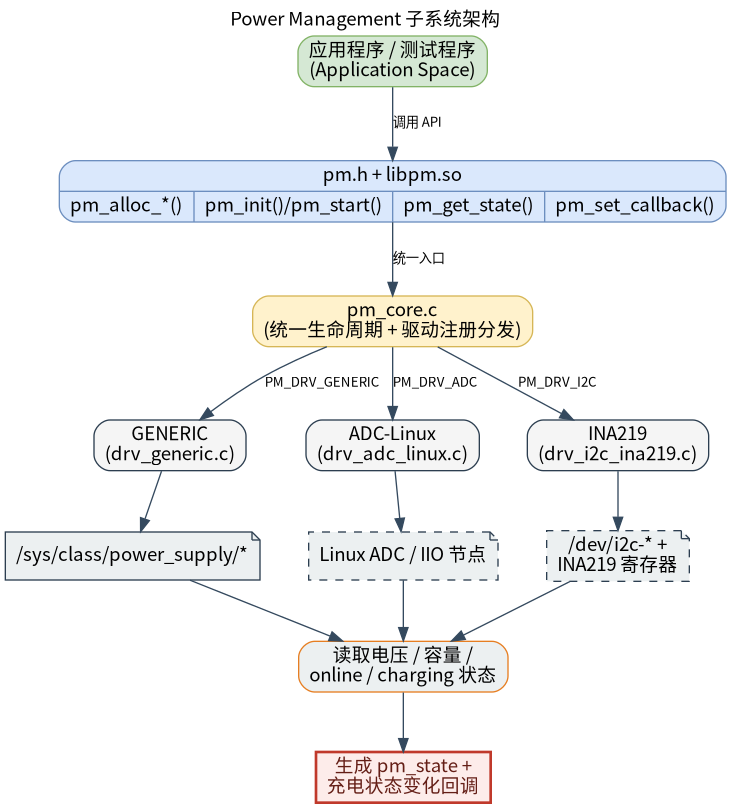

# 外设与驱动 · pm

## 1. 模块概述

- 主要功能：`pm` 模块位于 `components/peripherals/pm`，是一个面向电源管理与电池状态读取的用户态组件。模块通过统一的 `pm.h` 接口封装多种底层驱动，向上层提供电池电量、充放电状态等状态读取能力，并支持在状态变化时触发回调。  
- 规格或特性：对外以 `pm.h` + `libpm.so` 形式提供 C 接口；公共状态结构 `struct pm_state` 预留了电压、电流、功率、电量百分比、温度、健康度、循环次数、单节电压等字段；当前代码中可实际跑通的是 `GENERIC` 驱动，基于 Linux `/sys/class/power_supply/` 节点读取 `online` 与 `capacity`，并以 `1 Hz` 轮询充电状态变化；`ADC-Linux` 与 `INA219` 驱动的工厂函数和接口已预留，但底层采样与开关控制仍是 `TODO` 骨架实现，不能视为完整量产能力。  
- 软件框图：见下图。  



- 相关目录结构：  

| 路径 | 职责 |
| --- | --- |
| `components/peripherals/pm/include/pm.h` | 对外公开的状态结构、配置结构体和 API 声明 |
| `components/peripherals/pm/src/pm_core.h` | 私有驱动注册、虚函数表和设备对象定义 |
| `components/peripherals/pm/src/pm_core.c` | 工厂函数、默认配置、状态读取和驱动注册分发实现 |
| `components/peripherals/pm/src/drivers/drv_generic.c` | 基于 `power_supply` sysfs 节点的通用电池状态读取驱动 |
| `components/peripherals/pm/src/drivers/drv_adc_linux.c` | Linux ADC 采样驱动骨架，当前核心读数逻辑未完成 |
| `components/peripherals/pm/src/drivers/drv_i2c_ina219.c` | INA219 I2C 驱动骨架，当前寄存器配置与读取逻辑未完成 |
| `components/peripherals/pm/test/test_pm_generic.c` | 通用驱动演示程序，展示状态读取与状态变化回调 |
| `components/peripherals/pm/test/test_pm_adc.c` | ADC 驱动演示程序，当前主要用于说明接口调用方式 |
| `components/peripherals/pm/CMakeLists.txt` | 模块构建、安装、驱动启用和测试目标定义 |
| `components/peripherals/pm/README.md` | 独立使用说明与快速开始 |

## 2. 环境准备

### 前置条件

- 运行环境：推荐板端环境 `k1-deb1` 配套系统镜像；`cmake`、`make`、`gcc` 或 `clang` 可用；模块以 C99 编译并依赖 `pthread`。  

- 硬件与连接：需要板子集成电量计芯片CW2015和充电芯片IP2317，且内核需要打开驱动以及dts配置。 
  

### 构建编译

- **获取代码**：详见 [2.3-配置编译](../../02-%E5%BF%AB%E9%80%9F%E5%85%A5%E9%97%A8/2.3-%E9%85%8D%E7%BD%AE%E7%BC%96%E8%AF%91.md#21-代码获取) 章节，使用 `repo` 工具克隆完整 SDK。

- **本模块编译**：
    - **方式 1：独立编译**
      ```bash
      cd components/peripherals/pm
      mkdir build && cd build
      cmake .. -DBUILD_TESTS=ON
      make -j$(nproc)
      ```
    - **方式 2：SDK 集成编译 (推荐)**
      ```bash
      source build/envsetup.sh
      cd components/peripherals/pm
      mm     # 仅编译本模块
      ```

- **产物名称**：`libpm.so` 输出至 `build/`；启用 `BUILD_TESTS` 时同时生成 `test_pm_generic` 和 `test_pm_adc`。SDK 编译产物安装至系统 `output/staging/{lib,bin}` 路径。

- **说明**：默认构建至少启用 `drv_generic`。

## 3. 示例使用（从 0 跑通）

本节为读者**按步骤复现**的主线：

### 3.1 【运行自带 test_pm_generic 演示程序】

**前置**：请先确认目标板已经暴露了可读的 `power_supply` 节点；若你的节点名不是默认的 `ip2317-charger` 与 `cw-bat`，请在运行参数中传入实际名称。  

**步骤 1**：确认 `power_supply` 节点存在且内容可读。  

```bash
ls /sys/class/power_supply/ip2317-charger/online
ls /sys/class/power_supply/cw-bat/capacity
cat /sys/class/power_supply/ip2317-charger/online
cat /sys/class/power_supply/cw-bat/capacity
```

预期现象：前两条命令能找到文件，后两条命令能输出整数；通常 `online` 为 `0` 或 `1`，`capacity` 为 `0` 到 `100` 之间的整数。若你的平台节点名不同，请把路径中的 `ip2317-charger` 和 `cw-bat` 替换成实际名称。  

**步骤 2**：在组件目录下完成构建。  

```bash
cd components/peripherals/pm
cmake -S . -B build -DBUILD_TESTS=ON
cmake --build build -j$(nproc)
```

预期现象：命令成功结束，`build/` 目录下生成 `libpm.so`、`test_pm_generic` 和 `test_pm_adc`，返回码为 `0`。  

**步骤 3**：运行通用驱动演示程序。  

```bash
cd components/peripherals/pm
./build/test_pm_generic
```

如果节点名不同，可显式传入：  

```bash
cd components/peripherals/pm
./build/test_pm_generic <charger_node> <capacity_node>
```

预期现象：终端首先打印创建设备、初始化设备和注册回调等信息，例如：`=== PM GENERIC Test ===`、`[1] Creating GENERIC PM device...`、`[GENERIC] init:`、`Callback registered`。  

**步骤 4**：观察周期状态输出和状态变化回调。  

预期现象：  
- 程序会每秒调用一次 `pm_get_state()`，连续打印形如 `[state] SOC=78.0% status=2` 的状态信息。  
- 当 `online` 从 `0` 变为 `1` 时，回调线程会打印 `[callback] Charging, SOC=...%`。  
- 当 `online` 从 `1` 变为 `0` 时，回调线程会打印 `[callback] Discharging, SOC=...%`。  
- 如果充电状态一直不变化，回调不会重复触发，这属于当前实现的预期行为。  

**步骤 5**：结束程序。  

预期现象：`test_pm_generic` 在前 20 次状态打印后会继续常驻，进入仅等待回调的循环；如需结束，请按 `Ctrl+C`。由于示例程序没有额外的信号清理逻辑，终止时不会继续执行 `pm_free()` 之后的用户态收尾打印，这也是当前示例代码的正常现象。  

## 4. 应用开发

### 4.1 最简使用流程

```c
static void on_power_event(struct pm_dev *dev, const struct pm_state *state, void *ctx)
{
    (void)dev;
    (void)ctx;
    printf("status=%d soc=%.1f%%\n", state->status, state->percentage);
}

int main(void)
{
    struct pm_dev *batt =
        pm_alloc_generic("main_batt", "ip2317-charger", "cw-bat", NULL);
    if (!batt) {
        return -1;
    }

    if (pm_init(batt, NULL) < 0) {
        pm_free(batt);
        return -1;
    }

    pm_set_callback(batt, on_power_event, NULL);

    struct pm_state st = {0};
    if (pm_get_state(batt, &st) == 0) {
        printf("soc=%.1f%% status=%d\n", st.percentage, st.status);
    }

    pm_free(batt);
    return 0;
}
```

### 4.2 主要 API 说明

**1. 设备创建与生命周期**
```c
// 创建 ADC、数字电源计或 GENERIC 设备
struct pm_dev *pm_alloc_adc(const char *name, const char *adc_dev, float scale);
struct pm_dev *pm_alloc_digital(const char *name, const char *protocol, const char *dev_path, uint32_t addr);
struct pm_dev *pm_alloc_generic(const char *name, const char *charger_node, const char *capacity_node, void *args);

// 初始化与释放
int pm_init(struct pm_dev *dev, const struct pm_config *cfg);
void pm_free(struct pm_dev *dev);
```

**2. 状态读取与回调**
```c
// 注册状态变化回调
void pm_set_callback(struct pm_dev *dev, pm_callback_t cb, void *ctx);

// 启动周期采样（当前实现中仍为占位接口）
int pm_start(struct pm_dev *dev, uint32_t freq_hz);

// 读取当前状态
int pm_get_state(struct pm_dev *dev, struct pm_state *out_state);
```

**3. 电源开关控制**
```c
// 控制命名通道的开关状态
int pm_switch_set(struct pm_dev *dev, const char *channel_name, bool enable);
bool pm_switch_get(struct pm_dev *dev, const char *channel_name);
```

### 4.3 核心数据结构

**电源配置结构体**
```c
struct pm_config {
    float capacity_mah;
    float max_voltage;
    float min_voltage;
    float warn_voltage;
    float crit_voltage;
    float max_temp;
};
```

**电源状态结构体**
```c
struct pm_state {
    uint64_t timestamp_us;
    float voltage;
    float current;
    float power;
    float percentage;
    float temperature;
    float health;
    uint32_t cycle_count;
    enum pm_status status;
    uint32_t error_code;
    uint8_t cell_count;
    float cell_voltages[16];
};
```

**状态回调原型**
```c
typedef void (*pm_callback_t)(struct pm_dev *dev, const struct pm_state *state, void *ctx);
```

开发时需要注意：`pm_alloc_generic()` 默认选择 `GENERIC` 驱动，`pm_init(dev, NULL)` 会使用库内默认配置；当前 `GENERIC` 驱动主要可靠输出 `percentage` 和 `status`，其余字段很多仍是保留字段；`pm_set_callback()` 在 `GENERIC` 驱动下会启动内部线程，并在充放电状态变化时触发回调；`pm_start()` 当前仍是占位实现，现阶段主要依赖 `pm_get_state()` 轮询或 `GENERIC` 驱动的内部回调线程。

**参考 demo 或示例路径**
```text
components/peripherals/pm/test/test_pm_generic.c
components/peripherals/pm/test/test_pm_adc.c
```

## 5. 调试指南

- 如果 `test_pm_generic` 持续打印 `[state] read failed`，优先检查 `power_supply` 节点是否存在、是否可读，以及内容是否为纯整数。  
- 如果状态在打印但回调一直没有触发，先确认充放电状态是否真的变化。当前回调只在 `status` 变化时触发，单纯 `SOC` 变化不会触发。  
- 如果业务侧调用了 `pm_start()` 却没有自动采样效果，这是当前实现的行为；现阶段仍以 `pm_get_state()` 轮询或 `pm_set_callback()` 为主。  

## 6. 常见问题
暂无 
