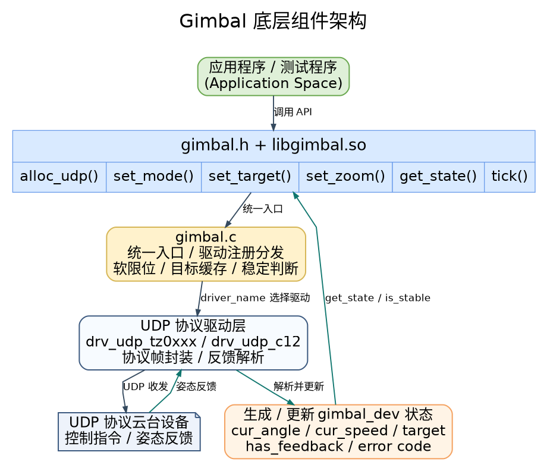

# 外设与驱动 · gimbal

## 1. 模块概述

- 主要功能：`gimbal` 模块位于 `components/control/gimbal`，是一个用户态云台控制组件。模块通过统一的 `gimbal.h` C API 封装不同云台协议，向上层提供模式切换、角度控制、速度控制、变倍控制、状态读取、软限位和稳定状态判断能力。当前实现主要面向 UDP 云台设备，支持 TZ0xxx 系列云台和 Skydroid C12 云台。
- 规格或特性：对外以 `gimbal.h` + `libgimbal.so` 形式提供接口；默认构建会编入 `drv_udp_tz0xxx` 和 `drv_udp_c12` 两个驱动，也可以通过 CMake 变量只启用指定驱动；角度和角速度单位均使用度制，`pitch` 为俯仰、`yaw` 为偏航、`roll` 为横滚；业务侧需要周期调用 `gimbal_tick()` 接收 UDP 反馈并推进速度模式重发逻辑，推荐周期为 `20 ms` 左右。
- 当前支持能力：
  - 云台控制模式：`OFF`、`ANGLE_ABS`、`ANGLE_REL`、`SPEED`、`FOLLOW`、`FPV`、`LOCK`、`CALIBRATE`。
  - 角度控制：支持绝对角和相对角两种目标下发。
  - 速度控制：支持 yaw/pitch 角速度下发，并按 `resend_period_s` 周期重发。
  - 变倍控制：TZ0xxx 映射为可见光变倍命令；C12 映射为 DZM 数码变焦步进命令。
  - 状态读取：通过反馈帧解析当前角度，并根据相邻反馈计算角速度。
  - 稳定判断：基于反馈新鲜度、角速度和目标角误差判断云台是否到位。
- 系统框架：




- 相关目录结构：

| 路径 | 职责 |
| --- | --- |
| `components/control/gimbal/include/gimbal.h` | 对外公开的云台控制 C API、模式枚举、角度结构和错误码 |
| `components/control/gimbal/src/gimbal.c` | 云台核心逻辑，包含驱动查找、软限位、目标缓存、状态读取和稳定判断 |
| `components/control/gimbal/src/gimbal_core.h` | 私有设备对象、驱动虚表、自动注册宏和内部工具函数 |
| `components/control/gimbal/src/drivers/drv_udp_tz0xxx.c` | TZ0xxx 系列 UDP 云台驱动 |
| `components/control/gimbal/src/drivers/drv_udp_c12.c` | Skydroid C12 TOP UDP 云台驱动 |
| `components/control/gimbal/test/test_gimbal_udp.c` | UDP 云台统一测试程序 |
| `components/control/gimbal/CMakeLists.txt` | 模块构建、驱动选择、测试程序和安装规则 |
| `components/control/gimbal/README.md` | 组件独立使用说明 |

## 2. 环境准备

### 前置条件

- 运行环境：推荐板端环境为 `k3-com260` 配套系统镜像；构建环境需要 `gcc`、`make`、`cmake`，模块以 C99 编译并依赖 `pthread` 和 `libm`。
- 硬件与连接：
  - TZ0xxx 云台：示例常用设备地址为 `192.168.44.160:4900`。
  - Skydroid C12 云台：默认设备地址为 `192.168.144.108:5000`，建议本机也绑定 `5000` 端口接收反馈。
  - 云台需已上电，并通过网线连接到开发板或同一网段交换机。
- 工具与权限：运行用户需要具备普通 UDP 网络访问权限；排查问题时建议准备 `ping`、`ss`、`tcpdump`、`strings` 等工具。抓包通常需要 `sudo` 权限。

### 构建编译

- **获取代码**：详见 [2.3-配置编译](../../02-%E5%BF%AB%E9%80%9F%E5%85%A5%E9%97%A8/2.3-%E9%85%8D%E7%BD%AE%E7%BC%96%E8%AF%91.md#21-代码获取) 章节，使用 `repo` 工具克隆完整 SDK。

- **本模块编译**：
  - **方式 1：独立编译**

    ```bash
    cd components/control/gimbal
    mkdir -p build
    cd build
    cmake .. -DBUILD_TESTS=ON
    make -j$(nproc)
    ```

  - **方式 2：只启用指定驱动**

    ```bash
    cd components/control/gimbal
    mkdir -p build
    cd build
    cmake .. -DBUILD_TESTS=ON -DSROBOTIS_CONTROL_GIMBAL_ENABLED_DRIVERS="drv_udp_c12"
    make -j$(nproc)
    ```

    如需同时启用两个 UDP 驱动：

    ```bash
    cmake .. -DBUILD_TESTS=ON -DSROBOTIS_CONTROL_GIMBAL_ENABLED_DRIVERS="drv_udp_tz0xxx;drv_udp_c12"
    ```

  - **方式 3：SDK 集成编译**

    ```bash
    source build/envsetup.sh
    cd components/control/gimbal
    mm
    ```

- **产物名称**：独立编译时，`libgimbal.so` 和 `test_gimbal_udp` 输出至 `components/control/gimbal/build/`；SDK 集成编译时，安装到 `output/staging/lib/libgimbal.so`、`output/staging/include/gimbal.h` 和 `output/staging/bin/test_gimbal_udp`。

- **说明**：建议在应用中显式传入设备 IP、设备端口和本地绑定端口，不要依赖驱动内部默认值。`test_gimbal_udp` 已按常见设备地址提供默认参数。

## 3. 示例使用（从 0 跑通）

本节为读者**按步骤复现**的主线。运行前请确认云台周围安全，避免大角度运动碰撞机械结构。

### 3.1 【运行 C12 UDP 云台测试】

**前置**：C12 云台已上电，目标板或调试主机已接入 `192.168.144.0/24` 网段。

**步骤 1**：配置主机网口并确认设备在线。网口名请按实际连接替换。

```bash
ifconfig eth0 192.168.144.100 netmask 255.255.255.0 up
route add -net 192.168.144.0 netmask 255.255.255.0 dev eth0
ping -c 3 192.168.144.108
```

预期现象：`ping` 能收到响应；若无法连通，请先检查供电、网线、交换机、本机 IP 和云台 IP。

**步骤 2**：构建底层组件。

```bash
cd components/control/gimbal
mkdir -p build
cd build
cmake .. -DBUILD_TESTS=ON
make -j$(nproc)
```

预期现象：`build/` 目录下生成 `libgimbal.so` 和 `test_gimbal_udp`。

**步骤 3**：运行 C12 测试程序。

```bash
cd components/control/gimbal/build
./test_gimbal_udp --driver drv_udp_c12 --ip 192.168.144.108 --port 5000 --bind-port 5000
```

预期现象：
- 终端打印已注册驱动和 `Gimbal UDP Demo` 启动信息；
- 程序依次执行回中、绝对角控制、相对角控制、速度控制、变倍和锁定模式切换；
- 收到有效反馈后，会周期打印 `[RX-STATE] pitch=... yaw=... roll=...`；
- 若一直打印 `waiting feedback...`，说明暂未收到 0.5 秒内的信息反馈，优先检查本机是否绑定了 `5000` 端口以及网络是否双向可达。

### 3.2 【运行 TZ0xxx UDP 云台测试】

**前置**：TZ0xxx 云台已上电，目标板或调试主机已接入云台所在网段。以下示例按常见地址 `192.168.44.160:4900` 说明。

**步骤 1**：配置主机网口并确认设备在线。

```bash
ifconfig eth0 192.168.44.100 netmask 255.255.255.0 up
ping -c 3 192.168.44.160
```

**步骤 2**：运行 TZ0xxx 测试程序。

```bash
cd components/control/gimbal/build
./test_gimbal_udp --driver drv_udp_tz0xxx --ip 192.168.44.160 --port 4900 --bind-port 4900
```

预期现象：终端打印 `[GIMBAL-T-UDP] Initialized driver 'drv_udp_tz0xxx'`；程序执行示例动作并输出姿态反馈。若云台动作正常但无反馈，请抓包确认 UDP `4900` 端口是否有回包。

### 3.3 【在自定义程序中调用底层 API】

**前置**：已完成组件构建，应用可以引用 `gimbal.h` 并链接 `libgimbal.so`。

**步骤 1**：创建 UDP 云台设备。

```c
#include <stdio.h>
#include <unistd.h>

#include "gimbal.h"

int main(void)
{
    gimbal_udp_config_t cfg = {
        .bind_ip = "0.0.0.0",
        .bind_port = 5000,
        .device_ip = "192.168.144.108",
        .device_port = 5000,
        .resend_period_s = 0.02f,
    };

    struct gimbal_dev *dev = gimbal_alloc_udp("drv_udp_c12", &cfg);
    if (!dev) {
        fprintf(stderr, "alloc gimbal failed\n");
        return -1;
    }
```

**步骤 2**：设置限位、切换模式并发送目标角。

```c
    gimbal_limits_t limits = {
        .max_angle = {.pitch = 90.0f, .yaw = 90.0f, .roll = 90.0f},
        .min_angle = {.pitch = -90.0f, .yaw = -90.0f, .roll = -90.0f},
        .max_speed = {.pitch = 9.9f, .yaw = 9.9f, .roll = 0.0f},
    };
    (void)gimbal_set_limits(dev, &limits);

    if (gimbal_set_mode(dev, GIMBAL_MODE_LOCK) != GIMBAL_OK ||
        gimbal_set_mode(dev, GIMBAL_MODE_ANGLE_ABS) != GIMBAL_OK) {
        gimbal_free(dev);
        return -1;
    }

    gimbal_euler_t target = {
        .pitch = -10.0f,
        .yaw = 10.0f,
        .roll = 0.0f,
    };

    if (gimbal_set_target(dev, &target) != GIMBAL_OK) {
        gimbal_free(dev);
        return -1;
    }
```

**步骤 3**：周期调用 `gimbal_tick()` 并读取状态。

```c
    for (int i = 0; i < 250; ++i) {
        gimbal_tick(dev, 0.02f);

        gimbal_euler_t angle = {0.0f, 0.0f, 0.0f};
        gimbal_euler_t speed = {0.0f, 0.0f, 0.0f};
        if (gimbal_get_state(dev, &angle, &speed) == GIMBAL_OK) {
            printf("pitch=%.2f yaw=%.2f roll=%.2f stable=%s\n",
                   angle.pitch, angle.yaw, angle.roll,
                   gimbal_is_stable(dev, 1.5f) ? "yes" : "no");
        }

        usleep(20000);
    }

    gimbal_set_zoom(dev, GIMBAL_ZOOM_IN, 0);
    gimbal_tick(dev, 0.02f);

    gimbal_free(dev);
    return 0;
}
```

**步骤 4**：编译并运行。假设示例文件名为 `demo_gimbal.c`：

```bash
gcc demo_gimbal.c \
  -Icomponents/control/gimbal/include \
  -Lcomponents/control/gimbal/build \
  -lgimbal -lpthread -lm \
  -Wl,-rpath,components/control/gimbal/build \
  -o demo_gimbal

./demo_gimbal
```

预期现象：程序创建云台设备后，周期读取姿态反馈，并在退出前释放资源。

## 4. 应用开发

### 4.1 主要 API 说明

**1. 设备创建与释放**

```c
struct gimbal_dev *gimbal_alloc_udp(const char *driver_name, void *args);
void gimbal_free(struct gimbal_dev *dev);
```

`driver_name` 当前可选 `drv_udp_tz0xxx` 或 `drv_udp_c12`。UDP 驱动的 `args` 参数为 `gimbal_udp_config_t *`；传 `NULL` 时会使用驱动内部默认配置，但实际项目建议显式传入。

**2. 控制接口**

```c
int gimbal_set_mode(struct gimbal_dev *dev, gimbal_mode_t mode);
int gimbal_set_target(struct gimbal_dev *dev, const gimbal_euler_t *target);
int gimbal_set_limits(struct gimbal_dev *dev, const gimbal_limits_t *limits);
int gimbal_set_zoom(struct gimbal_dev *dev, gimbal_zoom_dir_t dir,
                    uint8_t speed_level);
```

**3. 反馈与周期接口**

```c
int gimbal_get_state(struct gimbal_dev *dev, gimbal_euler_t *out_angle,
                     gimbal_euler_t *out_speed);
bool gimbal_is_stable(struct gimbal_dev *dev, float threshold_deg);
void gimbal_tick(struct gimbal_dev *dev, float dt_s);
```

`gimbal_get_state()` 只有在最近 `0.5 s` 内收到有效反馈时返回 `GIMBAL_OK`，否则返回 `GIMBAL_ERR_TIMEOUT`。`gimbal_is_stable()` 要求反馈新鲜、三轴角速度绝对值不超过 `1 deg/s`，并且当前角度与目标角误差小于 `threshold_deg`。

### 4.2 核心数据结构

**欧拉角结构体**

```c
typedef struct {
    float pitch;
    float yaw;
    float roll;
} gimbal_euler_t;
```

**UDP 配置结构体**

```c
typedef struct {
    const char *bind_ip;
    uint16_t bind_port;
    const char *device_ip;
    uint16_t device_port;
    float resend_period_s;
} gimbal_udp_config_t;
```

**软限位结构体**

```c
typedef struct {
    gimbal_euler_t max_angle;
    gimbal_euler_t min_angle;
    gimbal_euler_t max_speed;
} gimbal_limits_t;
```

**常用错误码**

| 错误码 | 含义 |
| --- | --- |
| `GIMBAL_OK` | 成功 |
| `GIMBAL_ERR_ALLOC` | 内存分配失败 |
| `GIMBAL_ERR_CONNECT` | socket、bind、sendto 等网络操作失败 |
| `GIMBAL_ERR_TIMEOUT` | 状态反馈超时 |
| `GIMBAL_ERR_CONFIG` | 配置错误 |
| `GIMBAL_ERR_PARAM` | 参数错误 |
| `GIMBAL_ERR_NOSYS` | 当前驱动未实现该能力 |

### 4.3 调用注意点

- 推荐调用顺序：`gimbal_alloc_udp()` -> `gimbal_set_limits()` -> `gimbal_set_mode()` -> `gimbal_set_target()` / `gimbal_set_zoom()` -> 周期 `gimbal_tick()` 和 `gimbal_get_state()` -> `gimbal_free()`。
- `GIMBAL_MODE_ANGLE_REL` 会基于当前缓存角度计算绝对目标，因此发送相对角命令前应先确认已经收到有效反馈。
- `GIMBAL_MODE_SPEED` 下目标值表示角速度，云台不会因为达到某个角度自动停止；需要显式发送零速目标或切换到其他模式。
- 软限位由 `gimbal.c` 在统一层执行。角度模式下按 `min_angle` / `max_angle` 截断，速度模式下按 `max_speed` 截断。
- `gimbal_tick()` 负责读取 UDP 反馈并在速度模式下周期重发命令，业务循环不能省略。
- C12 驱动创建时会发送 GAA 命令使能姿态反馈，释放时会尝试关闭反馈；如果程序异常退出，设备侧反馈状态可能需要重新启动程序或重新配置。
- C12 当前 yaw/pitch 控制下发较完整，roll 轴主要用于反馈解析；C12 `speed_level` 对数码变焦暂不生效。

**参考 demo 或示例路径**

```text
components/control/gimbal/test/test_gimbal_udp.c
components/control/gimbal/include/gimbal.h
components/control/gimbal/src/drivers/drv_udp_tz0xxx.c
components/control/gimbal/src/drivers/drv_udp_c12.c
```

## 5. 调试指南

- 优先使用 `test_gimbal_udp` 验证底层链路，确认网络、端口、驱动名和云台协议正确后，再集成到上层应用或 ROS 2 节点。
- 查看测试程序参数：

```bash
cd components/control/gimbal/build
./test_gimbal_udp --help
```

- 确认网络与端口：

```bash
ping -c 3 192.168.44.160
ss -anu | grep 4900
sudo tcpdump -ni any udp port 4900
```

C12 请改用：

```bash
ping -c 3 192.168.144.108
ss -anu | grep 5000
sudo tcpdump -ni any udp port 5000
```

- 确认当前 `libgimbal.so` 是否包含目标驱动：

```bash
strings components/control/gimbal/build/libgimbal.so | grep drv_udp
```

预期可看到 `drv_udp_tz0xxx`、`drv_udp_c12` 中已编入的驱动名。

- 如果应用运行时报找不到 `libgimbal.so`，可临时设置：

```bash
export LD_LIBRARY_PATH=$PWD/components/control/gimbal/build:$LD_LIBRARY_PATH
```

- 与硬件或驱动同事联调时，建议提供：云台型号、固件版本、设备 IP 和端口、本机 IP 和绑定端口、完整启动命令、`test_gimbal_udp` 输出、`ping`/`ss`/`tcpdump` 结果以及是否能看到姿态反馈。

## 6. 常见问题
暂无
