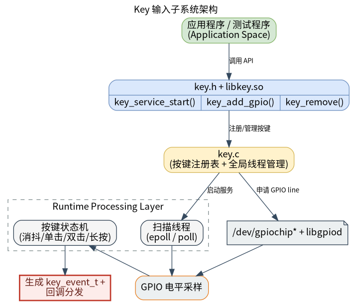

# 外设与驱动 · key

## 1. 模块概述
 
- 主要功能：`key` 模块位于 `components/peripherals/key`，是一个面向 Linux GPIO 字符设备的用户态按键驱动组件。模块通过后台线程周期性读取 GPIO 电平，完成按键去抖、事件识别与回调分发，向上层输出按下、释放、单击、双击、长按和长按连发等事件。  
- 规格或特性：对外以 `key.h` + `libkey.so` 形式提供 C 接口；底层依赖 `libgpiod` 访问 `/dev/gpiochip*`；兼容 `libgpiod` v1/v2；支持短按，长按，连续按等事件触发。  
- 软件框图：见下图。  



- 相关目录结构：  

| 路径 | 职责 |
| --- | --- |
| `components/peripherals/key/include/key.h` | 对外公开的事件枚举、配置结构体和 API 声明 |
| `components/peripherals/key/src/key.c` | GPIO 打开、轮询扫描、消抖、单/双击、长按和连发事件识别实现 |
| `components/peripherals/key/test/test_key.c` | 自带演示程序，展示双按键配置与事件打印 |
| `components/peripherals/key/CMakeLists.txt` | 模块构建、安装和 `test_key` 目标定义 |
| `components/peripherals/key/package.xml` | 组件版本与系统依赖声明 |
| `components/peripherals/key/README.md` | 独立使用说明与快速开始 |

## 2. 环境准备

### 前置条件

- 运行环境：推荐板端环境 `k3-com260` 配套系统镜像；

- 硬件与连接：目标板需暴露可由 Linux 访问的 GPIO 控制器，并接有机械按键或按键板；确认按键对应的 Linux 逻辑 GPIO 编号、有效电平和上下拉方式。当前演示程序默认使用 `GPIO113` 与 `GPIO114`，两者均配置为高电平有效。  
- 工具与权限：运行用户需要访问 `/dev/gpiochip*` 的权限；如设备节点权限未放开，可使用 `sudo` 运行演示程序。

### 构建编译

- **获取代码**：详见 [2.3-配置编译](../../02-%E5%BF%AB%E9%80%9F%E5%85%A5%E9%97%A8/2.3-%E9%85%8D%E7%BD%AE%E7%BC%96%E8%AF%91.md#21-代码获取) 章节，使用 `repo` 工具克隆完整 SDK。

- **本模块编译**：
    - **方式 1：独立编译**
      ```bash
      cd components/peripherals/key
      mkdir build && cd build
      cmake ..
      make -j$(nproc)
      ```
    - **方式 2：SDK 集成编译 (推荐)**
      ```bash
      # 根目录下
      source build/envsetup.sh
      cd components/peripherals/key
      mm     # 仅编译本模块
      ```

- **产物名称**：`libkey.so` 和 `test_key` 输出至 `build/` (独立编译) 或系统 `output/staging/{lib,bin}` 路径 (SDK 编译)。

- **说明**：`CMakeLists.txt` 会根据 `libgpiod` 版本自动定义 `LIBGPIOD_V1` 或 `LIBGPIOD_V2`。若平台 GPIO 编号规则与当前实现不一致，需要按实际 SoC 调整 `src/key.c` 中的 `open_gpio_chip()`。

## 3. 示例使用（从 0 跑通）

本节为读者**按步骤复现**的主线：

### 3.1 【运行自带 test_key 演示程序】

**前置**：对于k3-com260开发板，可参考以下接线方式，对应的是gpio83，通过杜邦线短接到GND，模拟实体的key按键。


**步骤 1**：当前示例默认注册两个按键：`GPIO113`、`GPIO114`，并将二者都配置为高电平有效；如果你的板级为k3-com250，请先修改 `key1_config`、`key2_config` 中的 `gpio_num` 与 `active_low` 后再编译。

```
    key_config_t key1_config = {
        .gpio_num = 82,
        .active_low = 1,           // gpio82默认拉高， 所以这里置为1
        .long_press_ms = 1500,     // 1.5秒长按
        .double_click_ms = 300     // 300ms内双击有效
    };

    // 配置按键2（假设连接到 GPIO18，高电平有效）
    key_config_t key2_config = {
        .gpio_num = 83,
        .active_low = 1,           // gpio82默认拉高， 所以这里置为1
        .long_press_ms = 2000,     // 2秒长按
        .double_click_ms = 400     // 400ms内双击有效
    };

```


**步骤 2**：在sdk组件目录下完成构建。  

```bash
cd components/peripherals/key
mkdir -p build
cd build
cmake ..
make -j$(nproc)
```

预期现象：命令成功结束，`build/` 目录下生成 `test_key` 与 `libkey.so`，`make` 返回码为 `0`。  

**步骤 3**：运行演示程序。

```bash
#运行测试程序
sudo ./build/test_key
```

预期现象：终端打印启动信息和已注册按键信息，例如：`启动按键驱动演示程序...`、`按键已添加:`、`等待按键事件...`。  

**步骤 4**：对物理按键执行短按、双击和长按动作，观察事件输出。  

预期现象：  
- 短按一次，会先看到 `物理按下`、`物理释放`，随后看到 `单击事件`。  
- 快速按两次，会在第二次释放后看到 `双击事件`。  
- 按住超过阈值，会看到 `长按事件`，继续按住则周期性看到 `连发事件`。  
- 按 `Ctrl+C` 退出时，会打印 `清理资源...` 和 `程序退出`。  


## 4. 应用开发

### 4.1 最简使用流程

```c
static void key_event_callback(struct key_handle *key, key_event_t event, void *user_data)
{
    (void)key;
    printf("[%s] event=%d\n", (const char *)user_data, event);
}

int main(void)
{
    // 1. 启动服务：创建后台扫描线程
    if (key_service_start() != 0) {
        return -1;
    }

    // 2. 配置按键：指定 GPIO 编号、有效电平和时序参数
    key_config_t cfg = {
        .gpio_num = 83,
        .active_low = 1,
        .long_press_ms = 1500,
        .double_click_ms = 300,
    };

    // 3. 注册按键：绑定回调，异步接收按键事件
    struct key_handle *key = key_add_gpio(&cfg, key_event_callback, "key1");
    if (!key) {
        key_service_stop();
        return -1;
    }

    // 4. 业务运行：主线程执行自己的逻辑，事件在回调中到达
    sleep(10);

    // 5. 释放资源：删除按键并停止服务
    key_remove(key);
    key_service_stop();
    return 0;
}
```

### 4.2 主要 API 说明

**1. 服务生命周期**
```c
// 启动全局按键服务，创建后台扫描线程
int key_service_start(void);

// 停止后台线程并释放全局资源
void key_service_stop(void);
```

**2. 按键注册与删除**
```c
// 注册一个 GPIO 按键
struct key_handle *key_add_gpio(const key_config_t *config, key_callback_t cb, void *user_data);
// config: 按键配置, cb: 事件回调, user_data: 用户私有数据

// 删除一个按键
void key_remove(struct key_handle *key);
// key: 由 key_add_gpio 返回的不透明句柄
```

**3. 事件回调**
```c
// 按键事件回调原型
typedef void (*key_callback_t)(struct key_handle *key, key_event_t event, void *user_data);
// key: 事件来源按键, event: 当前事件类型, user_data: 注册时透传的数据
```

### 4.3 核心数据结构

**按键配置结构体**
```c
typedef struct {
    int gpio_num;           // Linux GPIO 编号
    int active_low;         // 1: 低电平有效, 0: 高电平有效
    int long_press_ms;      // 长按阈值, 0 表示使用默认值 1500 ms
    int double_click_ms;    // 双击判定窗口, 0 表示使用默认值 300 ms
} key_config_t;
```

**按键事件枚举**
```c
typedef enum {
    KEY_EV_PRESSED,
    KEY_EV_RELEASED,
    KEY_EV_CLICK,
    KEY_EV_DOUBLE_CLICK,
    KEY_EV_LONG_PRESS,
    KEY_EV_HOLD_REPEAT
} key_event_t;
```

**按键句柄**
```c
struct key_handle;
```

开发时需要注意：必须先调用 `key_service_start()` 再注册按键；`key_add_gpio()` 的 `cb` 不能为空；`KEY_EV_LONG_PRESS` 一旦触发，当前按压不会再产生单击或双击事件；长按连发间隔当前固定为 `200 ms`；用户回调运行在模块内部的扫描线程上下文中，应避免阻塞、耗时 I/O 或直接执行复杂业务，必要时请在回调中投递到自己的工作线程；退出前建议先调用 `key_remove()` 释放每个按键，再调用 `key_service_stop()` 关闭后台线程。

**参考 demo 或示例路径**
```text
components/peripherals/key/test/test_key.c
```

## 5. 调试指南

- 与硬件或内核同事联调时，建议一并提供以下信息：板型与内核版本、按键原理图或接线说明、GPIO 编号与有效电平，以及内核设备树是否已配置成gpio模式。  

## 6. 常见问题
暂无
