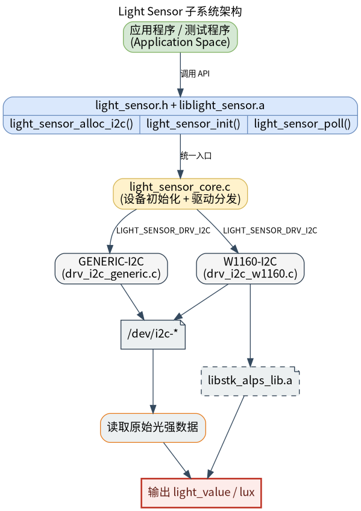

# 外设与驱动 · light_sensor

## 1. 模块概述
 
- 主要功能：`light_sensor` 模块位于 `components/peripherals/light_sensor`，提供基于 I2C 的光照传感器采集能力。模块通过统一的设备对象和驱动注册框架封装传感器初始化、轮询采样和资源释放流程，减少上层对具体芯片寄存器与算法库的直接依赖。当前代码已内置通用 I2C 读写适配层和 W1160 专用驱动。  
- 规格或特性：对外以 `light_sensor.h` + `liblight_sensor.a` 形式提供 C 接口；当前公开接口为 `light_sensor_alloc_i2c()`、`light_sensor_init()`、`light_sensor_poll()`、`light_sensor_free()`；支持通过 `驱动名:实例名` 的字符串形式选择具体驱动，例如 `W1160:als0`；当前主测器件为 W1160，默认 I2C 地址 `0x48`，测试程序默认访问 `/dev/i2c-5`；轮询读取返回单位为 `lux` 的 `uint32_t` 值；W1160 驱动依赖随仓库提供的静态算法库 `libstk_alps_lib.a`，并使用 FIFO 数据计算环境光。  
- 软件框图：见下图。  



- 相关目录结构：  

| 路径 | 职责 |
| --- | --- |
| `components/peripherals/light_sensor/include/light_sensor.h` | 对外公开的设备句柄和基础 API 声明 |
| `components/peripherals/light_sensor/src/light_sensor_core.c` | 设备分配、驱动注册表、驱动实例选择和统一 API 实现 |
| `components/peripherals/light_sensor/src/light_sensor_core.h` | 内部设备模型、驱动虚表和注册宏 |
| `components/peripherals/light_sensor/src/drivers/drv_i2c_generic.c` | 通用 I2C 访问驱动，提供基础 `open/ioctl/read/write` 封装 |
| `components/peripherals/light_sensor/src/drivers/drv_i2c_w1160/drv_i2c_w1160.c` | W1160 专用初始化、FIFO 读取、lux 计算和设备锁实现 |
| `components/peripherals/light_sensor/src/drivers/drv_i2c_w1160/libstk_alps_lib.a` | W1160 算法静态库 |
| `components/peripherals/light_sensor/test/test_light_sensor_i2c.c` | 自带演示程序，演示 W1160 的初始化和轮询读取 |
| `components/peripherals/light_sensor/CMakeLists.txt` | 模块构建、依赖静态库链接和测试目标定义 |

## 2. 环境准备

### 前置条件

- 运行环境：推荐板端环境 `k1-deb1` 配套系统镜像，系统需要启用 I2C 设备节点接口；需要 `gcc`、`make`、`cmake` 或同等构建工具；组件按 C99 编译；运行时需能访问 `/dev/i2c-*`。  
- 依赖与外部资源：本模块依赖 Linux I2C 字符设备接口，不需要额外第三方动态库；W1160 驱动依赖仓库内自带的 `src/drivers/drv_i2c_w1160/libstk_alps_lib.a` 静态库，默认会被 `CMakeLists.txt` 自动链接；若该静态库不在默认位置，可在构建时通过 `-DSTK_ALPS_STATIC_LIB=/path/to/libstk_alps_lib.a` 指定。  
- 硬件与连接：需要一颗通过 I2C 连接的光照传感器；当前实现重点支持 W1160。请确认传感器已正确供电，SCL/SDA 已连接到目标板对应 I2C 控制器，并确认设备节点路径和从设备地址。测试程序默认假设设备节点为 `/dev/i2c-5`、I2C 地址为 `0x48`。  
- 工具与权限：排查问题时建议预装 apt install i2c-tools，使用i2cdetect/i2cdump等工具排查问题。  

### 构建编译

- **获取代码**：详见 [2.3-配置编译](../../02-%E5%BF%AB%E9%80%9F%E5%85%A5%E9%97%A8/2.3-%E9%85%8D%E7%BD%AE%E7%BC%96%E8%AF%91.md#21-代码获取) 章节，使用 `repo` 工具克隆完整 SDK。以下编译测试命令均在sdk内执行。

- **本模块编译**：
    - **方式 1：独立编译**
      ```bash
      cd components/peripherals/light_sensor
      mkdir build && cd build
      cmake .. -DBUILD_TESTS=ON
      make -j$(nproc)
      ```
    - **方式 2：SDK 集成编译 (推荐)**
      ```bash
      source build/envsetup.sh
      cd components/peripherals/light_sensor
      mm     # 仅编译本模块
      ```

- **产物名称**：`liblight_sensor.a` 输出至 `build/`；启用 `BUILD_TESTS` 时同时生成 `test_light_sensor_i2c`。SDK 编译产物安装至系统 `output/staging/{lib,bin}` 路径。

- **说明**：W1160 驱动依赖仓库内 `src/drivers/drv_i2c_w1160/libstk_alps_lib.a`，但由于该静态库不是 -fPIC 编的，暂时不支持k3方案编译验证。

## 3. 示例使用（从 0 跑通）

本节为读者**按步骤复现**的主线：

### 3.1 【运行 W1160 自带测试程序】

**前置**：需要确认 W1160 传感器接在目标板对应 I2C 总线上，设备节点和地址可用，且当前用户可访问 `/dev/i2c-*` 与 `/var/lock/`。  

**步骤 1**：根据硬件连接确认测试参数。`test/test_light_sensor_i2c.c` 默认使用 `/dev/i2c-5` 和地址 `0x48`；如果你的板级连接不同，请在运行命令时通过参数覆盖，而不是直接修改源码。  

**步骤 2**：在组件目录下构建测试程序。  

```bash
cd components/peripherals/light_sensor
mkdir -p build
cd build
cmake .. -DBUILD_TESTS=ON
make -j$(nproc)
```

预期现象：构建成功后，`build/` 目录下可看到 `liblight_sensor.a` 和 `test_light_sensor_i2c`。  

**步骤 3**：运行测试程序。  

```bash
cd components/peripherals/light_sensor
sudo ./build/test_light_sensor_i2c /dev/i2c-5 0x48
```

预期现象：程序先打印 `W1160 Light Sensor I2C Test`、`Using: dev=/dev/i2c-5 addr=0x48`，初始化成功后打印 `W1160 initialization OK, polling light values...`。  

**步骤 4**：观察轮询结果。  

预期现象：  
- 当 FIFO 尚未攒够数据时，会看到 `No new FIFO data yet`。  
- 一旦 FIFO 数据就绪，会周期性打印形如 `[12] Light value: 356 lux` 的结果。  
- 测试程序总共轮询 200 次，每次间隔 `1 s`。全部完成后打印 `Test complete.`。  


## 4. 应用开发

### 4.1 最简使用流程

```c
int main(void)
{
    struct light_sensor_dev *dev =
        light_sensor_alloc_i2c("W1160:als0", "/dev/i2c-5", 0x48);
    if (!dev) {
        return -1;
    }

    if (light_sensor_init(dev) < 0) {
        light_sensor_free(dev);
        return -1;
    }

    for (int i = 0; i < 10; ++i) {
        uint32_t lux = 0;
        int ret = light_sensor_poll(dev, &lux);
        if (ret == 0) {
            printf("lux=%u\n", lux);
        }
        usleep(1000000);
    }

    light_sensor_free(dev);
    return 0;
}
```

### 4.2 主要 API 说明

**1. 设备创建与资源管理**
```c
// 按 I2C 方式创建设备实例
struct light_sensor_dev *light_sensor_alloc_i2c(const char *name, const char *i2c_dev, uint8_t addr);
// name: 驱动名:实例名, i2c_dev: I2C 设备节点, addr: 7 位设备地址

// 初始化传感器，打开设备并完成芯片初始化
int light_sensor_init(struct light_sensor_dev *dev);

// 释放设备资源
void light_sensor_free(struct light_sensor_dev *dev);
```

**2. 数据读取**
```c
// 轮询读取当前光照值
int light_sensor_poll(struct light_sensor_dev *dev, uint32_t *light_value);
// light_value: 输出的光照值，单位 lux
```

### 4.3 核心数据结构

**传感器句柄**
```c
struct light_sensor_dev;
```

**I2C 创建设备参数**
```c
struct light_sensor_dev *light_sensor_alloc_i2c(const char *name, const char *i2c_dev, uint8_t addr);
```

**采样输出**
```c
uint32_t light_value;  // 单位 lux
```

开发时需要注意：`light_sensor_alloc_i2c()` 的 `name` 建议显式传 `W1160:als0` 这类 `驱动名:实例名` 格式，以确保选择正确驱动；W1160 驱动首次 `poll()` 前会先完成初始化和数据准备，因此开始几次轮询可能还拿不到有效值；当 `light_sensor_poll()` 返回 `-EAGAIN` 时，表示当前样本尚未就绪，调用方应继续轮询；W1160 驱动在 `init()` 和 `poll()` 阶段会尝试使用 `/var/lock/` 锁文件串行化访问同一 I2C 设备。

**参考 demo 或示例路径**
```text
components/peripherals/light_sensor/test/test_light_sensor_i2c.c
components/peripherals/light_sensor/src/drivers/drv_i2c_w1160/drv_i2c_w1160.c
```

## 5. 调试指南

- 如果初始化失败，优先检查 `/dev/i2c-*`、I2C 地址和 `/var/lock/` 权限，并用 `i2cdetect -y <bus>` 确认地址 `0x48` 可见。  
- 如果程序持续打印 `No new FIFO data yet`，通常是 FIFO 样本尚未准备好，应先检查传感器供电、I2C 通讯和轮询间隔。  
- 如果怀疑是驱动选择问题，优先确认 `light_sensor_alloc_i2c()` 的 `name` 使用了 `W1160:als0` 这类 `驱动名:实例名` 格式。  

## 6. 常见问题

- `light_sensor_alloc_i2c()` 返回 `NULL`：通常是 `name`、`i2c_dev` 参数错误，或指定驱动未注册。优先使用 `W1160:als0`。  
- `light_sensor_init()` 失败：通常是设备节点、I2C 地址、权限或锁文件权限异常。必要时使用 `sudo` 并检查 `/var/lock/`。  
- 读到的 `lux` 数值不稳定：先排除环境光本身变化，再检查算法库、传感器标定和 FIFO 是否已经稳定输出。  
