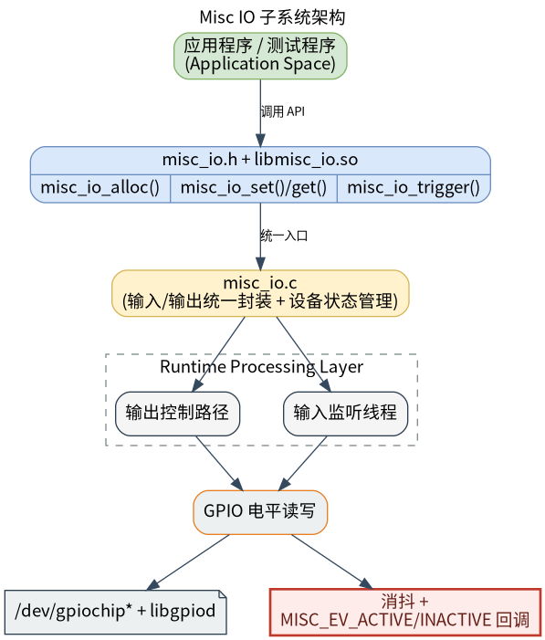

# 外设与驱动 · misc_io

## 1. 模块概述
 
- 主要功能：`misc_io` 模块位于 `components/peripherals/misc_io`，提供基于 Linux GPIO 的通用数字输入/输出封装，用于快速接入蜂鸣器、继电器、拨码开关、限位开关、简单数字传感器等零散 IO 外设。模块统一封装了 GPIO 打开、方向申请、电平读写、输入去抖和状态变化回调流程。  
- 规格或特性：对外以 `misc_io.h` + `libmisc_io.so` 形式提供 C 接口；依赖 `libgpiod` 访问 `/dev/gpiochip*`；兼容 `libgpiod` v1/v2；支持输入和输出两种方向、`active high/active low` 两种逻辑定义、去抖时间配置和回调触发；输入场景下 `misc_io_get()` 返回的是“当前是否 active”的逻辑值，不是原始电平值；v2 分支通过后台线程每 `10 ms` 轮询一次电平变化，v1 分支基于 `gpiod_line_event_wait()` 等待边沿事件。  
- 软件框图：见下图。  



- 相关目录结构：  

| 路径 | 职责 |
| --- | --- |
| `components/peripherals/misc_io/include/misc_io.h` | 对外公开的设备类型、方向、逻辑、电平事件和 API 声明 |
| `components/peripherals/misc_io/src/misc_io.c` | GPIO 打开、line 申请、输入轮询/事件等待、去抖、读写和资源释放实现 |
| `components/peripherals/misc_io/test/test_misc_io.c` | 自带演示程序，覆盖输入触发、主动读取和输出控制三种典型场景 |
| `components/peripherals/misc_io/CMakeLists.txt` | 模块构建、`libgpiod` 检测、测试目标和安装规则 |
| `components/peripherals/misc_io/package.xml` | 组件版本和系统依赖声明 |
| `components/peripherals/misc_io/README.md` | 组件说明和快速开始 |

## 2. 环境准备

### 前置条件

- 运行环境：推荐板端环境 `k3-com260` 配套系统镜像； 
- 硬件与连接：目标板需要暴露 Linux 可访问的 GPIO 控制器，并已连接好待测试的 IO 外设。调用者需要明确 `chip_name` 和 `line_offset`。源码中的说明给出了两类常见平台映射方式：对 K3 平台，可按 `GPIO83 -> gpiochip2 + line_offset 19` 理解；对 K1 平台，可能全部落在 `gpiochip0`，例如 `GPIO113 -> gpiochip0 + line_offset 113`。  
- 工具与权限：运行用户需要访问 `/dev/gpiochip*`；当设备节点权限受限时请使用 `sudo`。排查问题时建议准备 `gpioinfo`、`gpiodetect`、`gpioget`、`gpioset` 等工具，用于确认 line 是否存在、是否被占用以及原始电平状态。  

### 构建编译

- **获取代码**：详见 [2.3-配置编译](../../02-%E5%BF%AB%E9%80%9F%E5%85%A5%E9%97%A8/2.3-%E9%85%8D%E7%BD%AE%E7%BC%96%E8%AF%91.md#21-代码获取) 章节，使用 `repo` 工具克隆完整 SDK。

- **本模块编译**：
    - **方式 1：独立编译**
      ```bash
      cd components/peripherals/misc_io
      mkdir build && cd build
      cmake ..
      make -j$(nproc)
      ```
    - **方式 2：SDK 集成编译 (推荐)**
      ```bash
      source build/envsetup.sh
      cd components/peripherals/misc_io
      mm     # 仅编译本模块
      ```

- **产物名称**：`libmisc_io.so` 和 `test_misc_io` 输出至 `build/` (独立编译) 或系统 `output/staging/{lib,bin}` 路径 (SDK 编译)。

- **说明**：`CMakeLists.txt` 会根据 `libgpiod` 版本自动定义 `LIBGPIOD_V1` 或 `LIBGPIOD_V2`，两者的输入监控机制不同，文档行为以源码当前实现为准。

## 3. 示例使用（从 0 跑通）

本节为读者**按步骤复现**的主线：

### 3.1 【运行输入触发回调测试】

**前置**：已确认待测试输入外设接在目标板某个 GPIO line 上，并且你知道对应的 `chip_name` 与 `line_offset`。  

**步骤 1**：检查并按板级实际情况修改 `test/test_misc_io.c` 里的 `test_trigger()` 配置。当前示例默认使用：`chip_name = "gpiochip0"`、`line_offset = 9`、`active_logic = MISC_ACTIVE_HIGH`、`debounce_ms = 50`。如果你的硬件不一致，请先调整这些值。  

**步骤 2**：在组件目录下完成构建。  

```bash
cd components/peripherals/misc_io
mkdir -p build
cd build
cmake ..
make -j$(nproc)
```

预期现象：`build/` 目录下生成 `libmisc_io.so` 和 `test_misc_io`，`make` 返回码为 `0`。  

**步骤 3**：运行测试程序。  

```bash
cd components/peripherals/misc_io
sudo ./build/test_misc_io
```

预期现象：程序进入常驻等待，不会立即退出。  

**步骤 4**：切换外部输入电平，观察回调输出。  

预期现象：每次稳定状态变化后，终端会打印形如 `[cb] count=1 ev=ACTIVE` 或 `[cb] count=2 ev=INACTIVE` 的内容；当抖动发生在 `50 ms` 去抖窗口内时，不应重复触发多次回调。  

## 4. 应用开发

### 4.1 最简使用流程

```c
static void on_misc_event(struct misc_dev *dev, enum misc_event ev, void *args)
{
    (void)dev;
    (void)args;
    printf("event=%d\n", ev);
}

int main(void)
{
    struct misc_gpiod_ctx ctx = {
        .chip_name = "gpiochip0",
        .line_offset = 83,
        .consumer = "misc_demo",
    };

    struct misc_dev *dev = misc_io_alloc(MISC_TYPE_SWITCH, MISC_DIR_INPUT, &ctx);
    if (!dev) {
        return -1;
    }

    misc_io_config(dev, MISC_ACTIVE_HIGH, 50);
    misc_io_trigger(dev, on_misc_event, NULL);

    sleep(10);

    misc_io_free(dev);
    return 0;
}
```

### 4.2 主要 API 说明

**1. 设备创建与配置**
```c
// 创建设备
struct misc_dev *misc_io_alloc(enum misc_type type, enum misc_dir dir, void *hw_ctx);

// 配置 active 逻辑和去抖时间
void misc_io_config(struct misc_dev *dev, enum misc_logic active_logic, uint16_t debounce_ms);

// 释放设备资源
void misc_io_free(struct misc_dev *dev);
```

**2. 输入输出操作**
```c
// 写输出状态
int misc_io_set(struct misc_dev *dev, bool active);

// 读取当前逻辑状态
int misc_io_get(struct misc_dev *dev);
```

**3. 事件触发**
```c
// 启动输入监控并注册回调
void misc_io_trigger(struct misc_dev *dev, misc_cb_t cb, void *args);

// 输入事件回调原型
typedef void (*misc_cb_t)(struct misc_dev *dev, enum misc_event ev, void *args);
```

### 4.3 核心数据结构

**GPIO 上下文**
```c
struct misc_gpiod_ctx {
    const char *chip_name;
    unsigned int line_offset;
    const char *consumer;
};
```

**逻辑与事件枚举**
```c
enum misc_logic {
    MISC_ACTIVE_LOW = 0,
    MISC_ACTIVE_HIGH
};

enum misc_event {
    MISC_EV_ACTIVE = 0,
    MISC_EV_INACTIVE,
};
```

**设备句柄**
```c
struct misc_dev;
```

开发时需要注意：`misc_io_alloc()` 依赖 `chip_name` 和 `line_offset` 的正确板级映射；`misc_io_set()` 和 `misc_io_get()` 返回的是逻辑上的 active/inactive，不是 GPIO 原始电平；`misc_io_trigger()` 仅适用于输入方向，首次调用会启动后台线程；回调运行在模块内部线程上下文中，应避免阻塞和耗时 I/O。

**参考 demo 或示例路径**
```text
components/peripherals/misc_io/test/test_misc_io.c
components/peripherals/misc_io/src/misc_io.c
```

## 5. 调试指南

- 如果 `misc_io_alloc()` 失败，优先检查 `chip_name`、`line_offset` 和 `/dev/gpiochip*` 权限，并确认该 GPIO 没有被其他进程占用。  
- 如果输入电平变化了但没有回调，优先核对设备方向、`active_logic` 和 `debounce_ms`，必要时结合 `gpioinfo` / `gpioget` 交叉验证。  
- 如果 `misc_io_get()` 的结果和原始电平相反，先确认它返回的是逻辑上的 active/inactive，而不是 GPIO 原始高低电平。  

## 6. 常见问题

- `misc_io_alloc()` 返回 `NULL`：通常是 `chip_name`、`line_offset` 不正确，或 GPIO line 已被占用。  
- `misc_io_set()` 返回负值：通常是句柄无效，或当前设备是输入方向，不能执行输出写入。  
- `misc_io_get()` 返回值和原始电平相反：这是因为它返回的是 active/inactive 逻辑值，不是原始 GPIO 电平。  
