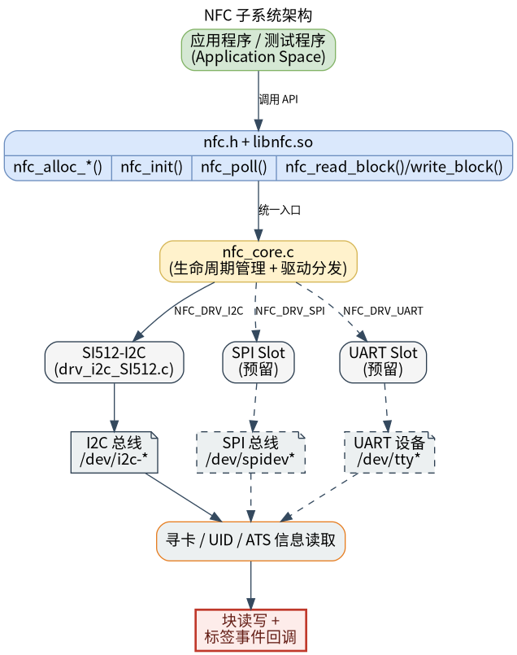

# 外设与驱动 · nfc

## 1. 模块概述
 
- 主要功能：`nfc` 模块位于 `components/peripherals/nfc`，提供面向用户态的 NFC 设备抽象层和驱动注册框架，用于初始化读卡器、轮询标签、读取 UID，并按设备能力进行块读写。当前仓库中实际落地的驱动是基于 I2C 的 SI512 读卡器实现，主要用于快速验证 Linux 侧读卡链路和 Type A 标签交互。  
- 规格或特性：对外以 `nfc.h` + `libnfc.so` 形式提供 C 接口；支持 `nfc_alloc_i2c()`、`nfc_alloc_spi()`、`nfc_alloc_uart()` 三类工厂接口，但当前目录下只有 `drv_i2c_SI512` 驱动源码，SPI/UART 只有 API 和测试壳，未随该目录提供对应驱动实现；I2C 示例默认设备节点为 `/dev/i2c-5`，默认从设备地址为 `0x28`；`nfc_poll()` 返回 `0` 表示检测到卡片，返回 `1` 表示超时/无卡；SI512 驱动支持 Type A 标签 UID 读取，并提供 16 字节块读写接口。  
- 软件框图：见下图。



- 相关目录结构：  

| 路径 | 职责 |
| --- | --- |
| `components/peripherals/nfc/include/nfc.h` | 对外公开的标签信息结构体、生命周期接口、块读写接口和工厂函数 |
| `components/peripherals/nfc/src/nfc_core.c` | 统一 API 实现、驱动注册表和 `name=驱动名:实例名` 解析逻辑 |
| `components/peripherals/nfc/src/nfc_core.h` | 内部设备对象、驱动虚表、bus 类型和注册宏 |
| `components/peripherals/nfc/src/drivers/drv_i2c_SI512/drv_i2c_SI512.c` | SI512 I2C 驱动、寄存器访问、Type A 轮询与块读写实现 |
| `components/peripherals/nfc/src/drivers/drv_i2c_SI512/drv_i2c_SI512.h` | SI512/MFRC522 风格寄存器、命令和设备常量定义 |
| `components/peripherals/nfc/test/test_nfc_i2c.c` | I2C 模式演示程序，展示初始化、轮询、UID 打印和块读写调用 |
| `components/peripherals/nfc/test/test_nfc_spi.c` | SPI 接口测试壳，用于验证 generic SPI 驱动存在时的返回码约定 |
| `components/peripherals/nfc/test/test_nfc_uart.c` | UART 接口测试壳，用于验证 generic UART 驱动存在时的返回码约定 |
| `components/peripherals/nfc/CMakeLists.txt` | 组件构建、驱动选择和测试目标定义 |

## 2. 环境准备

### 前置条件

- 运行环境：推荐板端环境 `k1-deb1` 配套系统镜像，系统具备 I2C 控制器和对应设备节点；需要 `gcc`、`make`、`cmake`；组件按 C99 构建。  
- 依赖与外部资源：I2C 模式依赖内核导出的 `/dev/i2c-*` 设备节点，不额外依赖第三方动态库；本仓库当前未随 `nfc` 组件提供 SPI/UART 驱动源文件，因此若只使用本目录代码，实际可跑通路径是 I2C + SI512。  
- 硬件与连接：需要一块 SI512 NFC 模块，并通过 I2C 连接到目标板。请确认供电、SCL、SDA 正确连接，模块 I2C 地址与程序参数一致，且待测试卡片为驱动当前示例路径支持的 Type A 类卡片。  

### 构建编译

- **获取代码**：详见 [2.3-配置编译](../../02-%E5%BF%AB%E9%80%9F%E5%85%A5%E9%97%A8/2.3-%E9%85%8D%E7%BD%AE%E7%BC%96%E8%AF%91.md#21-代码获取) 章节，使用 `repo` 工具克隆完整 SDK。

- **本模块编译**：
    - **方式 1：独立编译**
      ```bash
      cd components/peripherals/nfc
      mkdir build && cd build
      cmake .. -DBUILD_TESTS=ON -DSROBOTIS_PERIPHERALS_NFC_ENABLED_DRIVERS="drv_i2c_SI512"
      make -j$(nproc)
      ```
    - **方式 2：SDK 集成编译 (推荐)**
      ```bash
      source build/envsetup.sh
      cd components/peripherals/nfc
      mm     # 仅编译本模块
      ```

- **产物名称**：`libnfc.so` 输出至 `build/`；启用 `BUILD_TESTS` 时同时生成 `test_nfc_i2c`、`test_nfc_spi` 和 `test_nfc_uart`。SDK 编译产物安装至系统 `output/staging/{lib,bin}` 路径。

- **说明**：若要跑通 I2C SI512 示例，配置阶段必须显式启用 `drv_i2c_SI512`；否则调用 `nfc_alloc_i2c("SI512:...")` 会因找不到驱动返回 `NULL`。

## 3. 示例使用（从 0 跑通）

本节为读者**按步骤复现**的主线：

### 3.1 【运行 SI512 I2C 读卡测试】

**前置**：确认 SI512 模块接在目标板 I2C 总线上，设备节点可访问，且卡片类型与驱动当前路径兼容。  

**步骤 1**：按上一节命令启用 `drv_i2c_SI512` 并完成构建。  

```bash
cd components/peripherals/nfc
mkdir -p build
cd build
cmake .. -DBUILD_TESTS=ON -DSROBOTIS_PERIPHERALS_NFC_ENABLED_DRIVERS="drv_i2c_SI512"
make -j$(nproc)
```

预期现象：`build/` 目录下生成 `libnfc.so` 和 `test_nfc_i2c`。  

**步骤 2**：运行 I2C 示例程序。  

```bash
cd components/peripherals/nfc
sudo ./build/test_nfc_i2c /dev/i2c-5 0x28 4
```

其中第 1 个参数是 I2C 设备节点，第 2 个参数是 SI512 地址，第 3 个参数是要读写的块号。  

预期现象：启动后先打印 `Using: dev=/dev/i2c-5 addr=0x28 block=4`，随后进入最多 20 轮轮询。  

**步骤 3**：将卡片贴近读卡器并观察结果。  

预期现象：  
- 无卡时会周期性打印 `[poll] no tag`。  
- 检测到卡时会打印 `[poll] tag detected:`，随后输出 UID。  
- 注册过回调时，还会打印形如 `[callback] dev=0x... uid_len=4 type=1 rssi=0` 的信息。  
- 后续会尝试读取并写入指定块，打印 `read block ret=...` 和 `write block ret=...`；成功时返回长度应为 `16`，失败时返回负错误码。  


## 4. 应用开发

### 4.1 最简使用流程

```c
static void on_tag_event(struct nfc_dev *dev, const struct nfc_tag_info *info, void *ctx)
{
    (void)dev;
    (void)ctx;
    printf("uid_len=%u type=%d\n", info ? info->uid_len : 0, info ? info->type : -1);
}

int main(void)
{
    struct nfc_dev *dev = nfc_alloc_i2c("SI512:nfc0", "/dev/i2c-5", 0x28);
    if (!dev) {
        return -1;
    }

    nfc_set_callback(dev, on_tag_event, NULL);

    if (nfc_init(dev) < 0) {
        nfc_free(dev);
        return -1;
    }

    struct nfc_tag_info info = {0};
    if (nfc_poll(dev, &info, 100) == 0) {
        uint8_t buf[16] = {0};
        nfc_read_block(dev, 4, buf, sizeof(buf));
    }

    nfc_free(dev);
    return 0;
}
```

### 4.2 主要 API 说明

**1. 设备创建与资源管理**
```c
// 按不同总线方式创建设备
struct nfc_dev *nfc_alloc_i2c(const char *name, const char *i2c_dev, uint8_t addr);
struct nfc_dev *nfc_alloc_spi(const char *name, const char *spi_dev, uint32_t cs_pin);
struct nfc_dev *nfc_alloc_uart(const char *name, const char *uart_dev, uint32_t baud);

// 初始化与释放
int nfc_init(struct nfc_dev *dev);
void nfc_free(struct nfc_dev *dev);
```

**2. 轮询与回调**
```c
// 注册标签事件回调
void nfc_set_callback(struct nfc_dev *dev, nfc_event_cb_t cb, void *ctx);

// 在给定超时时间内轮询标签
int nfc_poll(struct nfc_dev *dev, struct nfc_tag_info *info, uint32_t timeout_ms);
```

**3. 标签块读写**
```c
// 读取标签数据块
int nfc_read_block(struct nfc_dev *dev, uint8_t block, uint8_t *buf, size_t len);

// 写入标签数据块
int nfc_write_block(struct nfc_dev *dev, uint8_t block, const uint8_t *buf, size_t len);
```

### 4.3 核心数据结构

**标签信息结构体**
```c
struct nfc_tag_info {
    uint8_t uid[16];
    uint8_t uid_len;
    enum nfc_tag_type type;
    int8_t  rssi_dbm;
    uint8_t ats[32];
    uint8_t ats_len;
};
```

**标签类型枚举**
```c
enum nfc_tag_type {
    NFC_TAG_UNKNOWN = 0,
    NFC_TAG_MIFARE_CLASSIC,
    NFC_TAG_MIFARE_ULTRALIGHT,
    NFC_TAG_TYPE_A,
    NFC_TAG_TYPE_B,
    NFC_TAG_FELICA,
    NFC_TAG_ISO15693,
};
```

**设备句柄与回调**
```c
struct nfc_dev;

typedef void (*nfc_event_cb_t)(struct nfc_dev *dev,
    const struct nfc_tag_info *info, void *ctx);
```

开发时需要注意：建议显式使用 `SI512:nfc0` 这类 `驱动名:实例名` 形式选择驱动；`nfc_poll()` 是同步轮询接口，常见返回值为 `0` 表示检测到标签、`1` 表示超时未检测到标签；当前 SI512 驱动会在 `/var/lock` 下对同一 I2C 设备加锁；`nfc_read_block()` 和 `nfc_write_block()` 当前要求 `len` 固定为 `16` 字节。

**参考 demo 或示例路径**
```text
components/peripherals/nfc/test/test_nfc_i2c.c
components/peripherals/nfc/src/drivers/drv_i2c_SI512/drv_i2c_SI512.c
```

## 5. 调试指南

- 如果始终提示 `no tag`，优先检查 SI512 模块供电、I2C 连接、卡片类型和天线距离，再用 `i2cdetect -y <bus>` 确认地址 `0x28` 可见。  
- 如果程序报 `alloc i2c failed`，通常是因为当前构建结果没有编入 `drv_i2c_SI512`，或者运行时代码没有使用 `SI512:nfc0` 这类驱动名格式。  
- 如果多进程访问同一 I2C 设备时偶发 `-EBUSY`，应检查 `/var/lock/` 下的锁文件和其他进程的总线占用情况。  

## 6. 常见问题

- `alloc i2c failed`：通常是没有启用 `drv_i2c_SI512`，或运行时代码没有使用 `SI512:nfc0` 这类驱动名格式。  
- `nfc_init()` 看起来成功但一直 `no tag`：先检查设备节点、地址 `0x28`、接线和卡片类型，再结合 `nfc_poll()` 返回值判断。  
- `read block` / `write block` 返回负值：先确认已经检测到标签，并且读写缓冲区长度固定为 `16` 字节。  
- 期望使用 SPI/UART 但无法分配设备：当前目录只有 I2C + SI512 路径可以直接使用，SPI/UART 仍需补驱动实现。  
