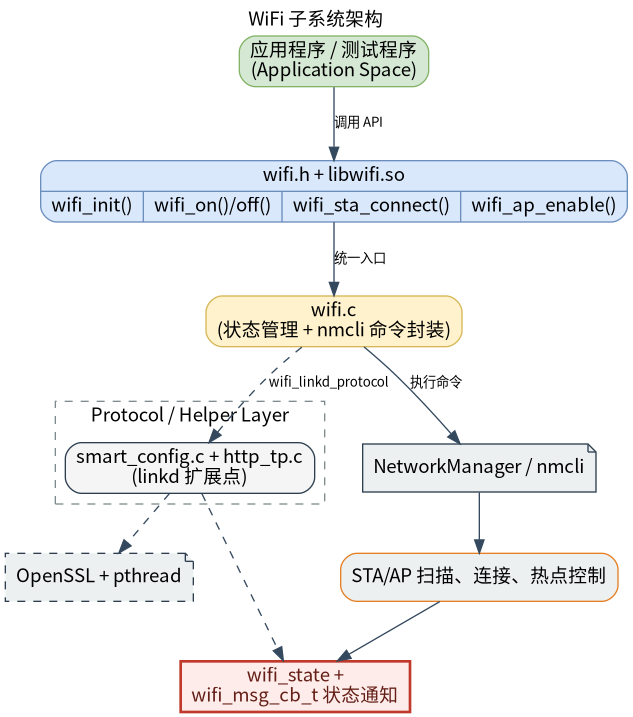

# 外设与驱动 · wifi

## 1. 模块概述
 
- 主要功能：`wifi` 模块位于 `components/peripherals/wifi`，提供基于 NetworkManager 的 WiFi 管理封装。模块通过统一的 `wifi.h` C API 调用 `nmcli`，覆盖 STA 扫描、连接、断开、信息查询、已保存网络管理、AP 热点启停、MAC 查询/设置，以及 SoftAP 配网相关能力。  
- 规格或特性：对外以 `wifi.h` + `libwifi.so` 形式提供 C 接口；运行时强依赖 `NetworkManager` 和 `nmcli`；构建时依赖 `pthread` 与 OpenSSL；STA 扫描结果最多由调用者数组容量决定，测试程序默认展示前 32 个；已保存网络列表 API 最多返回 `WIFI_STA_MAX_NUM=20` 条；SSID 最大长度为 32 字节，PSK 最大长度为 64 字节；SoftAP 配网页面默认监听 `8000` 端口，HTTP Basic 认证用户名/密码固定为 `admin/admin`；AP 配置查询优先从 `nmcli` 刷新，失败时返回组件内部缓存。  
- 软件框图：见下图。  



- 相关目录结构：  

| 路径 | 职责 |
| --- | --- |
| `components/peripherals/wifi/include/wifi.h` | 对外公开状态码、模式、STA/AP 结构体、消息回调和 WiFi API |
| `components/peripherals/wifi/src/wifi.c` | 基于 `nmcli` 的 WiFi 初始化、STA、AP、MAC、Linkd 和状态管理实现 |
| `components/peripherals/wifi/src/link_protocol/smart_config.c` | SoftAP 配网 HTTP 服务、SSID/PSK 表单解析和结果回调 |
| `components/peripherals/wifi/src/link_protocol/http_tp.c` | HTTP 响应头、配置页面和保存结果页面模板 |
| `components/peripherals/wifi/test/test_wifi_demo.c` | 命令行演示程序，覆盖扫描、连接、AP、MAC、状态和 Linkd 流程 |
| `components/peripherals/wifi/CMakeLists.txt` | 模块构建、OpenSSL/Threads 链接和测试目标定义 |
| `components/peripherals/wifi/package.xml` | 组件版本和 NetworkManager 依赖说明 |

## 2. 环境准备

### 前置条件

- 运行环境：推荐板端环境 `k1-deb1` 配套系统镜像，系统安装并运行 NetworkManager；`nmcli` 命令可用；构建环境需要 `gcc`、`make`、`cmake`。  

- 硬件与连接：目标板需要可被 NetworkManager 管理的 WiFi 网卡。STA 模式需要可连接的路由器或热点；AP 模式需要无线网卡和驱动支持 hotspot/AP 模式；设置克隆 MAC 需要当前连接存在且硬件/驱动允许修改 MAC。  
- 工具与权限：许多 `nmcli` 操作需要管理员权限或 polkit 授权，建议在开发板上使用具备网络管理权限的账户，必要时使用 `sudo` 运行测试程序。排查时可直接执行 `nmcli device status`、`nmcli radio wifi`、`nmcli device wifi list`、`nmcli connection show`。  

### 构建编译

- **获取代码**：详见 [2.3-配置编译](../../02-%E5%BF%AB%E9%80%9F%E5%85%A5%E9%97%A8/2.3-%E9%85%8D%E7%BD%AE%E7%BC%96%E8%AF%91.md#21-代码获取) 章节，使用 `repo` 工具克隆完整 SDK。

- **本模块编译**：
    - **方式 1：独立编译**
      ```bash
      cd components/peripherals/wifi
      mkdir build && cd build
      cmake .. -DBUILD_TESTS=ON
      make -j$(nproc)
      ```
    - **方式 2：SDK 集成编译 (推荐)**
      ```bash
      source build/envsetup.sh
      cd components/peripherals/wifi
      mm     # 仅编译本模块
      ```

- **产物名称**：`libwifi.so` 输出至 `build/`；启用 `BUILD_TESTS` 时同时生成 `test_wifi_demo`。SDK 编译产物安装至系统 `output/staging/{lib,bin}` 路径。

- **说明**：SoftAP 配网使用 OpenSSL 做 Base64 编码，构建环境必须能找到 OpenSSL；运行时依赖 `nmcli` 和 NetworkManager。

## 3. 示例使用（从 0 跑通）

本节为读者**按步骤复现**的主线：

### 3.1 【扫描并连接 WiFi】

**前置**：见 §2。已确认 NetworkManager 正在运行，WiFi 网卡可见，目标 AP 在附近且密码正确。  

**步骤 1**：构建演示程序。  

```bash
cd components/peripherals/wifi
mkdir -p build
cd build
cmake .. -DBUILD_TESTS=ON
make -j$(nproc)
```

预期现象：`build/` 目录下生成 `libwifi.so` 和 `test_wifi_demo`。  

**步骤 2**：扫描附近 WiFi。  

```bash
cd components/peripherals/wifi
./build/test_wifi_demo scan
```

预期现象：程序打印 `Found <N> networks (showing up to 32):`，并逐行输出 `SSID`、`RSSI`、`FREQ`、`SEC` 和 `BSSID`。如果希望同时观察组件回调，可执行 `./build/test_wifi_demo cb scan`，回调会打印 `[cb] dev_status=...` 等事件。  

**步骤 3**：连接指定 WiFi。  

```bash
./build/test_wifi_demo connect <ssid> <password>
```

预期现象：连接成功时打印 `wifi_sta_connect: 0`；失败时返回负状态码，例如 `-1` 表示底层 `nmcli` 命令失败，`-2` 表示组件尚未就绪。  

**步骤 4**：查询当前连接信息。  

```bash
./build/test_wifi_demo info
```

预期现象：成功时打印当前 `SSID`、`BSSID`、本机 `MAC`、频点、信号、加密类型、IP 和网关。  

### 3.2 【开启 AP 并使用 SoftAP 配网】

**前置**：无线网卡和驱动支持 AP/hotspot 模式，当前账户有权限执行 `nmcli device wifi hotspot`。  

**步骤 1**：启动一个普通 AP 热点。  

```bash
cd components/peripherals/wifi
./build/test_wifi_demo ap TEST_AP 12345678 192.168.1.1 192.168.1.1
```

预期现象：程序先执行 `wifi_on(WIFI_MODE_AP)`，随后调用 `wifi_ap_enable()`；成功时打印 `wifi_ap_enable: 0`。  

**步骤 2**：查询 AP 缓存配置。  

```bash
./build/test_wifi_demo ap_get
```

预期现象：成功时打印 `AP SSID`、`AP PSK`、`AP SEC`、`AP CH` 和 `AP STA NUM`。这些信息来自 `nmcli` 刷新结果或组件内部缓存。  

**步骤 3**：运行 SoftAP 配网流程。  

```bash
./build/test_wifi_demo linkd
```

预期现象：程序会创建默认热点 `TEST_AP_LINK`，打印 `linkd: connect to AP and open http://192.168.1.1:8000`。用户连接该 AP 后，在浏览器打开上述地址，使用页面提交目标路由器的 SSID/PSK；提交成功后，程序会通过回调打印 `[linkd] ssid=... psk=...`，再尝试关闭 `TEST_AP_LINK` 配置并连接目标网络。  

**步骤 4**：关闭 AP。  

```bash
./build/test_wifi_demo ap_off
```

预期现象：成功时打印 `wifi_ap_disable: 0`，组件状态中的 `ap_state` 变为 `WIFI_AP_STATE_DISABLE`。  

## 4. 应用开发

### 4.1 最简使用流程

```c
static void on_wifi_msg(struct wifi_msg_data *msg)
{
    if (!msg) {
        return;
    }
    printf("msg_id=%d\n", msg->id);
}

int main(void)
{
    struct wifi_sta_connect_param param = {0};

    if (wifi_init() != WIFI_STATUS_SUCCESS) {
        return -1;
    }

    wifi_register_msg_cb(on_wifi_msg, NULL);
    if (wifi_on(WIFI_MODE_STATION) != WIFI_STATUS_SUCCESS) {
        wifi_deinit();
        return -1;
    }

    param.ssid = "YourSSID";
    param.password = "YourPassword";
    param.sec = WIFI_SEC_WPA2_PSK;
    if (wifi_sta_connect(&param) != WIFI_STATUS_SUCCESS) {
        wifi_off(WIFI_MODE_STATION);
        wifi_deinit();
        return -1;
    }

    /* 业务侧通常通过回调或轮询 wifi_get_state()/wifi_sta_get_info() 判断连网结果 */

    wifi_off(WIFI_MODE_STATION);
    wifi_deinit();
    return 0;
}
```

### 4.2 主要 API 说明

**1. 生命周期与无线开关**
```c
// 初始化与反初始化
enum wifi_status wifi_init(void);
enum wifi_status wifi_deinit(void);

// 打开或关闭指定模式
enum wifi_status wifi_on(enum wifi_mode mode);
enum wifi_status wifi_off(enum wifi_mode mode);
```

**2. STA / AP 核心操作**
```c
// STA 连接与断开
enum wifi_status wifi_sta_connect(struct wifi_sta_connect_param *param);
enum wifi_status wifi_sta_disconnect(void);

// AP 开启与关闭
enum wifi_status wifi_ap_enable(struct wifi_ap_config *config);
enum wifi_status wifi_ap_disable(void);
```

**3. 扫描、状态与回调**
```c
// 获取扫描结果
enum wifi_status wifi_get_scan_results(struct wifi_scan_result *result,
    const char *ssid, uint32_t *bss_num, uint32_t arr_size);

// 查询当前状态
enum wifi_status wifi_get_state(struct wifi_state *state);

// 注册消息回调
enum wifi_status wifi_register_msg_cb(wifi_msg_cb_t msg_cb, void *arg);
```

### 4.3 核心数据结构

**STA 连接参数**
```c
struct wifi_sta_connect_param {
    const char *ssid;
    const char *password;
    uint8_t bssid[6];
    enum wifi_secure sec;
    bool fast_connect;
};
```

**扫描结果结构体**
```c
struct wifi_scan_result {
    uint8_t bssid[6];
    char ssid[WIFI_SSID_MAX_LEN + 1];
    uint32_t freq;
    int rssi;
    enum wifi_secure key_mgmt;
    bool scan_action;
};
```

**消息回调数据**
```c
struct wifi_msg_data {
    enum wifi_msg_id id;
    union {
        enum wifi_dev_status d_status;
        enum wifi_sta_event event;
        enum wifi_sta_state state;
        enum wifi_ap_event ap_event;
        enum wifi_ap_state ap_state;
    } data;
    void *private_data;
};
```

开发时需要注意：所有主要 API 都要求先调用 `wifi_init()`；`wifi_on()` / `wifi_off()` 操作的是全局 WiFi radio，可能影响系统中其他连接；`wifi_sta_list_networks()` 会为 `list.nodes` 分配内存，调用方使用后必须 `free(list.nodes)`；`wifi_linkd_protocol()` 当前只支持 `WIFI_LINKD_MODE_SOFTAP`；消息回调不是独立后台订阅线程，而是由相关 API 的执行路径触发。

**参考 demo 或示例路径**
```text
components/peripherals/wifi/test/test_wifi_demo.c
components/peripherals/wifi/src/wifi.c
components/peripherals/wifi/src/link_protocol/smart_config.c
```

## 5. 调试指南

- 如果 `wifi_init()` 失败，直接执行 `nmcli -t -f RUNNING general` 和 `nmcli device status`，确认 NetworkManager 已运行且无线网卡可见。  
- 如果扫描结果为 0，先用 `nmcli device wifi list` 验证系统层是否能扫描到 AP；若命令本身无输出，再检查射频开关、驱动和天线。  
- 如果 AP 或 SoftAP 配网失败，优先确认网卡支持热点模式，并检查端口 `8000` 是否被其他进程占用。  

## 6. 常见问题

- `wifi_init failed: -1`：通常是 NetworkManager 未运行，或 `nmcli` 不可用。  
- `wifi_sta_connect: -1`：通常是 SSID/密码错误、AP 不可达，或底层 `nmcli` 连接失败。  
- `wifi_linkd_protocol()` 返回 `-5`：当前只支持 `WIFI_LINKD_MODE_SOFTAP`，BLE/QRCODE 暂未实现。  
