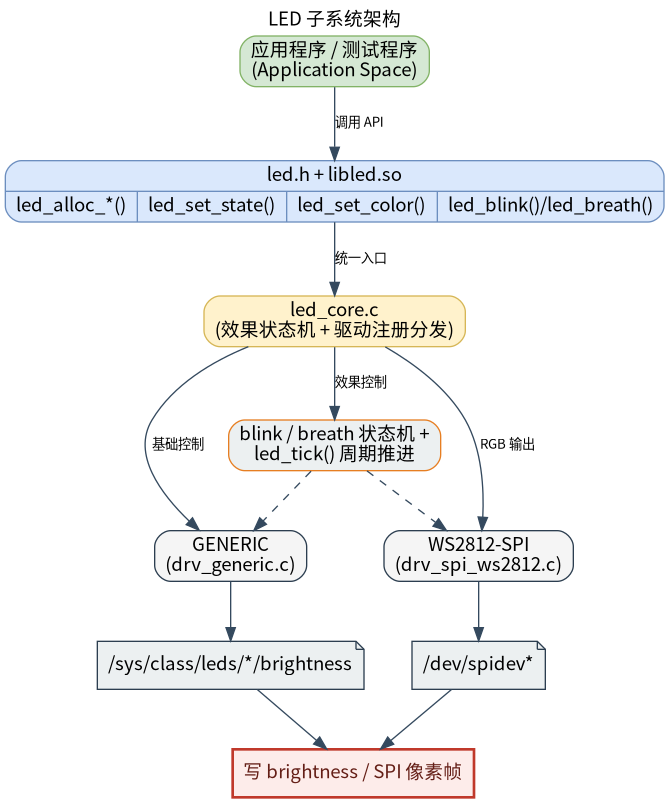

# 外设与驱动 · led

## 1. 模块概述
 
- 主要功能：`led` 模块位于 `
components/peripherals/led`，提供统一的用户态 LED 控制接口，用于控制普通 sysfs LED 指示灯和基于 SPI 的 WS2812/SK6812 RGB 灯带。模块通过驱动注册机制屏蔽底层差异，对上层暴露开关、亮度、颜色、闪烁和呼吸等通用操作。  
- 规格或特性：对外以 `led.h` + `libled.so` 形式提供 C 接口；默认只编入 `drv_generic` sysfs LED 驱动，如需 WS2812/SK6812 需要在 CMake 中显式启用 `drv_spi_ws2812`；sysfs 驱动写 `/sys/class/leds/<name>/brightness`，当前只写 `0/1`；WS2812 驱动写 `/dev/spidevX.Y`，默认 SPI 速率 `6400000 Hz`、默认复位填充 `80` 字节、默认灯珠数量 `1`，实际编码固定为 GRB 顺序；闪烁和呼吸效果依赖业务周期调用 `led_tick()`，推荐 10 Hz 到 50 Hz。  
- 软件框图：见下图。  



- 相关目录结构：  

| 路径 | 职责 |
| --- | --- |
| `
components/peripherals/led/include/led.h` | 对外公开颜色结构、闪烁参数和 LED 控制 API |
| `
components/peripherals/led/src/led_core.c` | 设备分配、驱动注册表、开关/亮度/颜色映射和效果状态机 |
| `
components/peripherals/led/src/led_core.h` | 内部设备对象、驱动虚表、驱动类型和注册宏 |
| `
components/peripherals/led/src/drivers/drv_generic.c` | sysfs LED 驱动，控制 `/sys/class/leds/<name>/brightness` |
| `
components/peripherals/led/src/drivers/drv_spi_ws2812.c` | SPI WS2812/SK6812 驱动，负责 GRB 编码和 spidev 传输 |
| `
components/peripherals/led/test/test_led_generic.c` | sysfs LED 演示程序，覆盖开关、切换、闪烁和呼吸 |
| `
components/peripherals/led/test/test_led_ws2812.c` | WS2812 SPI 演示程序，覆盖颜色、亮度、闪烁和呼吸 |
| `
components/peripherals/led/CMakeLists.txt` | 模块构建、驱动选择和测试目标定义 |

## 2. 环境准备

### 前置条件

- 运行环境：推荐板端环境 `k1-deb1` 配套系统镜像；构建环境需要 `gcc`、`make`、`cmake`；sysfs LED 路径需要内核 LED 子系统支持，WS2812 路径需要 spidev 支持。  
- 硬件与连接：普通 LED 需要在设备树中配置 `gpio-leds` 节点，并暴露到 `/sys/class/leds/`；WS2812/SK6812 灯带需要接到启用的 SPI 控制器，并确认供电、电平、GND 共地、灯珠数量和 SPI 频率满足硬件要求。

### 构建编译

- **获取代码**：详见 [2.3-配置编译](../../02-%E5%BF%AB%E9%80%9F%E5%85%A5%E9%97%A8/2.3-%E9%85%8D%E7%BD%AE%E7%BC%96%E8%AF%91.md#21-代码获取) 章节，使用 `repo` 工具克隆完整 SDK。

- **本模块编译**：
    - **方式 1：独立编译**
      ```bash
      cd components/peripherals/led
      mkdir build && cd build
      cmake .. -DBUILD_TESTS=ON -DSROBOTIS_PERIPHERALS_LED_ENABLED_DRIVERS="drv_generic;drv_spi_ws2812"
      make -j$(nproc)
      ```
    - **方式 2：SDK 集成编译 (推荐)**
      ```bash
      source build/envsetup.sh
      cd components/peripherals/led
      mm -DBUILD_TESTS=ON -DSROBOTIS_PERIPHERALS_LED_ENABLED_DRIVERS="drv_generic;drv_spi_ws2812"     # 仅编译本模块
      ```

- **产物名称**：`libled.so` 输出至 `build/`；启用 `BUILD_TESTS` 时同时生成 `test_led_generic` 和 `test_led_ws2812`。SDK 编译产物安装至系统 `output/staging/{lib,bin}` 路径。

- **说明**：默认只启用 `drv_generic`。如需 WS2812 SPI 驱动，请显式设置 `-DSROBOTIS_PERIPHERALS_LED_ENABLED_DRIVERS="drv_generic;drv_spi_ws2812"`，并注意分号参数需要整体加引号。

## 3. 示例使用（从 0 跑通）

本节为读者**按步骤复现**的主线：

### 3.1 【控制 WS2812 SPI 灯带】

**前置**：已确认 SPI 控制器启用，存在 `/dev/spidevX.Y`，灯带供电和信号连接正确。

**步骤 1**：构建时启用WS2812 SPI 驱动。  

```bash
cd components/peripherals/led
mkdir -p build
cd build
cmake .. -DBUILD_TESTS=ON -DSROBOTIS_PERIPHERALS_LED_ENABLED_DRIVERS="drv_spi_ws2812"
make -j$(nproc)
```

预期现象：`build/` 目录下生成 `libled.so` 和 `test_led_ws2812`。  

**步骤 2**：运行 WS2812 演示程序。  

```bash
cd components/peripherals/led
sudo ./build/test_led_ws2812 /dev/spidev0.0 23 grb 6400000 80
```

预期现象：终端打印 `LED WS2812 SPI Test`，并依次执行红、绿、蓝、关闭、闪烁和呼吸效果。当前驱动实际固定按 GRB 顺序编码，测试程序 usage 中的 `order` 参数只是占位，源码未把该参数传入驱动。  

## 4. 应用开发

### 4.1 最简使用流程

```c
static void run_ticks(struct led_dev *dev, uint32_t duration_ms, uint16_t tick_ms)
{
    uint32_t elapsed = 0;
    while (elapsed < duration_ms) {
        led_tick(dev, tick_ms);
        usleep(tick_ms * 1000U);
        elapsed += tick_ms;
    }
}

int main(void)
{
    struct led_sysfs_args {
        const char *sysfs_name;
        int active_level;
    } args = {
        .sysfs_name = "sys-led_1",
        .active_level = 0,
    };

    struct led_dev *dev = led_alloc_generic("sys-led_1", &args);
    if (!dev) {
        return -1;
    }

    led_set_state(dev, true);

    struct led_blink_param blink = {
        .period_ms = 1000,
        .on_ms = 200,
        .count = 5,
    };
    led_blink(dev, &blink);
    run_ticks(dev, 5500, 50);

    led_set_state(dev, false);
    led_free(dev);
    return 0;
}
```

### 4.2 主要 API 说明

**1. 设备创建与释放**
```c
// 创建 generic 或 SPI LED 设备
struct led_dev *led_alloc_generic(const char *name, void *args);
struct led_dev *led_alloc_spi(const char *name, void *args);

// 释放设备资源
void led_free(struct led_dev *dev);
```

**2. 基础控制**
```c
// 开关、翻转、亮度和颜色控制
void led_set_state(struct led_dev *dev, bool on);
void led_toggle(struct led_dev *dev);
void led_set_brightness(struct led_dev *dev, uint8_t brightness);
void led_set_color(struct led_dev *dev, const struct led_color *color);
```

**3. 效果控制**
```c
// 闪烁、呼吸和状态机推进
void led_blink(struct led_dev *dev, const struct led_blink_param *param);
void led_breath(struct led_dev *dev, uint16_t period_ms);
void led_tick(struct led_dev *dev, uint16_t dt_ms);
```

### 4.3 核心数据结构

**颜色结构体**
```c
struct led_color {
    uint8_t r;
    uint8_t g;
    uint8_t b;
};
```

**闪烁参数结构体**
```c
struct led_blink_param {
    uint16_t period_ms;
    uint16_t on_ms;
    uint8_t count;
};
```

**设备句柄**
```c
struct led_dev;
```

开发时需要注意：设备名支持 `驱动名:实例名` 形式，例如 `spi-ws2812:strip0`；`led_blink()` 和 `led_breath()` 只设置效果状态，必须由业务周期调用 `led_tick()` 推进效果；generic 驱动没有真正的 RGB 颜色接口，`led_set_color()` 会退化为亮灭控制；`led_alloc_generic()` 和 `led_alloc_spi()` 的 `args` 参数是驱动私有参数，当前布局请直接参考 demo 中的本地结构定义。

**参考 demo 或示例路径**
```text
components/peripherals/led/test/test_led_generic.c
components/peripherals/led/test/test_led_ws2812.c
components/peripherals/led/src/drivers/drv_generic.c
components/peripherals/led/src/drivers/drv_spi_ws2812.c
```

## 5. 调试指南
 
- 如果 sysfs LED 或 WS2812 创建失败，分别检查 `/sys/class/leds/<name>/brightness` 和 `/dev/spidevX.Y` 是否存在且具备访问权限。  
- 如果闪烁或呼吸效果没有变化，确认业务循环持续调用 `led_tick()`，且 `dt_ms` 非 0。  

## 6. 常见问题
- LED 亮灭和预期相反：优先检查 `active_level` 是否与硬件有效电平一致。  
- 在串口执行测试demo，会提示找不到设备，建议在ssh端口运行。
