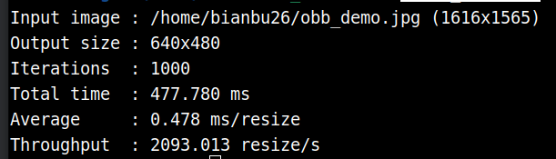
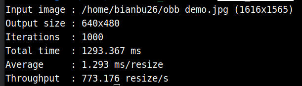
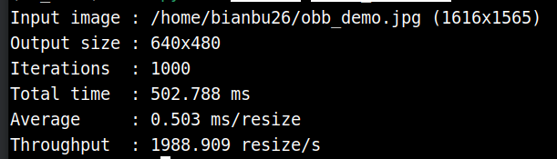

# OpenCV RVV

OpenCV 在 RVV（RISC-V Vector）上的使用与 x86 平台基本一致，主要是库的差异。

## 什么是OpenCV？

**OpenCV（Open Source Computer Vision Library）** 是一个开源的计算机视觉和机器学习软件库，由英特尔公司发起并得到社区的广泛支持。它提供了一个跨平台的编程框架，用于实时的计算机视觉应用开发。常用于:

- 图像处理和分析
- 人脸检测和识别
- 物体检测和跟踪
- 机器学习应用
- 视频分析
- 相机标定和 3D 重建

## C++使用

本节对比带 RVV 和不带 RVV的 resize 函数的性能表现

### 安装必要依赖

```
sudo apt install wget cmake gcc-15 g++-15
```

### 安装 opencv-spacemit

`opencv-spacemit` 包跟踪上游最新的RVV优化，提供在 SpacemiT riscv64 平台上的最佳性能

```
sudo apt update
sudo apt install opencv-spacemit
```

安装完成后终端打印：

```
==============================
How to use this custom OpenCV
==============================

Method 1: Specify OpenCV_DIR in CMakeLists.txt

    set(OpenCV_DIR "/opt/opencv-spacemit/lib/cmake/opencv4")
    find_package(OpenCV REQUIRED)

Method 2: Set CMAKE_PREFIX_PATH when running cmake

    cmake -DCMAKE_PREFIX_PATH=/opt/opencv-spacemit ..

================================
```


### **测试图片下载**

```
cd ~
wget https://archive.spacemit.com/spacemit-ai/BRDK/Model_Zoo/Datasets/test/obb_demo.jpg
```

### **项目结构**

```
➜  cv_test tree -L 2 .
.
├── CMakeLists.txt
└── src
    └── main.cpp # 测试程序
```

**main.cpp**

```
#include <opencv2/opencv.hpp>

#include <cstdlib>
#include <iomanip>
#include <iostream>
#include <string>

namespace {

void printUsage(const char* program) {
    std::cout << "Usage: " << program << " [image_path] [iterations] [width] [height]\n"
              << "Defaults:\n"
              << "  image_path : obb_demo.jpg\n"
              << "  iterations : 1000\n"
              << "  width      : 640\n"
              << "  height     : 480\n";
}

int parsePositiveInt(const char* value, const char* name) {
    char* end = nullptr;
    const long parsed = std::strtol(value, &end, 10);
    if (*value == '\0' || *end != '\0' || parsed <= 0) {
        std::cerr << "Invalid " << name << ": " << value << '\n';
        std::exit(1);
    }
    return static_cast<int>(parsed);
}

}  // namespace

int main(int argc, char** argv) {
    if (argc > 1 && (std::string(argv[1]) == "-h" || std::string(argv[1]) == "--help")) {
        printUsage(argv[0]);
        return 0;
    }

    const std::string imagePath = argc > 1 ? argv[1] : "obb_demo.jpg";
    const int iterations = argc > 2 ? parsePositiveInt(argv[2], "iterations") : 1000;
    const int targetWidth = argc > 3 ? parsePositiveInt(argv[3], "width") : 640;
    const int targetHeight = argc > 4 ? parsePositiveInt(argv[4], "height") : 480;

    if (argc > 5) {
        printUsage(argv[0]);
        return 1;
    }

    const cv::Mat input = cv::imread(imagePath, cv::IMREAD_COLOR);
    if (input.empty()) {
        std::cerr << "Failed to read image: " << imagePath << '\n';
        return 1;
    }

    cv::Mat output;
    const cv::Size targetSize(targetWidth, targetHeight);

    for (int i = 0; i < 10; ++i) {
        cv::resize(input, output, targetSize, 0.0, 0.0, cv::INTER_LINEAR);
    }

    const int64 start = cv::getTickCount();
    for (int i = 0; i < iterations; ++i) {
        cv::resize(input, output, targetSize, 0.0, 0.0, cv::INTER_LINEAR);
    }
    const int64 end = cv::getTickCount();

    const double totalMs = (end - start) * 1000.0 / cv::getTickFrequency();
    const double avgMs = totalMs / iterations;
    const double fps = 1000.0 / avgMs;

    std::cout << std::fixed << std::setprecision(3)
              << "Input image : " << imagePath << " (" << input.cols << "x" << input.rows << ")\n"
              << "Output size : " << targetWidth << "x" << targetHeight << '\n'
              << "Iterations  : " << iterations << '\n'
              << "Total time  : " << totalMs << " ms\n"
              << "Average     : " << avgMs << " ms/resize\n"
              << "Throughput  : " << fps << " resize/s\n";

    return 0;
}
```

**CMakeLists.txt**

```
cmake_minimum_required(VERSION 3.10)
project(opencv_resize_benchmark LANGUAGES CXX)

set(CMAKE_CXX_STANDARD 17)
set(CMAKE_CXX_STANDARD_REQUIRED ON)

find_package(OpenCV REQUIRED)

add_executable(resize_benchmark src/main.cpp)
target_link_libraries(resize_benchmark PRIVATE ${OpenCV_LIBS})
target_include_directories(resize_benchmark PRIVATE ${OpenCV_INCLUDE_DIRS})
```

本文顶层目录路径默认为 `~/cv_test`

### 带 RVV 编译测试

```
cd ~/cv_test
mkdir build && cd build
cmake -DCMAKE_PREFIX_PATH=/opt/opencv-spacemit ..
```

**终端打印如下：**

```
cmake -DCMAKE_PREFIX_PATH=/opt/opencv-spacemit ..
-- The CXX compiler identification is GNU 15.2.0
-- Detecting CXX compiler ABI info
-- Detecting CXX compiler ABI info - done
-- Check for working CXX compiler: /usr/bin/c++ - skipped
-- Detecting CXX compile features
-- Detecting CXX compile features - done
-- Found OpenCV: /opt/opencv-spacemit (found version "4.14.0")
-- Configuring done (0.6s)
-- Generating done (0.0s)
-- Build files have been written to: /home/bianbu26/cv_test/build
```

**编译：**

```
make
```

**开启测试：**

```
./resize_benchmark ~/obb_demo.jpg
```

**终端打印如下：**



### 不带 RVV 编译测试

**安装系统 OpenCV库**

```
sudo apt install libopencv-dev
```

测试完成后，如需恢复为优先使用 `opencv-spacemit` 的环境，可卸载系统 OpenCV：

```
sudo apt remove libopencv-dev
sudo apt autoremove
```

**配置**

```
cd ~/cv_test
rm -rf build
mkdir build && cd build
cmake ..
```

**终端打印**

```
cmake ..
-- The CXX compiler identification is GNU 15.2.0
-- Detecting CXX compiler ABI info
-- Detecting CXX compiler ABI info - done
-- Check for working CXX compiler: /usr/bin/c++ - skipped
-- Detecting CXX compile features
-- Detecting CXX compile features - done
-- Found OpenCV: /usr (found version "4.10.0")
-- Configuring done (0.6s)
-- Generating done (0.0s)
-- Build files have been written to: /home/bianbu26/cv_test/build
```

**编译**

```
make
```

**开启测试**

```
./resize_benchmark ~/obb_demo.jpg
```

**终端打印如下**



可以看出，RVV 加速的 OpenCV 库性能相比于系统自带的 OpenCV 库有明显提升（1.293ms -> 0.478ms）


## Python使用

### 安装必要依赖

```
sudo apt install python3-venv python3-pip
```

### 设置 SpacemiT 源

```
pip config set global.index-url https://mirrors.aliyun.com/pypi/simple/
pip config set global.extra-index-url https://git.spacemit.com/api/v4/projects/33/packages/pypi/simple
```

### 创建虚拟环境

```
python3 -m venv ~/cv_venv
```

### 安装 opencv-python

```
source ~/cv_venv/bin/activate
pip install opencv-python
```

终端打印

```
➜  ~ source ~/cv_venv/bin/activate
pip install opencv-python
Looking in indexes: https://mirrors.aliyun.com/pypi/simple/, https://git.spacemit.com/api/v4/projects/33/packages/pypi/simple
Collecting opencv-python
  Downloading https://git.spacemit.com/api/v4/projects/33/packages/pypi/files/21718d6ed9cc3558fa3cc3dde26496ff8739e58d5b7b1d4e7b4f7a34e8ca947c/opencv_python-4.13.0.92-cp39-abi3-linux_riscv64.whl (91.2 MB)
     ━━━━━━━━━━━━━━━━━━━━━━━━━━━━━━━━━━━━━━━━ 91.2/91.2 MB 588.5 kB/s eta 0:00:00
Collecting numpy>=2 (from opencv-python)
  Downloading https://git.spacemit.com/api/v4/projects/33/packages/pypi/files/6121ae6d6bbaf9b1f26d98af46100529679020759bbd1c1cb8d0f29fdf2ec941/numpy-2.4.6-cp314-cp314-manylinux_2_38_riscv64.manylinux_2_41_riscv64.whl (11.1 MB)
     ━━━━━━━━━━━━━━━━━━━━━━━━━━━━━━━━━━━━━━━━ 11.1/11.1 MB 657.3 kB/s eta 0:00:00
Installing collected packages: numpy, opencv-python
Successfully installed numpy-2.4.6 opencv-python-4.13.0.92
```

### 测试

测试代码：

main.py

```
import argparse
import sys
import time

import cv2


def positive_int(value: str) -> int:
    try:
        parsed = int(value)
    except ValueError:
        raise argparse.ArgumentTypeError(f"invalid positive int value: {value}")

    if parsed <= 0:
        raise argparse.ArgumentTypeError(f"invalid positive int value: {value}")
    return parsed


def parse_args() -> argparse.Namespace:
    parser = argparse.ArgumentParser(
        description="Benchmark OpenCV resize performance.",
        formatter_class=argparse.RawTextHelpFormatter,
    )
    parser.add_argument("image_path", nargs="?", default="obb_demo.jpg")
    parser.add_argument("iterations", nargs="?", type=positive_int, default=1000)
    parser.add_argument("width", nargs="?", type=positive_int, default=640)
    parser.add_argument("height", nargs="?", type=positive_int, default=480)
    return parser.parse_args()


def main() -> int:
    args = parse_args()

    input_image = cv2.imread(args.image_path, cv2.IMREAD_COLOR)
    if input_image is None:
        print(f"Failed to read image: {args.image_path}", file=sys.stderr)
        return 1

    target_size = (args.width, args.height)
    output_image = None

    for _ in range(10):
        output_image = cv2.resize(input_image, target_size, interpolation=cv2.INTER_LINEAR)

    start = time.perf_counter()
    for _ in range(args.iterations):
        output_image = cv2.resize(input_image, target_size, interpolation=cv2.INTER_LINEAR)
    end = time.perf_counter()

    if output_image is None:
        return 1

    total_ms = (end - start) * 1000.0
    avg_ms = total_ms / args.iterations
    fps = 1000.0 / avg_ms

    height, width = input_image.shape[:2]
    print(f"Input image : {args.image_path} ({width}x{height})")
    print(f"Output size : {args.width}x{args.height}")
    print(f"Iterations  : {args.iterations}")
    print(f"Total time  : {total_ms:.3f} ms")
    print(f"Average     : {avg_ms:.3f} ms/resize")
    print(f"Throughput  : {fps:.3f} resize/s")

    return 0


if __name__ == "__main__":
    raise SystemExit(main())
```

```
source ~/cv_venv/bin/activate
python main.py ~/obb_demo.jpg
```

结果如下：




## 更多OpenCV性能测试数据

### 单核对比

- 使用 OPENCV_FOR_THREADS_NUM=1 OMP_NUM_THREADS=1 OPENBLAS_NUM_THREADS=1 MKL_NUM_THREADS=1 taskset -c 7 限制线程和核数
- 计时策略是跑 100 次取平均值，预热10次
- no_rvv_avg_ms 表示的是系统 libopencv-dev 包的表现
- rvv_avg_ms 表示的是 opencv-spacemit 包的表现


| module | function | api | input_size | output_size | no_rvv_avg_ms | rvv_avg_ms | speedup |
| :-: | :-: | :-: | :-: | :-: | :--: | :--: | :--: |
| imgproc | resize_linear | `cv::resize(INTER_LINEAR)` | 1280x720 | 224x224 | 0.8742 | 0.4927 | 1.7743x |
| imgproc | resize_linear | `cv::resize(INTER_LINEAR)` | 1280x720 | 320x320 | 1.7556 | 1.0153 | 1.7291x |
| imgproc | resize_linear | `cv::resize(INTER_LINEAR)` | 1280x720 | 640x640 | 5.5175 | 3.7299 | 1.4793x |
| imgproc | resize_linear | `cv::resize(INTER_LINEAR)` | 1280x720 | 512x512 | 3.8247 | 2.4210 | 1.5798x |
| imgproc | resize_linear | `cv::resize(INTER_LINEAR)` | 1280x720 | 1024x1024 | 11.8105 | 9.4665 | 1.2476x |
| imgproc | resize_linear | `cv::resize(INTER_LINEAR)` | 1920x1080 | 224x224 | 0.9117 | 0.5334 | 1.7092x |
| imgproc | resize_linear | `cv::resize(INTER_LINEAR)` | 1920x1080 | 320x320 | 1.8685 | 1.1515 | 1.6227x |
| imgproc | resize_linear | `cv::resize(INTER_LINEAR)` | 1920x1080 | 640x640 | 6.5235 | 4.0568 | 1.6080x |
| imgproc | resize_linear | `cv::resize(INTER_LINEAR)` | 1920x1080 | 512x512 | 4.5591 | 2.8163 | 1.6188x |
| imgproc | resize_linear | `cv::resize(INTER_LINEAR)` | 1920x1080 | 1024x1024 | 14.2114 | 9.5484 | 1.4884x |
| imgproc | resize_linear | `cv::resize(INTER_LINEAR)` | 2560x1440 | 224x224 | 0.9762 | 0.6885 | 1.4179x |
| imgproc | resize_linear | `cv::resize(INTER_LINEAR)` | 2560x1440 | 320x320 | 1.9186 | 1.3032 | 1.4722x |
| imgproc | resize_linear | `cv::resize(INTER_LINEAR)` | 2560x1440 | 640x640 | 7.1410 | 4.5058 | 1.5848x |
| imgproc | resize_linear | `cv::resize(INTER_LINEAR)` | 2560x1440 | 512x512 | 4.6476 | 2.9959 | 1.5513x |
| imgproc | resize_linear | `cv::resize(INTER_LINEAR)` | 2560x1440 | 1024x1024 | 15.7861 | 9.8249 | 1.6067x |
| imgproc | resize_linear | `cv::resize(INTER_LINEAR)` | 3840x2160 | 224x224 | 1.1642 | 1.0324 | 1.1277x |
| imgproc | resize_linear | `cv::resize(INTER_LINEAR)` | 3840x2160 | 320x320 | 2.0680 | 1.6827 | 1.2290x |
| imgproc | resize_linear | `cv::resize(INTER_LINEAR)` | 3840x2160 | 640x640 | 7.2973 | 4.6838 | 1.5580x |
| imgproc | resize_linear | `cv::resize(INTER_LINEAR)` | 3840x2160 | 512x512 | 4.7658 | 3.2211 | 1.4796x |
| imgproc | resize_linear | `cv::resize(INTER_LINEAR)` | 3840x2160 | 1024x1024 | 18.5301 | 10.9281 | 1.6956x |
| imgproc | resize_linear | `cv::resize(INTER_LINEAR)` | 640x480 | 224x224 | 0.8616 | 0.4740 | 1.8177x |
| imgproc | resize_linear | `cv::resize(INTER_LINEAR)` | 640x480 | 320x320 | 1.5443 | 0.9449 | 1.6344x |
| imgproc | resize_linear | `cv::resize(INTER_LINEAR)` | 640x480 | 640x640 | 4.6122 | 3.6942 | 1.2485x |
| imgproc | resize_linear | `cv::resize(INTER_LINEAR)` | 640x480 | 512x512 | 3.3079 | 2.3730 | 1.3940x |
| imgproc | resize_linear | `cv::resize(INTER_LINEAR)` | 640x480 | 1024x1024 | 10.0030 | 9.4498 | 1.0585x |
| imgproc | cvtColor_bgr2rgb | `cv::cvtColor(COLOR_BGR2RGB)` | 224x224 | 224x224 | 0.0956 | 0.0165 | 5.7939x |
| imgproc | cvtColor_bgr2rgb | `cv::cvtColor(COLOR_BGR2RGB)` | 320x320 | 320x320 | 0.1944 | 0.0280 | 6.9429x |
| imgproc | cvtColor_bgr2rgb | `cv::cvtColor(COLOR_BGR2RGB)` | 640x640 | 640x640 | 0.7615 | 0.1061 | 7.1772x |
| imgproc | cvtColor_bgr2rgb | `cv::cvtColor(COLOR_BGR2RGB)` | 512x512 | 512x512 | 0.4897 | 0.0683 | 7.1698x |
| imgproc | cvtColor_bgr2rgb | `cv::cvtColor(COLOR_BGR2RGB)` | 1024x1024 | 1024x1024 | 1.9531 | 0.3598 | 5.4283x |
| imgproc | cvtColor_bgr2gray | `cv::cvtColor(COLOR_BGR2GRAY)` | 224x224 | 224x224 | 0.1119 | 0.0487 | 2.2977x |
| imgproc | cvtColor_bgr2gray | `cv::cvtColor(COLOR_BGR2GRAY)` | 320x320 | 320x320 | 0.2275 | 0.0911 | 2.4973x |
| imgproc | cvtColor_bgr2gray | `cv::cvtColor(COLOR_BGR2GRAY)` | 640x640 | 640x640 | 0.8893 | 0.3537 | 2.5143x |
| imgproc | cvtColor_bgr2gray | `cv::cvtColor(COLOR_BGR2GRAY)` | 512x512 | 512x512 | 0.5715 | 0.2277 | 2.5099x |
| imgproc | cvtColor_bgr2gray | `cv::cvtColor(COLOR_BGR2GRAY)` | 1024x1024 | 1024x1024 | 2.2687 | 0.9184 | 2.4703x |
| core | normalize_uint8_to_fp32 | `Mat::convertTo(CV_32FC3)` | 224x224 | 224x224 | 0.1562 | 0.0459 | 3.4031x |
| core | normalize_uint8_to_fp32 | `Mat::convertTo(CV_32FC3)` | 320x320 | 320x320 | 0.3212 | 0.0876 | 3.6667x |
| core | normalize_uint8_to_fp32 | `Mat::convertTo(CV_32FC3)` | 640x640 | 640x640 | 1.2323 | 0.3478 | 3.5431x |
| core | normalize_uint8_to_fp32 | `Mat::convertTo(CV_32FC3)` | 512x512 | 512x512 | 0.7879 | 0.2232 | 3.5300x |
| core | normalize_uint8_to_fp32 | `Mat::convertTo(CV_32FC3)` | 1024x1024 | 1024x1024 | 3.1761 | 0.9304 | 3.4137x |
| dnn | blobFromImage_bgr_fp32 | `cv::dnn::blobFromImage` | 224x224 | 1x3x224x224 | 0.8813 | 0.1660 | 5.3090x |
| dnn | blobFromImage_bgr_fp32 | `cv::dnn::blobFromImage` | 320x320 | 1x3x320x320 | 1.7852 | 0.3357 | 5.3178x |
| dnn | blobFromImage_bgr_fp32 | `cv::dnn::blobFromImage` | 640x640 | 1x3x640x640 | 7.3417 | 1.3883 | 5.2883x |
| dnn | blobFromImage_bgr_fp32 | `cv::dnn::blobFromImage` | 512x512 | 1x3x512x512 | 4.6450 | 0.8978 | 5.1738x |
| dnn | blobFromImage_bgr_fp32 | `cv::dnn::blobFromImage` | 1024x1024 | 1x3x1024x1024 | 35.3432 | 3.5119 | 10.0638x |
| core | mean_std_normalize | `cv::subtract + cv::divide` | 224x224 | 224x224 | 1.8795 | 1.8057 | 1.0409x |
| core | mean_std_normalize | `cv::subtract + cv::divide` | 320x320 | 320x320 | 3.8272 | 3.6704 | 1.0427x |
| core | mean_std_normalize | `cv::subtract + cv::divide` | 640x640 | 640x640 | 15.3598 | 14.7864 | 1.0388x |
| core | mean_std_normalize | `cv::subtract + cv::divide` | 512x512 | 512x512 | 9.8466 | 9.4438 | 1.0427x |
| core | mean_std_normalize | `cv::subtract + cv::divide` | 1024x1024 | 1024x1024 | 39.2297 | 37.8176 | 1.0373x |
| imgproc | gaussian_blur_3x3 | `cv::GaussianBlur(Size(3` | 224x224 | 224x224 | 0.6891 | 0.1476 | 4.6687x |
| imgproc | gaussian_blur_3x3 | `cv::GaussianBlur(Size(3` | 320x320 | 320x320 | 1.3929 | 0.2931 | 4.7523x |
| imgproc | gaussian_blur_3x3 | `cv::GaussianBlur(Size(3` | 640x640 | 640x640 | 5.5161 | 1.0480 | 5.2635x |
| imgproc | gaussian_blur_3x3 | `cv::GaussianBlur(Size(3` | 512x512 | 512x512 | 3.5383 | 0.7893 | 4.4828x |
| imgproc | gaussian_blur_3x3 | `cv::GaussianBlur(Size(3` | 1024x1024 | 1024x1024 | 14.1017 | 4.1439 | 3.4030x |
| core | copy_make_border_32 | `cv::copyMakeBorder(BORDER_CONSTANT)` | 224x224 | 288x288 | 0.0302 | 0.0219 | 1.3790x |
| core | copy_make_border_32 | `cv::copyMakeBorder(BORDER_CONSTANT)` | 320x320 | 384x384 | 0.0498 | 0.0373 | 1.3351x |
| core | copy_make_border_32 | `cv::copyMakeBorder(BORDER_CONSTANT)` | 640x640 | 704x704 | 0.1448 | 0.1187 | 1.2199x |
| core | copy_make_border_32 | `cv::copyMakeBorder(BORDER_CONSTANT)` | 512x512 | 576x576 | 0.1006 | 0.0802 | 1.2544x |
| core | copy_make_border_32 | `cv::copyMakeBorder(BORDER_CONSTANT)` | 1024x1024 | 1088x1088 | 0.4003 | 0.3729 | 1.0735x |
| core | split_channels | `cv::split` | 224x224 | 224x224 | 0.1056 | 0.0154 | 6.8571x |
| core | split_channels | `cv::split` | 320x320 | 320x320 | 0.2096 | 0.0265 | 7.9094x |
| core | split_channels | `cv::split` | 640x640 | 640x640 | 0.7822 | 0.0989 | 7.9090x |
| core | split_channels | `cv::split` | 512x512 | 512x512 | 0.5051 | 0.0639 | 7.9045x |
| core | split_channels | `cv::split` | 1024x1024 | 1024x1024 | 1.9977 | 0.3546 | 5.6337x |
| imgproc | threshold_otsu_gray | `cv::threshold(THRESH_OTSU)` | 224x224 | 224x224 | 0.2112 | 0.1309 | 1.6134x |
| imgproc | threshold_otsu_gray | `cv::threshold(THRESH_OTSU)` | 320x320 | 320x320 | 0.4248 | 0.2568 | 1.6542x |
| imgproc | threshold_otsu_gray | `cv::threshold(THRESH_OTSU)` | 640x640 | 640x640 | 1.6296 | 0.9885 | 1.6486x |
| imgproc | threshold_otsu_gray | `cv::threshold(THRESH_OTSU)` | 512x512 | 512x512 | 1.0522 | 0.6298 | 1.6707x |
| imgproc | threshold_otsu_gray | `cv::threshold(THRESH_OTSU)` | 1024x1024 | 1024x1024 | 4.1545 | 2.6075 | 1.5933x |
| core | addWeighted_segmentation_mask | `cv::addWeighted(mask overlay)` | 224x224 | 224x224 | 2.2849 | 0.1739 | 13.1392x |
| core | addWeighted_segmentation_mask | `cv::addWeighted(mask overlay)` | 320x320 | 320x320 | 4.6580 | 0.3523 | 13.2217x |
| core | addWeighted_segmentation_mask | `cv::addWeighted(mask overlay)` | 640x640 | 640x640 | 18.8223 | 1.4077 | 13.3710x |
| core | addWeighted_segmentation_mask | `cv::addWeighted(mask overlay)` | 512x512 | 512x512 | 12.0154 | 0.9013 | 13.3312x |
| core | addWeighted_segmentation_mask | `cv::addWeighted(mask overlay)` | 1024x1024 | 1024x1024 | 48.0701 | 3.6437 | 13.1927x |
| core | cartToPolar | `cv::cartToPolar` | 224x224 | 224x224 | 0.7694 | 0.2275 | 3.3820x |
| core | cartToPolar | `cv::cartToPolar` | 320x320 | 320x320 | 1.5677 | 0.4609 | 3.4014x |
| core | cartToPolar | `cv::cartToPolar` | 640x640 | 640x640 | 6.2492 | 1.8439 | 3.3891x |
| core | cartToPolar | `cv::cartToPolar` | 512x512 | 512x512 | 3.9960 | 1.1781 | 3.3919x |
| core | cartToPolar | `cv::cartToPolar` | 1024x1024 | 1024x1024 | 15.8954 | 4.7343 | 3.3575x |
| core | compare | `cv::compare(CMP_GT)` | 224x224 | 224x224 | 0.0517 | 0.0122 | 4.2377x |
| core | compare | `cv::compare(CMP_GT)` | 320x320 | 320x320 | 0.0968 | 0.0202 | 4.7921x |
| core | compare | `cv::compare(CMP_GT)` | 640x640 | 640x640 | 0.3740 | 0.0642 | 5.8255x |
| core | compare | `cv::compare(CMP_GT)` | 512x512 | 512x512 | 0.2408 | 0.0429 | 5.6131x |
| core | compare | `cv::compare(CMP_GT)` | 1024x1024 | 1024x1024 | 0.9486 | 0.1509 | 6.2863x |
| core | divide | `cv::divide(Scalar)` | 224x224 | 224x224 | 1.5925 | 1.6317 | 0.9760x |
| core | divide | `cv::divide(Scalar)` | 320x320 | 320x320 | 3.2487 | 3.3241 | 0.9773x |
| core | divide | `cv::divide(Scalar)` | 640x640 | 640x640 | 13.0132 | 13.3281 | 0.9764x |
| core | divide | `cv::divide(Scalar)` | 512x512 | 512x512 | 8.3188 | 8.5162 | 0.9768x |
| core | divide | `cv::divide(Scalar)` | 1024x1024 | 1024x1024 | 33.2666 | 34.0628 | 0.9766x |
| core | dot | `Mat::dot` | 224x224 | 1x1 | 0.2014 | 0.0347 | 5.8040x |
| core | dot | `Mat::dot` | 320x320 | 1x1 | 0.4110 | 0.0711 | 5.7806x |
| core | dot | `Mat::dot` | 640x640 | 1x1 | 1.6571 | 0.5697 | 2.9087x |
| core | dot | `Mat::dot` | 512x512 | 1x1 | 1.0530 | 0.2462 | 4.2770x |
| core | dot | `Mat::dot` | 1024x1024 | 1x1 | 4.2366 | 1.5042 | 2.8165x |
| core | dft | `cv::dft` | 224x224 | 224x224 | 1.0208 | 2.3128 | 0.4414x |
| core | dft | `cv::dft` | 320x320 | 320x320 | 1.7618 | 2.0457 | 0.8612x |
| core | dft | `cv::dft` | 640x640 | 640x640 | 7.8431 | 8.1615 | 0.9610x |
| core | dft | `cv::dft` | 512x512 | 512x512 | 4.7081 | 5.0837 | 0.9261x |
| core | dft | `cv::dft` | 1024x1024 | 1024x1024 | 35.0114 | 40.7955 | 0.8582x |
| core | exp | `cv::exp` | 224x224 | 224x224 | 3.5022 | 0.2809 | 12.4678x |
| core | exp | `cv::exp` | 320x320 | 320x320 | 7.1433 | 0.5707 | 12.5167x |
| core | exp | `cv::exp` | 640x640 | 640x640 | 28.5879 | 2.3018 | 12.4198x |
| core | exp | `cv::exp` | 512x512 | 512x512 | 18.2907 | 1.4683 | 12.4571x |
| core | exp | `cv::exp` | 1024x1024 | 1024x1024 | 73.1500 | 5.8740 | 12.4532x |
| core | flip_horizontal | `cv::flip(1)` | 224x224 | 224x224 | 0.1385 | 0.0225 | 6.1556x |
| core | flip_horizontal | `cv::flip(1)` | 320x320 | 320x320 | 0.2779 | 0.0345 | 8.0551x |
| core | flip_horizontal | `cv::flip(1)` | 640x640 | 640x640 | 1.0931 | 0.1331 | 8.2126x |
| core | flip_horizontal | `cv::flip(1)` | 512x512 | 512x512 | 0.7038 | 0.0857 | 8.2124x |
| core | flip_horizontal | `cv::flip(1)` | 1024x1024 | 1024x1024 | 2.8300 | 0.4153 | 6.8144x |
| core | LUT_invert | `cv::LUT` | 224x224 | 224x224 | 0.2077 | 0.0361 | 5.7535x |
| core | LUT_invert | `cv::LUT` | 320x320 | 320x320 | 0.4216 | 0.0731 | 5.7674x |
| core | LUT_invert | `cv::LUT` | 640x640 | 640x640 | 1.6924 | 0.2834 | 5.9718x |
| core | LUT_invert | `cv::LUT` | 512x512 | 512x512 | 1.0834 | 0.1820 | 5.9527x |
| core | LUT_invert | `cv::LUT` | 1024x1024 | 1024x1024 | 4.3393 | 0.7384 | 5.8766x |
| core | minMaxLoc | `cv::minMaxLoc` | 224x224 | 1x1 | 0.0921 | 0.0041 | 22.4634x |
| core | minMaxLoc | `cv::minMaxLoc` | 320x320 | 1x1 | 0.1879 | 0.0081 | 23.1975x |
| core | minMaxLoc | `cv::minMaxLoc` | 640x640 | 1x1 | 0.7472 | 0.0300 | 24.9067x |
| core | minMaxLoc | `cv::minMaxLoc` | 512x512 | 1x1 | 0.4793 | 0.0195 | 24.5795x |
| core | minMaxLoc | `cv::minMaxLoc` | 1024x1024 | 1x1 | 1.9131 | 0.0754 | 25.3727x |
| imgproc | remap_identity | `cv::remap(INTER_LINEAR)` | 224x224 | 224x224 | 2.1725 | 0.6094 | 3.5650x |
| imgproc | remap_identity | `cv::remap(INTER_LINEAR)` | 320x320 | 320x320 | 4.4258 | 1.2401 | 3.5689x |
| imgproc | remap_identity | `cv::remap(INTER_LINEAR)` | 640x640 | 640x640 | 17.7909 | 6.5314 | 2.7239x |
| imgproc | remap_identity | `cv::remap(INTER_LINEAR)` | 512x512 | 512x512 | 11.3623 | 3.3567 | 3.3850x |
| imgproc | remap_identity | `cv::remap(INTER_LINEAR)` | 1024x1024 | 1024x1024 | 45.5470 | 16.7297 | 2.7225x |
| core | transpose | `cv::transpose` | 224x224 | 224x224 | 0.0865 | 0.0647 | 1.3369x |
| core | transpose | `cv::transpose` | 320x320 | 320x320 | 0.1771 | 0.1349 | 1.3128x |
| core | transpose | `cv::transpose` | 640x640 | 640x640 | 1.0396 | 0.8684 | 1.1971x |
| core | transpose | `cv::transpose` | 512x512 | 512x512 | 0.7604 | 0.6568 | 1.1577x |
| core | transpose | `cv::transpose` | 1024x1024 | 1024x1024 | 5.0411 | 4.7557 | 1.0600x |
| imgproc | Canny | `cv::Canny` | 224x224 | 224x224 | 1.0812 | 0.6529 | 1.6560x |
| imgproc | Canny | `cv::Canny` | 320x320 | 320x320 | 1.9907 | 1.1120 | 1.7902x |
| imgproc | Canny | `cv::Canny` | 640x640 | 640x640 | 6.6657 | 3.0625 | 2.1766x |
| imgproc | Canny | `cv::Canny` | 512x512 | 512x512 | 4.4574 | 2.1652 | 2.0587x |
| imgproc | Canny | `cv::Canny` | 1024x1024 | 1024x1024 | 15.6314 | 6.4734 | 2.4147x |
| imgproc | erode_dilate | `cv::erode + cv::dilate` | 224x224 | 224x224 | 0.5417 | 0.1744 | 3.1061x |
| imgproc | erode_dilate | `cv::erode + cv::dilate` | 320x320 | 320x320 | 1.0222 | 0.2862 | 3.5716x |
| imgproc | erode_dilate | `cv::erode + cv::dilate` | 640x640 | 640x640 | 3.6923 | 0.7448 | 4.9574x |
| imgproc | erode_dilate | `cv::erode + cv::dilate` | 512x512 | 512x512 | 2.4159 | 0.5288 | 4.5686x |
| imgproc | erode_dilate | `cv::erode + cv::dilate` | 1024x1024 | 1024x1024 | 8.9698 | 2.2336 | 4.0158x |
| imgproc | pyrDown_pyrUp | `cv::pyrDown + cv::pyrUp` | 224x224 | 224x224 | 0.6036 | 0.4676 | 1.2908x |
| imgproc | pyrDown_pyrUp | `cv::pyrDown + cv::pyrUp` | 320x320 | 320x320 | 1.2193 | 0.8677 | 1.4052x |
| imgproc | pyrDown_pyrUp | `cv::pyrDown + cv::pyrUp` | 640x640 | 640x640 | 4.7939 | 3.4166 | 1.4031x |
| imgproc | pyrDown_pyrUp | `cv::pyrDown + cv::pyrUp` | 512x512 | 512x512 | 3.0798 | 2.1936 | 1.4040x |
| imgproc | pyrDown_pyrUp | `cv::pyrDown + cv::pyrUp` | 1024x1024 | 1024x1024 | 12.2247 | 8.7092 | 1.4037x |


### 八核对比

- 不限制线程数和核数
- 计时策略是跑 100 次取平均值，预热10次
- no_rvv_avg_ms 表示的是系统 libopencv-dev 包的表现
- rvv_avg_ms 表示的是 opencv-spacemit 包的表现

| module | function | api | input_size | output_size | no_rvv_avg_ms | rvv_avg_ms | speedup |
| :-: | :-: | :-: | :-: | :-: | :--: | :--: | :--: |
| imgproc | resize_linear | `cv::resize(INTER_LINEAR)` | 1280x720 | 224x224 | 0.8725 | 0.1081 | 8.0712x |
| imgproc | resize_linear | `cv::resize(INTER_LINEAR)` | 1280x720 | 320x320 | 0.9257 | 0.1826 | 5.0696x |
| imgproc | resize_linear | `cv::resize(INTER_LINEAR)` | 1280x720 | 640x640 | 1.0397 | 0.5110 | 2.0346x |
| imgproc | resize_linear | `cv::resize(INTER_LINEAR)` | 1280x720 | 512x512 | 1.0322 | 0.4255 | 2.4259x |
| imgproc | resize_linear | `cv::resize(INTER_LINEAR)` | 1280x720 | 1024x1024 | 1.7110 | 1.2817 | 1.3349x |
| imgproc | resize_linear | `cv::resize(INTER_LINEAR)` | 1920x1080 | 224x224 | 0.9079 | 0.1230 | 7.3813x |
| imgproc | resize_linear | `cv::resize(INTER_LINEAR)` | 1920x1080 | 320x320 | 0.9523 | 0.2013 | 4.7308x |
| imgproc | resize_linear | `cv::resize(INTER_LINEAR)` | 1920x1080 | 640x640 | 1.2041 | 0.5653 | 2.1300x |
| imgproc | resize_linear | `cv::resize(INTER_LINEAR)` | 1920x1080 | 512x512 | 1.2184 | 0.4141 | 2.9423x |
| imgproc | resize_linear | `cv::resize(INTER_LINEAR)` | 1920x1080 | 1024x1024 | 2.2713 | 1.3177 | 1.7237x |
| imgproc | resize_linear | `cv::resize(INTER_LINEAR)` | 2560x1440 | 224x224 | 0.9704 | 0.1516 | 6.4011x |
| imgproc | resize_linear | `cv::resize(INTER_LINEAR)` | 2560x1440 | 320x320 | 0.9757 | 0.2183 | 4.4695x |
| imgproc | resize_linear | `cv::resize(INTER_LINEAR)` | 2560x1440 | 640x640 | 1.3831 | 1.2363 | 1.1187x |
| imgproc | resize_linear | `cv::resize(INTER_LINEAR)` | 2560x1440 | 512x512 | 1.2882 | 0.7792 | 1.6532x |
| imgproc | resize_linear | `cv::resize(INTER_LINEAR)` | 2560x1440 | 1024x1024 | 2.3685 | 1.4875 | 1.5923x |
| imgproc | resize_linear | `cv::resize(INTER_LINEAR)` | 3840x2160 | 224x224 | 1.1752 | 0.2099 | 5.5989x |
| imgproc | resize_linear | `cv::resize(INTER_LINEAR)` | 3840x2160 | 320x320 | 1.1078 | 0.3085 | 3.5909x |
| imgproc | resize_linear | `cv::resize(INTER_LINEAR)` | 3840x2160 | 640x640 | 1.4702 | 1.0798 | 1.3615x |
| imgproc | resize_linear | `cv::resize(INTER_LINEAR)` | 3840x2160 | 512x512 | 1.3615 | 0.7537 | 1.8064x |
| imgproc | resize_linear | `cv::resize(INTER_LINEAR)` | 3840x2160 | 1024x1024 | 2.8575 | 1.8892 | 1.5125x |
| imgproc | resize_linear | `cv::resize(INTER_LINEAR)` | 640x480 | 224x224 | 0.8618 | 0.0911 | 9.4599x |
| imgproc | resize_linear | `cv::resize(INTER_LINEAR)` | 640x480 | 320x320 | 0.8084 | 0.1479 | 5.4659x |
| imgproc | resize_linear | `cv::resize(INTER_LINEAR)` | 640x480 | 640x640 | 0.8757 | 0.5049 | 1.7344x |
| imgproc | resize_linear | `cv::resize(INTER_LINEAR)` | 640x480 | 512x512 | 0.9078 | 0.3330 | 2.7261x |
| imgproc | resize_linear | `cv::resize(INTER_LINEAR)` | 640x480 | 1024x1024 | 1.4604 | 1.3587 | 1.0749x |
| imgproc | cvtColor_bgr2rgb | `cv::cvtColor(COLOR_BGR2RGB)` | 224x224 | 224x224 | 0.0957 | 0.0170 | 5.6294x |
| imgproc | cvtColor_bgr2rgb | `cv::cvtColor(COLOR_BGR2RGB)` | 320x320 | 320x320 | 0.1065 | 0.0285 | 3.7368x |
| imgproc | cvtColor_bgr2rgb | `cv::cvtColor(COLOR_BGR2RGB)` | 640x640 | 640x640 | 0.1611 | 0.1086 | 1.4834x |
| imgproc | cvtColor_bgr2rgb | `cv::cvtColor(COLOR_BGR2RGB)` | 512x512 | 512x512 | 0.1372 | 0.0685 | 2.0029x |
| imgproc | cvtColor_bgr2rgb | `cv::cvtColor(COLOR_BGR2RGB)` | 1024x1024 | 1024x1024 | 0.3892 | 0.4042 | 0.9629x |
| imgproc | cvtColor_bgr2gray | `cv::cvtColor(COLOR_BGR2GRAY)` | 224x224 | 224x224 | 0.1124 | 0.0310 | 3.6258x |
| imgproc | cvtColor_bgr2gray | `cv::cvtColor(COLOR_BGR2GRAY)` | 320x320 | 320x320 | 0.1210 | 0.0395 | 3.0633x |
| imgproc | cvtColor_bgr2gray | `cv::cvtColor(COLOR_BGR2GRAY)` | 640x640 | 640x640 | 0.1712 | 0.0756 | 2.2646x |
| imgproc | cvtColor_bgr2gray | `cv::cvtColor(COLOR_BGR2GRAY)` | 512x512 | 512x512 | 0.1553 | 0.0466 | 3.3326x |
| imgproc | cvtColor_bgr2gray | `cv::cvtColor(COLOR_BGR2GRAY)` | 1024x1024 | 1024x1024 | 0.4499 | 0.1528 | 2.9444x |
| core | normalize_uint8_to_fp32 | `Mat::convertTo(CV_32FC3)` | 224x224 | 224x224 | 0.1608 | 0.0465 | 3.4581x |
| core | normalize_uint8_to_fp32 | `Mat::convertTo(CV_32FC3)` | 320x320 | 320x320 | 0.3130 | 0.0884 | 3.5407x |
| core | normalize_uint8_to_fp32 | `Mat::convertTo(CV_32FC3)` | 640x640 | 640x640 | 1.2758 | 0.3500 | 3.6451x |
| core | normalize_uint8_to_fp32 | `Mat::convertTo(CV_32FC3)` | 512x512 | 512x512 | 0.8213 | 0.2256 | 3.6405x |
| core | normalize_uint8_to_fp32 | `Mat::convertTo(CV_32FC3)` | 1024x1024 | 1024x1024 | 3.0313 | 0.8945 | 3.3888x |
| dnn | blobFromImage_bgr_fp32 | `cv::dnn::blobFromImage` | 224x224 | 1x3x224x224 | 0.8829 | 0.1663 | 5.3091x |
| dnn | blobFromImage_bgr_fp32 | `cv::dnn::blobFromImage` | 320x320 | 1x3x320x320 | 1.7879 | 0.3361 | 5.3195x |
| dnn | blobFromImage_bgr_fp32 | `cv::dnn::blobFromImage` | 640x640 | 1x3x640x640 | 7.4718 | 1.3843 | 5.3975x |
| dnn | blobFromImage_bgr_fp32 | `cv::dnn::blobFromImage` | 512x512 | 1x3x512x512 | 4.6766 | 0.9020 | 5.1847x |
| dnn | blobFromImage_bgr_fp32 | `cv::dnn::blobFromImage` | 1024x1024 | 1x3x1024x1024 | 35.5356 | 3.5207 | 10.0933x |
| core | mean_std_normalize | `cv::subtract + cv::divide` | 224x224 | 224x224 | 1.8786 | 1.8028 | 1.0420x |
| core | mean_std_normalize | `cv::subtract + cv::divide` | 320x320 | 320x320 | 3.8291 | 3.6625 | 1.0455x |
| core | mean_std_normalize | `cv::subtract + cv::divide` | 640x640 | 640x640 | 15.6279 | 14.7644 | 1.0585x |
| core | mean_std_normalize | `cv::subtract + cv::divide` | 512x512 | 512x512 | 10.2764 | 9.4336 | 1.0893x |
| core | mean_std_normalize | `cv::subtract + cv::divide` | 1024x1024 | 1024x1024 | 39.5829 | 37.7746 | 1.0479x |
| imgproc | gaussian_blur_3x3 | `cv::GaussianBlur(Size(3` | 224x224 | 224x224 | 0.1167 | 0.0357 | 3.2689x |
| imgproc | gaussian_blur_3x3 | `cv::GaussianBlur(Size(3` | 320x320 | 320x320 | 0.2155 | 0.0710 | 3.0352x |
| imgproc | gaussian_blur_3x3 | `cv::GaussianBlur(Size(3` | 640x640 | 640x640 | 0.7413 | 0.2251 | 3.2932x |
| imgproc | gaussian_blur_3x3 | `cv::GaussianBlur(Size(3` | 512x512 | 512x512 | 0.9123 | 0.1678 | 5.4368x |
| imgproc | gaussian_blur_3x3 | `cv::GaussianBlur(Size(3` | 1024x1024 | 1024x1024 | 1.8435 | 1.0925 | 1.6874x |
| core | copy_make_border_32 | `cv::copyMakeBorder(BORDER_CONSTANT)` | 224x224 | 288x288 | 0.0303 | 0.0223 | 1.3587x |
| core | copy_make_border_32 | `cv::copyMakeBorder(BORDER_CONSTANT)` | 320x320 | 384x384 | 0.0496 | 0.0375 | 1.3227x |
| core | copy_make_border_32 | `cv::copyMakeBorder(BORDER_CONSTANT)` | 640x640 | 704x704 | 0.1484 | 0.1188 | 1.2492x |
| core | copy_make_border_32 | `cv::copyMakeBorder(BORDER_CONSTANT)` | 512x512 | 576x576 | 0.1002 | 0.0806 | 1.2432x |
| core | copy_make_border_32 | `cv::copyMakeBorder(BORDER_CONSTANT)` | 1024x1024 | 1088x1088 | 0.4016 | 0.3486 | 1.1520x |
| core | split_channels | `cv::split` | 224x224 | 224x224 | 0.0981 | 0.0154 | 6.3701x |
| core | split_channels | `cv::split` | 320x320 | 320x320 | 0.1966 | 0.0274 | 7.1752x |
| core | split_channels | `cv::split` | 640x640 | 640x640 | 0.7809 | 0.0977 | 7.9928x |
| core | split_channels | `cv::split` | 512x512 | 512x512 | 0.5008 | 0.0628 | 7.9745x |
| core | split_channels | `cv::split` | 1024x1024 | 1024x1024 | 1.9996 | 0.3540 | 5.6486x |
| imgproc | threshold_otsu_gray | `cv::threshold(THRESH_OTSU)` | 224x224 | 224x224 | 0.2115 | 0.0697 | 3.0344x |
| imgproc | threshold_otsu_gray | `cv::threshold(THRESH_OTSU)` | 320x320 | 320x320 | 0.2892 | 0.0905 | 3.1956x |
| imgproc | threshold_otsu_gray | `cv::threshold(THRESH_OTSU)` | 640x640 | 640x640 | 0.6844 | 0.2053 | 3.3337x |
| imgproc | threshold_otsu_gray | `cv::threshold(THRESH_OTSU)` | 512x512 | 512x512 | 0.5092 | 0.1409 | 3.6139x |
| imgproc | threshold_otsu_gray | `cv::threshold(THRESH_OTSU)` | 1024x1024 | 1024x1024 | 1.5612 | 0.5983 | 2.6094x |
| core | addWeighted_segmentation_mask | `cv::addWeighted(mask overlay)` | 224x224 | 224x224 | 2.3038 | 0.1759 | 13.0972x |
| core | addWeighted_segmentation_mask | `cv::addWeighted(mask overlay)` | 320x320 | 320x320 | 4.6996 | 0.3544 | 13.2607x |
| core | addWeighted_segmentation_mask | `cv::addWeighted(mask overlay)` | 640x640 | 640x640 | 18.7963 | 1.4091 | 13.3392x |
| core | addWeighted_segmentation_mask | `cv::addWeighted(mask overlay)` | 512x512 | 512x512 | 12.0276 | 0.9007 | 13.3536x |
| core | addWeighted_segmentation_mask | `cv::addWeighted(mask overlay)` | 1024x1024 | 1024x1024 | 48.1972 | 3.6353 | 13.2581x |
| core | cartToPolar | `cv::cartToPolar` | 224x224 | 224x224 | 0.7703 | 0.2276 | 3.3844x |
| core | cartToPolar | `cv::cartToPolar` | 320x320 | 320x320 | 1.5760 | 0.4614 | 3.4157x |
| core | cartToPolar | `cv::cartToPolar` | 640x640 | 640x640 | 6.3527 | 1.8492 | 3.4354x |
| core | cartToPolar | `cv::cartToPolar` | 512x512 | 512x512 | 4.1158 | 1.1776 | 3.4951x |
| core | cartToPolar | `cv::cartToPolar` | 1024x1024 | 1024x1024 | 16.0252 | 4.7353 | 3.3842x |
| core | compare | `cv::compare(CMP_GT)` | 224x224 | 224x224 | 0.0514 | 0.0123 | 4.1789x |
| core | compare | `cv::compare(CMP_GT)` | 320x320 | 320x320 | 0.0966 | 0.0201 | 4.8060x |
| core | compare | `cv::compare(CMP_GT)` | 640x640 | 640x640 | 0.3733 | 0.0621 | 6.0113x |
| core | compare | `cv::compare(CMP_GT)` | 512x512 | 512x512 | 0.2401 | 0.0415 | 5.7855x |
| core | compare | `cv::compare(CMP_GT)` | 1024x1024 | 1024x1024 | 0.9441 | 0.1491 | 6.3320x |
| core | divide | `cv::divide(Scalar)` | 224x224 | 224x224 | 1.5929 | 1.6311 | 0.9766x |
| core | divide | `cv::divide(Scalar)` | 320x320 | 320x320 | 3.2471 | 3.3224 | 0.9773x |
| core | divide | `cv::divide(Scalar)` | 640x640 | 640x640 | 13.0019 | 13.3133 | 0.9766x |
| core | divide | `cv::divide(Scalar)` | 512x512 | 512x512 | 8.3138 | 8.5093 | 0.9770x |
| core | divide | `cv::divide(Scalar)` | 1024x1024 | 1024x1024 | 33.3617 | 34.0391 | 0.9801x |
| core | dot | `Mat::dot` | 224x224 | 1x1 | 0.2032 | 0.0356 | 5.7079x |
| core | dot | `Mat::dot` | 320x320 | 1x1 | 0.4119 | 0.0710 | 5.8014x |
| core | dot | `Mat::dot` | 640x640 | 1x1 | 1.6660 | 0.6130 | 2.7178x |
| core | dot | `Mat::dot` | 512x512 | 1x1 | 1.0615 | 0.2744 | 3.8684x |
| core | dot | `Mat::dot` | 1024x1024 | 1x1 | 4.2606 | 1.6210 | 2.6284x |
| core | dft | `cv::dft` | 224x224 | 224x224 | 1.0249 | 2.3067 | 0.4443x |
| core | dft | `cv::dft` | 320x320 | 320x320 | 1.7625 | 2.0284 | 0.8689x |
| core | dft | `cv::dft` | 640x640 | 640x640 | 7.8298 | 8.0986 | 0.9668x |
| core | dft | `cv::dft` | 512x512 | 512x512 | 4.7497 | 5.0603 | 0.9386x |
| core | dft | `cv::dft` | 1024x1024 | 1024x1024 | 32.9397 | 42.4881 | 0.7753x |
| core | exp | `cv::exp` | 224x224 | 224x224 | 3.5000 | 0.2806 | 12.4733x |
| core | exp | `cv::exp` | 320x320 | 320x320 | 7.1405 | 0.5709 | 12.5074x |
| core | exp | `cv::exp` | 640x640 | 640x640 | 28.5876 | 2.3021 | 12.4181x |
| core | exp | `cv::exp` | 512x512 | 512x512 | 18.2888 | 1.4667 | 12.4694x |
| core | exp | `cv::exp` | 1024x1024 | 1024x1024 | 73.1620 | 5.8793 | 12.4440x |
| core | flip_horizontal | `cv::flip(1)` | 224x224 | 224x224 | 0.1373 | 0.0221 | 6.2127x |
| core | flip_horizontal | `cv::flip(1)` | 320x320 | 320x320 | 0.2778 | 0.0344 | 8.0756x |
| core | flip_horizontal | `cv::flip(1)` | 640x640 | 640x640 | 1.0956 | 0.1342 | 8.1639x |
| core | flip_horizontal | `cv::flip(1)` | 512x512 | 512x512 | 0.7046 | 0.0859 | 8.2026x |
| core | flip_horizontal | `cv::flip(1)` | 1024x1024 | 1024x1024 | 2.8236 | 0.4305 | 6.5589x |
| core | LUT_invert | `cv::LUT` | 224x224 | 224x224 | 0.2081 | 0.0361 | 5.7645x |
| core | LUT_invert | `cv::LUT` | 320x320 | 320x320 | 0.4214 | 0.0372 | 11.3280x |
| core | LUT_invert | `cv::LUT` | 640x640 | 640x640 | 0.3100 | 0.0816 | 3.7990x |
| core | LUT_invert | `cv::LUT` | 512x512 | 512x512 | 0.2877 | 0.0595 | 4.8353x |
| core | LUT_invert | `cv::LUT` | 1024x1024 | 1024x1024 | 0.6399 | 0.1755 | 3.6462x |
| core | minMaxLoc | `cv::minMaxLoc` | 224x224 | 1x1 | 0.0923 | 0.0042 | 21.9762x |
| core | minMaxLoc | `cv::minMaxLoc` | 320x320 | 1x1 | 0.1888 | 0.0084 | 22.4762x |
| core | minMaxLoc | `cv::minMaxLoc` | 640x640 | 1x1 | 0.7480 | 0.0303 | 24.6865x |
| core | minMaxLoc | `cv::minMaxLoc` | 512x512 | 1x1 | 0.4793 | 0.0197 | 24.3299x |
| core | minMaxLoc | `cv::minMaxLoc` | 1024x1024 | 1x1 | 1.9119 | 0.0757 | 25.2563x |
| imgproc | remap_identity | `cv::remap(INTER_LINEAR)` | 224x224 | 224x224 | 2.1189 | 0.3691 | 5.7407x |
| imgproc | remap_identity | `cv::remap(INTER_LINEAR)` | 320x320 | 320x320 | 2.1759 | 0.5212 | 4.1748x |
| imgproc | remap_identity | `cv::remap(INTER_LINEAR)` | 640x640 | 640x640 | 3.0862 | 1.0133 | 3.0457x |
| imgproc | remap_identity | `cv::remap(INTER_LINEAR)` | 512x512 | 512x512 | 2.8669 | 0.6035 | 4.7505x |
| imgproc | remap_identity | `cv::remap(INTER_LINEAR)` | 1024x1024 | 1024x1024 | 6.1271 | 2.3530 | 2.6040x |
| core | transpose | `cv::transpose` | 224x224 | 224x224 | 0.0867 | 0.0652 | 1.3298x |
| core | transpose | `cv::transpose` | 320x320 | 320x320 | 0.1763 | 0.1345 | 1.3108x |
| core | transpose | `cv::transpose` | 640x640 | 640x640 | 1.0095 | 0.8645 | 1.1677x |
| core | transpose | `cv::transpose` | 512x512 | 512x512 | 0.7859 | 0.6602 | 1.1904x |
| core | transpose | `cv::transpose` | 1024x1024 | 1024x1024 | 5.0581 | 4.6902 | 1.0784x |
| imgproc | Canny | `cv::Canny` | 224x224 | 224x224 | 0.3560 | 0.2436 | 1.4614x |
| imgproc | Canny | `cv::Canny` | 320x320 | 320x320 | 0.5887 | 0.4115 | 1.4306x |
| imgproc | Canny | `cv::Canny` | 640x640 | 640x640 | 1.4790 | 1.1927 | 1.2400x |
| imgproc | Canny | `cv::Canny` | 512x512 | 512x512 | 1.0579 | 0.8249 | 1.2825x |
| imgproc | Canny | `cv::Canny` | 1024x1024 | 1024x1024 | 3.2367 | 2.4633 | 1.3140x |
| imgproc | erode_dilate | `cv::erode + cv::dilate` | 224x224 | 224x224 | 0.5410 | 0.0708 | 7.6412x |
| imgproc | erode_dilate | `cv::erode + cv::dilate` | 320x320 | 320x320 | 1.0229 | 0.1043 | 9.8073x |
| imgproc | erode_dilate | `cv::erode + cv::dilate` | 640x640 | 640x640 | 3.6897 | 0.2643 | 13.9603x |
| imgproc | erode_dilate | `cv::erode + cv::dilate` | 512x512 | 512x512 | 2.4183 | 0.2005 | 12.0613x |
| imgproc | erode_dilate | `cv::erode + cv::dilate` | 1024x1024 | 1024x1024 | 8.9730 | 0.6168 | 14.5477x |
| imgproc | pyrDown_pyrUp | `cv::pyrDown + cv::pyrUp` | 224x224 | 224x224 | 0.4020 | 0.2386 | 1.6848x |
| imgproc | pyrDown_pyrUp | `cv::pyrDown + cv::pyrUp` | 320x320 | 320x320 | 0.7846 | 0.4526 | 1.7335x |
| imgproc | pyrDown_pyrUp | `cv::pyrDown + cv::pyrUp` | 640x640 | 640x640 | 2.9932 | 1.7714 | 1.6897x |
| imgproc | pyrDown_pyrUp | `cv::pyrDown + cv::pyrUp` | 512x512 | 512x512 | 2.0003 | 1.1914 | 1.6789x |
| imgproc | pyrDown_pyrUp | `cv::pyrDown + cv::pyrUp` | 1024x1024 | 1024x1024 | 7.7747 | 4.4134 | 1.7616x |
