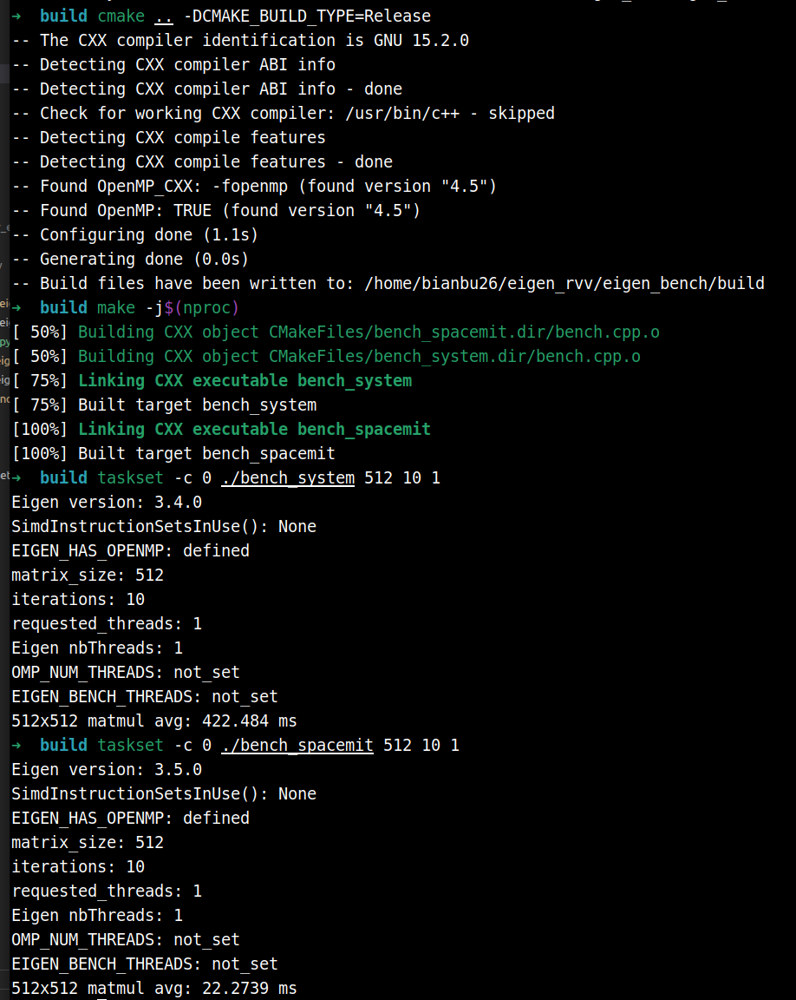
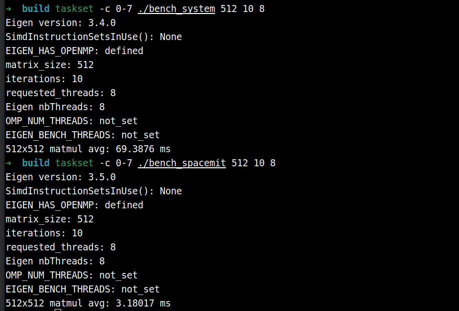
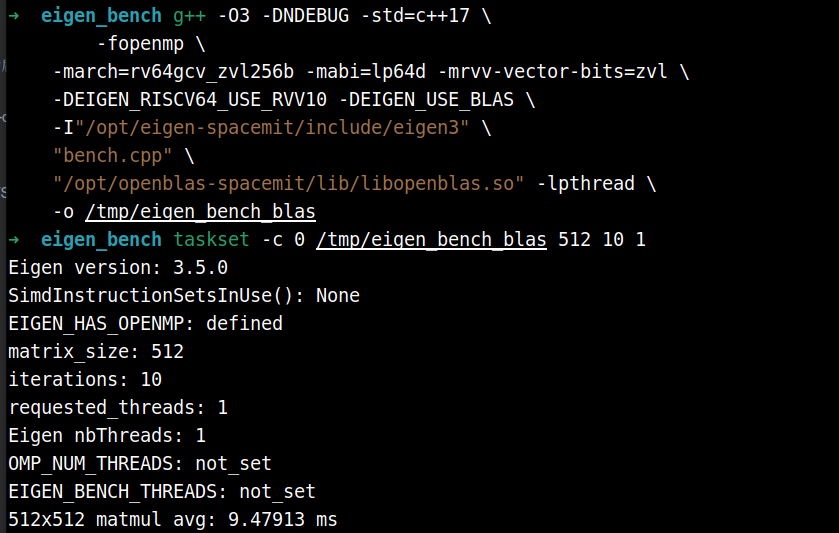
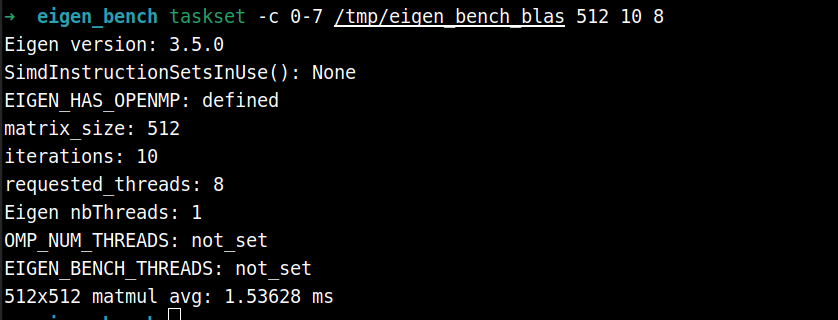

# Eigen RVV

## Eigen 简介

[Eigen](https://eigen.tuxfamily.org) 是一个高性能的 C++ 模板库，专用于线性代数运算，涵盖矩阵、向量、数值求解及相关算法。它被广泛应用于机器人、计算机视觉、数值仿真等领域，是 ROS、OpenCV、PCL 等主流框架的核心依赖之一。

**主要特点：**

- **纯头文件**：无需编译，直接 `#include` 即可使用
- **高性能**：通过表达式模板（expression templates）消除临时变量，自动向量化（SIMD）
- **功能丰富**：支持稠密矩阵、稀疏矩阵、几何变换（旋转矩阵、四元数）、线性求解器等
- **跨平台**：支持 x86、ARM、RISC-V 等主流架构

## RVV 加速

RVV（RISC-V Vector Extension）是 RISC-V 架构的向量扩展指令集，可对矩阵运算进行 SIMD 加速。K3 搭载的 SpacemiT X100 + A100 16 核处理器原生支持 RVV 1.0（含 `zve64d`、`zvfh` 等向量子扩展）。

针对 K3 平台，我们提供了专为 RVV 优化的定制 Eigen 库 `eigen-spacemit`，相比系统默认的 Eigen 有显著差异：

| 对比项 | 系统 Eigen（`libeigen3-dev`） | eigen-spacemit |
|:-:|:-:|:-:|
| 安装路径 | `/usr/include/eigen3` | `/opt/eigen-spacemit` |
| RVV 加速 | 未启用 | 针对 RVV 1.0 优化 |
| 适用平台 | 通用（x86/ARM/RISC-V） | 专为 SpacemiT X100 定制 |
| 安装方式 | `apt install libeigen3-dev` | `apt install eigen-spacemit` |

在 K3 上进行高性能线性代数运算（如点云处理、SLAM、卡尔曼滤波）时，推荐优先使用 `eigen-spacemit` 以充分发挥 RVV 硬件能力。

## 使用示例

以下示例对比系统 Eigen 与 `eigen-spacemit` 在 512×512 矩阵乘法上的性能差异。

**安装必要依赖**

```
sudo apt update
sudo apt install eigen-spacemit libeigen3-dev
```

**目录结构：**

```
eigen_bench/
├── CMakeLists.txt
└── bench.cpp
```

**CMakeLists.txt：**

```cmake
cmake_minimum_required(VERSION 3.16)
project(eigen_bench LANGUAGES CXX)

# OpenMP 让 Eigen 支持的单个算子（主要是大矩阵乘法）可以使用多线程。
option(EIGEN_BENCH_ENABLE_OPENMP "Enable OpenMP so Eigen can parallelize supported operators" ON)

# RVV 编译参数用于 g++ 14 及以下；g++ 15 当前会跳过 -march/-mabi，避免不兼容。
set(RVV_MARCH "rv64gcv_zvl256b" CACHE STRING "RISC-V architecture flags for RVV builds")
set(RVV_MABI  "lp64d"           CACHE STRING "RISC-V ABI flags for RVV builds")

if(EIGEN_BENCH_ENABLE_OPENMP)
  find_package(OpenMP)
endif()

set(RVV_ARCH_FLAGS "")
if(CMAKE_CXX_COMPILER_ID STREQUAL "GNU")
  string(REGEX MATCH "^[0-9]+" GXX_MAJOR "${CMAKE_CXX_COMPILER_VERSION}")
  if(GXX_MAJOR VERSION_LESS_EQUAL "14")
    list(APPEND RVV_ARCH_FLAGS -march=${RVV_MARCH} -mabi=${RVV_MABI})
  endif()
endif()

# 统一创建 benchmark 目标：传入不同 Eigen include 路径即可对比不同实现。
function(add_bench target eigen_include)
  add_executable(${target} bench.cpp)
  target_include_directories(${target} PRIVATE "${eigen_include}")
  target_compile_options(${target} PRIVATE -O3 -DNDEBUG -std=c++17)
  if(EIGEN_BENCH_ENABLE_OPENMP AND OpenMP_CXX_FOUND)
    target_link_libraries(${target} PRIVATE OpenMP::OpenMP_CXX)
  endif()
endfunction()

# SpacemiT Eigen（RVV 加速）
add_bench(bench_spacemit /opt/eigen-spacemit/include/eigen3)
target_compile_options(bench_spacemit PRIVATE ${RVV_ARCH_FLAGS} -mrvv-vector-bits=zvl)
target_compile_definitions(bench_spacemit PRIVATE EIGEN_RISCV64_USE_RVV10)

# 系统 Eigen（无 RVV）
add_bench(bench_system /usr/include/eigen3)
```

**bench.cpp：**

```cpp
#include <Eigen/Dense>
#include <chrono>
#include <cstdlib>
#include <iostream>
#include <stdexcept>
#include <string>

namespace {

int parsePositiveInt(const char* value, const std::string& name) {
    const int parsed = std::stoi(value);
    if (parsed <= 0) {
        throw std::runtime_error(name + " must be positive");
    }
    return parsed;
}

std::string envOrUnset(const char* name) {
    const char* value = std::getenv(name);
    return value ? value : "not_set";
}

}  // namespace

int main(int argc, char** argv) {
    try {
    const int N = argc > 1 ? parsePositiveInt(argv[1], "matrix_size") : 512;
    const int iters = argc > 2 ? parsePositiveInt(argv[2], "iterations") : 10;
    const char* threads_env = std::getenv("EIGEN_BENCH_THREADS");
    const int threads = argc > 3 ? parsePositiveInt(argv[3], "threads") : (threads_env ? parsePositiveInt(threads_env, "EIGEN_BENCH_THREADS") : 8);
    Eigen::setNbThreads(threads);

    Eigen::MatrixXf A = Eigen::MatrixXf::Random(N, N);
    Eigen::MatrixXf B = Eigen::MatrixXf::Random(N, N);
    Eigen::MatrixXf C(N, N);

    C.noalias() = A * B; // warmup

    auto t0 = std::chrono::high_resolution_clock::now();
    for (int i = 0; i < iters; ++i)
        C.noalias() = A * B;
    auto t1 = std::chrono::high_resolution_clock::now();

    double ms = std::chrono::duration<double, std::milli>(t1 - t0).count() / iters;
    std::cout << "Eigen version: " << EIGEN_WORLD_VERSION << '.' << EIGEN_MAJOR_VERSION << '.' << EIGEN_MINOR_VERSION << '\n';
    std::cout << "SimdInstructionSetsInUse(): " << Eigen::SimdInstructionSetsInUse() << '\n';
#ifdef EIGEN_HAS_OPENMP
    std::cout << "EIGEN_HAS_OPENMP: defined\n";
#else
    std::cout << "EIGEN_HAS_OPENMP: not_defined\n";
#endif
    std::cout << "matrix_size: " << N << '\n';
    std::cout << "iterations: " << iters << '\n';
    std::cout << "requested_threads: " << threads << '\n';
    std::cout << "Eigen nbThreads: " << Eigen::nbThreads() << '\n';
    std::cout << "OMP_NUM_THREADS: " << envOrUnset("OMP_NUM_THREADS") << '\n';
    std::cout << "EIGEN_BENCH_THREADS: " << envOrUnset("EIGEN_BENCH_THREADS") << '\n';
    std::cout << N << "x" << N << " matmul avg: " << ms << " ms\n";
    return 0;
    } catch (const std::exception& error) {
        std::cerr << "error: " << error.what() << '\n';
        return 1;
    }
}
```

**编译与运行：**

```bash
mkdir build && cd build
cmake .. -DCMAKE_BUILD_TYPE=Release
make -j$(nproc)

./bench_system    # 系统 Eigen
./bench_spacemit  # SpacemiT Eigen（RVV）
```

**单核对比**



可以看出，RVV加速后的矩阵乘法性能有明显提升（423ms -> 23ms）

**八核对比**




## 使用 openblas-spacemit 作为后端

Eigen 默认使用自身的模板实现完成矩阵运算，而 [OpenBLAS](https://www.openblas.net/) 是一个经过高度优化的 BLAS（Basic Linear Algebra Subprograms）数值库。通过在编译时添加 `-DEIGEN_USE_BLAS` 宏，Eigen 会将底层的矩阵乘法（`gemm`）等关键运算委托给 OpenBLAS 执行，从而利用其针对特定硬件深度调优的实现。

`openblas-spacemit` 是专为 SpacemiT K3 平台定制的 OpenBLAS 版本，充分利用了 RVV 1.0 向量扩展及平台特性。与单独使用 `eigen-spacemit`（RVV 向量化）相比，通过 `openblas-spacemit` 后端可以进一步将大规模矩阵乘法性能提升。

**安装必要依赖**

```
sudo apt install openblas-spacemit
```

**编译与运行**

仍使用上一节的bench.cpp

```
export LD_LIBRARY_PATH=/opt/openblas-spacemit/lib:$LD_LIBRARY_PATH
g++ -O3 -DNDEBUG -std=c++17 \
	-fopenmp \
    -march=rv64gcv_zvl256b -mabi=lp64d -mrvv-vector-bits=zvl \
    -DEIGEN_RISCV64_USE_RVV10 -DEIGEN_USE_BLAS \
    -I"/opt/eigen-spacemit/include/eigen3" \
    "bench.cpp" \
    "/opt/openblas-spacemit/lib/libopenblas.so" -lpthread \
    -o /tmp/eigen_bench_blas
```

```
/tmp/eigen_bench_blas
```

**单核性能：**



使用 openblas-spacemit 作为 eigen 后端，矩阵乘法的性能还有进一步的提升（23ms -> 9.48 ms）

**八核性能：**




## 更多性能测试数据

**测试环境**

- SpacemiT RISCV64 X100 CPU（2.4Ghz）
- Bianbu 4.0.1 操作系统
- 内存：32GB

**多核测试说明**

- 多核测试编译需要 `target_link_libraries(${target_name} PRIVATE OpenMP::OpenMP_CXX)`
- 多核测试代码需要 `Eigen::setNbThreads(threads)`，`threads` 建议与测试时限制的核数一致
- 以下测试 `threads` 与核数均取一致

**性能下降情况说明**

后续表格中 `speedup` 小于 1 或 `improvement` 为负数表示对比方案性能低于基准方案。需要注意的是，这类结果主要集中在以下几类场景：

- **极小规模几何运算**：如 `Quaternion::inverse()`、`Quaternion::normalize()`、`Quaternion::toRotationMatrix()`、`cross()` 等输入规模仅为 3x1 或 3x3，单次耗时约 0.0001 ms，已经接近计时分辨率与函数调用开销，少量负收益更多体现为测试抖动或额外分支/向量化开销，不代表大规模计算性能退化。
- **低计算密度或访存主导算子**：如 `trace()`、部分 `Identity()`、`block()`、`transpose()`、`rowwise().sum()` 等，计算量较小或内存访问占主导，RVV/BLAS 后端的调度、打包、线程同步等开销可能抵消向量化收益。
- **使用 BLAS 后端时的非 GEMM 算子**：`EIGEN_USE_BLAS` 主要加速大矩阵乘法等 BLAS Level-3 操作；对于大量数组逐元素运算、标量运算、归约或小矩阵操作，调用 BLAS 后端并不会带来直接收益，部分场景会出现 1%～3% 左右的小幅下降，通常属于开销差异或测试波动。
- **多核小算子并行开销**：在四核、八核测试中，部分单次计算量较小的算子会受到线程调度、同步和缓存竞争影响，出现比单核更明显的负收益。例如 BLAS 后端对比中，`matrix_gemv`、`matrix_identity` 等在多核下存在下降，但大矩阵乘法仍保持显著提升。

因此，性能下降项应结合算子类型、输入规模与标准差一起判断。实际应用中，建议优先将 `eigen-spacemit` 或 `openblas-spacemit` 用于矩阵乘法、矩阵分解、求逆、归约等计算密集型任务；对于小尺寸几何操作或访存主导算子，可根据端到端业务耗时进行取舍。

## eigen-spacemit VS libeigen3-dev

- 使用 taskset -c 限制核数
- 单次测试的计时策略是每个算子跑 50 次取平均值，预热10次。本测试重复10次单次测试，取其指标的平均值并计算标准差
- mean 表示 10 次测试的均值，sd 为标准差

### **单核对比**

taskset -c 0

threads：1


| module | function | api | dtype | input_size | output_size | libeigen3-dev avg_ms mean±sd | eigen-spacemit avg_ms mean±sd | libeigen3-dev avg_gflops mean±sd | eigen-spacemit avg_gflops mean±sd | speedup mean±sd | improvement mean±sd |
| :-: | :-: | :-: | :-: | :-: | :-: | :-: | :-: | :-: | :-: | :-: | :-: |
| array | vector_abs | abs(a - scalar) | float32 | 262144x1 | 262144x1 | 0.8237 ± 0.0199 | 0.2554 ± 0.0067 | 0.3184 ± 0.0078 | 1.0270 ± 0.0267 | 3.23x ± 0.12x | 222.72% ± 11.91% |
| array | vector_abs | abs(a - scalar) | float64 | 262144x1 | 262144x1 | 1.3267 ± 0.0294 | 0.7107 ± 0.0141 | 0.1977 ± 0.0043 | 0.3690 ± 0.0074 | 1.87x ± 0.07x | 86.77% ± 6.91% |
| array | vector_add_scalar | a + scalar | float32 | 262144x1 | 262144x1 | 0.7592 ± 0.0125 | 0.2095 ± 0.0058 | 0.3454 ± 0.0055 | 1.2524 ± 0.0348 | 3.63x ± 0.13x | 262.74% ± 12.99% |
| array | vector_add_scalar | a + scalar | float64 | 262144x1 | 262144x1 | 1.2438 ± 0.0231 | 0.6293 ± 0.0124 | 0.2108 ± 0.0038 | 0.4167 ± 0.0083 | 1.98x ± 0.06x | 97.76% ± 6.47% |
| array | vector_add_vector | a + b | float32 | 262144x1 | 262144x1 | 0.7840 ± 0.0152 | 0.2575 ± 0.0127 | 0.3345 ± 0.0063 | 1.0202 ± 0.0511 | 3.05x ± 0.18x | 205.21% ± 18.37% |
| array | vector_add_vector | a + b | float64 | 262144x1 | 262144x1 | 1.5166 ± 0.0456 | 0.9060 ± 0.0338 | 0.1730 ± 0.0051 | 0.2897 ± 0.0103 | 1.68x ± 0.09x | 67.68% ± 9.47% |
| array | vector_clamp | cwiseMax + cwiseMin | float32 | 262144x1 | 262144x1 | 1.0472 ± 0.0254 | 0.4635 ± 0.0117 | 0.5009 ± 0.0123 | 1.1319 ± 0.0285 | 2.26x ± 0.07x | 126.06% ± 7.22% |
| array | vector_clamp | cwiseMax + cwiseMin | float64 | 262144x1 | 262144x1 | 1.2901 ± 0.0316 | 1.0832 ± 0.0257 | 0.4066 ± 0.0099 | 0.4843 ± 0.0115 | 1.19x ± 0.04x | 19.17% ± 4.42% |
| array | vector_cos | cos(a) | float32 | 262144x1 | 262144x1 | 6.2285 ± 0.1471 | 2.2214 ± 0.0494 | 0.0421 ± 0.0010 | 0.1181 ± 0.0026 | 2.81x ± 0.10x | 180.53% ± 9.68% |
| array | vector_cos | cos(a) | float64 | 262144x1 | 262144x1 | 11.9379 ± 0.2534 | 11.2988 ± 0.2265 | 0.0220 ± 0.0005 | 0.0232 ± 0.0004 | 1.06x ± 0.03x | 5.68% ± 2.65% |
| array | vector_div_scalar | a / scalar | float32 | 262144x1 | 262144x1 | 1.1776 ± 0.0187 | 0.6879 ± 0.0171 | 0.2227 ± 0.0034 | 0.3813 ± 0.0095 | 1.71x ± 0.06x | 71.29% ± 5.80% |
| array | vector_div_scalar | a / scalar | float64 | 262144x1 | 262144x1 | 2.9978 ± 0.0705 | 2.4871 ± 0.0563 | 0.0875 ± 0.0020 | 0.1054 ± 0.0024 | 1.21x ± 0.05x | 20.61% ± 4.58% |
| array | vector_div_vector | a / (b + scalar) | float32 | 262144x1 | 262144x1 | 1.3236 ± 0.0291 | 0.7977 ± 0.0219 | 0.3963 ± 0.0086 | 0.6577 ± 0.0181 | 1.66x ± 0.06x | 66.05% ± 5.97% |
| array | vector_div_vector | a / (b + scalar) | float64 | 262144x1 | 262144x1 | 3.3361 ± 0.0722 | 2.6811 ± 0.0437 | 0.1572 ± 0.0035 | 0.1956 ± 0.0031 | 1.24x ± 0.05x | 24.49% ± 4.52% |
| array | vector_dot | dot() | float32 | 262144x1 | 1x1 | 0.6433 ± 0.0173 | 0.0980 ± 0.0063 | 0.8156 ± 0.0220 | 5.3704 ± 0.3347 | 6.59x ± 0.42x | 558.64% ± 41.52% |
| array | vector_dot | dot() | float64 | 262144x1 | 1x1 | 0.9742 ± 0.0233 | 0.4137 ± 0.0260 | 0.5384 ± 0.0130 | 1.2717 ± 0.0796 | 2.36x ± 0.11x | 136.06% ± 11.26% |
| array | vector_exp | exp(a * scalar) | float32 | 262144x1 | 262144x1 | 7.2222 ± 0.1496 | 2.2425 ± 0.0572 | 0.0726 ± 0.0015 | 0.2339 ± 0.0060 | 3.22x ± 0.11x | 222.24% ± 10.70% |
| array | vector_exp | exp(a * scalar) | float64 | 262144x1 | 262144x1 | 8.3032 ± 0.1817 | 7.1566 ± 0.1360 | 0.0632 ± 0.0014 | 0.0733 ± 0.0014 | 1.16x ± 0.03x | 16.06% ± 3.39% |
| array | vector_fma | a * b + c | float32 | 262144x1 | 262144x1 | 0.9770 ± 0.0184 | 0.4903 ± 0.0129 | 0.5368 ± 0.0100 | 1.0701 ± 0.0286 | 1.99x ± 0.07x | 99.42% ± 6.64% |
| array | vector_fma | a * b + c | float64 | 262144x1 | 262144x1 | 1.9344 ± 0.0297 | 1.2983 ± 0.0285 | 0.2711 ± 0.0042 | 0.4040 ± 0.0089 | 1.49x ± 0.04x | 49.06% ± 3.91% |
| array | vector_log | log(a + scalar) | float32 | 262144x1 | 262144x1 | 7.0280 ± 0.1626 | 2.1829 ± 0.0507 | 0.0746 ± 0.0017 | 0.2403 ± 0.0056 | 3.22x ± 0.10x | 222.09% ± 9.74% |
| array | vector_log | log(a + scalar) | float64 | 262144x1 | 262144x1 | 8.1584 ± 0.1440 | 6.3895 ± 0.1069 | 0.0643 ± 0.0011 | 0.0821 ± 0.0013 | 1.28x ± 0.02x | 27.70% ± 2.33% |
| array | vector_max | max(a, b) | float32 | 262144x1 | 262144x1 | 0.8247 ± 0.0184 | 0.3253 ± 0.0154 | 0.3180 ± 0.0071 | 0.8075 ± 0.0386 | 2.54x ± 0.14x | 154.05% ± 13.62% |
| array | vector_max | max(a, b) | float64 | 262144x1 | 262144x1 | 1.4980 ± 0.0276 | 0.9118 ± 0.0230 | 0.1751 ± 0.0032 | 0.2877 ± 0.0071 | 1.64x ± 0.05x | 64.39% ± 5.26% |
| array | vector_min | min(a, b) | float32 | 262144x1 | 262144x1 | 0.8261 ± 0.0199 | 0.3226 ± 0.0137 | 0.3175 ± 0.0077 | 0.8141 ± 0.0356 | 2.57x ± 0.12x | 156.50% ± 11.81% |
| array | vector_min | min(a, b) | float64 | 262144x1 | 262144x1 | 1.4838 ± 0.0297 | 0.9127 ± 0.0214 | 0.1767 ± 0.0034 | 0.2874 ± 0.0065 | 1.63x ± 0.06x | 62.68% ± 5.91% |
| array | vector_mul_scalar | a * scalar | float32 | 262144x1 | 262144x1 | 0.7729 ± 0.0122 | 0.2249 ± 0.0051 | 0.3392 ± 0.0052 | 1.1662 ± 0.0265 | 3.44x ± 0.11x | 243.90% ± 10.91% |
| array | vector_mul_scalar | a * scalar | float64 | 262144x1 | 262144x1 | 1.2746 ± 0.0273 | 0.6530 ± 0.0114 | 0.2058 ± 0.0043 | 0.4015 ± 0.0070 | 1.95x ± 0.07x | 95.27% ± 6.97% |
| array | vector_mul_vector | a * b | float32 | 262144x1 | 262144x1 | 0.7958 ± 0.0152 | 0.2710 ± 0.0129 | 0.3295 ± 0.0061 | 0.9694 ± 0.0471 | 2.94x ± 0.17x | 194.36% ± 17.16% |
| array | vector_mul_vector | a * b | float64 | 262144x1 | 262144x1 | 1.5215 ± 0.0330 | 0.9084 ± 0.0324 | 0.1724 ± 0.0038 | 0.2889 ± 0.0101 | 1.68x ± 0.07x | 67.66% ± 6.52% |
| array | vector_norm | norm() | float32 | 262144x1 | 1x1 | 0.6396 ± 0.0157 | 0.0878 ± 0.0023 | 0.8202 ± 0.0200 | 5.9732 ± 0.1539 | 7.29x ± 0.27x | 628.76% ± 26.77% |
| array | vector_norm | norm() | float64 | 262144x1 | 1x1 | 0.9647 ± 0.0249 | 0.1939 ± 0.0080 | 0.5438 ± 0.0140 | 2.7078 ± 0.1064 | 4.98x ± 0.18x | 398.06% ± 18.49% |
| array | vector_normalize | normalize() | float32 | 262144x1 | 262144x1 | 1.8960 ± 0.0392 | 0.8693 ± 0.0219 | 0.4149 ± 0.0084 | 0.9051 ± 0.0227 | 2.18x ± 0.07x | 118.22% ± 7.16% |
| array | vector_normalize | normalize() | float64 | 262144x1 | 262144x1 | 4.1983 ± 0.0997 | 2.9003 ± 0.0627 | 0.1874 ± 0.0044 | 0.2713 ± 0.0058 | 1.45x ± 0.03x | 44.78% ± 3.11% |
| array | vector_segment | segment() | float32 | 262144x1 | 131072x1 | 0.3430 ± 0.0077 | 0.0667 ± 0.0017 | 0.0000 ± 0.0000 | 0.0000 ± 0.0000 | 5.15x ± 0.18x | 414.77% ± 18.13% |
| array | vector_segment | segment() | float64 | 262144x1 | 131072x1 | 0.5201 ± 0.0127 | 0.1372 ± 0.0076 | 0.0000 ± 0.0000 | 0.0000 ± 0.0000 | 3.80x ± 0.18x | 279.96% ± 18.50% |
| array | vector_select | mask.select(a, b) | float32 | 262144x1 | 262144x1 | 0.8966 ± 0.0230 | 0.5056 ± 0.0152 | 0.2926 ± 0.0076 | 0.5189 ± 0.0155 | 1.77x ± 0.06x | 77.43% ± 5.97% |
| array | vector_select | mask.select(a, b) | float64 | 262144x1 | 262144x1 | 1.5416 ± 0.0279 | 1.1657 ± 0.0210 | 0.1701 ± 0.0031 | 0.2250 ± 0.0041 | 1.32x ± 0.03x | 32.29% ± 3.28% |
| array | vector_sin | sin(a) | float32 | 262144x1 | 262144x1 | 6.1399 ± 0.1590 | 2.2095 ± 0.0564 | 0.0427 ± 0.0011 | 0.1187 ± 0.0030 | 2.78x ± 0.11x | 178.08% ± 11.02% |
| array | vector_sin | sin(a) | float64 | 262144x1 | 262144x1 | 12.0565 ± 0.1887 | 11.4311 ± 0.2242 | 0.0217 ± 0.0003 | 0.0229 ± 0.0005 | 1.05x ± 0.02x | 5.50% ± 2.13% |
| array | vector_sqrt | (a + scalar).sqrt() | float32 | 262144x1 | 262144x1 | 1.8776 ± 0.0445 | 0.6588 ± 0.0166 | 0.2794 ± 0.0065 | 0.7962 ± 0.0201 | 2.85x ± 0.11x | 185.18% ± 10.75% |
| array | vector_sqrt | (a + scalar).sqrt() | float64 | 262144x1 | 262144x1 | 3.2154 ± 0.0641 | 2.4247 ± 0.0504 | 0.1631 ± 0.0033 | 0.2163 ± 0.0044 | 1.33x ± 0.02x | 32.63% ± 2.46% |
| array | vector_sub_scalar | a - scalar | float32 | 262144x1 | 262144x1 | 0.7573 ± 0.0120 | 0.2097 ± 0.0050 | 0.3462 ± 0.0053 | 1.2507 ± 0.0300 | 3.61x ± 0.12x | 261.38% ± 12.29% |
| array | vector_sub_scalar | a - scalar | float64 | 262144x1 | 262144x1 | 1.2449 ± 0.0225 | 0.6298 ± 0.0096 | 0.2106 ± 0.0037 | 0.4163 ± 0.0064 | 1.98x ± 0.06x | 97.73% ± 5.54% |
| array | vector_sub_vector | a - b | float32 | 262144x1 | 262144x1 | 0.7849 ± 0.0144 | 0.2575 ± 0.0127 | 0.3341 ± 0.0060 | 1.0203 ± 0.0510 | 3.06x ± 0.18x | 205.56% ± 17.92% |
| array | vector_sub_vector | a - b | float64 | 262144x1 | 262144x1 | 1.5370 ± 0.0405 | 0.9045 ± 0.0296 | 0.1707 ± 0.0045 | 0.2901 ± 0.0092 | 1.70x ± 0.05x | 70.02% ± 5.22% |
| array | vector_sum | sum() | float32 | 262144x1 | 1x1 | 0.6117 ± 0.0149 | 0.0470 ± 0.0011 | 0.4288 ± 0.0104 | 5.5827 ± 0.1301 | 13.03x ± 0.40x | 1202.62% ± 39.72% |
| array | vector_sum | sum() | float64 | 262144x1 | 1x1 | 0.8724 ± 0.0220 | 0.0956 ± 0.0057 | 0.3006 ± 0.0076 | 2.7504 ± 0.1531 | 9.15x ± 0.49x | 814.99% ± 48.81% |
| array | vector_tanh | tanh(a * scalar) | float32 | 262144x1 | 262144x1 | 3.1856 ± 0.0783 | 1.2877 ± 0.0325 | 0.1647 ± 0.0041 | 0.4074 ± 0.0102 | 2.48x ± 0.09x | 147.53% ± 8.93% |
| array | vector_tanh | tanh(a * scalar) | float64 | 262144x1 | 262144x1 | 16.8482 ± 0.2468 | 16.1769 ± 0.3247 | 0.0311 ± 0.0005 | 0.0324 ± 0.0006 | 1.04x ± 0.02x | 4.18% ± 2.41% |
| geometry | quaternion_inverse | Quaternion::inverse() | float32 | 3x1 | 3x1 | 0.0001 ± 0.0000 | 0.0001 ± 0.0000 | 0.0953 ± 0.0023 | 0.0945 ± 0.0029 | 1.00x ± 0.00x | 0.00% ± 0.00% |
| geometry | quaternion_inverse | Quaternion::inverse() | float64 | 3x1 | 3x1 | 0.0001 ± 0.0000 | 0.0001 ± 0.0000 | 0.0840 ± 0.0025 | 0.0682 ± 0.0019 | 0.90x ± 0.21x | -10.00% ± 21.08% |
| geometry | quaternion_normalize | Quaternion::normalize() | float32 | 3x1 | 3x1 | 0.0001 ± 0.0000 | 0.0001 ± 0.0000 | 0.1089 ± 0.0035 | 0.1076 ± 0.0027 | 1.00x ± 0.00x | 0.00% ± 0.00% |
| geometry | quaternion_normalize | Quaternion::normalize() | float64 | 3x1 | 3x1 | 0.0001 ± 0.0000 | 0.0002 ± 0.0001 | 0.0942 ± 0.0025 | 0.0793 ± 0.0023 | 0.75x ± 0.26x | -25.00% ± 26.35% |
| geometry | quaternion_to_rotation_matrix | Quaternion::toRotationMatrix() | float32 | 3x1 | 3x3 | 0.0001 ± 0.0000 | 0.0001 ± 0.0000 | 0.3029 ± 0.0047 | 0.2617 ± 0.0075 | 1.00x ± 0.00x | 0.00% ± 0.00% |
| geometry | quaternion_to_rotation_matrix | Quaternion::toRotationMatrix() | float64 | 3x1 | 3x3 | 0.0001 ± 0.0000 | 0.0001 ± 0.0000 | 0.3046 ± 0.0112 | 0.2555 ± 0.0077 | 1.00x ± 0.00x | 0.00% ± 0.00% |
| geometry | vector_cross | cross() | float32 | 3x1 | 3x1 | 0.0001 ± 0.0000 | 0.0001 ± 0.0000 | 0.1068 ± 0.0031 | 0.1071 ± 0.0047 | 1.00x ± 0.00x | 0.00% ± 0.00% |
| geometry | vector_cross | cross() | float64 | 3x1 | 3x1 | 0.0001 ± 0.0000 | 0.0001 ± 0.0000 | 0.1077 ± 0.0051 | 0.1066 ± 0.0026 | 1.00x ± 0.00x | 0.00% ± 0.00% |
| matrix | matrix_add | A + B | float32 | 512x512 | 512x512 | 0.7939 ± 0.0147 | 0.2596 ± 0.0132 | 0.3303 ± 0.0061 | 1.0121 ± 0.0507 | 3.07x ± 0.17x | 206.53% ± 16.96% |
| matrix | matrix_add | A + B | float64 | 512x512 | 512x512 | 1.5194 ± 0.0453 | 0.9015 ± 0.0262 | 0.1727 ± 0.0052 | 0.2910 ± 0.0081 | 1.69x ± 0.08x | 68.72% ± 8.34% |
| matrix | matrix_block | block() | float32 | 512x512 | 256x256 | 0.1764 ± 0.0047 | 0.0353 ± 0.0010 | 0.0000 ± 0.0000 | 0.0000 ± 0.0000 | 5.00x ± 0.17x | 399.92% ± 16.84% |
| matrix | matrix_block | block() | float64 | 512x512 | 256x256 | 0.2619 ± 0.0074 | 0.0677 ± 0.0027 | 0.0000 ± 0.0000 | 0.0000 ± 0.0000 | 3.87x ± 0.19x | 287.34% ± 18.63% |
| matrix | matrix_colwise_sum | colwise().sum() | float32 | 512x512 | 1x512 | 0.6023 ± 0.0127 | 0.0496 ± 0.0012 | 0.4346 ± 0.0089 | 5.2756 ± 0.1291 | 12.15x ± 0.48x | 1114.99% ± 48.15% |
| matrix | matrix_colwise_sum | colwise().sum() | float64 | 512x512 | 1x512 | 0.8604 ± 0.0197 | 0.1000 ± 0.0081 | 0.3042 ± 0.0068 | 2.6308 ± 0.1943 | 8.66x ± 0.73x | 765.69% ± 72.91% |
| matrix | matrix_cwise_product | cwiseProduct | float32 | 512x512 | 512x512 | 0.8081 ± 0.0165 | 0.2728 ± 0.0126 | 0.3245 ± 0.0066 | 0.9628 ± 0.0446 | 2.97x ± 0.15x | 196.81% ± 15.07% |
| matrix | matrix_cwise_product | cwiseProduct | float64 | 512x512 | 512x512 | 1.5044 ± 0.0415 | 0.9016 ± 0.0300 | 0.1744 ± 0.0047 | 0.2910 ± 0.0094 | 1.67x ± 0.09x | 67.09% ± 8.58% |
| matrix | matrix_determinant | determinant() | float32 | 512x512 | 1x1 | 159.6927 ± 2.1036 | 15.2237 ± 0.2570 | 0.5604 ± 0.0074 | 5.8791 ± 0.0970 | 10.49x ± 0.17x | 949.15% ± 17.27% |
| matrix | matrix_determinant | determinant() | float64 | 512x512 | 1x1 | 263.0741 ± 3.4192 | 26.6953 ± 0.4917 | 0.3402 ± 0.0044 | 3.3528 ± 0.0612 | 9.86x ± 0.24x | 885.80% ± 23.85% |
| matrix | matrix_gemv | A * x | float32 | 512x512 | 512x1 | 0.1583 ± 0.0042 | 0.0840 ± 0.0022 | 3.3104 ± 0.0875 | 6.2383 ± 0.1688 | 1.89x ± 0.06x | 88.54% ± 6.40% |
| matrix | matrix_gemv | A * x | float64 | 512x512 | 512x1 | 0.3439 ± 0.0186 | 0.1923 ± 0.0066 | 1.5272 ± 0.0819 | 2.7266 ± 0.0925 | 1.79x ± 0.13x | 79.08% ± 12.72% |
| matrix | matrix_identity | Identity() | float32 | 1x1 | 512x512 | 0.9366 ± 0.0232 | 0.3654 ± 0.0091 | 0.0000 ± 0.0000 | 0.0000 ± 0.0000 | 2.56x ± 0.06x | 156.35% ± 6.40% |
| matrix | matrix_identity | Identity() | float64 | 1x1 | 512x512 | 1.1796 ± 0.0291 | 0.4168 ± 0.0113 | 0.0000 ± 0.0000 | 0.0000 ± 0.0000 | 2.83x ± 0.10x | 183.24% ± 10.18% |
| matrix | matrix_inverse | inverse() | float32 | 512x512 | 512x512 | 610.4411 ± 6.7633 | 61.5101 ± 0.8284 | 0.4398 ± 0.0049 | 4.3648 ± 0.0582 | 9.92x ± 0.09x | 892.49% ± 8.95% |
| matrix | matrix_inverse | inverse() | float64 | 512x512 | 512x512 | 1012.0476 ± 9.7223 | 107.2796 ± 1.5870 | 0.2653 ± 0.0025 | 2.5027 ± 0.0370 | 9.44x ± 0.13x | 843.51% ± 13.49% |
| matrix | matrix_ldlt_solve | LDLT::solve(x) | float32 | 512x512 | 512x1 | 0.2577 ± 0.0064 | 0.1504 ± 0.0032 | 2.0358 ± 0.0487 | 3.4871 ± 0.0738 | 1.71x ± 0.06x | 71.38% ± 6.43% |
| matrix | matrix_ldlt_solve | LDLT::solve(x) | float64 | 512x512 | 512x1 | 0.4277 ± 0.0113 | 0.3000 ± 0.0052 | 1.2267 ± 0.0321 | 1.7481 ± 0.0297 | 1.43x ± 0.06x | 42.63% ± 5.58% |
| matrix | matrix_llt_solve | LLT::solve(x) | float32 | 512x512 | 512x1 | 0.2545 ± 0.0054 | 0.1557 ± 0.0042 | 2.0607 ± 0.0427 | 3.3701 ± 0.0901 | 1.64x ± 0.06x | 63.64% ± 6.44% |
| matrix | matrix_llt_solve | LLT::solve(x) | float64 | 512x512 | 512x1 | 0.4299 ± 0.0108 | 0.2997 ± 0.0042 | 1.2202 ± 0.0304 | 1.7498 ± 0.0242 | 1.44x ± 0.05x | 43.51% ± 4.71% |
| matrix | matrix_matmul | A * B | float32 | 512x512 | 512x512 | 450.2673 ± 4.6081 | 23.4721 ± 0.3215 | 0.5957 ± 0.0061 | 11.4271 ± 0.1562 | 19.19x ± 0.24x | 1818.52% ± 24.33% |
| matrix | matrix_matmul | A * B | float64 | 512x512 | 512x512 | 799.3526 ± 7.6372 | 50.4785 ± 0.7497 | 0.3355 ± 0.0032 | 5.3137 ± 0.0776 | 15.84x ± 0.32x | 1483.94% ± 32.15% |
| matrix | matrix_rowwise_sum | rowwise().sum() | float32 | 512x512 | 512x1 | 1.9115 ± 0.0463 | 0.2482 ± 0.0066 | 0.1370 ± 0.0033 | 1.0550 ± 0.0276 | 7.71x ± 0.29x | 670.81% ± 28.88% |
| matrix | matrix_rowwise_sum | rowwise().sum() | float64 | 512x512 | 512x1 | 2.7236 ± 0.0687 | 0.7295 ± 0.1290 | 0.0961 ± 0.0024 | 0.3668 ± 0.0513 | 3.82x ± 0.58x | 282.49% ± 58.14% |
| matrix | matrix_sub | A - B | float32 | 512x512 | 512x512 | 0.7976 ± 0.0156 | 0.2582 ± 0.0134 | 0.3288 ± 0.0065 | 1.0177 ± 0.0526 | 3.10x ± 0.17x | 209.67% ± 16.98% |
| matrix | matrix_sub | A - B | float64 | 512x512 | 512x512 | 1.5125 ± 0.0506 | 0.9183 ± 0.0285 | 0.1735 ± 0.0058 | 0.2857 ± 0.0087 | 1.65x ± 0.10x | 64.97% ± 10.03% |
| matrix | matrix_trace | trace() | float32 | 512x512 | 1x1 | 0.0009 ± 0.0000 | 0.0009 ± 0.0000 | 0.5873 ± 0.0127 | 0.5827 ± 0.0166 | 0.98x ± 0.05x | -2.22% ± 4.68% |
| matrix | matrix_trace | trace() | float64 | 512x512 | 1x1 | 0.0011 ± 0.0000 | 0.0011 ± 0.0001 | 0.4506 ± 0.0113 | 0.4513 ± 0.0113 | 0.99x ± 0.06x | -0.68% ± 6.40% |
| matrix | matrix_transpose | transpose() | float32 | 512x512 | 512x512 | 2.5254 ± 0.0522 | 1.9942 ± 0.0512 | 0.0000 ± 0.0000 | 0.0000 ± 0.0000 | 1.27x ± 0.05x | 26.74% ± 5.11% |
| matrix | matrix_transpose | transpose() | float64 | 512x512 | 512x512 | 4.3251 ± 0.1443 | 3.7453 ± 0.2670 | 0.0000 ± 0.0000 | 0.0000 ± 0.0000 | 1.16x ± 0.10x | 16.13% ± 10.46% |
| matrix | matrix_zero | Zero() | float32 | 1x1 | 512x512 | 0.6666 ± 0.0173 | 0.0964 ± 0.0023 | 0.0000 ± 0.0000 | 0.0000 ± 0.0000 | 6.91x ± 0.17x | 591.47% ± 17.16% |
| matrix | matrix_zero | Zero() | float64 | 1x1 | 512x512 | 0.9547 ± 0.0189 | 0.1949 ± 0.0058 | 0.0000 ± 0.0000 | 0.0000 ± 0.0000 | 4.90x ± 0.20x | 390.33% ± 19.90% |

### **四核对比**

taskset -c 0-3

threads：4


| module | function | api | dtype | input_size | output_size | libeigen3-dev avg_ms mean±sd | eigen-spacemit avg_ms mean±sd | libeigen3-dev avg_gflops mean±sd | eigen-spacemit avg_gflops mean±sd | speedup mean±sd | improvement mean±sd |
| :-: | :-: | :-: | :-: | :-: | :-: | :-: | :-: | :-: | :-: | :-: | :-: |
| array | vector_abs | abs(a - scalar) | float32 | 262144x1 | 262144x1 | 0.8029 ± 0.0138 | 0.2543 ± 0.0063 | 0.3266 ± 0.0054 | 1.0315 ± 0.0251 | 3.16x ± 0.06x | 215.83% ± 6.33% |
| array | vector_abs | abs(a - scalar) | float64 | 262144x1 | 262144x1 | 1.3243 ± 0.0291 | 0.6982 ± 0.0128 | 0.1980 ± 0.0043 | 0.3756 ± 0.0068 | 1.90x ± 0.04x | 89.70% ± 3.89% |
| array | vector_add_scalar | a + scalar | float32 | 262144x1 | 262144x1 | 0.7633 ± 0.0192 | 0.2115 ± 0.0070 | 0.3436 ± 0.0084 | 1.2410 ± 0.0412 | 3.61x ± 0.13x | 261.27% ± 12.93% |
| array | vector_add_scalar | a + scalar | float64 | 262144x1 | 262144x1 | 1.2466 ± 0.0273 | 0.6266 ± 0.0096 | 0.2104 ± 0.0045 | 0.4184 ± 0.0064 | 1.99x ± 0.06x | 99.01% ± 6.34% |
| array | vector_add_vector | a + b | float32 | 262144x1 | 262144x1 | 0.7872 ± 0.0119 | 0.2540 ± 0.0129 | 0.3331 ± 0.0050 | 1.0343 ± 0.0536 | 3.11x ± 0.17x | 210.63% ± 16.85% |
| array | vector_add_vector | a + b | float64 | 262144x1 | 262144x1 | 1.5093 ± 0.0375 | 0.8898 ± 0.0193 | 0.1738 ± 0.0043 | 0.2947 ± 0.0063 | 1.70x ± 0.07x | 69.73% ± 6.78% |
| array | vector_clamp | cwiseMax + cwiseMin | float32 | 262144x1 | 262144x1 | 1.0214 ± 0.0194 | 0.4613 ± 0.0109 | 0.5135 ± 0.0094 | 1.1371 ± 0.0265 | 2.21x ± 0.05x | 121.48% ± 4.71% |
| array | vector_clamp | cwiseMax + cwiseMin | float64 | 262144x1 | 262144x1 | 1.2744 ± 0.0244 | 1.0693 ± 0.0233 | 0.4115 ± 0.0077 | 0.4905 ± 0.0105 | 1.19x ± 0.02x | 19.20% ± 1.68% |
| array | vector_cos | cos(a) | float32 | 262144x1 | 262144x1 | 6.1226 ± 0.1283 | 2.1972 ± 0.0511 | 0.0428 ± 0.0009 | 0.1193 ± 0.0027 | 2.79x ± 0.08x | 178.77% ± 8.05% |
| array | vector_cos | cos(a) | float64 | 262144x1 | 262144x1 | 11.6912 ± 0.0890 | 11.2348 ± 0.2282 | 0.0224 ± 0.0002 | 0.0233 ± 0.0005 | 1.04x ± 0.02x | 4.10% ± 2.10% |
| array | vector_div_scalar | a / scalar | float32 | 262144x1 | 262144x1 | 1.1792 ± 0.0203 | 0.6871 ± 0.0191 | 0.2224 ± 0.0037 | 0.3818 ± 0.0106 | 1.72x ± 0.05x | 71.73% ± 5.24% |
| array | vector_div_scalar | a / scalar | float64 | 262144x1 | 262144x1 | 2.9478 ± 0.0427 | 2.5058 ± 0.0546 | 0.0889 ± 0.0013 | 0.1047 ± 0.0023 | 1.18x ± 0.02x | 17.68% ± 2.39% |
| array | vector_div_vector | a / (b + scalar) | float32 | 262144x1 | 262144x1 | 1.3099 ± 0.0208 | 0.7921 ± 0.0214 | 0.4003 ± 0.0061 | 0.6623 ± 0.0178 | 1.65x ± 0.04x | 65.46% ± 4.12% |
| array | vector_div_vector | a / (b + scalar) | float64 | 262144x1 | 262144x1 | 3.2643 ± 0.0676 | 2.7136 ± 0.0545 | 0.1607 ± 0.0033 | 0.1933 ± 0.0039 | 1.20x ± 0.03x | 20.32% ± 2.94% |
| array | vector_dot | dot() | float32 | 262144x1 | 1x1 | 0.6294 ± 0.0096 | 0.1005 ± 0.0086 | 0.8332 ± 0.0123 | 5.2483 ± 0.4302 | 6.30x ± 0.55x | 530.20% ± 54.89% |
| array | vector_dot | dot() | float64 | 262144x1 | 1x1 | 0.9655 ± 0.0246 | 0.4184 ± 0.0331 | 0.5433 ± 0.0138 | 1.2595 ± 0.0916 | 2.32x ± 0.17x | 131.91% ± 17.07% |
| array | vector_exp | exp(a * scalar) | float32 | 262144x1 | 262144x1 | 7.2198 ± 0.1650 | 2.2374 ± 0.0543 | 0.0727 ± 0.0016 | 0.2344 ± 0.0057 | 3.23x ± 0.10x | 222.84% ± 10.28% |
| array | vector_exp | exp(a * scalar) | float64 | 262144x1 | 262144x1 | 8.1004 ± 0.1030 | 7.1211 ± 0.1105 | 0.0647 ± 0.0008 | 0.0736 ± 0.0011 | 1.14x ± 0.02x | 13.78% ± 2.37% |
| array | vector_fma | a * b + c | float32 | 262144x1 | 262144x1 | 0.9677 ± 0.0087 | 0.4798 ± 0.0070 | 0.5418 ± 0.0048 | 1.0930 ± 0.0159 | 2.02x ± 0.03x | 101.75% ± 2.91% |
| array | vector_fma | a * b + c | float64 | 262144x1 | 262144x1 | 1.9013 ± 0.0193 | 1.3056 ± 0.0238 | 0.2758 ± 0.0028 | 0.4017 ± 0.0073 | 1.46x ± 0.03x | 45.67% ± 3.09% |
| array | vector_log | log(a + scalar) | float32 | 262144x1 | 262144x1 | 6.9564 ± 0.1451 | 2.1622 ± 0.0496 | 0.0754 ± 0.0016 | 0.2426 ± 0.0055 | 3.22x ± 0.11x | 221.90% ± 10.85% |
| array | vector_log | log(a + scalar) | float64 | 262144x1 | 262144x1 | 7.9775 ± 0.0036 | 6.3690 ± 0.0980 | 0.0657 ± 0.0000 | 0.0823 ± 0.0012 | 1.25x ± 0.02x | 25.28% ± 1.88% |
| array | vector_max | max(a, b) | float32 | 262144x1 | 262144x1 | 0.8103 ± 0.0126 | 0.3225 ± 0.0096 | 0.3236 ± 0.0049 | 0.8135 ± 0.0247 | 2.51x ± 0.09x | 151.47% ± 8.67% |
| array | vector_max | max(a, b) | float64 | 262144x1 | 262144x1 | 1.5015 ± 0.0303 | 0.9124 ± 0.0321 | 0.1746 ± 0.0035 | 0.2876 ± 0.0096 | 1.65x ± 0.05x | 64.69% ± 4.53% |
| array | vector_min | min(a, b) | float32 | 262144x1 | 262144x1 | 0.8096 ± 0.0129 | 0.3202 ± 0.0106 | 0.3239 ± 0.0050 | 0.8194 ± 0.0273 | 2.53x ± 0.08x | 153.05% ± 8.50% |
| array | vector_min | min(a, b) | float64 | 262144x1 | 262144x1 | 1.5033 ± 0.0364 | 0.9090 ± 0.0228 | 0.1745 ± 0.0041 | 0.2885 ± 0.0071 | 1.65x ± 0.04x | 65.41% ± 3.73% |
| array | vector_mul_scalar | a * scalar | float32 | 262144x1 | 262144x1 | 0.7766 ± 0.0164 | 0.2272 ± 0.0077 | 0.3377 ± 0.0069 | 1.1551 ± 0.0388 | 3.42x ± 0.13x | 242.15% ± 12.93% |
| array | vector_mul_scalar | a * scalar | float64 | 262144x1 | 262144x1 | 1.2774 ± 0.0297 | 0.6525 ± 0.0072 | 0.2053 ± 0.0047 | 0.4018 ± 0.0044 | 1.96x ± 0.04x | 95.76% ± 4.36% |
| array | vector_mul_vector | a * b | float32 | 262144x1 | 262144x1 | 0.8001 ± 0.0116 | 0.2694 ± 0.0131 | 0.3277 ± 0.0047 | 0.9751 ± 0.0493 | 2.98x ± 0.15x | 197.58% ± 15.21% |
| array | vector_mul_vector | a * b | float64 | 262144x1 | 262144x1 | 1.5114 ± 0.0302 | 0.9180 ± 0.0447 | 0.1735 ± 0.0035 | 0.2862 ± 0.0137 | 1.65x ± 0.08x | 64.97% ± 8.37% |
| array | vector_norm | norm() | float32 | 262144x1 | 1x1 | 0.6292 ± 0.0101 | 0.0873 ± 0.0020 | 0.8334 ± 0.0129 | 6.0064 ± 0.1300 | 7.21x ± 0.19x | 620.89% ± 19.26% |
| array | vector_norm | norm() | float64 | 262144x1 | 1x1 | 0.9498 ± 0.0188 | 0.1942 ± 0.0047 | 0.5522 ± 0.0107 | 2.7014 ± 0.0663 | 4.89x ± 0.10x | 389.21% ± 10.16% |
| array | vector_normalize | normalize() | float32 | 262144x1 | 262144x1 | 1.8852 ± 0.0336 | 0.8554 ± 0.0170 | 0.4173 ± 0.0072 | 0.9197 ± 0.0178 | 2.20x ± 0.06x | 120.48% ± 6.45% |
| array | vector_normalize | normalize() | float64 | 262144x1 | 262144x1 | 4.1712 ± 0.0873 | 2.8988 ± 0.0627 | 0.1886 ± 0.0039 | 0.2714 ± 0.0058 | 1.44x ± 0.04x | 43.94% ± 3.76% |
| array | vector_segment | segment() | float32 | 262144x1 | 131072x1 | 0.3427 ± 0.0075 | 0.0657 ± 0.0013 | 0.0000 ± 0.0000 | 0.0000 ± 0.0000 | 5.22x ± 0.17x | 421.64% ± 16.51% |
| array | vector_segment | segment() | float64 | 262144x1 | 131072x1 | 0.5076 ± 0.0015 | 0.1354 ± 0.0046 | 0.0000 ± 0.0000 | 0.0000 ± 0.0000 | 3.75x ± 0.13x | 275.26% ± 12.68% |
| array | vector_select | mask.select(a, b) | float32 | 262144x1 | 262144x1 | 0.8765 ± 0.0126 | 0.5077 ± 0.0171 | 0.2992 ± 0.0041 | 0.5169 ± 0.0174 | 1.73x ± 0.07x | 72.83% ± 6.63% |
| array | vector_select | mask.select(a, b) | float64 | 262144x1 | 262144x1 | 1.5162 ± 0.0207 | 1.1564 ± 0.0202 | 0.1729 ± 0.0023 | 0.2268 ± 0.0039 | 1.31x ± 0.02x | 31.13% ± 2.14% |
| array | vector_sin | sin(a) | float32 | 262144x1 | 262144x1 | 6.0688 ± 0.1371 | 2.1838 ± 0.0435 | 0.0432 ± 0.0010 | 0.1201 ± 0.0023 | 2.78x ± 0.10x | 178.05% ± 10.13% |
| array | vector_sin | sin(a) | float64 | 262144x1 | 262144x1 | 11.8447 ± 0.0498 | 11.3239 ± 0.1770 | 0.0222 ± 0.0001 | 0.0232 ± 0.0004 | 1.05x ± 0.02x | 4.62% ± 1.76% |
| array | vector_sqrt | (a + scalar).sqrt() | float32 | 262144x1 | 262144x1 | 1.8569 ± 0.0283 | 0.6593 ± 0.0181 | 0.2824 ± 0.0041 | 0.7958 ± 0.0218 | 2.82x ± 0.07x | 181.82% ± 7.29% |
| array | vector_sqrt | (a + scalar).sqrt() | float64 | 262144x1 | 262144x1 | 3.1241 ± 0.0487 | 2.4153 ± 0.0509 | 0.1679 ± 0.0025 | 0.2171 ± 0.0045 | 1.29x ± 0.02x | 29.37% ± 2.33% |
| array | vector_sub_scalar | a - scalar | float32 | 262144x1 | 262144x1 | 0.7635 ± 0.0184 | 0.2105 ± 0.0068 | 0.3435 ± 0.0081 | 1.2468 ± 0.0404 | 3.63x ± 0.12x | 263.03% ± 11.90% |
| array | vector_sub_scalar | a - scalar | float64 | 262144x1 | 262144x1 | 1.2561 ± 0.0278 | 0.6238 ± 0.0087 | 0.2088 ± 0.0046 | 0.4203 ± 0.0059 | 2.01x ± 0.06x | 101.40% ± 5.51% |
| array | vector_sub_vector | a - b | float32 | 262144x1 | 262144x1 | 0.7891 ± 0.0117 | 0.2560 ± 0.0130 | 0.3323 ± 0.0048 | 1.0264 ± 0.0537 | 3.09x ± 0.16x | 208.95% ± 16.25% |
| array | vector_sub_vector | a - b | float64 | 262144x1 | 262144x1 | 1.5093 ± 0.0328 | 0.9060 ± 0.0395 | 0.1738 ± 0.0038 | 0.2898 ± 0.0123 | 1.67x ± 0.08x | 66.88% ± 7.87% |
| array | vector_sum | sum() | float32 | 262144x1 | 1x1 | 0.5980 ± 0.0092 | 0.0466 ± 0.0012 | 0.4385 ± 0.0065 | 5.6254 ± 0.1353 | 12.83x ± 0.39x | 1183.39% ± 38.56% |
| array | vector_sum | sum() | float64 | 262144x1 | 1x1 | 0.8494 ± 0.0134 | 0.0954 ± 0.0030 | 0.3087 ± 0.0047 | 2.7495 ± 0.0869 | 8.91x ± 0.27x | 790.72% ± 26.55% |
| array | vector_tanh | tanh(a * scalar) | float32 | 262144x1 | 262144x1 | 3.1163 ± 0.0507 | 1.2805 ± 0.0314 | 0.1683 ± 0.0027 | 0.4097 ± 0.0099 | 2.43x ± 0.06x | 143.45% ± 5.61% |
| array | vector_tanh | tanh(a * scalar) | float64 | 262144x1 | 262144x1 | 16.6001 ± 0.1905 | 16.0779 ± 0.2800 | 0.0316 ± 0.0004 | 0.0326 ± 0.0006 | 1.03x ± 0.02x | 3.27% ± 1.77% |
| geometry | quaternion_inverse | Quaternion::inverse() | float32 | 3x1 | 3x1 | 0.0001 ± 0.0000 | 0.0001 ± 0.0000 | 0.0967 ± 0.0031 | 0.0955 ± 0.0024 | 1.00x ± 0.00x | 0.00% ± 0.00% |
| geometry | quaternion_inverse | Quaternion::inverse() | float64 | 3x1 | 3x1 | 0.0001 ± 0.0000 | 0.0001 ± 0.0001 | 0.0861 ± 0.0012 | 0.0682 ± 0.0020 | 0.80x ± 0.26x | -20.00% ± 25.82% |
| geometry | quaternion_normalize | Quaternion::normalize() | float32 | 3x1 | 3x1 | 0.0001 ± 0.0000 | 0.0001 ± 0.0000 | 0.1072 ± 0.0049 | 0.1090 ± 0.0025 | 1.00x ± 0.00x | 0.00% ± 0.00% |
| geometry | quaternion_normalize | Quaternion::normalize() | float64 | 3x1 | 3x1 | 0.0001 ± 0.0000 | 0.0002 ± 0.0001 | 0.0957 ± 0.0011 | 0.0792 ± 0.0019 | 0.70x ± 0.26x | -30.00% ± 25.82% |
| geometry | quaternion_to_rotation_matrix | Quaternion::toRotationMatrix() | float32 | 3x1 | 3x3 | 0.0001 ± 0.0000 | 0.0001 ± 0.0000 | 0.3051 ± 0.0113 | 0.2637 ± 0.0055 | 1.00x ± 0.00x | 0.00% ± 0.00% |
| geometry | quaternion_to_rotation_matrix | Quaternion::toRotationMatrix() | float64 | 3x1 | 3x3 | 0.0001 ± 0.0000 | 0.0001 ± 0.0000 | 0.3144 ± 0.0063 | 0.2550 ± 0.0084 | 1.00x ± 0.00x | 0.00% ± 0.00% |
| geometry | vector_cross | cross() | float32 | 3x1 | 3x1 | 0.0001 ± 0.0000 | 0.0001 ± 0.0000 | 0.1081 ± 0.0027 | 0.1073 ± 0.0024 | 1.00x ± 0.00x | 0.00% ± 0.00% |
| geometry | vector_cross | cross() | float64 | 3x1 | 3x1 | 0.0001 ± 0.0000 | 0.0001 ± 0.0001 | 0.1085 ± 0.0032 | 0.0980 ± 0.0250 | 0.93x ± 0.21x | -6.67% ± 21.08% |
| matrix | matrix_add | A + B | float32 | 512x512 | 512x512 | 0.7898 ± 0.0170 | 0.2553 ± 0.0137 | 0.3321 ± 0.0070 | 1.0296 ± 0.0545 | 3.10x ± 0.20x | 210.30% ± 20.15% |
| matrix | matrix_add | A + B | float64 | 512x512 | 512x512 | 1.4808 ± 0.0237 | 0.8824 ± 0.0141 | 0.1771 ± 0.0028 | 0.2971 ± 0.0047 | 1.68x ± 0.04x | 67.87% ± 4.29% |
| matrix | matrix_block | block() | float32 | 512x512 | 256x256 | 0.1754 ± 0.0043 | 0.0355 ± 0.0008 | 0.0000 ± 0.0000 | 0.0000 ± 0.0000 | 4.93x ± 0.11x | 393.47% ± 11.05% |
| matrix | matrix_block | block() | float64 | 512x512 | 256x256 | 0.2596 ± 0.0067 | 0.0670 ± 0.0014 | 0.0000 ± 0.0000 | 0.0000 ± 0.0000 | 3.87x ± 0.12x | 287.44% ± 12.35% |
| matrix | matrix_colwise_sum | colwise().sum() | float32 | 512x512 | 1x512 | 0.6040 ± 0.0145 | 0.0503 ± 0.0019 | 0.4333 ± 0.0102 | 5.2066 ± 0.1880 | 12.02x ± 0.44x | 1101.54% ± 43.65% |
| matrix | matrix_colwise_sum | colwise().sum() | float64 | 512x512 | 1x512 | 0.8805 ± 0.0184 | 0.0986 ± 0.0048 | 0.2973 ± 0.0064 | 2.6592 ± 0.1258 | 8.95x ± 0.43x | 794.86% ± 43.33% |
| matrix | matrix_cwise_product | cwiseProduct | float32 | 512x512 | 512x512 | 0.8034 ± 0.0173 | 0.2668 ± 0.0118 | 0.3264 ± 0.0068 | 0.9845 ± 0.0437 | 3.02x ± 0.17x | 201.82% ± 17.17% |
| matrix | matrix_cwise_product | cwiseProduct | float64 | 512x512 | 512x512 | 1.5105 ± 0.0422 | 0.9053 ± 0.0429 | 0.1737 ± 0.0048 | 0.2901 ± 0.0134 | 1.67x ± 0.09x | 67.15% ± 8.62% |
| matrix | matrix_determinant | determinant() | float32 | 512x512 | 1x1 | 60.9492 ± 1.0428 | 11.1958 ± 0.2106 | 1.4685 ± 0.0249 | 7.9947 ± 0.1486 | 5.45x ± 0.13x | 444.54% ± 12.65% |
| matrix | matrix_determinant | determinant() | float64 | 512x512 | 1x1 | 92.3259 ± 1.7681 | 18.1086 ± 0.3717 | 0.9695 ± 0.0187 | 4.9431 ± 0.1015 | 5.10x ± 0.12x | 409.98% ± 12.00% |
| matrix | matrix_gemv | A * x | float32 | 512x512 | 512x1 | 0.1572 ± 0.0036 | 0.0850 ± 0.0035 | 3.3344 ± 0.0753 | 6.1707 ± 0.2558 | 1.85x ± 0.09x | 85.15% ± 8.56% |
| matrix | matrix_gemv | A * x | float64 | 512x512 | 512x1 | 0.3401 ± 0.0175 | 0.1917 ± 0.0057 | 1.5435 ± 0.0755 | 2.7340 ± 0.0818 | 1.77x ± 0.09x | 77.46% ± 9.23% |
| matrix | matrix_identity | Identity() | float32 | 1x1 | 512x512 | 0.9245 ± 0.0220 | 0.3651 ± 0.0088 | 0.0000 ± 0.0000 | 0.0000 ± 0.0000 | 2.53x ± 0.06x | 153.30% ± 5.79% |
| matrix | matrix_identity | Identity() | float64 | 1x1 | 512x512 | 1.1768 ± 0.0279 | 0.4196 ± 0.0117 | 0.0000 ± 0.0000 | 0.0000 ± 0.0000 | 2.81x ± 0.11x | 180.67% ± 11.32% |
| matrix | matrix_inverse | inverse() | float32 | 512x512 | 512x512 | 506.5358 ± 7.4737 | 54.0802 ± 0.9676 | 0.5301 ± 0.0077 | 4.9651 ± 0.0869 | 9.37x ± 0.18x | 836.84% ± 17.79% |
| matrix | matrix_inverse | inverse() | float64 | 512x512 | 512x512 | 834.6359 ± 11.6069 | 95.2438 ± 1.8906 | 0.3217 ± 0.0044 | 2.8194 ± 0.0554 | 8.77x ± 0.19x | 776.58% ± 19.01% |
| matrix | matrix_ldlt_solve | LDLT::solve(x) | float32 | 512x512 | 512x1 | 0.2578 ± 0.0054 | 0.1519 ± 0.0043 | 2.0343 ± 0.0417 | 3.4548 ± 0.0995 | 1.70x ± 0.07x | 69.91% ± 6.53% |
| matrix | matrix_ldlt_solve | LDLT::solve(x) | float64 | 512x512 | 512x1 | 0.4306 ± 0.0106 | 0.3102 ± 0.0028 | 1.2184 ± 0.0300 | 1.6901 ± 0.0153 | 1.39x ± 0.03x | 38.79% ± 3.44% |
| matrix | matrix_llt_solve | LLT::solve(x) | float32 | 512x512 | 512x1 | 0.2557 ± 0.0058 | 0.1572 ± 0.0043 | 2.0514 ± 0.0460 | 3.3373 ± 0.0914 | 1.63x ± 0.05x | 62.73% ± 5.40% |
| matrix | matrix_llt_solve | LLT::solve(x) | float64 | 512x512 | 512x1 | 0.4320 ± 0.0116 | 0.3120 ± 0.0064 | 1.2144 ± 0.0328 | 1.6808 ± 0.0357 | 1.38x ± 0.04x | 38.49% ± 4.41% |
| matrix | matrix_matmul | A * B | float32 | 512x512 | 512x512 | 115.0972 ± 1.8264 | 6.1008 ± 0.1227 | 2.3305 ± 0.0367 | 43.9728 ± 0.8842 | 18.87x ± 0.48x | 1787.26% ± 48.46% |
| matrix | matrix_matmul | A * B | float64 | 512x512 | 512x512 | 205.2410 ± 2.6911 | 13.4054 ± 0.1166 | 1.3068 ± 0.0171 | 20.0063 ± 0.1747 | 15.31x ± 0.23x | 1431.12% ± 22.61% |
| matrix | matrix_rowwise_sum | rowwise().sum() | float32 | 512x512 | 512x1 | 1.9175 ± 0.0572 | 0.2499 ± 0.0065 | 0.1365 ± 0.0040 | 1.0477 ± 0.0274 | 7.68x ± 0.31x | 667.91% ± 30.82% |
| matrix | matrix_rowwise_sum | rowwise().sum() | float64 | 512x512 | 512x1 | 2.7513 ± 0.0673 | 0.7060 ± 0.0616 | 0.0951 ± 0.0024 | 0.3729 ± 0.0295 | 3.92x ± 0.30x | 291.90% ± 29.54% |
| matrix | matrix_sub | A - B | float32 | 512x512 | 512x512 | 0.7919 ± 0.0160 | 0.2546 ± 0.0136 | 0.3311 ± 0.0066 | 1.0322 ± 0.0540 | 3.12x ± 0.19x | 211.93% ± 19.43% |
| matrix | matrix_sub | A - B | float64 | 512x512 | 512x512 | 1.4876 ± 0.0359 | 0.8999 ± 0.0381 | 0.1763 ± 0.0042 | 0.2918 ± 0.0116 | 1.66x ± 0.09x | 65.63% ± 9.01% |
| matrix | matrix_trace | trace() | float32 | 512x512 | 1x1 | 0.0009 ± 0.0000 | 0.0009 ± 0.0000 | 0.5908 ± 0.0128 | 0.5819 ± 0.0154 | 0.97x ± 0.05x | -3.33% ± 5.37% |
| matrix | matrix_trace | trace() | float64 | 512x512 | 1x1 | 0.0012 ± 0.0000 | 0.0011 ± 0.0000 | 0.4453 ± 0.0104 | 0.4516 ± 0.0116 | 1.04x ± 0.07x | 3.79% ± 7.39% |
| matrix | matrix_transpose | transpose() | float32 | 512x512 | 512x512 | 2.5199 ± 0.0566 | 1.9503 ± 0.0386 | 0.0000 ± 0.0000 | 0.0000 ± 0.0000 | 1.29x ± 0.04x | 29.24% ± 3.67% |
| matrix | matrix_transpose | transpose() | float64 | 512x512 | 512x512 | 4.2004 ± 0.1359 | 3.6308 ± 0.1304 | 0.0000 ± 0.0000 | 0.0000 ± 0.0000 | 1.16x ± 0.04x | 15.77% ± 4.08% |
| matrix | matrix_zero | Zero() | float32 | 1x1 | 512x512 | 0.6665 ± 0.0153 | 0.0965 ± 0.0023 | 0.0000 ± 0.0000 | 0.0000 ± 0.0000 | 6.91x ± 0.16x | 591.06% ± 16.05% |
| matrix | matrix_zero | Zero() | float64 | 1x1 | 512x512 | 0.9779 ± 0.0233 | 0.1999 ± 0.0094 | 0.0000 ± 0.0000 | 0.0000 ± 0.0000 | 4.90x ± 0.28x | 390.36% ± 27.61% |

### 八核对比

taskset -c 0-7

threads：8


| module | function | api | dtype | input_size | output_size | libeigen3-dev avg_ms mean±sd | eigen-spacemit avg_ms mean±sd | libeigen3-dev avg_gflops mean±sd | eigen-spacemit avg_gflops mean±sd | speedup mean±sd | improvement mean±sd |
| :-: | :-: | :-: | :-: | :-: | :-: | :-: | :-: | :-: | :-: | :-: | :-: |
| array | vector_abs | abs(a - scalar) | float32 | 262144x1 | 262144x1 | 0.8179 ± 0.0223 | 0.2505 ± 0.0014 | 0.3207 ± 0.0087 | 1.0464 ± 0.0058 | 3.26x ± 0.08x | 226.47% ± 8.24% |
| array | vector_abs | abs(a - scalar) | float64 | 262144x1 | 262144x1 | 1.3306 ± 0.0316 | 0.7002 ± 0.0438 | 0.1971 ± 0.0046 | 0.3759 ± 0.0274 | 1.91x ± 0.13x | 90.73% ± 13.26% |
| array | vector_add_scalar | a + scalar | float32 | 262144x1 | 262144x1 | 0.7648 ± 0.0174 | 0.2059 ± 0.0048 | 0.3429 ± 0.0077 | 1.2736 ± 0.0292 | 3.72x ± 0.11x | 271.60% ± 11.31% |
| array | vector_add_scalar | a + scalar | float64 | 262144x1 | 262144x1 | 1.2571 ± 0.0234 | 0.6421 ± 0.0136 | 0.2086 ± 0.0039 | 0.4084 ± 0.0087 | 1.96x ± 0.06x | 95.88% ± 5.81% |
| array | vector_add_vector | a + b | float32 | 262144x1 | 262144x1 | 0.7894 ± 0.0160 | 0.2476 ± 0.0104 | 0.3322 ± 0.0067 | 1.0605 ± 0.0438 | 3.19x ± 0.15x | 219.33% ± 15.14% |
| array | vector_add_vector | a + b | float64 | 262144x1 | 262144x1 | 1.4703 ± 0.0088 | 0.8673 ± 0.0750 | 0.1783 ± 0.0011 | 0.3044 ± 0.0282 | 1.71x ± 0.17x | 70.80% ± 16.52% |
| array | vector_clamp | cwiseMax + cwiseMin | float32 | 262144x1 | 262144x1 | 1.0376 ± 0.0281 | 0.4555 ± 0.0046 | 0.5056 ± 0.0135 | 1.1512 ± 0.0114 | 2.28x ± 0.07x | 127.85% ± 7.16% |
| array | vector_clamp | cwiseMax + cwiseMin | float64 | 262144x1 | 262144x1 | 1.2860 ± 0.0310 | 1.0768 ± 0.0349 | 0.4079 ± 0.0097 | 0.4874 ± 0.0164 | 1.20x ± 0.04x | 19.52% ± 4.22% |
| array | vector_cos | cos(a) | float32 | 262144x1 | 262144x1 | 6.1650 ± 0.1521 | 2.1850 ± 0.0355 | 0.0425 ± 0.0010 | 0.1200 ± 0.0019 | 2.82x ± 0.10x | 182.26% ± 9.64% |
| array | vector_cos | cos(a) | float64 | 262144x1 | 262144x1 | 11.7595 ± 0.1455 | 11.1385 ± 0.1658 | 0.0223 ± 0.0003 | 0.0236 ± 0.0003 | 1.06x ± 0.02x | 5.60% ± 2.35% |
| array | vector_div_scalar | a / scalar | float32 | 262144x1 | 262144x1 | 1.1828 ± 0.0198 | 0.6755 ± 0.0148 | 0.2217 ± 0.0036 | 0.3883 ± 0.0083 | 1.75x ± 0.03x | 75.14% ± 3.34% |
| array | vector_div_scalar | a / scalar | float64 | 262144x1 | 262144x1 | 2.9252 ± 0.0039 | 2.4941 ± 0.0667 | 0.0896 ± 0.0001 | 0.1052 ± 0.0029 | 1.17x ± 0.03x | 17.36% ± 3.18% |
| array | vector_div_vector | a / (b + scalar) | float32 | 262144x1 | 262144x1 | 1.3183 ± 0.0335 | 0.7843 ± 0.0133 | 0.3979 ± 0.0097 | 0.6686 ± 0.0112 | 1.68x ± 0.06x | 68.15% ± 5.87% |
| array | vector_div_vector | a / (b + scalar) | float64 | 262144x1 | 262144x1 | 3.2376 ± 0.0563 | 2.6926 ± 0.0598 | 0.1620 ± 0.0027 | 0.1948 ± 0.0043 | 1.20x ± 0.04x | 20.31% ± 3.96% |
| array | vector_dot | dot() | float32 | 262144x1 | 1x1 | 0.6414 ± 0.0166 | 0.0961 ± 0.0072 | 0.8179 ± 0.0211 | 5.4799 ± 0.3636 | 6.70x ± 0.46x | 570.18% ± 46.03% |
| array | vector_dot | dot() | float64 | 262144x1 | 1x1 | 0.9708 ± 0.0336 | 0.4015 ± 0.0536 | 0.5406 ± 0.0181 | 1.3341 ± 0.2361 | 2.47x ± 0.42x | 146.70% ± 41.57% |
| array | vector_exp | exp(a * scalar) | float32 | 262144x1 | 262144x1 | 7.1594 ± 0.0763 | 2.1921 ± 0.0227 | 0.0732 ± 0.0008 | 0.2392 ± 0.0024 | 3.27x ± 0.03x | 226.62% ± 2.77% |
| array | vector_exp | exp(a * scalar) | float64 | 262144x1 | 262144x1 | 8.0450 ± 0.0954 | 7.0735 ± 0.0205 | 0.0652 ± 0.0008 | 0.0741 ± 0.0002 | 1.14x ± 0.01x | 13.73% ± 1.37% |
| array | vector_fma | a * b + c | float32 | 262144x1 | 262144x1 | 0.9619 ± 0.0278 | 0.4864 ± 0.0136 | 0.5455 ± 0.0160 | 1.0786 ± 0.0302 | 1.98x ± 0.09x | 97.93% ± 8.81% |
| array | vector_fma | a * b + c | float64 | 262144x1 | 262144x1 | 1.9022 ± 0.0224 | 1.2583 ± 0.0920 | 0.2757 ± 0.0032 | 0.4190 ± 0.0362 | 1.52x ± 0.13x | 52.00% ± 12.64% |
| array | vector_log | log(a + scalar) | float32 | 262144x1 | 262144x1 | 6.9046 ± 0.1133 | 2.1277 ± 0.0126 | 0.0760 ± 0.0012 | 0.2464 ± 0.0014 | 3.25x ± 0.06x | 224.53% ± 5.72% |
| array | vector_log | log(a + scalar) | float64 | 262144x1 | 262144x1 | 7.9955 ± 0.0429 | 6.3528 ± 0.0432 | 0.0656 ± 0.0003 | 0.0825 ± 0.0006 | 1.26x ± 0.01x | 25.86% ± 1.08% |
| array | vector_max | max(a, b) | float32 | 262144x1 | 262144x1 | 0.8244 ± 0.0209 | 0.3178 ± 0.0101 | 0.3181 ± 0.0081 | 0.8256 ± 0.0264 | 2.60x ± 0.12x | 159.71% ± 11.80% |
| array | vector_max | max(a, b) | float64 | 262144x1 | 262144x1 | 1.5072 ± 0.0489 | 0.8960 ± 0.0858 | 0.1741 ± 0.0058 | 0.2955 ± 0.0340 | 1.70x ± 0.17x | 69.62% ± 17.11% |
| array | vector_min | min(a, b) | float32 | 262144x1 | 262144x1 | 0.8255 ± 0.0237 | 0.3168 ± 0.0081 | 0.3178 ± 0.0090 | 0.8280 ± 0.0212 | 2.61x ± 0.11x | 160.77% ± 11.31% |
| array | vector_min | min(a, b) | float64 | 262144x1 | 262144x1 | 1.4873 ± 0.0348 | 0.9023 ± 0.0414 | 0.1764 ± 0.0042 | 0.2911 ± 0.0139 | 1.65x ± 0.08x | 65.12% ± 8.15% |
| array | vector_mul_scalar | a * scalar | float32 | 262144x1 | 262144x1 | 0.7742 ± 0.0137 | 0.2214 ± 0.0045 | 0.3387 ± 0.0058 | 1.1846 ± 0.0239 | 3.50x ± 0.08x | 249.81% ± 7.51% |
| array | vector_mul_scalar | a * scalar | float64 | 262144x1 | 262144x1 | 1.2461 ± 0.0119 | 0.6636 ± 0.0252 | 0.2104 ± 0.0020 | 0.3956 ± 0.0159 | 1.88x ± 0.08x | 88.03% ± 7.71% |
| array | vector_mul_vector | a * b | float32 | 262144x1 | 262144x1 | 0.8017 ± 0.0170 | 0.2606 ± 0.0097 | 0.3271 ± 0.0069 | 1.0072 ± 0.0374 | 3.08x ± 0.14x | 208.06% ± 13.54% |
| array | vector_mul_vector | a * b | float64 | 262144x1 | 262144x1 | 1.4845 ± 0.0241 | 0.8868 ± 0.0795 | 0.1766 ± 0.0028 | 0.2980 ± 0.0296 | 1.69x ± 0.17x | 68.73% ± 16.55% |
| array | vector_norm | norm() | float32 | 262144x1 | 1x1 | 0.6400 ± 0.0151 | 0.0868 ± 0.0018 | 0.8196 ± 0.0193 | 6.0399 ± 0.1200 | 7.37x ± 0.18x | 637.18% ± 17.71% |
| array | vector_norm | norm() | float64 | 262144x1 | 1x1 | 0.9549 ± 0.0220 | 0.1983 ± 0.0095 | 0.5493 ± 0.0125 | 2.6495 ± 0.1272 | 4.83x ± 0.25x | 382.52% ± 24.68% |
| array | vector_normalize | normalize() | float32 | 262144x1 | 262144x1 | 1.9118 ± 0.0472 | 0.8567 ± 0.0131 | 0.4116 ± 0.0101 | 0.9182 ± 0.0137 | 2.23x ± 0.06x | 123.19% ± 5.79% |
| array | vector_normalize | normalize() | float64 | 262144x1 | 262144x1 | 4.1750 ± 0.0747 | 2.8816 ± 0.0565 | 0.1884 ± 0.0033 | 0.2730 ± 0.0053 | 1.45x ± 0.05x | 44.96% ± 4.65% |
| array | vector_segment | segment() | float32 | 262144x1 | 131072x1 | 0.3468 ± 0.0089 | 0.0658 ± 0.0013 | 0.0000 ± 0.0000 | 0.0000 ± 0.0000 | 5.27x ± 0.17x | 427.06% ± 16.52% |
| array | vector_segment | segment() | float64 | 262144x1 | 131072x1 | 0.5131 ± 0.0111 | 0.1366 ± 0.0066 | 0.0000 ± 0.0000 | 0.0000 ± 0.0000 | 3.77x ± 0.23x | 276.70% ± 22.52% |
| array | vector_select | mask.select(a, b) | float32 | 262144x1 | 262144x1 | 0.8954 ± 0.0231 | 0.4983 ± 0.0122 | 0.2929 ± 0.0075 | 0.5263 ± 0.0127 | 1.80x ± 0.07x | 79.80% ± 7.17% |
| array | vector_select | mask.select(a, b) | float64 | 262144x1 | 262144x1 | 1.5123 ± 0.0263 | 1.1684 ± 0.0270 | 0.1734 ± 0.0030 | 0.2245 ± 0.0051 | 1.30x ± 0.04x | 29.51% ± 4.31% |
| array | vector_sin | sin(a) | float32 | 262144x1 | 262144x1 | 6.0808 ± 0.1408 | 2.1645 ± 0.0265 | 0.0431 ± 0.0010 | 0.1211 ± 0.0014 | 2.81x ± 0.08x | 181.00% ± 8.30% |
| array | vector_sin | sin(a) | float64 | 262144x1 | 262144x1 | 11.9895 ± 0.2179 | 11.2707 ± 0.1029 | 0.0219 ± 0.0004 | 0.0233 ± 0.0002 | 1.06x ± 0.01x | 6.37% ± 1.39% |
| array | vector_sqrt | (a + scalar).sqrt() | float32 | 262144x1 | 262144x1 | 1.8589 ± 0.0305 | 0.6490 ± 0.0142 | 0.2821 ± 0.0045 | 0.8082 ± 0.0172 | 2.87x ± 0.09x | 186.58% ± 8.61% |
| array | vector_sqrt | (a + scalar).sqrt() | float64 | 262144x1 | 262144x1 | 3.1274 ± 0.0475 | 2.3955 ± 0.0561 | 0.1677 ± 0.0025 | 0.2190 ± 0.0052 | 1.31x ± 0.04x | 30.62% ± 3.64% |
| array | vector_sub_scalar | a - scalar | float32 | 262144x1 | 262144x1 | 0.7631 ± 0.0167 | 0.2059 ± 0.0046 | 0.3437 ± 0.0074 | 1.2737 ± 0.0279 | 3.71x ± 0.11x | 270.76% ± 11.10% |
| array | vector_sub_scalar | a - scalar | float64 | 262144x1 | 262144x1 | 1.2313 ± 0.0149 | 0.6426 ± 0.0119 | 0.2129 ± 0.0025 | 0.4081 ± 0.0075 | 1.92x ± 0.03x | 91.64% ± 2.97% |
| array | vector_sub_vector | a - b | float32 | 262144x1 | 262144x1 | 0.7907 ± 0.0138 | 0.2475 ± 0.0116 | 0.3316 ± 0.0058 | 1.0613 ± 0.0487 | 3.20x ± 0.17x | 220.17% ± 16.92% |
| array | vector_sub_vector | a - b | float64 | 262144x1 | 262144x1 | 1.4761 ± 0.0236 | 0.8786 ± 0.0834 | 0.1776 ± 0.0027 | 0.3010 ± 0.0313 | 1.69x ± 0.17x | 69.47% ± 17.45% |
| array | vector_sum | sum() | float32 | 262144x1 | 1x1 | 0.6079 ± 0.0151 | 0.0462 ± 0.0004 | 0.4315 ± 0.0106 | 5.6764 ± 0.0456 | 13.17x ± 0.39x | 1216.56% ± 38.95% |
| array | vector_sum | sum() | float64 | 262144x1 | 1x1 | 0.8634 ± 0.0235 | 0.1102 ± 0.0292 | 0.3038 ± 0.0082 | 2.4966 ± 0.4978 | 8.22x ± 1.64x | 722.01% ± 164.07% |
| array | vector_tanh | tanh(a * scalar) | float32 | 262144x1 | 262144x1 | 3.1500 ± 0.0725 | 1.2683 ± 0.0172 | 0.1665 ± 0.0038 | 0.4134 ± 0.0055 | 2.48x ± 0.08x | 148.43% ± 7.53% |
| array | vector_tanh | tanh(a * scalar) | float64 | 262144x1 | 262144x1 | 16.7281 ± 0.3084 | 15.9847 ± 0.2097 | 0.0314 ± 0.0006 | 0.0328 ± 0.0004 | 1.05x ± 0.03x | 4.67% ± 2.66% |
| geometry | quaternion_inverse | Quaternion::inverse() | float32 | 3x1 | 3x1 | 0.0001 ± 0.0000 | 0.0001 ± 0.0000 | 0.0950 ± 0.0035 | 0.0958 ± 0.0026 | 1.00x ± 0.00x | 0.00% ± 0.00% |
| geometry | quaternion_inverse | Quaternion::inverse() | float64 | 3x1 | 3x1 | 0.0001 ± 0.0000 | 0.0001 ± 0.0000 | 0.0847 ± 0.0018 | 0.0690 ± 0.0025 | 0.90x ± 0.21x | -10.00% ± 21.08% |
| geometry | quaternion_normalize | Quaternion::normalize() | float32 | 3x1 | 3x1 | 0.0002 ± 0.0002 | 0.0001 ± 0.0000 | 0.0993 ± 0.0297 | 0.1091 ± 0.0023 | 1.70x ± 2.21x | 70.00% ± 221.36% |
| geometry | quaternion_normalize | Quaternion::normalize() | float64 | 3x1 | 3x1 | 0.0001 ± 0.0000 | 0.0002 ± 0.0001 | 0.0952 ± 0.0014 | 0.0795 ± 0.0019 | 0.70x ± 0.26x | -30.00% ± 25.82% |
| geometry | quaternion_to_rotation_matrix | Quaternion::toRotationMatrix() | float32 | 3x1 | 3x3 | 0.0001 ± 0.0000 | 0.0001 ± 0.0000 | 0.3014 ± 0.0142 | 0.2666 ± 0.0062 | 1.00x ± 0.00x | 0.00% ± 0.00% |
| geometry | quaternion_to_rotation_matrix | Quaternion::toRotationMatrix() | float64 | 3x1 | 3x3 | 0.0001 ± 0.0000 | 0.0001 ± 0.0001 | 0.3104 ± 0.0104 | 0.2444 ± 0.0579 | 0.93x ± 0.21x | -6.67% ± 21.08% |
| geometry | vector_cross | cross() | float32 | 3x1 | 3x1 | 0.0001 ± 0.0000 | 0.0001 ± 0.0000 | 0.1061 ± 0.0038 | 0.1075 ± 0.0020 | 1.00x ± 0.00x | 0.00% ± 0.00% |
| geometry | vector_cross | cross() | float64 | 3x1 | 3x1 | 0.0001 ± 0.0000 | 0.0001 ± 0.0000 | 0.1089 ± 0.0024 | 0.1089 ± 0.0066 | 1.00x ± 0.00x | 0.00% ± 0.00% |
| matrix | matrix_add | A + B | float32 | 512x512 | 512x512 | 0.7981 ± 0.0238 | 0.2647 ± 0.0158 | 0.3287 ± 0.0098 | 0.9937 ± 0.0603 | 3.03x ± 0.22x | 202.64% ± 22.20% |
| matrix | matrix_add | A + B | float64 | 512x512 | 512x512 | 1.5009 ± 0.0350 | 0.8973 ± 0.0260 | 0.1748 ± 0.0040 | 0.2924 ± 0.0084 | 1.67x ± 0.06x | 67.39% ± 5.86% |
| matrix | matrix_block | block() | float32 | 512x512 | 256x256 | 0.1761 ± 0.0043 | 0.0354 ± 0.0006 | 0.0000 ± 0.0000 | 0.0000 ± 0.0000 | 4.98x ± 0.14x | 397.53% ± 14.18% |
| matrix | matrix_block | block() | float64 | 512x512 | 256x256 | 0.2597 ± 0.0061 | 0.0672 ± 0.0021 | 0.0000 ± 0.0000 | 0.0000 ± 0.0000 | 3.87x ± 0.12x | 286.63% ± 11.54% |
| matrix | matrix_colwise_sum | colwise().sum() | float32 | 512x512 | 1x512 | 0.6105 ± 0.0159 | 0.0514 ± 0.0026 | 0.4288 ± 0.0112 | 5.0982 ± 0.2392 | 11.89x ± 0.48x | 1089.12% ± 48.03% |
| matrix | matrix_colwise_sum | colwise().sum() | float64 | 512x512 | 1x512 | 0.8716 ± 0.0257 | 0.1055 ± 0.0083 | 0.3004 ± 0.0088 | 2.4931 ± 0.1774 | 8.31x ± 0.65x | 730.59% ± 64.88% |
| matrix | matrix_cwise_product | cwiseProduct | float32 | 512x512 | 512x512 | 0.8087 ± 0.0217 | 0.2796 ± 0.0172 | 0.3244 ± 0.0087 | 0.9407 ± 0.0587 | 2.90x ± 0.22x | 190.34% ± 21.55% |
| matrix | matrix_cwise_product | cwiseProduct | float64 | 512x512 | 512x512 | 1.5171 ± 0.0345 | 0.8951 ± 0.0232 | 0.1729 ± 0.0039 | 0.2930 ± 0.0075 | 1.70x ± 0.07x | 69.61% ± 6.91% |
| matrix | matrix_determinant | determinant() | float32 | 512x512 | 1x1 | 58.9518 ± 2.4861 | 15.7307 ± 0.2028 | 1.5203 ± 0.0644 | 5.6890 ± 0.0741 | 3.75x ± 0.20x | 274.94% ± 19.53% |
| matrix | matrix_determinant | determinant() | float64 | 512x512 | 1x1 | 81.2824 ± 1.7041 | 22.6159 ± 0.2265 | 1.1013 ± 0.0232 | 3.9568 ± 0.0397 | 3.59x ± 0.08x | 259.43% ± 7.98% |
| matrix | matrix_gemv | A * x | float32 | 512x512 | 512x1 | 0.1616 ± 0.0080 | 0.0869 ± 0.0055 | 3.2473 ± 0.1561 | 6.0456 ± 0.3432 | 1.87x ± 0.15x | 86.58% ± 14.66% |
| matrix | matrix_gemv | A * x | float64 | 512x512 | 512x1 | 0.4293 ± 0.1396 | 0.2431 ± 0.0630 | 1.3224 ± 0.3515 | 2.2718 ± 0.5038 | 1.88x ± 0.79x | 87.98% ± 78.67% |
| matrix | matrix_identity | Identity() | float32 | 1x1 | 512x512 | 0.9299 ± 0.0248 | 0.3638 ± 0.0073 | 0.0000 ± 0.0000 | 0.0000 ± 0.0000 | 2.56x ± 0.10x | 155.79% ± 9.95% |
| matrix | matrix_identity | Identity() | float64 | 1x1 | 512x512 | 1.1765 ± 0.0283 | 0.4158 ± 0.0111 | 0.0000 ± 0.0000 | 0.0000 ± 0.0000 | 2.83x ± 0.06x | 183.06% ± 6.49% |
| matrix | matrix_inverse | inverse() | float32 | 512x512 | 512x512 | 509.5388 ± 5.6289 | 58.8780 ± 0.5106 | 0.5269 ± 0.0058 | 4.5595 ± 0.0395 | 8.65x ± 0.11x | 765.46% ± 10.99% |
| matrix | matrix_inverse | inverse() | float64 | 512x512 | 512x512 | 826.6587 ± 9.3719 | 99.8852 ± 1.5039 | 0.3247 ± 0.0037 | 2.6880 ± 0.0397 | 8.28x ± 0.09x | 727.69% ± 8.84% |
| matrix | matrix_ldlt_solve | LDLT::solve(x) | float32 | 512x512 | 512x1 | 0.2663 ± 0.0054 | 0.1552 ± 0.0039 | 1.9692 ± 0.0411 | 3.3801 ± 0.0849 | 1.72x ± 0.04x | 71.67% ± 3.65% |
| matrix | matrix_ldlt_solve | LDLT::solve(x) | float64 | 512x512 | 512x1 | 0.4349 ± 0.0069 | 0.3164 ± 0.0069 | 1.2058 ± 0.0198 | 1.6576 ± 0.0353 | 1.38x ± 0.03x | 37.50% ± 3.36% |
| matrix | matrix_llt_solve | LLT::solve(x) | float32 | 512x512 | 512x1 | 0.2630 ± 0.0057 | 0.1603 ± 0.0038 | 1.9945 ± 0.0437 | 3.2718 ± 0.0773 | 1.64x ± 0.04x | 64.08% ± 4.15% |
| matrix | matrix_llt_solve | LLT::solve(x) | float64 | 512x512 | 512x1 | 0.4483 ± 0.0213 | 0.3205 ± 0.0084 | 1.1717 ± 0.0504 | 1.6371 ± 0.0419 | 1.40x ± 0.08x | 40.00% ± 8.10% |
| matrix | matrix_matmul | A * B | float32 | 512x512 | 512x512 | 64.3801 ± 0.6852 | 3.6741 ± 0.2562 | 4.1659 ± 0.0443 | 73.3026 ± 4.9681 | 17.60x ± 1.26x | 1660.12% ± 125.97% |
| matrix | matrix_matmul | A * B | float64 | 512x512 | 512x512 | 112.4019 ± 1.0986 | 7.5019 ± 0.8674 | 2.3861 ± 0.0235 | 36.0934 ± 3.3361 | 15.12x ± 1.37x | 1412.49% ± 137.39% |
| matrix | matrix_rowwise_sum | rowwise().sum() | float32 | 512x512 | 512x1 | 1.9693 ± 0.0482 | 0.2604 ± 0.0282 | 0.1329 ± 0.0033 | 1.0136 ± 0.0883 | 7.63x ± 0.71x | 662.91% ± 70.67% |
| matrix | matrix_rowwise_sum | rowwise().sum() | float64 | 512x512 | 512x1 | 2.7116 ± 0.0674 | 0.8075 ± 0.0956 | 0.0965 ± 0.0024 | 0.3282 ± 0.0397 | 3.40x ± 0.45x | 240.45% ± 44.55% |
| matrix | matrix_sub | A - B | float32 | 512x512 | 512x512 | 0.7972 ± 0.0232 | 0.2651 ± 0.0163 | 0.3291 ± 0.0096 | 0.9921 ± 0.0623 | 3.02x ± 0.23x | 201.83% ± 22.74% |
| matrix | matrix_sub | A - B | float64 | 512x512 | 512x512 | 1.4952 ± 0.0534 | 0.9029 ± 0.0223 | 0.1755 ± 0.0065 | 0.2905 ± 0.0072 | 1.66x ± 0.08x | 65.74% ± 8.19% |
| matrix | matrix_trace | trace() | float32 | 512x512 | 1x1 | 0.0009 ± 0.0000 | 0.0009 ± 0.0000 | 0.5752 ± 0.0205 | 0.5698 ± 0.0141 | 1.00x ± 0.05x | 0.00% ± 5.24% |
| matrix | matrix_trace | trace() | float64 | 512x512 | 1x1 | 0.0012 ± 0.0001 | 0.0019 ± 0.0022 | 0.4465 ± 0.0098 | 0.3991 ± 0.1192 | 0.89x ± 0.27x | -10.98% ± 26.82% |
| matrix | matrix_transpose | transpose() | float32 | 512x512 | 512x512 | 2.5622 ± 0.0804 | 2.0246 ± 0.0538 | 0.0000 ± 0.0000 | 0.0000 ± 0.0000 | 1.27x ± 0.06x | 26.66% ± 5.92% |
| matrix | matrix_transpose | transpose() | float64 | 512x512 | 512x512 | 4.2392 ± 0.1317 | 3.6848 ± 0.2157 | 0.0000 ± 0.0000 | 0.0000 ± 0.0000 | 1.15x ± 0.08x | 15.40% ± 7.75% |
| matrix | matrix_zero | Zero() | float32 | 1x1 | 512x512 | 0.6717 ± 0.0175 | 0.0956 ± 0.0014 | 0.0000 ± 0.0000 | 0.0000 ± 0.0000 | 7.03x ± 0.24x | 603.10% ± 23.98% |
| matrix | matrix_zero | Zero() | float64 | 1x1 | 512x512 | 0.9778 ± 0.0216 | 0.1982 ± 0.0078 | 0.0000 ± 0.0000 | 0.0000 ± 0.0000 | 4.94x ± 0.18x | 393.79% ± 17.82% |

## eigen-sapcemit USE BLAS VS Without BLAS

- 对比 eigen-sapcemit 使用 openblas-spacemit 作为后端和不使用之间的性能差异
- 使用 taskset -c 限制核数
- 计时策略是跑 50 次取平均值，预热10次
- no_blas 表示直接使用 eigen-spacemit 的 API
- blas 表示 eigen-spacemit  使用 openblas-spacemit 作为后端


### 单核对比

taskset -c 0

threads：1


| module | function | api | dtype | input_size | output_size | no_blas avg_ms mean±sd | blas avg_ms mean±sd | no_blas avg_gflops mean±sd | blas avg_gflops mean±sd | speedup mean±sd | improvement mean±sd |
| :-: | :-: | :-: | :-: | :-: | :-: | :-: | :-: | :-: | :-: | :-: | :-: |
| array | vector_abs | abs(a - scalar) | float32 | 262144x1 | 262144x1 | 0.2426 ± 0.0060 | 0.2457 ± 0.0088 | 1.0810 ± 0.0263 | 1.0679 ± 0.0374 | 0.99x ± 0.03x | -1.21% ± 2.74% |
| array | vector_abs | abs(a - scalar) | float64 | 262144x1 | 262144x1 | 0.6786 ± 0.0092 | 0.6801 ± 0.0148 | 0.3864 ± 0.0053 | 0.3856 ± 0.0083 | 1.00x ± 0.02x | -0.19% ± 1.58% |
| array | vector_add_scalar | a + scalar | float32 | 262144x1 | 262144x1 | 0.1986 ± 0.0074 | 0.2023 ± 0.0097 | 1.3213 ± 0.0472 | 1.2982 ± 0.0608 | 0.98x ± 0.03x | -1.74% ± 3.14% |
| array | vector_add_scalar | a + scalar | float64 | 262144x1 | 262144x1 | 0.6039 ± 0.0079 | 0.6084 ± 0.0252 | 0.4342 ± 0.0056 | 0.4315 ± 0.0174 | 0.99x ± 0.03x | -0.63% ± 3.43% |
| array | vector_add_vector | a + b | float32 | 262144x1 | 262144x1 | 0.2458 ± 0.0150 | 0.2509 ± 0.0205 | 1.0700 ± 0.0640 | 1.0515 ± 0.0928 | 0.99x ± 0.11x | -1.31% ± 11.42% |
| array | vector_add_vector | a + b | float64 | 262144x1 | 262144x1 | 0.9074 ± 0.0300 | 0.9024 ± 0.0319 | 0.2892 ± 0.0093 | 0.2908 ± 0.0100 | 1.01x ± 0.04x | 0.63% ± 3.81% |
| array | vector_clamp | cwiseMax + cwiseMin | float32 | 262144x1 | 262144x1 | 0.4406 ± 0.0104 | 0.4427 ± 0.0148 | 1.1905 ± 0.0277 | 1.1855 ± 0.0378 | 1.00x ± 0.02x | -0.41% ± 2.16% |
| array | vector_clamp | cwiseMax + cwiseMin | float64 | 262144x1 | 262144x1 | 1.0264 ± 0.0182 | 1.0284 ± 0.0240 | 0.5110 ± 0.0090 | 0.5101 ± 0.0118 | 1.00x ± 0.01x | -0.18% ± 0.95% |
| array | vector_cos | cos(a) | float32 | 262144x1 | 262144x1 | 2.0988 ± 0.0478 | 2.0865 ± 0.0696 | 0.1250 ± 0.0028 | 0.1258 ± 0.0040 | 1.01x ± 0.02x | 0.63% ± 2.16% |
| array | vector_cos | cos(a) | float64 | 262144x1 | 262144x1 | 10.7241 ± 0.2396 | 10.7488 ± 0.3031 | 0.0244 ± 0.0005 | 0.0244 ± 0.0007 | 1.00x ± 0.01x | -0.21% ± 0.79% |
| array | vector_div_scalar | a / scalar | float32 | 262144x1 | 262144x1 | 0.6508 ± 0.0212 | 0.6610 ± 0.0262 | 0.4032 ± 0.0126 | 0.3972 ± 0.0150 | 0.99x ± 0.02x | -1.50% ± 2.19% |
| array | vector_div_scalar | a / scalar | float64 | 262144x1 | 262144x1 | 2.3885 ± 0.0865 | 2.3830 ± 0.0969 | 0.1099 ± 0.0038 | 0.1102 ± 0.0043 | 1.00x ± 0.01x | 0.25% ± 0.67% |
| array | vector_div_vector | a / (b + scalar) | float32 | 262144x1 | 262144x1 | 0.7589 ± 0.0231 | 0.7706 ± 0.0325 | 0.6914 ± 0.0204 | 0.6815 ± 0.0280 | 0.99x ± 0.03x | -1.44% ± 3.00% |
| array | vector_div_vector | a / (b + scalar) | float64 | 262144x1 | 262144x1 | 2.5917 ± 0.0838 | 2.5770 ± 0.0674 | 0.2025 ± 0.0063 | 0.2036 ± 0.0052 | 1.01x ± 0.01x | 0.56% ± 1.03% |
| array | vector_dot | dot() | float32 | 262144x1 | 1x1 | 0.0960 ± 0.0101 | 0.0929 ± 0.0073 | 5.5139 ± 0.5420 | 5.6720 ± 0.4122 | 1.04x ± 0.11x | 3.61% ± 11.22% |
| array | vector_dot | dot() | float64 | 262144x1 | 1x1 | 0.4065 ± 0.0338 | 0.4005 ± 0.0166 | 1.2974 ± 0.1011 | 1.3110 ± 0.0539 | 1.02x ± 0.09x | 1.63% ± 9.43% |
| array | vector_exp | exp(a * scalar) | float32 | 262144x1 | 262144x1 | 2.1141 ± 0.0482 | 2.1223 ± 0.0715 | 0.2481 ± 0.0055 | 0.2473 ± 0.0078 | 1.00x ± 0.02x | -0.33% ± 2.39% |
| array | vector_exp | exp(a * scalar) | float64 | 262144x1 | 262144x1 | 6.8590 ± 0.1686 | 6.8094 ± 0.1905 | 0.0765 ± 0.0018 | 0.0770 ± 0.0021 | 1.01x ± 0.01x | 0.74% ± 0.86% |
| array | vector_fma | a * b + c | float32 | 262144x1 | 262144x1 | 0.4823 ± 0.0119 | 0.4822 ± 0.0209 | 1.0876 ± 0.0257 | 1.0891 ± 0.0451 | 1.00x ± 0.05x | 0.20% ± 5.18% |
| array | vector_fma | a * b + c | float64 | 262144x1 | 262144x1 | 1.2767 ± 0.0174 | 1.2782 ± 0.0266 | 0.4107 ± 0.0056 | 0.4103 ± 0.0084 | 1.00x ± 0.02x | -0.09% ± 2.23% |
| array | vector_log | log(a + scalar) | float32 | 262144x1 | 262144x1 | 2.0563 ± 0.0479 | 2.0593 ± 0.0679 | 0.2551 ± 0.0058 | 0.2548 ± 0.0079 | 1.00x ± 0.02x | -0.10% ± 2.24% |
| array | vector_log | log(a + scalar) | float64 | 262144x1 | 262144x1 | 6.1495 ± 0.1527 | 6.1545 ± 0.1703 | 0.0853 ± 0.0021 | 0.0852 ± 0.0023 | 1.00x ± 0.01x | -0.07% ± 1.07% |
| array | vector_max | max(a, b) | float32 | 262144x1 | 262144x1 | 0.3110 ± 0.0129 | 0.3166 ± 0.0235 | 0.8443 ± 0.0353 | 0.8321 ± 0.0613 | 0.99x ± 0.09x | -1.25% ± 8.76% |
| array | vector_max | max(a, b) | float64 | 262144x1 | 262144x1 | 0.9116 ± 0.0393 | 0.9189 ± 0.0363 | 0.2880 ± 0.0118 | 0.2857 ± 0.0110 | 0.99x ± 0.07x | -0.61% ± 6.75% |
| array | vector_min | min(a, b) | float32 | 262144x1 | 262144x1 | 0.3086 ± 0.0119 | 0.3159 ± 0.0221 | 0.8506 ± 0.0325 | 0.8336 ± 0.0581 | 0.98x ± 0.09x | -1.81% ± 8.52% |
| array | vector_min | min(a, b) | float64 | 262144x1 | 262144x1 | 0.9000 ± 0.0211 | 0.8979 ± 0.0178 | 0.2914 ± 0.0066 | 0.2920 ± 0.0057 | 1.00x ± 0.03x | 0.27% ± 3.25% |
| array | vector_mul_scalar | a * scalar | float32 | 262144x1 | 262144x1 | 0.2132 ± 0.0075 | 0.2175 ± 0.0091 | 1.2307 ± 0.0409 | 1.2070 ± 0.0500 | 0.98x ± 0.03x | -1.91% ± 3.00% |
| array | vector_mul_scalar | a * scalar | float64 | 262144x1 | 262144x1 | 0.6311 ± 0.0114 | 0.6329 ± 0.0253 | 0.4155 ± 0.0074 | 0.4148 ± 0.0161 | 1.00x ± 0.03x | -0.19% ± 3.03% |
| array | vector_mul_vector | a * b | float32 | 262144x1 | 262144x1 | 0.2604 ± 0.0170 | 0.2647 ± 0.0201 | 1.0104 ± 0.0653 | 0.9960 ± 0.0817 | 0.99x ± 0.10x | -1.07% ± 10.06% |
| array | vector_mul_vector | a * b | float64 | 262144x1 | 262144x1 | 0.9002 ± 0.0382 | 0.9071 ± 0.0341 | 0.2916 ± 0.0117 | 0.2893 ± 0.0105 | 0.99x ± 0.06x | -0.62% ± 5.91% |
| array | vector_norm | norm() | float32 | 262144x1 | 1x1 | 0.0841 ± 0.0029 | 0.0837 ± 0.0027 | 6.2425 ± 0.2041 | 6.2732 ± 0.1949 | 1.01x ± 0.03x | 0.54% ± 2.81% |
| array | vector_norm | norm() | float64 | 262144x1 | 1x1 | 0.1858 ± 0.0072 | 0.1859 ± 0.0083 | 2.8251 ± 0.1038 | 2.8258 ± 0.1227 | 1.00x ± 0.03x | 0.05% ± 3.12% |
| array | vector_normalize | normalize() | float32 | 262144x1 | 262144x1 | 0.8263 ± 0.0301 | 0.8253 ± 0.0242 | 0.9529 ± 0.0331 | 0.9536 ± 0.0270 | 1.00x ± 0.03x | 0.12% ± 2.56% |
| array | vector_normalize | normalize() | float64 | 262144x1 | 262144x1 | 2.7610 ± 0.0519 | 2.7621 ± 0.0844 | 0.2849 ± 0.0053 | 0.2850 ± 0.0084 | 1.00x ± 0.01x | -0.01% ± 1.45% |
| array | vector_segment | segment() | float32 | 262144x1 | 131072x1 | 0.0636 ± 0.0020 | 0.0626 ± 0.0013 | 0.0000 ± 0.0000 | 0.0000 ± 0.0000 | 1.02x ± 0.02x | 1.65% ± 1.87% |
| array | vector_segment | segment() | float64 | 262144x1 | 131072x1 | 0.1294 ± 0.0067 | 0.1276 ± 0.0039 | 0.0000 ± 0.0000 | 0.0000 ± 0.0000 | 1.01x ± 0.06x | 1.45% ± 6.00% |
| array | vector_select | mask.select(a, b) | float32 | 262144x1 | 262144x1 | 0.4872 ± 0.0168 | 0.4854 ± 0.0210 | 0.5387 ± 0.0184 | 0.5409 ± 0.0232 | 1.01x ± 0.05x | 0.51% ± 5.00% |
| array | vector_select | mask.select(a, b) | float64 | 262144x1 | 262144x1 | 1.1199 ± 0.0173 | 1.1256 ± 0.0231 | 0.2341 ± 0.0036 | 0.2330 ± 0.0047 | 1.00x ± 0.01x | -0.49% ± 1.32% |
| array | vector_sin | sin(a) | float32 | 262144x1 | 262144x1 | 2.0844 ± 0.0453 | 2.1151 ± 0.0676 | 0.1258 ± 0.0027 | 0.1240 ± 0.0037 | 0.99x ± 0.02x | -1.41% ± 2.09% |
| array | vector_sin | sin(a) | float64 | 262144x1 | 262144x1 | 10.9153 ± 0.3224 | 10.9188 ± 0.3461 | 0.0240 ± 0.0007 | 0.0240 ± 0.0007 | 1.00x ± 0.01x | -0.02% ± 0.91% |
| array | vector_sqrt | (a + scalar).sqrt() | float32 | 262144x1 | 262144x1 | 0.6227 ± 0.0137 | 0.6263 ± 0.0216 | 0.8423 ± 0.0182 | 0.8380 ± 0.0275 | 0.99x ± 0.02x | -0.52% ± 2.16% |
| array | vector_sqrt | (a + scalar).sqrt() | float64 | 262144x1 | 262144x1 | 2.3245 ± 0.0733 | 2.3158 ± 0.0565 | 0.2258 ± 0.0068 | 0.2265 ± 0.0054 | 1.00x ± 0.02x | 0.37% ± 1.53% |
| array | vector_sub_scalar | a - scalar | float32 | 262144x1 | 262144x1 | 0.1983 ± 0.0064 | 0.2024 ± 0.0087 | 1.3230 ± 0.0413 | 1.2975 ± 0.0546 | 0.98x ± 0.03x | -1.92% ± 2.97% |
| array | vector_sub_scalar | a - scalar | float64 | 262144x1 | 262144x1 | 0.6066 ± 0.0098 | 0.6093 ± 0.0258 | 0.4323 ± 0.0069 | 0.4309 ± 0.0178 | 1.00x ± 0.04x | -0.30% ± 3.76% |
| array | vector_sub_vector | a - b | float32 | 262144x1 | 262144x1 | 0.2453 ± 0.0149 | 0.2508 ± 0.0207 | 1.0722 ± 0.0640 | 1.0523 ± 0.0942 | 0.99x ± 0.12x | -1.47% ± 11.50% |
| array | vector_sub_vector | a - b | float64 | 262144x1 | 262144x1 | 0.8995 ± 0.0200 | 0.9162 ± 0.0359 | 0.2916 ± 0.0064 | 0.2866 ± 0.0112 | 0.98x ± 0.03x | -1.73% ± 3.19% |
| array | vector_sum | sum() | float32 | 262144x1 | 1x1 | 0.0454 ± 0.0017 | 0.0446 ± 0.0016 | 5.7800 ± 0.2011 | 5.8800 ± 0.1962 | 1.02x ± 0.03x | 1.78% ± 2.88% |
| array | vector_sum | sum() | float64 | 262144x1 | 1x1 | 0.0920 ± 0.0054 | 0.0924 ± 0.0053 | 2.8561 ± 0.1551 | 2.8450 ± 0.1572 | 1.00x ± 0.06x | -0.22% ± 5.88% |
| array | vector_tanh | tanh(a * scalar) | float32 | 262144x1 | 262144x1 | 1.2219 ± 0.0283 | 1.2256 ± 0.0403 | 0.4293 ± 0.0098 | 0.4282 ± 0.0134 | 1.00x ± 0.02x | -0.26% ± 2.17% |
| array | vector_tanh | tanh(a * scalar) | float64 | 262144x1 | 262144x1 | 15.4090 ± 0.4466 | 15.4376 ± 0.4939 | 0.0340 ± 0.0010 | 0.0340 ± 0.0010 | 1.00x ± 0.01x | -0.18% ± 0.64% |
| geometry | quaternion_inverse | Quaternion::inverse() | float32 | 3x1 | 3x1 | 0.0001 ± 0.0000 | 0.0001 ± 0.0000 | 0.0990 ± 0.0044 | 0.1104 ± 0.0038 | 1.00x ± 0.00x | 0.00% ± 0.00% |
| geometry | quaternion_inverse | Quaternion::inverse() | float64 | 3x1 | 3x1 | 0.0001 ± 0.0000 | 0.0001 ± 0.0000 | 0.0717 ± 0.0025 | 0.0735 ± 0.0034 | 0.95x ± 0.16x | -5.00% ± 15.81% |
| geometry | quaternion_normalize | Quaternion::normalize() | float32 | 3x1 | 3x1 | 0.0001 ± 0.0000 | 0.0001 ± 0.0000 | 0.1138 ± 0.0048 | 0.1290 ± 0.0054 | 1.00x ± 0.00x | 0.00% ± 0.00% |
| geometry | quaternion_normalize | Quaternion::normalize() | float64 | 3x1 | 3x1 | 0.0001 ± 0.0000 | 0.0001 ± 0.0000 | 0.0833 ± 0.0025 | 0.0868 ± 0.0031 | 1.10x ± 0.32x | 10.00% ± 31.62% |
| geometry | quaternion_to_rotation_matrix | Quaternion::toRotationMatrix() | float32 | 3x1 | 3x3 | 0.0001 ± 0.0000 | 0.0001 ± 0.0000 | 0.2749 ± 0.0120 | 0.2995 ± 0.0140 | 1.00x ± 0.00x | 0.00% ± 0.00% |
| geometry | quaternion_to_rotation_matrix | Quaternion::toRotationMatrix() | float64 | 3x1 | 3x3 | 0.0001 ± 0.0000 | 0.0001 ± 0.0000 | 0.2697 ± 0.0137 | 0.2985 ± 0.0120 | 1.00x ± 0.00x | 0.00% ± 0.00% |
| geometry | vector_cross | cross() | float32 | 3x1 | 3x1 | 0.0001 ± 0.0000 | 0.0001 ± 0.0000 | 0.1120 ± 0.0051 | 0.1296 ± 0.0033 | 1.00x ± 0.00x | 0.00% ± 0.00% |
| geometry | vector_cross | cross() | float64 | 3x1 | 3x1 | 0.0001 ± 0.0000 | 0.0001 ± 0.0000 | 0.1140 ± 0.0036 | 0.1295 ± 0.0051 | 1.00x ± 0.00x | 0.00% ± 0.00% |
| matrix | matrix_add | A + B | float32 | 512x512 | 512x512 | 0.2503 ± 0.0110 | 0.2512 ± 0.0131 | 1.0492 ± 0.0451 | 1.0459 ± 0.0529 | 1.00x ± 0.06x | -0.20% ± 5.60% |
| matrix | matrix_add | A + B | float64 | 512x512 | 512x512 | 0.9127 ± 0.0427 | 0.9066 ± 0.0351 | 0.2877 ± 0.0130 | 0.2895 ± 0.0109 | 1.01x ± 0.06x | 0.80% ± 5.88% |
| matrix | matrix_block | block() | float32 | 512x512 | 256x256 | 0.0337 ± 0.0011 | 0.0341 ± 0.0015 | 0.0000 ± 0.0000 | 0.0000 ± 0.0000 | 0.99x ± 0.02x | -1.09% ± 1.86% |
| matrix | matrix_block | block() | float64 | 512x512 | 256x256 | 0.0642 ± 0.0020 | 0.0646 ± 0.0025 | 0.0000 ± 0.0000 | 0.0000 ± 0.0000 | 0.99x ± 0.02x | -0.59% ± 2.04% |
| matrix | matrix_colwise_sum | colwise().sum() | float32 | 512x512 | 1x512 | 0.0472 ± 0.0016 | 0.0469 ± 0.0012 | 5.5489 ± 0.1786 | 5.5816 ± 0.1347 | 1.01x ± 0.02x | 0.63% ± 1.58% |
| matrix | matrix_colwise_sum | colwise().sum() | float64 | 512x512 | 1x512 | 0.0940 ± 0.0045 | 0.0938 ± 0.0048 | 2.7882 ± 0.1299 | 2.7949 ± 0.1357 | 1.00x ± 0.07x | 0.44% ± 6.69% |
| matrix | matrix_cwise_product | cwiseProduct | float32 | 512x512 | 512x512 | 0.2626 ± 0.0111 | 0.2622 ± 0.0105 | 1.0001 ± 0.0423 | 1.0013 ± 0.0398 | 1.00x ± 0.05x | 0.23% ± 4.62% |
| matrix | matrix_cwise_product | cwiseProduct | float64 | 512x512 | 512x512 | 0.8996 ± 0.0318 | 0.9034 ± 0.0385 | 0.2917 ± 0.0102 | 0.2906 ± 0.0119 | 1.00x ± 0.06x | -0.27% ± 5.56% |
| matrix | matrix_determinant | determinant() | float32 | 512x512 | 1x1 | 14.6256 ± 0.4043 | 8.9489 ± 0.2659 | 6.1220 ± 0.1651 | 10.0065 ± 0.2866 | 1.63x ± 0.02x | 63.45% ± 1.83% |
| matrix | matrix_determinant | determinant() | float64 | 512x512 | 1x1 | 25.5483 ± 0.7610 | 14.4550 ± 0.5234 | 3.5051 ± 0.1018 | 6.1972 ± 0.2169 | 1.77x ± 0.02x | 76.79% ± 1.89% |
| matrix | matrix_gemv | A * x | float32 | 512x512 | 512x1 | 0.0796 ± 0.0027 | 0.1093 ± 0.0024 | 6.5897 ± 0.2140 | 4.7949 ± 0.1043 | 0.73x ± 0.01x | -27.21% ± 1.24% |
| matrix | matrix_gemv | A * x | float64 | 512x512 | 512x1 | 0.1840 ± 0.0083 | 0.2257 ± 0.0158 | 2.8515 ± 0.1235 | 2.3304 ± 0.1577 | 0.82x ± 0.05x | -18.24% ± 4.86% |
| matrix | matrix_identity | Identity() | float32 | 1x1 | 512x512 | 0.3504 ± 0.0119 | 0.3808 ± 0.0123 | 0.0000 ± 0.0000 | 0.0000 ± 0.0000 | 0.92x ± 0.02x | -7.98% ± 2.21% |
| matrix | matrix_identity | Identity() | float64 | 1x1 | 512x512 | 0.3988 ± 0.0148 | 0.4305 ± 0.0188 | 0.0000 ± 0.0000 | 0.0000 ± 0.0000 | 0.93x ± 0.02x | -7.33% ± 1.66% |
| matrix | matrix_inverse | inverse() | float32 | 512x512 | 512x512 | 58.6058 ± 1.6097 | 35.6504 ± 0.8409 | 4.5834 ± 0.1225 | 7.5333 ± 0.1717 | 1.64x ± 0.02x | 64.39% ± 2.29% |
| matrix | matrix_inverse | inverse() | float64 | 512x512 | 512x512 | 102.4444 ± 2.8414 | 52.7110 ± 1.6649 | 2.6221 ± 0.0707 | 5.0970 ± 0.1557 | 1.94x ± 0.01x | 94.37% ± 1.36% |
| matrix | matrix_ldlt_solve | LDLT::solve(x) | float32 | 512x512 | 512x1 | 0.1428 ± 0.0041 | 0.1392 ± 0.0067 | 3.6731 ± 0.1037 | 3.7733 ± 0.1742 | 1.03x ± 0.02x | 2.70% ± 2.44% |
| matrix | matrix_ldlt_solve | LDLT::solve(x) | float64 | 512x512 | 512x1 | 0.2893 ± 0.0104 | 0.2291 ± 0.0048 | 1.8146 ± 0.0635 | 2.2898 ± 0.0469 | 1.26x ± 0.03x | 26.26% ± 2.50% |
| matrix | matrix_llt_solve | LLT::solve(x) | float32 | 512x512 | 512x1 | 0.1477 ± 0.0032 | 0.1441 ± 0.0071 | 3.5506 ± 0.0759 | 3.6474 ± 0.1738 | 1.03x ± 0.03x | 2.67% ± 2.82% |
| matrix | matrix_llt_solve | LLT::solve(x) | float64 | 512x512 | 512x1 | 0.2913 ± 0.0111 | 0.2313 ± 0.0051 | 1.8022 ± 0.0653 | 2.2674 ± 0.0498 | 1.26x ± 0.03x | 25.90% ± 3.10% |
| matrix | matrix_matmul | A * B | float32 | 512x512 | 512x512 | 22.2456 ± 0.5236 | 9.3863 ± 0.3394 | 12.0610 ± 0.2787 | 28.6032 ± 1.0011 | 2.37x ± 0.03x | 137.10% ± 3.41% |
| matrix | matrix_matmul | A * B | float64 | 512x512 | 512x512 | 48.6433 ± 1.3853 | 24.6871 ± 0.6813 | 5.5170 ± 0.1528 | 10.8702 ± 0.2933 | 1.97x ± 0.01x | 97.04% ± 1.34% |
| matrix | matrix_rowwise_sum | rowwise().sum() | float32 | 512x512 | 512x1 | 0.2364 ± 0.0076 | 0.2372 ± 0.0062 | 1.1077 ± 0.0343 | 1.1035 ± 0.0283 | 1.00x ± 0.02x | -0.35% ± 1.93% |
| matrix | matrix_rowwise_sum | rowwise().sum() | float64 | 512x512 | 512x1 | 0.6596 ± 0.0482 | 0.6753 ± 0.0792 | 0.3983 ± 0.0264 | 0.3914 ± 0.0376 | 0.99x ± 0.12x | -1.27% ± 12.09% |
| matrix | matrix_sub | A - B | float32 | 512x512 | 512x512 | 0.2532 ± 0.0114 | 0.2513 ± 0.0103 | 1.0372 ± 0.0454 | 1.0447 ± 0.0425 | 1.01x ± 0.05x | 0.86% ± 5.46% |
| matrix | matrix_sub | A - B | float64 | 512x512 | 512x512 | 0.9192 ± 0.0440 | 0.9067 ± 0.0432 | 0.2858 ± 0.0136 | 0.2897 ± 0.0135 | 1.02x ± 0.09x | 1.70% ± 8.57% |
| matrix | matrix_trace | trace() | float32 | 512x512 | 1x1 | 0.0008 ± 0.0000 | 0.0008 ± 0.0000 | 0.6114 ± 0.0214 | 0.6266 ± 0.0149 | 1.04x ± 0.06x | 3.75% ± 6.04% |
| matrix | matrix_trace | trace() | float64 | 512x512 | 1x1 | 0.0011 ± 0.0000 | 0.0011 ± 0.0001 | 0.4692 ± 0.0192 | 0.4796 ± 0.0116 | 1.06x ± 0.05x | 5.82% ± 5.02% |
| matrix | matrix_transpose | transpose() | float32 | 512x512 | 512x512 | 1.9027 ± 0.0676 | 1.8776 ± 0.0508 | 0.0000 ± 0.0000 | 0.0000 ± 0.0000 | 1.01x ± 0.02x | 1.33% ± 1.91% |
| matrix | matrix_transpose | transpose() | float64 | 512x512 | 512x512 | 3.4747 ± 0.1341 | 3.5373 ± 0.2039 | 0.0000 ± 0.0000 | 0.0000 ± 0.0000 | 0.98x ± 0.06x | -1.52% ± 5.97% |
| matrix | matrix_zero | Zero() | float32 | 1x1 | 512x512 | 0.0925 ± 0.0032 | 0.0923 ± 0.0031 | 0.0000 ± 0.0000 | 0.0000 ± 0.0000 | 1.00x ± 0.03x | 0.25% ± 2.73% |
| matrix | matrix_zero | Zero() | float64 | 1x1 | 512x512 | 0.1882 ± 0.0095 | 0.1882 ± 0.0106 | 0.0000 ± 0.0000 | 0.0000 ± 0.0000 | 1.00x ± 0.05x | 0.14% ± 5.10% |

### **四核对比**

taskset -c 0-3

threads：4


| module | function | api | dtype | input_size | output_size | no_blas avg_ms mean±sd | blas avg_ms mean±sd | no_blas avg_gflops mean±sd | blas avg_gflops mean±sd | speedup mean±sd | improvement mean±sd |
| :-: | :-: | :-: | :-: | :-: | :-: | :-: | :-: | :-: | :-: | :-: | :-: |
| array | vector_abs | abs(a - scalar) | float32 | 262144x1 | 262144x1 | 0.2416 ± 0.0051 | 0.2392 ± 0.0011 | 1.0857 ± 0.0224 | 1.0958 ± 0.0050 | 1.01x ± 0.02x | 0.98% ± 2.31% |
| array | vector_abs | abs(a - scalar) | float64 | 262144x1 | 262144x1 | 0.6711 ± 0.0086 | 0.6737 ± 0.0087 | 0.3907 ± 0.0050 | 0.3891 ± 0.0049 | 1.00x ± 0.01x | -0.39% ± 0.93% |
| array | vector_add_scalar | a + scalar | float32 | 262144x1 | 262144x1 | 0.1981 ± 0.0060 | 0.1955 ± 0.0039 | 1.3242 ± 0.0387 | 1.3413 ± 0.0258 | 1.01x ± 0.04x | 1.37% ± 3.89% |
| array | vector_add_scalar | a + scalar | float64 | 262144x1 | 262144x1 | 0.5992 ± 0.0114 | 0.6036 ± 0.0129 | 0.4376 ± 0.0083 | 0.4345 ± 0.0092 | 0.99x ± 0.02x | -0.71% ± 2.05% |
| array | vector_add_vector | a + b | float32 | 262144x1 | 262144x1 | 0.2482 ± 0.0162 | 0.2472 ± 0.0172 | 1.0601 ± 0.0695 | 1.0652 ± 0.0735 | 1.01x ± 0.09x | 0.81% ± 8.91% |
| array | vector_add_vector | a + b | float64 | 262144x1 | 262144x1 | 0.8884 ± 0.0304 | 0.9132 ± 0.0334 | 0.2954 ± 0.0097 | 0.2874 ± 0.0106 | 0.97x ± 0.05x | -2.60% ± 4.79% |
| array | vector_clamp | cwiseMax + cwiseMin | float32 | 262144x1 | 262144x1 | 0.4353 ± 0.0044 | 0.4329 ± 0.0011 | 1.2044 ± 0.0122 | 1.2110 ± 0.0030 | 1.01x ± 0.01x | 0.55% ± 1.06% |
| array | vector_clamp | cwiseMax + cwiseMin | float64 | 262144x1 | 262144x1 | 1.0154 ± 0.0089 | 1.0145 ± 0.0101 | 0.5164 ± 0.0045 | 0.5168 ± 0.0051 | 1.00x ± 0.01x | 0.10% ± 0.88% |
| array | vector_cos | cos(a) | float32 | 262144x1 | 262144x1 | 2.0710 ± 0.0057 | 2.0510 ± 0.0047 | 0.1266 ± 0.0004 | 0.1278 ± 0.0003 | 1.01x ± 0.00x | 0.98% ± 0.32% |
| array | vector_cos | cos(a) | float64 | 262144x1 | 262144x1 | 10.5539 ± 0.0189 | 10.5530 ± 0.0136 | 0.0248 ± 0.0000 | 0.0248 ± 0.0000 | 1.00x ± 0.00x | 0.01% ± 0.19% |
| array | vector_div_scalar | a / scalar | float32 | 262144x1 | 262144x1 | 0.6404 ± 0.0043 | 0.6442 ± 0.0084 | 0.4094 ± 0.0027 | 0.4070 ± 0.0052 | 0.99x ± 0.02x | -0.57% ± 1.66% |
| array | vector_div_scalar | a / scalar | float64 | 262144x1 | 262144x1 | 2.3229 ± 0.0110 | 2.3314 ± 0.0146 | 0.1129 ± 0.0005 | 0.1124 ± 0.0007 | 1.00x ± 0.00x | -0.36% ± 0.48% |
| array | vector_div_vector | a / (b + scalar) | float32 | 262144x1 | 262144x1 | 0.7443 ± 0.0095 | 0.7498 ± 0.0110 | 0.7045 ± 0.0090 | 0.6994 ± 0.0103 | 0.99x ± 0.02x | -0.71% ± 1.78% |
| array | vector_div_vector | a / (b + scalar) | float64 | 262144x1 | 262144x1 | 2.5419 ± 0.0166 | 2.5347 ± 0.0094 | 0.2063 ± 0.0014 | 0.2069 ± 0.0008 | 1.00x ± 0.01x | 0.29% ± 0.52% |
| array | vector_dot | dot() | float32 | 262144x1 | 1x1 | 0.0937 ± 0.0090 | 0.0959 ± 0.0109 | 5.6377 ± 0.5052 | 5.5242 ± 0.5756 | 0.99x ± 0.14x | -1.20% ± 14.36% |
| array | vector_dot | dot() | float64 | 262144x1 | 1x1 | 0.4170 ± 0.0202 | 0.3983 ± 0.0125 | 1.2601 ± 0.0617 | 1.3175 ± 0.0411 | 1.05x ± 0.08x | 4.88% ± 7.62% |
| array | vector_exp | exp(a * scalar) | float32 | 262144x1 | 262144x1 | 2.0859 ± 0.0049 | 2.0883 ± 0.0097 | 0.2513 ± 0.0006 | 0.2511 ± 0.0012 | 1.00x ± 0.01x | -0.11% ± 0.64% |
| array | vector_exp | exp(a * scalar) | float64 | 262144x1 | 262144x1 | 6.7441 ± 0.0091 | 6.6802 ± 0.0097 | 0.0777 ± 0.0001 | 0.0785 ± 0.0001 | 1.01x ± 0.00x | 0.96% ± 0.16% |
| array | vector_fma | a * b + c | float32 | 262144x1 | 262144x1 | 0.4809 ± 0.0120 | 0.4727 ± 0.0191 | 1.0909 ± 0.0276 | 1.1106 ± 0.0442 | 1.02x ± 0.05x | 1.86% ± 4.59% |
| array | vector_fma | a * b + c | float64 | 262144x1 | 262144x1 | 1.3205 ± 0.0267 | 1.2779 ± 0.0266 | 0.3972 ± 0.0082 | 0.4104 ± 0.0083 | 1.03x ± 0.03x | 3.39% ± 3.49% |
| array | vector_log | log(a + scalar) | float32 | 262144x1 | 262144x1 | 2.0275 ± 0.0035 | 2.0242 ± 0.0018 | 0.2586 ± 0.0004 | 0.2590 ± 0.0002 | 1.00x ± 0.00x | 0.16% ± 0.24% |
| array | vector_log | log(a + scalar) | float64 | 262144x1 | 262144x1 | 6.0402 ± 0.0110 | 6.0428 ± 0.0042 | 0.0868 ± 0.0002 | 0.0867 ± 0.0001 | 1.00x ± 0.00x | -0.04% ± 0.18% |
| array | vector_max | max(a, b) | float32 | 262144x1 | 262144x1 | 0.3140 ± 0.0156 | 0.3132 ± 0.0126 | 0.8368 ± 0.0413 | 0.8381 ± 0.0327 | 1.00x ± 0.06x | 0.38% ± 6.43% |
| array | vector_max | max(a, b) | float64 | 262144x1 | 262144x1 | 0.9226 ± 0.0392 | 0.9106 ± 0.0327 | 0.2846 ± 0.0119 | 0.2882 ± 0.0102 | 1.02x ± 0.07x | 1.52% ± 7.27% |
| array | vector_min | min(a, b) | float32 | 262144x1 | 262144x1 | 0.3115 ± 0.0134 | 0.3140 ± 0.0160 | 0.8430 ± 0.0359 | 0.8369 ± 0.0422 | 0.99x ± 0.06x | -0.60% ± 5.86% |
| array | vector_min | min(a, b) | float64 | 262144x1 | 262144x1 | 0.9007 ± 0.0235 | 0.8977 ± 0.0200 | 0.2912 ± 0.0073 | 0.2921 ± 0.0063 | 1.00x ± 0.04x | 0.38% ± 3.61% |
| array | vector_mul_scalar | a * scalar | float32 | 262144x1 | 262144x1 | 0.2125 ± 0.0057 | 0.2087 ± 0.0005 | 1.2342 ± 0.0324 | 1.2560 ± 0.0032 | 1.02x ± 0.03x | 1.84% ± 2.85% |
| array | vector_mul_scalar | a * scalar | float64 | 262144x1 | 262144x1 | 0.6229 ± 0.0096 | 0.6244 ± 0.0117 | 0.4210 ± 0.0065 | 0.4200 ± 0.0078 | 1.00x ± 0.02x | -0.22% ± 1.89% |
| array | vector_mul_vector | a * b | float32 | 262144x1 | 262144x1 | 0.2597 ± 0.0143 | 0.2584 ± 0.0164 | 1.0121 ± 0.0562 | 1.0180 ± 0.0640 | 1.01x ± 0.08x | 0.83% ± 7.96% |
| array | vector_mul_vector | a * b | float64 | 262144x1 | 262144x1 | 0.9140 ± 0.0364 | 0.9077 ± 0.0335 | 0.2872 ± 0.0114 | 0.2892 ± 0.0106 | 1.01x ± 0.06x | 0.83% ± 5.81% |
| array | vector_norm | norm() | float32 | 262144x1 | 1x1 | 0.0824 ± 0.0002 | 0.0823 ± 0.0001 | 6.3630 ± 0.0172 | 6.3693 ± 0.0096 | 1.00x ± 0.00x | 0.07% ± 0.33% |
| array | vector_norm | norm() | float64 | 262144x1 | 1x1 | 0.1824 ± 0.0056 | 0.1816 ± 0.0046 | 2.8773 ± 0.0837 | 2.8883 ± 0.0691 | 1.00x ± 0.04x | 0.48% ± 4.17% |
| array | vector_normalize | normalize() | float32 | 262144x1 | 262144x1 | 0.8117 ± 0.0062 | 0.8099 ± 0.0019 | 0.9690 ± 0.0073 | 0.9711 ± 0.0022 | 1.00x ± 0.01x | 0.22% ± 0.89% |
| array | vector_normalize | normalize() | float64 | 262144x1 | 262144x1 | 2.7192 ± 0.0094 | 2.7161 ± 0.0083 | 0.2892 ± 0.0010 | 0.2895 ± 0.0009 | 1.00x ± 0.00x | 0.11% ± 0.45% |
| array | vector_segment | segment() | float32 | 262144x1 | 131072x1 | 0.0624 ± 0.0004 | 0.0623 ± 0.0002 | 0.0000 ± 0.0000 | 0.0000 ± 0.0000 | 1.00x ± 0.01x | 0.13% ± 0.75% |
| array | vector_segment | segment() | float64 | 262144x1 | 131072x1 | 0.1268 ± 0.0050 | 0.1264 ± 0.0047 | 0.0000 ± 0.0000 | 0.0000 ± 0.0000 | 1.01x ± 0.06x | 0.50% ± 5.83% |
| array | vector_select | mask.select(a, b) | float32 | 262144x1 | 262144x1 | 0.4819 ± 0.0190 | 0.4808 ± 0.0130 | 0.5447 ± 0.0205 | 0.5456 ± 0.0145 | 1.00x ± 0.05x | 0.29% ± 4.98% |
| array | vector_select | mask.select(a, b) | float64 | 262144x1 | 262144x1 | 1.1194 ± 0.0152 | 1.1066 ± 0.0102 | 0.2342 ± 0.0032 | 0.2369 ± 0.0021 | 1.01x ± 0.02x | 1.17% ± 2.05% |
| array | vector_sin | sin(a) | float32 | 262144x1 | 262144x1 | 2.0531 ± 0.0053 | 2.0818 ± 0.0052 | 0.1277 ± 0.0003 | 0.1259 ± 0.0003 | 0.99x ± 0.00x | -1.38% ± 0.41% |
| array | vector_sin | sin(a) | float64 | 262144x1 | 262144x1 | 10.7043 ± 0.0138 | 10.7054 ± 0.0090 | 0.0245 ± 0.0000 | 0.0245 ± 0.0000 | 1.00x ± 0.00x | -0.01% ± 0.15% |
| array | vector_sqrt | (a + scalar).sqrt() | float32 | 262144x1 | 262144x1 | 0.6149 ± 0.0045 | 0.6135 ± 0.0018 | 0.8527 ± 0.0061 | 0.8546 ± 0.0025 | 1.00x ± 0.01x | 0.23% ± 0.85% |
| array | vector_sqrt | (a + scalar).sqrt() | float64 | 262144x1 | 262144x1 | 2.2786 ± 0.0086 | 2.2822 ± 0.0073 | 0.2301 ± 0.0009 | 0.2298 ± 0.0007 | 1.00x ± 0.00x | -0.16% ± 0.41% |
| array | vector_sub_scalar | a - scalar | float32 | 262144x1 | 262144x1 | 0.1981 ± 0.0055 | 0.1943 ± 0.0013 | 1.3245 ± 0.0359 | 1.3489 ± 0.0090 | 1.02x ± 0.03x | 1.92% ± 3.18% |
| array | vector_sub_scalar | a - scalar | float64 | 262144x1 | 262144x1 | 0.6015 ± 0.0122 | 0.6018 ± 0.0137 | 0.4360 ± 0.0088 | 0.4358 ± 0.0097 | 1.00x ± 0.02x | -0.02% ± 2.36% |
| array | vector_sub_vector | a - b | float32 | 262144x1 | 262144x1 | 0.2478 ± 0.0146 | 0.2471 ± 0.0170 | 1.0612 ± 0.0633 | 1.0653 ± 0.0734 | 1.01x ± 0.09x | 0.67% ± 8.65% |
| array | vector_sub_vector | a - b | float64 | 262144x1 | 262144x1 | 0.9075 ± 0.0381 | 0.9062 ± 0.0361 | 0.2893 ± 0.0120 | 0.2897 ± 0.0115 | 1.00x ± 0.07x | 0.34% ± 6.70% |
| array | vector_sum | sum() | float32 | 262144x1 | 1x1 | 0.0440 ± 0.0003 | 0.0440 ± 0.0004 | 5.9621 ± 0.0391 | 5.9556 ± 0.0476 | 1.00x ± 0.01x | -0.16% ± 0.78% |
| array | vector_sum | sum() | float64 | 262144x1 | 1x1 | 0.0901 ± 0.0054 | 0.0896 ± 0.0043 | 2.9172 ± 0.1565 | 2.9326 ± 0.1269 | 1.01x ± 0.08x | 0.85% ± 7.77% |
| array | vector_tanh | tanh(a * scalar) | float32 | 262144x1 | 262144x1 | 1.2058 ± 0.0058 | 1.1980 ± 0.0020 | 0.4348 ± 0.0021 | 0.4376 ± 0.0007 | 1.01x ± 0.01x | 0.65% ± 0.61% |
| array | vector_tanh | tanh(a * scalar) | float64 | 262144x1 | 262144x1 | 15.1154 ± 0.0124 | 15.1210 ± 0.0172 | 0.0347 ± 0.0000 | 0.0347 ± 0.0000 | 1.00x ± 0.00x | -0.04% ± 0.12% |
| geometry | quaternion_inverse | Quaternion::inverse() | float32 | 3x1 | 3x1 | 0.0001 ± 0.0000 | 0.0001 ± 0.0000 | 0.1016 ± 0.0019 | 0.1128 ± 0.0026 | 1.00x ± 0.00x | 0.00% ± 0.00% |
| geometry | quaternion_inverse | Quaternion::inverse() | float64 | 3x1 | 3x1 | 0.0001 ± 0.0000 | 0.0001 ± 0.0000 | 0.0733 ± 0.0007 | 0.0749 ± 0.0005 | 1.00x ± 0.00x | 0.00% ± 0.00% |
| geometry | quaternion_normalize | Quaternion::normalize() | float32 | 3x1 | 3x1 | 0.0001 ± 0.0000 | 0.0001 ± 0.0000 | 0.1156 ± 0.0015 | 0.1277 ± 0.0041 | 1.00x ± 0.00x | 0.00% ± 0.00% |
| geometry | quaternion_normalize | Quaternion::normalize() | float64 | 3x1 | 3x1 | 0.0001 ± 0.0000 | 0.0001 ± 0.0000 | 0.0843 ± 0.0020 | 0.0888 ± 0.0013 | 1.00x ± 0.00x | 0.00% ± 0.00% |
| geometry | quaternion_to_rotation_matrix | Quaternion::toRotationMatrix() | float32 | 3x1 | 3x3 | 0.0001 ± 0.0000 | 0.0001 ± 0.0000 | 0.2782 ± 0.0096 | 0.3108 ± 0.0062 | 1.00x ± 0.00x | 0.00% ± 0.00% |
| geometry | quaternion_to_rotation_matrix | Quaternion::toRotationMatrix() | float64 | 3x1 | 3x3 | 0.0001 ± 0.0000 | 0.0001 ± 0.0000 | 0.2822 ± 0.0259 | 0.3023 ± 0.0051 | 1.00x ± 0.00x | 0.00% ± 0.00% |
| geometry | vector_cross | cross() | float32 | 3x1 | 3x1 | 0.0001 ± 0.0000 | 0.0001 ± 0.0000 | 0.1125 ± 0.0021 | 0.1302 ± 0.0022 | 1.00x ± 0.00x | 0.00% ± 0.00% |
| geometry | vector_cross | cross() | float64 | 3x1 | 3x1 | 0.0001 ± 0.0000 | 0.0001 ± 0.0000 | 0.1142 ± 0.0035 | 0.1315 ± 0.0035 | 1.00x ± 0.00x | 0.00% ± 0.00% |
| matrix | matrix_add | A + B | float32 | 512x512 | 512x512 | 0.2496 ± 0.0168 | 0.2487 ± 0.0152 | 1.0548 ± 0.0753 | 1.0573 ± 0.0631 | 1.01x ± 0.08x | 0.56% ± 7.64% |
| matrix | matrix_add | A + B | float64 | 512x512 | 512x512 | 0.8835 ± 0.0266 | 0.8924 ± 0.0257 | 0.2969 ± 0.0087 | 0.2940 ± 0.0082 | 0.99x ± 0.04x | -0.94% ± 3.62% |
| matrix | matrix_block | block() | float32 | 512x512 | 256x256 | 0.0334 ± 0.0003 | 0.0333 ± 0.0004 | 0.0000 ± 0.0000 | 0.0000 ± 0.0000 | 1.00x ± 0.01x | 0.49% ± 1.17% |
| matrix | matrix_block | block() | float64 | 512x512 | 256x256 | 0.0630 ± 0.0002 | 0.0631 ± 0.0005 | 0.0000 ± 0.0000 | 0.0000 ± 0.0000 | 1.00x ± 0.01x | -0.08% ± 0.65% |
| matrix | matrix_colwise_sum | colwise().sum() | float32 | 512x512 | 1x512 | 0.0463 ± 0.0002 | 0.0462 ± 0.0002 | 5.6552 ± 0.0232 | 5.6621 ± 0.0187 | 1.00x ± 0.00x | 0.15% ± 0.45% |
| matrix | matrix_colwise_sum | colwise().sum() | float64 | 512x512 | 1x512 | 0.0928 ± 0.0032 | 0.0929 ± 0.0041 | 2.8215 ± 0.0953 | 2.8198 ± 0.1170 | 1.00x ± 0.06x | 0.10% ± 6.48% |
| matrix | matrix_cwise_product | cwiseProduct | float32 | 512x512 | 512x512 | 0.2625 ± 0.0148 | 0.2615 ± 0.0144 | 1.0016 ± 0.0584 | 1.0053 ± 0.0537 | 1.01x ± 0.06x | 0.55% ± 6.04% |
| matrix | matrix_cwise_product | cwiseProduct | float64 | 512x512 | 512x512 | 0.8918 ± 0.0423 | 0.8939 ± 0.0253 | 0.2945 ± 0.0135 | 0.2935 ± 0.0080 | 1.00x ± 0.05x | -0.20% ± 4.65% |
| matrix | matrix_determinant | determinant() | float32 | 512x512 | 1x1 | 10.5614 ± 0.0747 | 5.5022 ± 0.0131 | 8.4726 ± 0.0593 | 16.2622 ± 0.0386 | 1.92x ± 0.01x | 91.95% ± 1.39% |
| matrix | matrix_determinant | determinant() | float64 | 512x512 | 1x1 | 17.0516 ± 0.1539 | 9.4279 ± 0.1019 | 5.2479 ± 0.0474 | 9.4918 ± 0.1023 | 1.81x ± 0.03x | 80.88% ± 2.54% |
| matrix | matrix_gemv | A * x | float32 | 512x512 | 512x1 | 0.0784 ± 0.0007 | 0.1082 ± 0.0004 | 6.6805 ± 0.0594 | 4.8415 ± 0.0170 | 0.72x ± 0.01x | -27.52% ± 0.55% |
| matrix | matrix_gemv | A * x | float64 | 512x512 | 512x1 | 0.1802 ± 0.0033 | 0.2180 ± 0.0106 | 2.9076 ± 0.0515 | 2.4073 ± 0.1092 | 0.83x ± 0.04x | -17.17% ± 4.31% |
| matrix | matrix_identity | Identity() | float32 | 1x1 | 512x512 | 0.3432 ± 0.0005 | 0.3741 ± 0.0006 | 0.0000 ± 0.0000 | 0.0000 ± 0.0000 | 0.92x ± 0.00x | -8.25% ± 0.23% |
| matrix | matrix_identity | Identity() | float64 | 1x1 | 512x512 | 0.3904 ± 0.0060 | 0.4230 ± 0.0047 | 0.0000 ± 0.0000 | 0.0000 ± 0.0000 | 0.92x ± 0.02x | -7.71% ± 1.63% |
| matrix | matrix_inverse | inverse() | float32 | 512x512 | 512x512 | 51.1701 ± 0.0814 | 17.7917 ± 0.0713 | 5.2460 ± 0.0083 | 15.0879 ± 0.0603 | 2.88x ± 0.01x | 187.61% ± 1.33% |
| matrix | matrix_inverse | inverse() | float64 | 512x512 | 512x512 | 89.4104 ± 0.1895 | 28.1555 ± 0.1274 | 3.0023 ± 0.0064 | 9.5342 ± 0.0431 | 3.18x ± 0.01x | 217.56% ± 1.30% |
| matrix | matrix_ldlt_solve | LDLT::solve(x) | float32 | 512x512 | 512x1 | 0.1406 ± 0.0007 | 0.1352 ± 0.0010 | 3.7295 ± 0.0172 | 3.8787 ± 0.0288 | 1.04x ± 0.01x | 4.01% ± 1.09% |
| matrix | matrix_ldlt_solve | LDLT::solve(x) | float64 | 512x512 | 512x1 | 0.2820 ± 0.0019 | 0.2273 ± 0.0010 | 1.8591 ± 0.0122 | 2.3067 ± 0.0103 | 1.24x ± 0.01x | 24.09% ± 0.95% |
| matrix | matrix_llt_solve | LLT::solve(x) | float32 | 512x512 | 512x1 | 0.1459 ± 0.0014 | 0.1401 ± 0.0009 | 3.5931 ± 0.0331 | 3.7411 ± 0.0233 | 1.04x ± 0.01x | 4.12% ± 1.13% |
| matrix | matrix_llt_solve | LLT::solve(x) | float64 | 512x512 | 512x1 | 0.2869 ± 0.0022 | 0.2304 ± 0.0022 | 1.8277 ± 0.0137 | 2.2758 ± 0.0218 | 1.25x ± 0.02x | 24.52% ± 1.68% |
| matrix | matrix_matmul | A * B | float32 | 512x512 | 512x512 | 5.6547 ± 0.0307 | 3.1467 ± 0.0362 | 47.4266 ± 0.2580 | 85.2327 ± 0.9693 | 1.80x ± 0.02x | 79.72% ± 2.27% |
| matrix | matrix_matmul | A * B | float64 | 512x512 | 512x512 | 12.3670 ± 0.0774 | 7.0604 ± 0.0411 | 21.6854 ± 0.1353 | 37.9837 ± 0.2203 | 1.75x ± 0.01x | 75.16% ± 1.40% |
| matrix | matrix_rowwise_sum | rowwise().sum() | float32 | 512x512 | 512x1 | 0.2312 ± 0.0013 | 0.2334 ± 0.0012 | 1.1316 ± 0.0062 | 1.1208 ± 0.0056 | 0.99x ± 0.01x | -0.94% ± 0.85% |
| matrix | matrix_rowwise_sum | rowwise().sum() | float64 | 512x512 | 512x1 | 0.6573 ± 0.0552 | 0.6698 ± 0.0789 | 0.4003 ± 0.0300 | 0.3948 ± 0.0396 | 0.99x ± 0.15x | -0.58% ± 14.87% |
| matrix | matrix_sub | A - B | float32 | 512x512 | 512x512 | 0.2495 ± 0.0144 | 0.2498 ± 0.0153 | 1.0540 ± 0.0636 | 1.0526 ± 0.0625 | 1.00x ± 0.06x | 0.05% ± 6.31% |
| matrix | matrix_sub | A - B | float64 | 512x512 | 512x512 | 0.8966 ± 0.0476 | 0.8820 ± 0.0110 | 0.2931 ± 0.0146 | 0.2972 ± 0.0037 | 1.02x ± 0.06x | 1.67% ± 5.66% |
| matrix | matrix_trace | trace() | float32 | 512x512 | 1x1 | 0.0008 ± 0.0000 | 0.0008 ± 0.0000 | 0.6198 ± 0.0058 | 0.6326 ± 0.0075 | 1.00x ± 0.00x | 0.00% ± 0.00% |
| matrix | matrix_trace | trace() | float64 | 512x512 | 1x1 | 0.0011 ± 0.0000 | 0.0011 ± 0.0001 | 0.4794 ± 0.0054 | 0.4864 ± 0.0032 | 1.04x ± 0.05x | 4.00% ± 5.16% |
| matrix | matrix_transpose | transpose() | float32 | 512x512 | 512x512 | 1.8550 ± 0.0161 | 1.8488 ± 0.0118 | 0.0000 ± 0.0000 | 0.0000 ± 0.0000 | 1.00x ± 0.01x | 0.34% ± 1.21% |
| matrix | matrix_transpose | transpose() | float64 | 512x512 | 512x512 | 3.4719 ± 0.1458 | 3.4733 ± 0.1662 | 0.0000 ± 0.0000 | 0.0000 ± 0.0000 | 1.00x ± 0.07x | 0.21% ± 7.01% |
| matrix | matrix_zero | Zero() | float32 | 1x1 | 512x512 | 0.0907 ± 0.0002 | 0.0910 ± 0.0003 | 0.0000 ± 0.0000 | 0.0000 ± 0.0000 | 1.00x ± 0.00x | -0.26% ± 0.36% |
| matrix | matrix_zero | Zero() | float64 | 1x1 | 512x512 | 0.1859 ± 0.0072 | 0.1858 ± 0.0051 | 0.0000 ± 0.0000 | 0.0000 ± 0.0000 | 1.00x ± 0.04x | 0.07% ± 4.06% |

### 八核对比

taskset -c 0-7

threads：8


| module | function | api | dtype | input_size | output_size | no_blas avg_ms mean±sd | blas avg_ms mean±sd | no_blas avg_gflops mean±sd | blas avg_gflops mean±sd | speedup mean±sd | improvement mean±sd |
| :-: | :-: | :-: | :-: | :-: | :-: | :-: | :-: | :-: | :-: | :-: | :-: |
| array | vector_abs | abs(a - scalar) | float32 | 262144x1 | 262144x1 | 0.2215 ± 0.0044 | 0.2218 ± 0.0042 | 1.1841 ± 0.0226 | 1.1821 ± 0.0220 | 1.00x ± 0.03x | -0.13% ± 3.27% |
| array | vector_abs | abs(a - scalar) | float64 | 262144x1 | 262144x1 | 0.6470 ± 0.0127 | 0.6327 ± 0.0088 | 0.4053 ± 0.0079 | 0.4144 ± 0.0057 | 1.02x ± 0.02x | 2.26% ± 1.68% |
| array | vector_add_scalar | a + scalar | float32 | 262144x1 | 262144x1 | 0.1839 ± 0.0062 | 0.1838 ± 0.0072 | 1.4268 ± 0.0476 | 1.4283 ± 0.0548 | 1.00x ± 0.05x | 0.21% ± 5.11% |
| array | vector_add_scalar | a + scalar | float64 | 262144x1 | 262144x1 | 0.5746 ± 0.0176 | 0.5733 ± 0.0165 | 0.4566 ± 0.0134 | 0.4576 ± 0.0126 | 1.00x ± 0.04x | 0.30% ± 4.11% |
| array | vector_add_vector | a + b | float32 | 262144x1 | 262144x1 | 0.2411 ± 0.0153 | 0.2343 ± 0.0145 | 1.0912 ± 0.0691 | 1.1227 ± 0.0703 | 1.03x ± 0.07x | 3.09% ± 6.68% |
| array | vector_add_vector | a + b | float64 | 262144x1 | 262144x1 | 0.8765 ± 0.0190 | 0.8773 ± 0.0327 | 0.2992 ± 0.0063 | 0.2992 ± 0.0106 | 1.00x ± 0.05x | 0.04% ± 4.65% |
| array | vector_clamp | cwiseMax + cwiseMin | float32 | 262144x1 | 262144x1 | 0.4023 ± 0.0092 | 0.4031 ± 0.0106 | 1.3038 ± 0.0285 | 1.3013 ± 0.0328 | 1.00x ± 0.03x | -0.16% ± 3.15% |
| array | vector_clamp | cwiseMax + cwiseMin | float64 | 262144x1 | 262144x1 | 0.9576 ± 0.0140 | 0.9420 ± 0.0096 | 0.5476 ± 0.0080 | 0.5566 ± 0.0057 | 1.02x ± 0.02x | 1.66% ± 1.52% |
| array | vector_cos | cos(a) | float32 | 262144x1 | 262144x1 | 1.9118 ± 0.0227 | 1.8944 ± 0.0224 | 0.1371 ± 0.0016 | 0.1384 ± 0.0016 | 1.01x ± 0.01x | 0.93% ± 1.28% |
| array | vector_cos | cos(a) | float64 | 262144x1 | 262144x1 | 9.7176 ± 0.0652 | 9.6950 ± 0.0125 | 0.0270 ± 0.0002 | 0.0270 ± 0.0000 | 1.00x ± 0.01x | 0.23% ± 0.67% |
| array | vector_div_scalar | a / scalar | float32 | 262144x1 | 262144x1 | 0.5916 ± 0.0084 | 0.5913 ± 0.0035 | 0.4432 ± 0.0063 | 0.4433 ± 0.0026 | 1.00x ± 0.01x | 0.04% ± 1.16% |
| array | vector_div_scalar | a / scalar | float64 | 262144x1 | 262144x1 | 2.1528 ± 0.0141 | 2.1794 ± 0.0446 | 0.1217 ± 0.0008 | 0.1203 ± 0.0024 | 0.99x ± 0.02x | -1.17% ± 2.47% |
| array | vector_div_vector | a / (b + scalar) | float32 | 262144x1 | 262144x1 | 0.6959 ± 0.0173 | 0.6939 ± 0.0165 | 0.7538 ± 0.0185 | 0.7559 ± 0.0175 | 1.00x ± 0.03x | 0.32% ± 2.56% |
| array | vector_div_vector | a / (b + scalar) | float64 | 262144x1 | 262144x1 | 2.3395 ± 0.0203 | 2.3372 ± 0.0172 | 0.2241 ± 0.0019 | 0.2243 ± 0.0016 | 1.00x ± 0.01x | 0.10% ± 1.34% |
| array | vector_dot | dot() | float32 | 262144x1 | 1x1 | 0.0888 ± 0.0098 | 0.0872 ± 0.0112 | 5.9631 ± 0.6088 | 6.0899 ± 0.6829 | 1.03x ± 0.16x | 3.11% ± 16.47% |
| array | vector_dot | dot() | float64 | 262144x1 | 1x1 | 0.4038 ± 0.0222 | 0.3922 ± 0.0146 | 1.3019 ± 0.0724 | 1.3384 ± 0.0478 | 1.03x ± 0.04x | 2.97% ± 4.46% |
| array | vector_exp | exp(a * scalar) | float32 | 262144x1 | 262144x1 | 1.9252 ± 0.0191 | 1.9539 ± 0.0824 | 0.2724 ± 0.0027 | 0.2687 ± 0.0104 | 0.99x ± 0.03x | -1.35% ± 3.20% |
| array | vector_exp | exp(a * scalar) | float64 | 262144x1 | 262144x1 | 6.2123 ± 0.0463 | 6.1377 ± 0.0068 | 0.0844 ± 0.0006 | 0.0854 ± 0.0001 | 1.01x ± 0.01x | 1.22% ± 0.79% |
| array | vector_fma | a * b + c | float32 | 262144x1 | 262144x1 | 0.4734 ± 0.0156 | 0.4852 ± 0.0254 | 1.1085 ± 0.0364 | 1.0831 ± 0.0564 | 0.98x ± 0.05x | -2.26% ± 4.70% |
| array | vector_fma | a * b + c | float64 | 262144x1 | 262144x1 | 1.2533 ± 0.0297 | 1.2412 ± 0.0196 | 0.4185 ± 0.0099 | 0.4225 ± 0.0065 | 1.01x ± 0.03x | 1.01% ± 3.19% |
| array | vector_log | log(a + scalar) | float32 | 262144x1 | 262144x1 | 1.8750 ± 0.0289 | 1.8875 ± 0.0561 | 0.2797 ± 0.0042 | 0.2780 ± 0.0078 | 0.99x ± 0.01x | -0.62% ± 1.47% |
| array | vector_log | log(a + scalar) | float64 | 262144x1 | 262144x1 | 5.5634 ± 0.0324 | 5.5517 ± 0.0101 | 0.0942 ± 0.0005 | 0.0944 ± 0.0002 | 1.00x ± 0.01x | 0.21% ± 0.64% |
| array | vector_max | max(a, b) | float32 | 262144x1 | 262144x1 | 0.2948 ± 0.0096 | 0.2913 ± 0.0125 | 0.8900 ± 0.0296 | 0.9015 ± 0.0391 | 1.01x ± 0.06x | 1.40% ± 5.62% |
| array | vector_max | max(a, b) | float64 | 262144x1 | 262144x1 | 0.8995 ± 0.0250 | 0.8867 ± 0.0369 | 0.2916 ± 0.0081 | 0.2961 ± 0.0117 | 1.02x ± 0.04x | 1.57% ± 4.16% |
| array | vector_min | min(a, b) | float32 | 262144x1 | 262144x1 | 0.2958 ± 0.0119 | 0.2900 ± 0.0112 | 0.8876 ± 0.0355 | 0.9052 ± 0.0353 | 1.02x ± 0.05x | 2.10% ± 5.13% |
| array | vector_min | min(a, b) | float64 | 262144x1 | 262144x1 | 0.8940 ± 0.0165 | 0.8842 ± 0.0235 | 0.2933 ± 0.0054 | 0.2967 ± 0.0076 | 1.01x ± 0.02x | 1.16% ± 2.47% |
| array | vector_mul_scalar | a * scalar | float32 | 262144x1 | 262144x1 | 0.1970 ± 0.0055 | 0.1955 ± 0.0044 | 1.3317 ± 0.0367 | 1.3414 ± 0.0294 | 1.01x ± 0.04x | 0.80% ± 3.68% |
| array | vector_mul_scalar | a * scalar | float64 | 262144x1 | 262144x1 | 0.5933 ± 0.0114 | 0.6234 ± 0.0583 | 0.4420 ± 0.0085 | 0.4234 ± 0.0347 | 0.96x ± 0.07x | -4.23% ± 7.32% |
| array | vector_mul_vector | a * b | float32 | 262144x1 | 262144x1 | 0.2523 ± 0.0169 | 0.2513 ± 0.0180 | 1.0431 ± 0.0683 | 1.0479 ± 0.0761 | 1.01x ± 0.06x | 0.58% ± 6.05% |
| array | vector_mul_vector | a * b | float64 | 262144x1 | 262144x1 | 0.8744 ± 0.0260 | 0.8814 ± 0.0277 | 0.3000 ± 0.0085 | 0.2977 ± 0.0092 | 0.99x ± 0.04x | -0.71% ± 4.15% |
| array | vector_norm | norm() | float32 | 262144x1 | 1x1 | 0.0766 ± 0.0025 | 0.0759 ± 0.0008 | 6.8540 ± 0.2127 | 6.9066 ± 0.0737 | 1.01x ± 0.03x | 0.88% ± 3.41% |
| array | vector_norm | norm() | float64 | 262144x1 | 1x1 | 0.1679 ± 0.0066 | 0.1707 ± 0.0089 | 3.1263 ± 0.1158 | 3.0791 ± 0.1523 | 0.99x ± 0.07x | -1.32% ± 7.21% |
| array | vector_normalize | normalize() | float32 | 262144x1 | 262144x1 | 0.7610 ± 0.0260 | 0.7496 ± 0.0074 | 1.0345 ± 0.0338 | 1.0492 ± 0.0103 | 1.02x ± 0.04x | 1.53% ± 3.65% |
| array | vector_normalize | normalize() | float64 | 262144x1 | 262144x1 | 2.5184 ± 0.0235 | 2.5160 ± 0.0116 | 0.3123 ± 0.0029 | 0.3126 ± 0.0014 | 1.00x ± 0.01x | 0.10% ± 1.01% |
| array | vector_segment | segment() | float32 | 262144x1 | 131072x1 | 0.0586 ± 0.0026 | 0.0588 ± 0.0030 | 0.0000 ± 0.0000 | 0.0000 ± 0.0000 | 1.00x ± 0.07x | -0.20% ± 6.67% |
| array | vector_segment | segment() | float64 | 262144x1 | 131072x1 | 0.1173 ± 0.0058 | 0.1183 ± 0.0072 | 0.0000 ± 0.0000 | 0.0000 ± 0.0000 | 0.99x ± 0.07x | -0.54% ± 7.38% |
| array | vector_select | mask.select(a, b) | float32 | 262144x1 | 262144x1 | 0.4471 ± 0.0103 | 0.4443 ± 0.0165 | 0.5865 ± 0.0133 | 0.5908 ± 0.0215 | 1.01x ± 0.05x | 0.78% ± 4.58% |
| array | vector_select | mask.select(a, b) | float64 | 262144x1 | 262144x1 | 1.0560 ± 0.0177 | 1.0460 ± 0.0093 | 0.2483 ± 0.0041 | 0.2506 ± 0.0022 | 1.01x ± 0.02x | 0.96% ± 1.68% |
| array | vector_sin | sin(a) | float32 | 262144x1 | 262144x1 | 1.9014 ± 0.0312 | 1.9291 ± 0.0312 | 0.1379 ± 0.0022 | 0.1359 ± 0.0022 | 0.99x ± 0.01x | -1.43% ± 0.74% |
| array | vector_sin | sin(a) | float64 | 262144x1 | 262144x1 | 9.8594 ± 0.0947 | 9.8342 ± 0.0129 | 0.0266 ± 0.0003 | 0.0267 ± 0.0001 | 1.00x ± 0.01x | 0.26% ± 0.94% |
| array | vector_sqrt | (a + scalar).sqrt() | float32 | 262144x1 | 262144x1 | 0.5683 ± 0.0099 | 0.5801 ± 0.0299 | 0.9228 ± 0.0157 | 0.9057 ± 0.0432 | 0.98x ± 0.05x | -1.83% ± 4.73% |
| array | vector_sqrt | (a + scalar).sqrt() | float64 | 262144x1 | 262144x1 | 2.1125 ± 0.0147 | 2.1021 ± 0.0069 | 0.2482 ± 0.0017 | 0.2494 ± 0.0008 | 1.00x ± 0.01x | 0.50% ± 0.83% |
| array | vector_sub_scalar | a - scalar | float32 | 262144x1 | 262144x1 | 0.1826 ± 0.0062 | 0.1828 ± 0.0076 | 1.4372 ± 0.0472 | 1.4364 ± 0.0567 | 1.00x ± 0.04x | -0.02% ± 3.94% |
| array | vector_sub_scalar | a - scalar | float64 | 262144x1 | 262144x1 | 0.5716 ± 0.0095 | 0.6237 ± 0.1619 | 0.4587 ± 0.0077 | 0.4365 ± 0.0695 | 0.95x ± 0.15x | -4.94% ± 14.69% |
| array | vector_sub_vector | a - b | float32 | 262144x1 | 262144x1 | 0.2433 ± 0.0161 | 0.2384 ± 0.0223 | 1.0818 ± 0.0718 | 1.1080 ± 0.0982 | 1.03x ± 0.09x | 2.63% ± 9.26% |
| array | vector_sub_vector | a - b | float64 | 262144x1 | 262144x1 | 0.8753 ± 0.0231 | 0.8923 ± 0.0464 | 0.2997 ± 0.0077 | 0.2944 ± 0.0146 | 0.98x ± 0.06x | -1.64% ± 6.23% |
| array | vector_sum | sum() | float32 | 262144x1 | 1x1 | 0.0405 ± 0.0006 | 0.0402 ± 0.0001 | 6.4745 ± 0.1026 | 6.5170 ± 0.0213 | 1.01x ± 0.01x | 0.67% ± 1.41% |
| array | vector_sum | sum() | float64 | 262144x1 | 1x1 | 0.0823 ± 0.0038 | 0.0875 ± 0.0116 | 3.1913 ± 0.1329 | 3.0371 ± 0.3500 | 0.95x ± 0.13x | -4.54% ± 12.79% |
| array | vector_tanh | tanh(a * scalar) | float32 | 262144x1 | 262144x1 | 1.1129 ± 0.0115 | 1.1068 ± 0.0162 | 0.4712 ± 0.0048 | 0.4738 ± 0.0068 | 1.01x ± 0.01x | 0.56% ± 1.10% |
| array | vector_tanh | tanh(a * scalar) | float64 | 262144x1 | 262144x1 | 13.9063 ± 0.1157 | 13.8740 ± 0.0113 | 0.0377 ± 0.0003 | 0.0378 ± 0.0000 | 1.00x ± 0.01x | 0.23% ± 0.81% |
| geometry | quaternion_inverse | Quaternion::inverse() | float32 | 3x1 | 3x1 | 0.0001 ± 0.0000 | 0.0001 ± 0.0000 | 0.1102 ± 0.0012 | 0.1240 ± 0.0111 | 1.00x ± 0.00x | 0.00% ± 0.00% |
| geometry | quaternion_inverse | Quaternion::inverse() | float64 | 3x1 | 3x1 | 0.0001 ± 0.0000 | 0.0001 ± 0.0000 | 0.0798 ± 0.0004 | 0.0816 ± 0.0010 | 1.00x ± 0.00x | 0.00% ± 0.00% |
| geometry | quaternion_normalize | Quaternion::normalize() | float32 | 3x1 | 3x1 | 0.0001 ± 0.0000 | 0.0001 ± 0.0000 | 0.1261 ± 0.0021 | 0.1372 ± 0.0055 | 1.00x ± 0.00x | 0.00% ± 0.00% |
| geometry | quaternion_normalize | Quaternion::normalize() | float64 | 3x1 | 3x1 | 0.0001 ± 0.0000 | 0.0001 ± 0.0000 | 0.0926 ± 0.0010 | 0.0963 ± 0.0016 | 1.00x ± 0.00x | 0.00% ± 0.00% |
| geometry | quaternion_to_rotation_matrix | Quaternion::toRotationMatrix() | float32 | 3x1 | 3x3 | 0.0001 ± 0.0000 | 0.0001 ± 0.0000 | 0.3043 ± 0.0025 | 0.3390 ± 0.0056 | 1.00x ± 0.00x | 0.00% ± 0.00% |
| geometry | quaternion_to_rotation_matrix | Quaternion::toRotationMatrix() | float64 | 3x1 | 3x3 | 0.0001 ± 0.0000 | 0.0001 ± 0.0000 | 0.2987 ± 0.0048 | 0.3307 ± 0.0036 | 1.00x ± 0.00x | 0.00% ± 0.00% |
| geometry | vector_cross | cross() | float32 | 3x1 | 3x1 | 0.0001 ± 0.0000 | 0.0001 ± 0.0000 | 0.1232 ± 0.0018 | 0.1422 ± 0.0043 | 1.00x ± 0.00x | 0.00% ± 0.00% |
| geometry | vector_cross | cross() | float64 | 3x1 | 3x1 | 0.0001 ± 0.0000 | 0.0001 ± 0.0000 | 0.1248 ± 0.0019 | 0.1533 ± 0.0148 | 1.00x ± 0.00x | 0.00% ± 0.00% |
| matrix | matrix_add | A + B | float32 | 512x512 | 512x512 | 0.2444 ± 0.0162 | 0.2363 ± 0.0151 | 1.0768 ± 0.0690 | 1.1134 ± 0.0731 | 1.04x ± 0.11x | 3.90% ± 10.64% |
| matrix | matrix_add | A + B | float64 | 512x512 | 512x512 | 0.8806 ± 0.0214 | 0.8841 ± 0.0331 | 0.2979 ± 0.0072 | 0.2969 ± 0.0108 | 1.00x ± 0.04x | -0.30% ± 3.90% |
| matrix | matrix_block | block() | float32 | 512x512 | 256x256 | 0.0307 ± 0.0004 | 0.0306 ± 0.0003 | 0.0000 ± 0.0000 | 0.0000 ± 0.0000 | 1.01x ± 0.02x | 0.60% ± 2.13% |
| matrix | matrix_block | block() | float64 | 512x512 | 256x256 | 0.0577 ± 0.0003 | 0.0579 ± 0.0010 | 0.0000 ± 0.0000 | 0.0000 ± 0.0000 | 1.00x ± 0.02x | -0.42% ± 1.83% |
| matrix | matrix_colwise_sum | colwise().sum() | float32 | 512x512 | 1x512 | 0.0428 ± 0.0008 | 0.0426 ± 0.0007 | 6.1163 ± 0.1147 | 6.1366 ± 0.0896 | 1.00x ± 0.03x | 0.40% ± 2.56% |
| matrix | matrix_colwise_sum | colwise().sum() | float64 | 512x512 | 1x512 | 0.0878 ± 0.0077 | 0.0848 ± 0.0036 | 2.9994 ± 0.2339 | 3.0920 ± 0.1214 | 1.04x ± 0.09x | 3.65% ± 8.98% |
| matrix | matrix_cwise_product | cwiseProduct | float32 | 512x512 | 512x512 | 0.2589 ± 0.0170 | 0.2466 ± 0.0136 | 1.0166 ± 0.0655 | 1.0661 ± 0.0618 | 1.05x ± 0.09x | 5.23% ± 8.60% |
| matrix | matrix_cwise_product | cwiseProduct | float64 | 512x512 | 512x512 | 0.8840 ± 0.0300 | 0.8962 ± 0.0369 | 0.2968 ± 0.0097 | 0.2929 ± 0.0121 | 0.99x ± 0.03x | -1.29% ± 3.10% |
| matrix | matrix_determinant | determinant() | float32 | 512x512 | 1x1 | 12.1405 ± 1.0030 | 5.2100 ± 0.1221 | 7.4167 ± 0.6275 | 17.1831 ± 0.4104 | 2.33x ± 0.21x | 133.20% ± 20.93% |
| matrix | matrix_determinant | determinant() | float64 | 512x512 | 1x1 | 17.5771 ± 1.1407 | 9.4609 ± 1.0266 | 5.1098 ± 0.3295 | 9.5376 ± 0.8177 | 1.87x ± 0.19x | 87.22% ± 19.18% |
| matrix | matrix_gemv | A * x | float32 | 512x512 | 512x1 | 0.0728 ± 0.0024 | 0.0998 ± 0.0011 | 7.2020 ± 0.2387 | 5.2476 ± 0.0586 | 0.73x ± 0.02x | -27.08% ± 2.31% |
| matrix | matrix_gemv | A * x | float64 | 512x512 | 512x1 | 0.1675 ± 0.0050 | 0.2008 ± 0.0099 | 3.1296 ± 0.0911 | 2.6139 ± 0.1215 | 0.84x ± 0.05x | -16.39% ± 4.98% |
| matrix | matrix_identity | Identity() | float32 | 1x1 | 512x512 | 0.3157 ± 0.0035 | 0.3437 ± 0.0031 | 0.0000 ± 0.0000 | 0.0000 ± 0.0000 | 0.92x ± 0.01x | -8.14% ± 1.38% |
| matrix | matrix_identity | Identity() | float64 | 1x1 | 512x512 | 0.3610 ± 0.0094 | 0.3946 ± 0.0177 | 0.0000 ± 0.0000 | 0.0000 ± 0.0000 | 0.92x ± 0.04x | -8.38% ± 4.02% |
| matrix | matrix_inverse | inverse() | float32 | 512x512 | 512x512 | 50.5584 ± 0.9010 | 15.5381 ± 1.3623 | 5.3109 ± 0.0952 | 17.3835 ± 1.3633 | 3.27x ± 0.24x | 227.24% ± 24.16% |
| matrix | matrix_inverse | inverse() | float64 | 512x512 | 512x512 | 85.6748 ± 0.6326 | 25.2014 ± 1.8696 | 3.1333 ± 0.0230 | 10.7039 ± 0.7830 | 3.42x ± 0.26x | 241.66% ± 25.55% |
| matrix | matrix_ldlt_solve | LDLT::solve(x) | float32 | 512x512 | 512x1 | 0.1301 ± 0.0041 | 0.1256 ± 0.0023 | 4.0339 ± 0.1187 | 4.1760 ± 0.0738 | 1.04x ± 0.05x | 3.64% ± 4.56% |
| matrix | matrix_ldlt_solve | LDLT::solve(x) | float64 | 512x512 | 512x1 | 0.2601 ± 0.0030 | 0.2116 ± 0.0029 | 2.0160 ± 0.0226 | 2.4787 ± 0.0328 | 1.23x ± 0.02x | 22.96% ± 1.98% |
| matrix | matrix_llt_solve | LLT::solve(x) | float32 | 512x512 | 512x1 | 0.1339 ± 0.0007 | 0.1297 ± 0.0010 | 3.9156 ± 0.0201 | 4.0419 ± 0.0303 | 1.03x ± 0.01x | 3.24% ± 1.20% |
| matrix | matrix_llt_solve | LLT::solve(x) | float64 | 512x512 | 512x1 | 0.2642 ± 0.0040 | 0.2143 ± 0.0028 | 1.9848 ± 0.0296 | 2.4463 ± 0.0314 | 1.23x ± 0.03x | 23.29% ± 3.13% |
| matrix | matrix_matmul | A * B | float32 | 512x512 | 512x512 | 3.0865 ± 0.4786 | 1.7980 ± 0.5509 | 88.2614 ± 9.8672 | 158.5934 ± 34.6302 | 1.84x ± 0.55x | 83.85% ± 54.82% |
| matrix | matrix_matmul | A * B | float64 | 512x512 | 512x512 | 6.3781 ± 0.7170 | 3.9874 ± 1.1349 | 42.4325 ± 3.8308 | 70.3070 ± 12.0051 | 1.67x ± 0.35x | 67.29% ± 35.34% |
| matrix | matrix_rowwise_sum | rowwise().sum() | float32 | 512x512 | 512x1 | 0.2161 ± 0.0075 | 0.2155 ± 0.0026 | 1.2117 ± 0.0397 | 1.2145 ± 0.0146 | 1.00x ± 0.04x | 0.34% ± 4.24% |
| matrix | matrix_rowwise_sum | rowwise().sum() | float64 | 512x512 | 512x1 | 0.6470 ± 0.1152 | 0.6061 ± 0.0617 | 0.4141 ± 0.0609 | 0.4350 ± 0.0369 | 1.08x ± 0.22x | 7.55% ± 21.61% |
| matrix | matrix_sub | A - B | float32 | 512x512 | 512x512 | 0.2458 ± 0.0175 | 0.2370 ± 0.0148 | 1.0712 ± 0.0730 | 1.1103 ± 0.0735 | 1.04x ± 0.11x | 4.21% ± 11.15% |
| matrix | matrix_sub | A - B | float64 | 512x512 | 512x512 | 0.8784 ± 0.0195 | 0.8945 ± 0.0402 | 0.2986 ± 0.0065 | 0.2936 ± 0.0130 | 0.98x ± 0.04x | -1.65% ± 4.48% |
| matrix | matrix_trace | trace() | float32 | 512x512 | 1x1 | 0.0008 ± 0.0000 | 0.0007 ± 0.0000 | 0.6784 ± 0.0045 | 0.6900 ± 0.0081 | 1.10x ± 0.07x | 10.00% ± 6.90% |
| matrix | matrix_trace | trace() | float64 | 512x512 | 1x1 | 0.0010 ± 0.0000 | 0.0011 ± 0.0004 | 0.5202 ± 0.0068 | 0.4994 ± 0.0966 | 0.95x ± 0.19x | -4.54% ± 18.59% |
| matrix | matrix_transpose | transpose() | float32 | 512x512 | 512x512 | 1.7316 ± 0.0269 | 1.7152 ± 0.0236 | 0.0000 ± 0.0000 | 0.0000 ± 0.0000 | 1.01x ± 0.01x | 0.96% ± 1.26% |
| matrix | matrix_transpose | transpose() | float64 | 512x512 | 512x512 | 3.3745 ± 0.2731 | 3.2961 ± 0.1231 | 0.0000 ± 0.0000 | 0.0000 ± 0.0000 | 1.02x ± 0.08x | 2.41% ± 7.99% |
| matrix | matrix_zero | Zero() | float32 | 1x1 | 512x512 | 0.0841 ± 0.0018 | 0.0838 ± 0.0009 | 0.0000 ± 0.0000 | 0.0000 ± 0.0000 | 1.00x ± 0.03x | 0.41% ± 2.68% |
| matrix | matrix_zero | Zero() | float64 | 1x1 | 512x512 | 0.1706 ± 0.0086 | 0.1716 ± 0.0048 | 0.0000 ± 0.0000 | 0.0000 ± 0.0000 | 0.99x ± 0.05x | -0.56% ± 4.75% |
