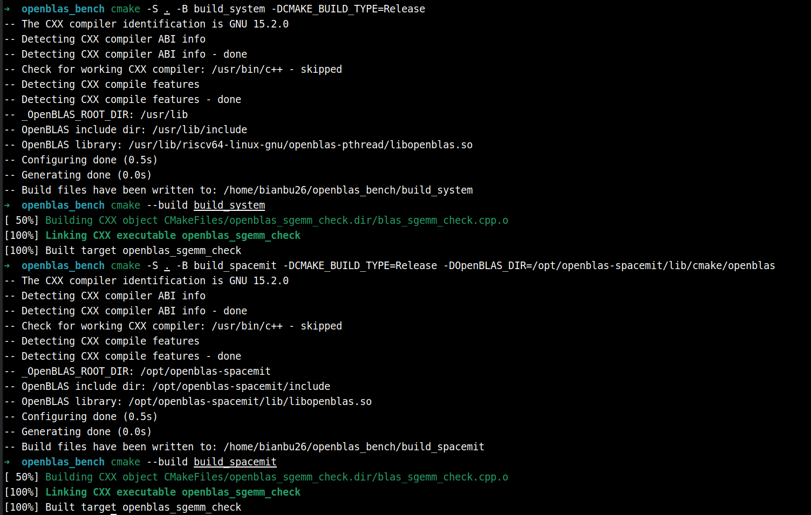
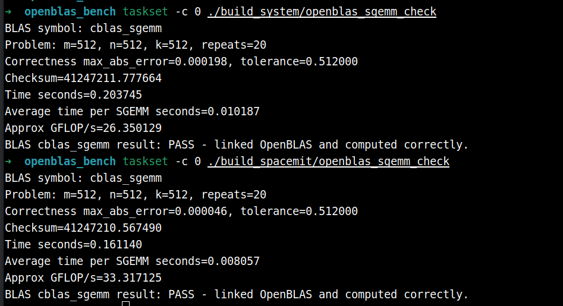
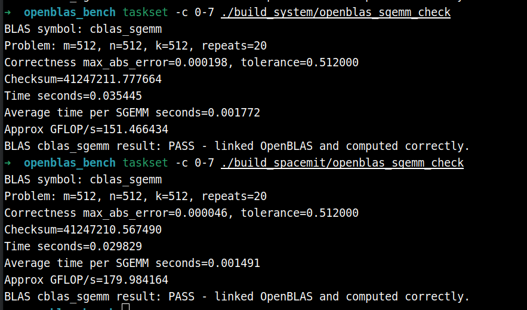

# OpenBLAS RVV

## OpenBLAS 简介

[OpenBLAS](https://www.openblas.net/) 是一个开源的 BLAS（Basic Linear Algebra Subprograms）和部分 LAPACK 实现，提供矩阵乘法、向量运算、线性方程求解、矩阵分解等基础数值计算能力。OpenBLAS 被广泛用于 NumPy、SciPy、Eigen、OpenCV、机器学习推理框架以及机器人算法中的线性代数加速场景。

OpenBLAS 的性能与目标 CPU 架构、缓存参数、线程模型和核心算子实现密切相关。对于 GEMM（General Matrix Multiply，通用矩阵乘法）这类计算密集型算子，是否针对具体处理器实现向量化微内核通常会直接影响吞吐。K3 平台搭载的 SpacemiT X100 处理器支持 RISC-V Vector Extension（RVV 1.0），因此在大规模矩阵乘法、矩阵分解等场景中，可以通过 RVV 优化库进一步释放硬件性能。


## RVV 加速

K3 系统中可对比两套 OpenBLAS：

| 对比项 | 系统 OpenBLAS（`libopenblas-pthread-dev`） | SpacemiT OpenBLAS（`openblas-spacemit`） |
| :-: | :-: | :-: |
| 版本 | OpenBLAS 0.3.32 | OpenBLAS 0.3.32 |
| 安装方式 | `sudo apt install libopenblas-pthread-dev` | `sudo apt install openblas-spacemit` |
| 头文件路径 | `/usr/include/riscv64-linux-gnu/openblas-pthread` | `/opt/openblas-spacemit/include` |
| 库文件路径 | `/usr/lib/riscv64-linux-gnu/openblas-pthread` | `/opt/openblas-spacemit/lib` |
| 目标核心 | `generic` | `x100` |
| 优化方向 | 通用 riscv64 OpenBLAS pthread 实现 | 面向 SpacemiT X100 的 RVV 优化实现 |
| 典型用途 | 兼容系统默认 BLAS/LAPACK 依赖 | 在 K3 上进行高性能矩阵计算和算法加速 |

本文后续主要通过相同的 BLAS 接口（如 `cblas_sgemm` / `cblas_dgemm`）对比 `libopenblas-pthread-dev` 与 `openblas-spacemit` 的性能差异。测试时仅切换头文件与链接库路径，并通过 `OPENBLAS_NUM_THREADS`、`taskset` 等方式控制线程数和 CPU 亲和性，从而观察 RVV 优化库在 K3 平台上的加速效果。


## 使用示例

### 软硬件环境

- SpacemiT RISCV64 X100 CPU（2.4Ghz）
- Bianbu 4.0.1 操作系统
- 内存：32GB


### **安装必要依赖**

```
sudo apt update
sudo apt install libopenblas-pthread-dev openblas-spacemit
```


### 测试代码

**目录结构：**

```
openblas_bench/
├── CMakeLists.txt
└── blas_sgemm_check.cpp
```

**CMakeLists.txt：**

```cmake
cmake_minimum_required(VERSION 3.16)
project(openblas_simple_check LANGUAGES CXX)

set(CMAKE_CXX_STANDARD 17)
set(CMAKE_CXX_STANDARD_REQUIRED ON)

add_executable(openblas_sgemm_check blas_sgemm_check.cpp)

find_package(OpenBLAS REQUIRED)

if(_OpenBLAS_ROOT_DIR STREQUAL "/usr/lib")
	set(OpenBLAS_LIB /usr/lib/riscv64-linux-gnu/openblas-pthread/libopenblas.so)
else()
	set(OpenBLAS_LIB ${OpenBLAS_LIBRARIES})
endif()

message(STATUS "_OpenBLAS_ROOT_DIR: ${_OpenBLAS_ROOT_DIR}")
message(STATUS "OpenBLAS include dir: ${OpenBLAS_INCLUDE_DIRS}")
message(STATUS "OpenBLAS library: ${OpenBLAS_LIB}")


target_include_directories(openblas_sgemm_check PRIVATE ${OpenBLAS_INCLUDE_DIRS})
target_link_libraries(openblas_sgemm_check PRIVATE ${OpenBLAS_LIB})
```

**blas_sgemm_check.cpp**

```
// Test the installed BLAS ABI library by calling cblas_sgemm.
// This validates that the target BLAS library can be linked and used.

#include <algorithm>
#include <chrono>
#include <cmath>
#include <cstdlib>
#include <iomanip>
#include <iostream>
#include <string>
#include <vector>

#include <cblas.h>

namespace {

float value_for(int row, int col, int rows) {
  return static_cast<float>(((row + 1) * 17 + (col + 1) * 31 + rows) % 101) / 101.0f;
}

void fill_col_major(std::vector<float>& matrix, int rows, int cols) {
  for (int col = 0; col < cols; ++col) {
    for (int row = 0; row < rows; ++row) {
      matrix[row + col * rows] = value_for(row, col, rows);
    }
  }
}

std::vector<float> reference_gemm(const std::vector<float>& a, const std::vector<float>& b,
                                  int m, int n, int k, float alpha, float beta) {
  std::vector<float> c(static_cast<size_t>(m) * n, 1.0f);
  for (int col = 0; col < n; ++col) {
    for (int row = 0; row < m; ++row) {
      float acc = 0.0f;
      for (int inner = 0; inner < k; ++inner) {
        acc += a[row + inner * m] * b[inner + col * k];
      }
      c[row + col * m] = alpha * acc + beta * c[row + col * m];
    }
  }
  return c;
}

double max_abs_error(const std::vector<float>& x, const std::vector<float>& y) {
  double err = 0.0;
  for (size_t i = 0; i < x.size(); ++i) {
    err = std::max(err, std::abs(static_cast<double>(x[i]) - static_cast<double>(y[i])));
  }
  return err;
}

double checksum(const std::vector<float>& x) {
  double sum = 0.0;
  for (float v : x) sum += v;
  return sum;
}

}  // namespace

int main(int argc, char** argv) {
  int m = 512;
  int n = 512;
  int k = 512;
  int repeats = 20;

  if (argc > 1) m = std::atoi(argv[1]);
  if (argc > 2) n = std::atoi(argv[2]);
  if (argc > 3) k = std::atoi(argv[3]);
  if (argc > 4) repeats = std::atoi(argv[4]);

  if (m <= 0 || n <= 0 || k <= 0 || repeats <= 0) {
    std::cerr << "usage: " << argv[0] << " [m n k repeats]\n";
    return 2;
  }

  std::vector<float> a(static_cast<size_t>(m) * k);
  std::vector<float> b(static_cast<size_t>(k) * n);
  std::vector<float> c(static_cast<size_t>(m) * n, 1.0f);

  fill_col_major(a, m, k);
  fill_col_major(b, k, n);

  float alpha = 1.25f;
  float beta = 0.5f;
  int lda = m;
  int ldb = k;
  int ldc = m;

  const auto expected = reference_gemm(a, b, m, n, k, alpha, beta);

  cblas_sgemm(CblasColMajor, CblasNoTrans, CblasNoTrans, m, n, k, alpha, a.data(), lda, b.data(), ldb,
              beta, c.data(), ldc);

  const double err = max_abs_error(c, expected);
  const double tolerance = 1e-3 * static_cast<double>(k);

  std::cout << std::fixed << std::setprecision(6);
  std::cout << "BLAS symbol: cblas_sgemm\n";
  std::cout << "Problem: m=" << m << ", n=" << n << ", k=" << k << ", repeats=" << repeats << '\n';
  std::cout << "Correctness max_abs_error=" << err << ", tolerance=" << tolerance << '\n';
  std::cout << "Checksum=" << checksum(c) << '\n';

  if (err > tolerance) {
    std::cerr << "BLAS cblas_sgemm result: FAIL - result mismatch\n";
    return 1;
  }

  std::fill(c.begin(), c.end(), 1.0f);
  const auto start = std::chrono::steady_clock::now();
  for (int r = 0; r < repeats; ++r) {
    cblas_sgemm(CblasColMajor, CblasNoTrans, CblasNoTrans, m, n, k, alpha, a.data(), lda, b.data(), ldb,
                beta, c.data(), ldc);
  }
  const auto end = std::chrono::steady_clock::now();
  const double seconds = std::chrono::duration<double>(end - start).count();
  const double avg_seconds = seconds / repeats;
  const double gflops = (2.0 * m * n * k * repeats) / seconds / 1.0e9;

  std::cout << "Time seconds=" << seconds << '\n';
  std::cout << "Average time per SGEMM seconds=" << avg_seconds << '\n';
  std::cout << "Approx GFLOP/s=" << gflops << '\n';
  std::cout << "BLAS cblas_sgemm result: PASS - linked OpenBLAS and computed correctly.\n";
  return 0;
}
```

### 编译

```
# 使用libopenblas-pthread-dev
cmake -S . -B build_system -DCMAKE_BUILD_TYPE=Release
cmake --build build_system

# 使用 openblas-spacemit
cmake -S . -B build_spacemit -DCMAKE_BUILD_TYPE=Release -DOpenBLAS_DIR=/opt/openblas-spacemit/lib/cmake/openblas
cmake --build build_spacemit
```

终端输出：




### 测试对比

**单核测试**

```
taskset -c 0 ./build_system/openblas_sgemm_check # 系统库
```

```
taskset -c 0 ./build_spacemit/openblas_sgemm_check # openblas-spacemit
```

输出：



可以看出，RVV加速后的sgemm算子性能有所提升（10.18ms -> 8.05ms）

**八核测试**

```
taskset -c 0-7 ./build_system/openblas_sgemm_check
```

```
taskset -c 0-7 ./build_spacemit/openblas_sgemm_check
```

输出：




## 更多性能测试数据

- 使用 taskset -c 限制核数
- 单次测试的计时策略是跑 50 次取平均值，预热10次。本测试重复10次单次测试，取其指标的平均值并计算标准差
- mean 表示 10 次测试的均值，sd 为标准差

### 测试结果简要说明

本次测评聚焦系统默认 `libopenblas-pthread-dev` 与面向 SpacemiT X100 处理器优化的 `openblas-spacemit`，在单核与八核条件下量化 RVV 加速收益，测试均采用统一的计时与重复策略以保证可比性。

主要结论如下：

- **BLAS Level-3（矩阵-矩阵运算）**：`openblas-spacemit` 显著提升核心算子性能。单核 `sgemm` 吞吐由 26.48 GFLOPS 提升至 33.47 GFLOPS（+26.4%），八核 `sgemm` 吞吐由 150.52 GFLOPS 提升至 183.40 GFLOPS（+22.5%）。`ssymm`、`strmm` 等算子普遍获得 15%～23% 的加速；双精度场景（如 `dgemm`）亦有 5%～10% 的增益。
- **BLAS Level-1（向量运算）**：数据搬运与缩放类算子（如 `scopy`、`dcopy`、`sscal`、`dscal`）性能提升 20%～40%；归约类算子（如 `sdot`、`ddot`、`nrm2`）改进有限；部分算子（如 `sasum`、`dasum`）仍略逊于系统库。
- **BLAS Level-2（矩阵-向量运算）**：整体优势不明显，`sgemv`、`dgemv` 等算子与系统库相比低约 20%～30%，主要受制于内存带宽及较低的运算密度。

综合来看，`openblas-spacemit` 在计算密集型矩阵运算中优势突出，适用于机器人感知、SLAM、机器学习推理及科学计算等高度依赖 GEMM 的工作负载；而对内存访问主导的向量与矩阵-向量算子需结合具体场景评估其收益。

### 单核测试

| module | function |     api     |         expression          |  dtype  | input_size | output_size | libopenblas-pthread-dev avg_ms mean±sd | openblas-spacemit avg_ms mean±sd | libopenblas-pthread-dev avg_gflops mean±sd | openblas-spacemit avg_gflops mean±sd | speedup mean±sd | improvement mean±sd |
| :----: | :------: | :---------: | :-------------------------: | :-----: | :--------: | :---------: | :------------------------------------: | :------------------------------: | :----------------------------------------: | :----------------------------------: | :-------------: | :-----------------: |
| blas1  |  sasum   | cblas_sasum |         sum(abs(x))         | float32 |  262144x1  |     1x1     |            0.0460 ± 0.0006             |         0.0516 ± 0.0003          |              5.7036 ± 0.0745               |           5.0760 ± 0.0337            |  0.89x ± 0.01x  |   -10.96% ± 1.22%   |
| blas1  |  dasum   | cblas_dasum |         sum(abs(x))         | float64 |  262144x1  |     1x1     |            0.0934 ± 0.0022             |         0.1066 ± 0.0059          |              2.8081 ± 0.0625               |           2.4654 ± 0.1287            |  0.88x ± 0.04x  |   -12.18% ± 4.22%   |
| blas1  |  saxpy   | cblas_saxpy |       z = alpha*x + z       | float32 |  262144x1  |  262144x1   |            0.0951 ± 0.0039             |         0.0978 ± 0.0034          |              5.5200 ± 0.2050               |           5.3671 ± 0.1774            |  0.97x ± 0.05x  |   -2.59% ± 5.36%    |
| blas1  |  daxpy   | cblas_daxpy |       z = alpha*x + z       | float64 |  262144x1  |  262144x1   |            0.4546 ± 0.0208             |         0.4214 ± 0.0170          |              1.1555 ± 0.0523               |           1.2461 ± 0.0493            |  1.08x ± 0.07x  |    8.09% ± 7.46%    |
| blas1  |  scopy   | cblas_scopy |            z = x            | float32 |  262144x1  |  262144x1   |            0.0734 ± 0.0003             |         0.0593 ± 0.0003          |              3.5713 ± 0.0140               |           4.4216 ± 0.0225            |  1.24x ± 0.01x  |   23.80% ± 0.70%    |
| blas1  |  dcopy   | cblas_dcopy |            z = x            | float64 |  262144x1  |  262144x1   |            0.1481 ± 0.0012             |         0.1239 ± 0.0073          |              1.7699 ± 0.0145               |           2.1222 ± 0.1167            |  1.20x ± 0.06x  |   19.88% ± 6.03%    |
| blas1  |   sdot   | cblas_sdot  |          dot(x, y)          | float32 |  262144x1  |     1x1     |            0.0771 ± 0.0022             |         0.0824 ± 0.0073          |              6.8064 ± 0.1934               |           6.4044 ± 0.5376            |  0.94x ± 0.08x  |   -5.88% ± 7.95%    |
| blas1  |   ddot   | cblas_ddot  |          dot(x, y)          | float64 |  262144x1  |     1x1     |            0.3765 ± 0.0103             |         0.3628 ± 0.0080          |              1.3936 ± 0.0387               |           1.4458 ± 0.0318            |  1.04x ± 0.03x  |    3.80% ± 3.00%    |
| blas1  |  snrm2   | cblas_snrm2 |       sqrt(dot(x, x))       | float32 |  262144x1  |     1x1     |            0.6717 ± 0.0014             |         0.6233 ± 0.0012          |              0.7805 ± 0.0016               |           0.8411 ± 0.0016            |  1.08x ± 0.00x  |    7.77% ± 0.32%    |
| blas1  |  dnrm2   | cblas_dnrm2 |       sqrt(dot(x, x))       | float64 |  262144x1  |     1x1     |            2.1654 ± 0.0010             |         2.0484 ± 0.0034          |              0.2421 ± 0.0001               |           0.2560 ± 0.0004            |  1.06x ± 0.00x  |    5.71% ± 0.15%    |
| blas1  |  sscal   | cblas_sscal |         z = alpha*z         | float32 |  262144x1  |  262144x1   |            0.0757 ± 0.0003             |         0.0588 ± 0.0004          |              3.4646 ± 0.0116               |           4.4540 ± 0.0255            |  1.29x ± 0.01x  |   28.61% ± 0.97%    |
| blas1  |  dscal   | cblas_dscal |         z = alpha*z         | float64 |  262144x1  |  262144x1   |            0.1662 ± 0.0030             |         0.1273 ± 0.0110          |              1.5775 ± 0.0279               |           2.0720 ± 0.1744            |  1.31x ± 0.11x  |   31.39% ± 11.17%   |
| blas2  |  sgemv   | cblas_sgemv |   z = alpha*A*x + beta*z    | float32 |  512x512   |    512x1    |            0.0788 ± 0.0002             |         0.1139 ± 0.0005          |              6.6556 ± 0.0180               |           4.6013 ± 0.0198            |  0.69x ± 0.00x  |   -30.86% ± 0.29%   |
| blas2  |  dgemv   | cblas_dgemv |   z = alpha*A*x + beta*z    | float64 |  512x512   |    512x1    |            0.1611 ± 0.0077             |         0.2247 ± 0.0100          |              3.2618 ± 0.1545               |           2.3368 ± 0.0944            |  0.72x ± 0.05x  |   -28.18% ± 4.99%   |
| blas2  |  ssymv   | cblas_ssymv | z = alpha*Sym(A)*x + beta*z | float32 |  512x512   |    512x1    |            0.0694 ± 0.0006             |         0.0817 ± 0.0002          |              7.5572 ± 0.0634               |           6.4155 ± 0.0158            |  0.85x ± 0.01x  |   -15.11% ± 0.72%   |
| blas2  |  dsymv   | cblas_dsymv | z = alpha*Sym(A)*x + beta*z | float64 |  512x512   |    512x1    |            0.1168 ± 0.0017             |         0.1331 ± 0.0018          |              4.4887 ± 0.0640               |           3.9409 ± 0.0504            |  0.88x ± 0.01x  |   -12.18% ± 1.34%   |
| blas2  |  stbmv   | cblas_stbmv |      z = TriBand(A)*z       | float32 |  512x512   |    512x1    |            0.0109 ± 0.0001             |         0.0138 ± 0.0003          |              0.2338 ± 0.0026               |           0.1857 ± 0.0043            |  0.79x ± 0.02x  |   -20.67% ± 2.02%   |
| blas2  |  dtbmv   | cblas_dtbmv |      z = TriBand(A)*z       | float64 |  512x512   |    512x1    |            0.0112 ± 0.0000             |         0.0134 ± 0.0006          |              0.2295 ± 0.0000               |           0.1914 ± 0.0086            |  0.84x ± 0.04x  |   -16.21% ± 3.71%   |
| blas2  |  stpmv   | cblas_stpmv |     z = PackedTri(A)*z      | float32 |  512x512   |    512x1    |            0.0501 ± 0.0003             |         0.0499 ± 0.0021          |              5.2366 ± 0.0354               |           5.2574 ± 0.2115            |  1.00x ± 0.04x  |    0.43% ± 4.11%    |
| blas2  |  dtpmv   | cblas_dtpmv |     z = PackedTri(A)*z      | float64 |  512x512   |    512x1    |            0.0946 ± 0.0003             |         0.0889 ± 0.0023          |              2.7708 ± 0.0102               |           2.9493 ± 0.0730            |  1.06x ± 0.02x  |    6.44% ± 2.37%    |
| blas2  |  strmv   | cblas_strmv |        z = Tri(A)*z         | float32 |  512x512   |    512x1    |            0.0671 ± 0.0002             |         0.0732 ± 0.0028          |              3.9054 ± 0.0111               |           3.5857 ± 0.1327            |  0.92x ± 0.03x  |   -8.21% ± 3.46%    |
| blas2  |  dtrmv   | cblas_dtrmv |        z = Tri(A)*z         | float64 |  512x512   |    512x1    |            0.1083 ± 0.0012             |         0.1266 ± 0.0030          |              2.4214 ± 0.0265               |           2.0718 ± 0.0481            |  0.86x ± 0.02x  |   -14.43% ± 2.07%   |
| blas3  |  sgemm   | cblas_sgemm |   C = alpha*A*B + beta*C    | float32 |  512x512   |   512x512   |            10.1364 ± 0.0659            |         8.0202 ± 0.0188          |              26.4833 ± 0.1716              |           33.4701 ± 0.0786           |  1.26x ± 0.01x  |   26.39% ± 0.79%    |
| blas3  |  dgemm   | cblas_dgemm |   C = alpha*A*B + beta*C    | float64 |  512x512   |   512x512   |            23.3091 ± 0.0797            |         21.2694 ± 0.0505         |              11.5165 ± 0.0394              |           12.6208 ± 0.0300           |  1.10x ± 0.00x  |    9.59% ± 0.41%    |
| blas3  |  ssymm   | cblas_ssymm | C = alpha*Sym(A)*B + beta*C | float32 |  512x512   |   512x512   |            10.1916 ± 0.0355            |         8.2806 ± 0.0270          |              26.3392 ± 0.0918              |           32.4179 ± 0.1055           |  1.23x ± 0.01x  |   23.08% ± 0.57%    |
| blas3  |  dsymm   | cblas_dsymm | C = alpha*Sym(A)*B + beta*C | float64 |  512x512   |   512x512   |            23.0906 ± 0.0821            |         22.5162 ± 0.0585         |              11.6255 ± 0.0414              |           11.9220 ± 0.0310           |  1.03x ± 0.00x  |    2.55% ± 0.48%    |
| blas3  |  strmm   | cblas_strmm |     C = alpha*Tri(A)*C      | float32 |  512x512   |   512x512   |            5.2380 ± 0.0176             |         4.5287 ± 0.0172          |              25.6241 ± 0.0857              |           29.6377 ± 0.1126           |  1.16x ± 0.01x  |   15.66% ± 0.51%    |
| blas3  |  dtrmm   | cblas_dtrmm |     C = alpha*Tri(A)*C      | float64 |  512x512   |   512x512   |            11.3021 ± 0.1004            |         10.1598 ± 0.0567         |              11.8763 ± 0.1052              |           13.2111 ± 0.0736           |  1.11x ± 0.01x  |   11.25% ± 0.97%    |


### 八核测试

| module | function |     api     |         expression          |  dtype  | input_size | output_size | libopenblas-pthread-dev avg_ms mean±sd | openblas-spacemit avg_ms mean±sd | libopenblas-pthread-dev avg_gflops mean±sd | openblas-spacemit avg_gflops mean±sd | speedup mean±sd | improvement mean±sd |
| :----: | :------: | :---------: | :-------------------------: | :-----: | :--------: | :---------: | :------------------------------------: | :------------------------------: | :----------------------------------------: | :----------------------------------: | :-------------: | :-----------------: |
| blas1  |  sasum   | cblas_sasum |         sum(abs(x))         | float32 |  262144x1  |     1x1     |            0.0653 ± 0.0063             |         0.0637 ± 0.0093          |              4.0463 ± 0.3653               |           4.1903 ± 0.5812            |  1.04x ± 0.18x  |   4.42% ± 17.54%    |
| blas1  |  dasum   | cblas_dasum |         sum(abs(x))         | float64 |  262144x1  |     1x1     |            0.1100 ± 0.0149             |         0.1533 ± 0.0097          |              2.4195 ± 0.2959               |           1.7163 ± 0.1050            |  0.72x ± 0.09x  |   -28.18% ± 8.91%   |
| blas1  |  saxpy   | cblas_saxpy |       z = alpha*x + z       | float32 |  262144x1  |  262144x1   |            0.0369 ± 0.0053             |         0.0350 ± 0.0061          |              14.4811 ± 2.2321              |           15.4264 ± 2.8504           |  1.09x ± 0.28x  |   9.37% ± 28.30%    |
| blas1  |  daxpy   | cblas_daxpy |       z = alpha*x + z       | float64 |  262144x1  |  262144x1   |            0.0605 ± 0.0079             |         0.0616 ± 0.0072          |              8.7922 ± 1.0583               |           8.6122 ± 0.9870            |  1.00x ± 0.19x  |   -0.27% ± 19.23%   |
| blas1  |  scopy   | cblas_scopy |            z = x            | float32 |  262144x1  |  262144x1   |            0.0733 ± 0.0003             |         0.0592 ± 0.0004          |              3.5765 ± 0.0147               |           4.4264 ± 0.0280            |  1.24x ± 0.01x  |   23.78% ± 1.09%    |
| blas1  |  dcopy   | cblas_dcopy |            z = x            | float64 |  262144x1  |  262144x1   |            0.1706 ± 0.0627             |         0.1236 ± 0.0060          |              1.6419 ± 0.3194               |           2.1261 ± 0.1003            |  1.39x ± 0.55x  |   39.07% ± 55.23%   |
| blas1  |   sdot   | cblas_sdot  |          dot(x, y)          | float32 |  262144x1  |     1x1     |            0.1068 ± 0.0360             |         0.0952 ± 0.0055          |              5.2162 ± 1.0422               |           5.5213 ± 0.3114            |  1.12x ± 0.35x  |   11.96% ± 34.66%   |
| blas1  |   ddot   | cblas_ddot  |          dot(x, y)          | float64 |  262144x1  |     1x1     |            0.2790 ± 0.0194             |         0.3266 ± 0.0928          |              1.8873 ± 0.1318               |           1.6914 ± 0.3433            |  0.90x ± 0.21x  |   -9.77% ± 20.61%   |
| blas1  |  snrm2   | cblas_snrm2 |       sqrt(dot(x, x))       | float32 |  262144x1  |     1x1     |            0.6748 ± 0.0076             |         0.6434 ± 0.0655          |              0.7771 ± 0.0086               |           0.8209 ± 0.0664            |  1.06x ± 0.08x  |    5.58% ± 7.69%    |
| blas1  |  dnrm2   | cblas_dnrm2 |       sqrt(dot(x, x))       | float64 |  262144x1  |     1x1     |            2.1886 ± 0.0527             |         2.0510 ± 0.0056          |              0.2397 ± 0.0055               |           0.2556 ± 0.0007            |  1.07x ± 0.03x  |    6.71% ± 2.61%    |
| blas1  |  sscal   | cblas_sscal |         z = alpha*z         | float32 |  262144x1  |  262144x1   |            0.0754 ± 0.0001             |         0.0590 ± 0.0005          |              3.4741 ± 0.0038               |           4.4415 ± 0.0361            |  1.28x ± 0.01x  |   27.83% ± 1.18%    |
| blas1  |  dscal   | cblas_dscal |         z = alpha*z         | float64 |  262144x1  |  262144x1   |            0.1682 ± 0.0057             |         0.1188 ± 0.0013          |              1.5604 ± 0.0508               |           2.2066 ± 0.0233            |  1.42x ± 0.05x  |   41.55% ± 5.00%    |
| blas2  |  sgemv   | cblas_sgemv |   z = alpha*A*x + beta*z    | float32 |  512x512   |    512x1    |            0.0789 ± 0.0002             |         0.1140 ± 0.0003          |              6.6473 ± 0.0137               |           4.5987 ± 0.0141            |  0.69x ± 0.00x  |   -30.81% ± 0.18%   |
| blas2  |  dgemv   | cblas_dgemv |   z = alpha*A*x + beta*z    | float64 |  512x512   |    512x1    |            0.1570 ± 0.0064             |         0.2266 ± 0.0144          |              3.3446 ± 0.1296               |           2.3206 ± 0.1279            |  0.70x ± 0.05x  |   -30.49% ± 5.15%   |
| blas2  |  ssymv   | cblas_ssymv | z = alpha*Sym(A)*x + beta*z | float32 |  512x512   |    512x1    |            0.0196 ± 0.0004             |         0.0242 ± 0.0007          |              26.8242 ± 0.4924              |           21.6891 ± 0.5964           |  0.81x ± 0.03x  |   -19.09% ± 2.75%   |
| blas2  |  dsymv   | cblas_dsymv | z = alpha*Sym(A)*x + beta*z | float64 |  512x512   |    512x1    |            0.0310 ± 0.0039             |         0.0346 ± 0.0007          |              17.1231 ± 1.6445              |           15.1380 ± 0.3015           |  0.89x ± 0.12x  |  -10.52% ± 11.79%   |
| blas2  |  stbmv   | cblas_stbmv |      z = TriBand(A)*z       | float32 |  512x512   |    512x1    |            0.0056 ± 0.0003             |         0.0083 ± 0.0005          |              0.4546 ± 0.0205               |           0.3088 ± 0.0176            |  0.68x ± 0.05x  |   -31.88% ± 4.96%   |
| blas2  |  dtbmv   | cblas_dtbmv |      z = TriBand(A)*z       | float64 |  512x512   |    512x1    |            0.0075 ± 0.0003             |         0.0079 ± 0.0006          |              0.3409 ± 0.0115               |           0.3265 ± 0.0225            |  0.96x ± 0.07x  |   -4.26% ± 7.18%    |
| blas2  |  stpmv   | cblas_stpmv |     z = PackedTri(A)*z      | float32 |  512x512   |    512x1    |            0.0133 ± 0.0032             |         0.0124 ± 0.0003          |              20.4058 ± 3.0779              |           21.2088 ± 0.4254           |  1.07x ± 0.25x  |   7.29% ± 24.85%    |
| blas2  |  dtpmv   | cblas_dtpmv |     z = PackedTri(A)*z      | float64 |  512x512   |    512x1    |            0.0227 ± 0.0030             |         0.0211 ± 0.0008          |              11.6867 ± 1.2003              |           12.4503 ± 0.4639           |  1.07x ± 0.11x  |   7.46% ± 11.20%    |
| blas2  |  strmv   | cblas_strmv |        z = Tri(A)*z         | float32 |  512x512   |    512x1    |            0.0312 ± 0.0035             |         0.0337 ± 0.0015          |              8.4915 ± 0.8559               |           7.7875 ± 0.3644            |  0.93x ± 0.11x  |   -7.31% ± 10.84%   |
| blas2  |  dtrmv   | cblas_dtrmv |        z = Tri(A)*z         | float64 |  512x512   |    512x1    |            0.0465 ± 0.0055             |         0.0661 ± 0.0045          |              5.7243 ± 0.8369               |           3.9807 ± 0.2823            |  0.71x ± 0.10x  |   -29.33% ± 9.75%   |
| blas3  |  sgemm   | cblas_sgemm |   C = alpha*A*B + beta*C    | float32 |  512x512   |   512x512   |            1.7920 ± 0.1311             |         1.4639 ± 0.0175          |             150.5191 ± 11.0008             |          183.4007 ± 2.1639           |  1.22x ± 0.09x  |   22.46% ± 9.41%    |
| blas3  |  dgemm   | cblas_dgemm |   C = alpha*A*B + beta*C    | float64 |  512x512   |   512x512   |            3.7447 ± 0.1520             |         3.5579 ± 0.1550          |              71.7921 ± 2.9347              |           75.5774 ± 3.3164           |  1.06x ± 0.08x  |    5.50% ± 7.52%    |
| blas3  |  ssymm   | cblas_ssymm | C = alpha*Sym(A)*B + beta*C | float32 |  512x512   |   512x512   |            1.7756 ± 0.0235             |         1.7004 ± 0.1035          |             151.2034 ± 1.9713              |          158.3544 ± 8.9724           |  1.05x ± 0.05x  |    4.71% ± 5.47%    |
| blas3  |  dsymm   | cblas_dsymm | C = alpha*Sym(A)*B + beta*C | float64 |  512x512   |   512x512   |            3.7062 ± 0.0967             |         3.9785 ± 0.1184          |              72.4741 ± 1.8827              |           67.5256 ± 2.0129           |  0.93x ± 0.04x  |   -6.76% ± 3.91%    |
| blas3  |  strmm   | cblas_strmm |     C = alpha*Tri(A)*C      | float32 |  512x512   |   512x512   |            1.2341 ± 0.0619             |         1.4279 ± 0.0935          |             108.9822 ± 4.9051              |           94.3393 ± 5.7967           |  0.87x ± 0.08x  |   -13.20% ± 7.73%   |
| blas3  |  dtrmm   | cblas_dtrmm |     C = alpha*Tri(A)*C      | float64 |  512x512   |   512x512   |            2.4169 ± 0.1800             |         2.3975 ± 0.0244          |              55.7853 ± 3.7923              |           55.9882 ± 0.5670           |  1.01x ± 0.08x  |    0.83% ± 7.66%    |
