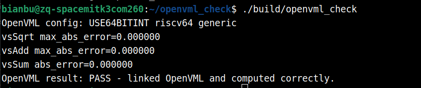

# OpenVML RVV

## OpenVML 简介

OpenVML 是一套面向向量数据的数学函数库，提供浮点向量初等函数、二元运算、归约运算以及整数向量运算等能力。它的接口以批量数组为输入输出，例如 `vsSqrt`、`vsAdd`、`vsSum`、`vdExp`、`vs8Dot` 等，可用于一次处理大量连续元素。

在机器人、感知算法、信号处理、机器学习前后处理等场景中，常见的数据流会包含大量逐元素运算，例如绝对值、平方根、指数、对数、三角函数、向量加减乘以及整型量化数据处理。相比在业务代码中手写标量循环，使用向量数学库可以把这些基础算子交给经过平台优化的实现，从而获得更稳定的吞吐表现。


## RVV 加速

K3 平台搭载的 SpacemiT X100 处理器支持 RISC-V Vector Extension（RVV 1.0）。`openvml-spacemit` 安装在 `/opt/openvml-spacemit`，面向 K3 平台提供 OpenVML 算子实现。

| 项目 | openvml-spacemit |
| :-: | :-: |
| 安装方式 | `sudo apt install openvml-spacemit` |
| 头文件路径 | `/opt/openvml-spacemit/include` |
| 库文件路径 | `/opt/openvml-spacemit/lib` |
| 主要头文件 | `openvml.h` |
| 主要库文件 | `libopenvml.so` |
| 典型用途 | 向量数学函数、浮点逐元素运算、整数向量运算与归约运算 |


## 使用示例

### 软硬件环境

- SpacemiT RISCV64 X100 CPU（2.4 GHz）
- Bianbu 4.0.1 操作系统
- 内存：32 GB


### 安装必要依赖

```bash
sudo apt update
sudo apt install openvml-spacemit
```


### 测试代码

**目录结构：**

```text
openvml_check/
├── CMakeLists.txt
└── openvml_check.cpp
```

**CMakeLists.txt：**

```cmake
cmake_minimum_required(VERSION 3.16)
project(openvml_simple_check LANGUAGES CXX)

set(CMAKE_CXX_STANDARD 17)
set(CMAKE_CXX_STANDARD_REQUIRED ON)

set(OPENVML_PREFIX "/opt/openvml-spacemit" CACHE PATH "OpenVML install prefix")

find_path(OPENVML_INCLUDE_DIR
  NAMES openvml.h
  PATHS "${OPENVML_PREFIX}/include"
  NO_DEFAULT_PATH)

find_library(OPENVML_LIBRARY
  NAMES openvml
  PATHS "${OPENVML_PREFIX}/lib"
  NO_DEFAULT_PATH)

if(NOT OPENVML_INCLUDE_DIR)
  message(FATAL_ERROR "openvml.h not found under ${OPENVML_PREFIX}/include")
endif()

if(NOT OPENVML_LIBRARY)
  message(FATAL_ERROR "libopenvml not found under ${OPENVML_PREFIX}/lib")
endif()

get_filename_component(OPENVML_LIBRARY_DIR "${OPENVML_LIBRARY}" DIRECTORY)

add_executable(openvml_check openvml_check.cpp)
target_include_directories(openvml_check PRIVATE "${OPENVML_INCLUDE_DIR}")
target_compile_options(openvml_check PRIVATE -O3 -DNDEBUG)
target_link_libraries(openvml_check PRIVATE "${OPENVML_LIBRARY}")

if(OPENVML_LIBRARY_DIR)
  set_target_properties(openvml_check PROPERTIES
    BUILD_RPATH "${OPENVML_LIBRARY_DIR}"
    INSTALL_RPATH "${OPENVML_LIBRARY_DIR}")
endif()

message(STATUS "OPENVML_PREFIX: ${OPENVML_PREFIX}")
message(STATUS "OPENVML_INCLUDE_DIR: ${OPENVML_INCLUDE_DIR}")
message(STATUS "OPENVML_LIBRARY: ${OPENVML_LIBRARY}")
```

**openvml_check.cpp：**

```cpp
#include <openvml.h>

#include <algorithm>
#include <cmath>
#include <iomanip>
#include <iostream>
#include <numeric>
#include <vector>

double max_abs_error(const std::vector<float>& x, const std::vector<float>& y) {
  double err = 0.0;
  for (size_t i = 0; i < x.size(); ++i) {
    err = std::max(err, std::abs(static_cast<double>(x[i]) - static_cast<double>(y[i])));
  }
  return err;
}

int main() {
  const VML_INT n = 8;
  std::vector<float> x{0.25f, 1.0f, 2.25f, 4.0f, 6.25f, 9.0f, 12.25f, 16.0f};
  std::vector<float> y{1.0f, 2.0f, 3.0f, 4.0f, 5.0f, 6.0f, 7.0f, 8.0f};
  std::vector<float> sqrt_out(n);
  std::vector<float> add_out(n);
  std::vector<float> sqrt_ref(n);
  std::vector<float> add_ref(n);
  float sum_out = 0.0f;

  vsSqrt(n, x.data(), sqrt_out.data());
  vsAdd(n, x.data(), y.data(), add_out.data());
  vsSum(n, x.data(), &sum_out);

  for (VML_INT i = 0; i < n; ++i) {
    sqrt_ref[static_cast<size_t>(i)] = std::sqrt(x[static_cast<size_t>(i)]);
    add_ref[static_cast<size_t>(i)] = x[static_cast<size_t>(i)] + y[static_cast<size_t>(i)];
  }
  const float sum_ref = std::accumulate(x.begin(), x.end(), 0.0f);

  const double sqrt_err = max_abs_error(sqrt_out, sqrt_ref);
  const double add_err = max_abs_error(add_out, add_ref);
  const double sum_err = std::abs(static_cast<double>(sum_out) - static_cast<double>(sum_ref));

  std::cout << std::fixed << std::setprecision(6);
  std::cout << "OpenVML config: " << openvml_get_config() << '\n';
  std::cout << "vsSqrt max_abs_error=" << sqrt_err << '\n';
  std::cout << "vsAdd max_abs_error=" << add_err << '\n';
  std::cout << "vsSum abs_error=" << sum_err << '\n';

  if (sqrt_err > 1e-5 || add_err > 1e-5 || sum_err > 1e-5) {
    std::cerr << "OpenVML result: FAIL - result mismatch\n";
    return 1;
  }

  std::cout << "OpenVML result: PASS - linked OpenVML and computed correctly.\n";
  return 0;
}
```


### 编译与运行

```bash
cmake -S . -B build -DCMAKE_BUILD_TYPE=Release
cmake --build build
./build/openvml_check
```

终端输出：



也可以显式指定安装路径：

```bash
cmake -S . -B build -DCMAKE_BUILD_TYPE=Release -DOPENVML_PREFIX=/opt/openvml-spacemit
cmake --build build
LD_LIBRARY_PATH=/opt/openvml-spacemit/lib:$LD_LIBRARY_PATH ./build/openvml_check
```


## 更多性能测试数据

- 使用 `taskset -c` 绑定 CPU，脚本同时设置 `OMP_NUM_THREADS`。
- `vector_size` 为 1048576，`iterations` 为 50，`warmup` 为 10。
- `avg_ms` 表示单次算子调用的平均耗时，`mevals_per_second` 表示每秒百万次元素计算吞吐，`checksum` 用于确认输出参与计算且结果稳定。


### 测试结果简要说明

本次测试覆盖 81 个 OpenVML 算子，包括 `float32`、`float64` 和 `int8` / `int16` / `int32` 数据类型。

### 单核绑定测试结果


| module | function | api | expression | dtype | input_size | output_size | eval_count | total_ms | avg_ms | mevals_per_second | checksum |
| --- | --- | --- | --- | --- | --- | --- | --- | --- | --- | --- | --- |
| unary | abs | vsAbs | y = abs(x) | float32 | 1048576x1 | 1048576x1 | 1048576.0000 | 28.0353 | 0.5607 | 1870.0962 | 1572878.0765 |
| unary | recip | vsRecip | y = 1 / x | float32 | 1048576x1 | 1048576x1 | 1048576.0000 | 98.7829 | 1.9757 | 530.7475 | 634956.4420 |
| unary | sqrt | vsSqrt | y = sqrt(x) | float32 | 1048576x1 | 1048576x1 | 1048576.0000 | 99.4084 | 1.9882 | 527.4083 | 2796397.7431 |
| unary | sqr | vsSqr | y = x * x | float32 | 1048576x1 | 1048576x1 | 1048576.0000 | 26.6677 | 0.5334 | 1966.0032 | 3145759.1388 |
| unary | pow2o3 | vsPow2o3 | y = x^(2/3) | float32 | 1048576x1 | 1048576x1 | 1048576.0000 | 280.8658 | 5.6173 | 186.6685 | 3995106.2436 |
| unary | pow3o2 | vsPow3o2 | y = x^(3/2) | float32 | 1048576x1 | 1048576x1 | 1048576.0000 | 276.8267 | 5.5365 | 189.3922 | 26845443.5468 |
| unary | exp | vsExp | y = exp(x) | float32 | 1048576x1 | 1048576x1 | 1048576.0000 | 82.0062 | 1.6401 | 639.3276 | 1149691.5115 |
| unary | expm1 | vsExpm1 | y = exp(x) - 1 | float32 | 1048576x1 | 1048576x1 | 1048576.0000 | 613.6415 | 12.2728 | 85.4388 | 101107.1236 |
| unary | log10 | vsLog10 | y = log10(x) | float32 | 1048576x1 | 1048576x1 | 1048576.0000 | 589.4520 | 11.7890 | 88.9450 | 807500.8625 |
| unary | ln | vsLn | y = ln(x) | float32 | 1048576x1 | 1048576x1 | 1048576.0000 | 138.1510 | 2.7630 | 379.5035 | 1859339.4487 |
| unary | log1p | vsLog1p | y = log(1 + x) | float32 | 1048576x1 | 1048576x1 | 1048576.0000 | 719.0534 | 14.3811 | 72.9136 | 2108088.9563 |
| unary | tanh | vsTanh | y = tanh(x) | float32 | 1048576x1 | 1048576x1 | 1048576.0000 | 1031.7560 | 20.6351 | 50.8151 | -0.0011 |
| unary | round | vsRound | y = round(x) | float32 | 1048576x1 | 1048576x1 | 1048576.0000 | 26.1761 | 0.5235 | 2002.9256 | 0.0001 |
| unary | ceil | vsCeil | y = ceil(x) | float32 | 1048576x1 | 1048576x1 | 1048576.0000 | 26.2473 | 0.5249 | 1997.4920 | 524292.1944 |
| unary | floor | vsFloor | y = floor(x) | float32 | 1048576x1 | 1048576x1 | 1048576.0000 | 28.1338 | 0.5627 | 1863.5518 | -524290.1941 |
| unary | sin | vsSin | y = sin(x) | float32 | 1048576x1 | 1048576x1 | 1048576.0000 | 113.4690 | 2.2694 | 462.0541 | -0.0021 |
| unary | cos | vsCos | y = cos(x) | float32 | 1048576x1 | 1048576x1 | 1048576.0000 | 113.9144 | 2.2783 | 460.2474 | 953007.0083 |
| unary | tan | vsTan | y = tan(x) | float32 | 1048576x1 | 1048576x1 | 1048576.0000 | 1184.4234 | 23.6885 | 44.2653 | -0.0026 |
| unary | asin | vsAsin | y = asin(x) | float32 | 1048576x1 | 1048576x1 | 1048576.0000 | 303.8496 | 6.0770 | 172.5485 | 0.0006 |
| unary | acos | vsAcos | y = acos(x) | float32 | 1048576x1 | 1048576x1 | 1048576.0000 | 396.6906 | 7.9338 | 132.1655 | 1647112.5339 |
| unary | atan | vsAtan | y = atan(x) | float32 | 1048576x1 | 1048576x1 | 1048576.0000 | 289.2232 | 5.7845 | 181.2745 | -0.0013 |
| reduction | sum | vsSum | y = sum(x) | float32 | 1048576x1 | 1x1 | 1048576.0000 | 25.7794 | 0.5156 | 2033.7495 | 0.0344 |
| binary | add | vsAdd | y = a + b | float32 | 1048576x1 | 1048576x1 | 1048576.0000 | 62.5870 | 1.2517 | 837.6948 | 1310730.4626 |
| binary | sub | vsSub | y = a - b | float32 | 1048576x1 | 1048576x1 | 1048576.0000 | 61.2043 | 1.2241 | 856.6199 | -1310730.4890 |
| binary | mul | vsMul | y = a * b | float32 | 1048576x1 | 1048576x1 | 1048576.0000 | 61.1937 | 1.2239 | 856.7680 | 786439.7730 |
| binary | pow | vsPow | y = a ^ b | float32 | 1048576x1 | 1048576x1 | 1048576.0000 | 1217.9616 | 24.3592 | 43.0463 | 136978240.0024 |
| binary | powx | vsPowx | y = a ^ b | float32 | 1048576x1 | 1048576x1 | 1048576.0000 | 276.7253 | 5.5345 | 189.4615 | 2796397.7404 |
| binary | atan2 | vsAtan2 | y = atan2(a, b) | float32 | 1048576x1 | 1048576x1 | 1048576.0000 | 245.4615 | 4.9092 | 213.5927 | -122453.9317 |
| reduction | dot | vsDot | y = dot(a, b) | float32 | 1048576x1 | 1x1 | 1048576.0000 | 56.9216 | 1.1384 | 921.0701 | 786433.1875 |
| binary | offset | vsOffset | y = offset(a, b) | float32 | 1048576x1 | 1048576x1 | 1048576.0000 | 27.9806 | 0.5596 | 1873.7580 | 524292.1943 |
| binary | scale | vsScale | y = scale(a, b) | float32 | 1048576x1 | 1048576x1 | 1048576.0000 | 28.5132 | 0.5703 | 1838.7553 | -0.0032 |
| pair_output | sincos | vsSinCos | sin(x), cos(x) | float32 | 1048576x1 | 1048576x2 | 1048576.0000 | 624.6710 | 12.4934 | 83.9303 | 953007.5056 |
| unary | abs | vdAbs | y = abs(x) | float64 | 1048576x1 | 1048576x1 | 1048576.0000 | 88.5267 | 1.7705 | 592.2368 | 1572878.0829 |
| unary | recip | vdRecip | y = 1 / x | float64 | 1048576x1 | 1048576x1 | 1048576.0000 | 365.2998 | 7.3060 | 143.5227 | 634956.4308 |
| unary | sqrt | vdSqrt | y = sqrt(x) | float64 | 1048576x1 | 1048576x1 | 1048576.0000 | 1075.4431 | 21.5089 | 48.7509 | 2796397.7786 |
| unary | sqr | vdSqr | y = x * x | float64 | 1048576x1 | 1048576x1 | 1048576.0000 | 66.4973 | 1.3299 | 788.4355 | 3145759.1658 |
| unary | pow2o3 | vdPow2o3 | y = x^(2/3) | float64 | 1048576x1 | 1048576x1 | 1048576.0000 | 1987.4959 | 39.7499 | 26.3793 | 3995106.1786 |
| unary | pow3o2 | vdPow3o2 | y = x^(3/2) | float64 | 1048576x1 | 1048576x1 | 1048576.0000 | 1986.1636 | 39.7233 | 26.3970 | 26845444.5869 |
| unary | exp | vdExp | y = exp(x) | float64 | 1048576x1 | 1048576x1 | 1048576.0000 | 594.1584 | 11.8832 | 88.2404 | 1149691.5151 |
| unary | expm1 | vdExpm1 | y = exp(x) - 1 | float64 | 1048576x1 | 1048576x1 | 1048576.0000 | 1420.2793 | 28.4056 | 36.9144 | 101107.1265 |
| unary | log10 | vdLog10 | y = log10(x) | float64 | 1048576x1 | 1048576x1 | 1048576.0000 | 1146.8622 | 22.9372 | 45.7150 | 807500.8742 |
| unary | ln | vdLn | y = ln(x) | float64 | 1048576x1 | 1048576x1 | 1048576.0000 | 606.5845 | 12.1317 | 86.4328 | 1859339.4754 |
| unary | log1p | vdLog1p | y = log(1 + x) | float64 | 1048576x1 | 1048576x1 | 1048576.0000 | 1842.7722 | 36.8554 | 28.4510 | 2108088.9783 |
| unary | tanh | vdTanh | y = tanh(x) | float64 | 1048576x1 | 1048576x1 | 1048576.0000 | 2713.2891 | 54.2658 | 19.3230 | 0.0000 |
| unary | round | vdRound | y = round(x) | float64 | 1048576x1 | 1048576x1 | 1048576.0000 | 1229.2977 | 24.5860 | 42.6494 | 0.0001 |
| unary | ceil | vdCeil | y = ceil(x) | float64 | 1048576x1 | 1048576x1 | 1048576.0000 | 1228.6794 | 24.5736 | 42.6709 | 524290.1944 |
| unary | floor | vdFloor | y = floor(x) | float64 | 1048576x1 | 1048576x1 | 1048576.0000 | 1229.5959 | 24.5919 | 42.6391 | -524291.1942 |
| unary | sin | vdSin | y = sin(x) | float64 | 1048576x1 | 1048576x1 | 1048576.0000 | 1655.0676 | 33.1014 | 31.6777 | 0.0000 |
| unary | cos | vdCos | y = cos(x) | float64 | 1048576x1 | 1048576x1 | 1048576.0000 | 1612.7833 | 32.2557 | 32.5083 | 953007.5061 |
| unary | tan | vdTan | y = tan(x) | float64 | 1048576x1 | 1048576x1 | 1048576.0000 | 2048.6185 | 40.9724 | 25.5923 | 0.0000 |
| unary | asin | vdAsin | y = asin(x) | float64 | 1048576x1 | 1048576x1 | 1048576.0000 | 900.6585 | 18.0132 | 58.2116 | 0.0001 |
| unary | acos | vdAcos | y = acos(x) | float64 | 1048576x1 | 1048576x1 | 1048576.0000 | 843.2233 | 16.8645 | 62.1766 | 1647112.5059 |
| unary | atan | vdAtan | y = atan(x) | float64 | 1048576x1 | 1048576x1 | 1048576.0000 | 1833.6776 | 36.6736 | 28.5922 | 0.0000 |
| reduction | sum | vdSum | y = sum(x) | float64 | 1048576x1 | 1x1 | 1048576.0000 | 67.1682 | 1.3434 | 780.5595 | 0.0000 |
| binary | add | vdAdd | y = a + b | float64 | 1048576x1 | 1048576x1 | 1048576.0000 | 119.3994 | 2.3880 | 439.1045 | 1310730.4859 |
| binary | sub | vdSub | y = a - b | float64 | 1048576x1 | 1048576x1 | 1048576.0000 | 125.3201 | 2.5064 | 418.3592 | -1310730.4857 |
| binary | pow | vdPow | y = a ^ b | float64 | 1048576x1 | 1048576x1 | 1048576.0000 | 2072.6019 | 41.4520 | 25.2961 | 136978237.8088 |
| binary | powx | vdPowx | y = a ^ b | float64 | 1048576x1 | 1048576x1 | 1048576.0000 | 1988.8939 | 39.7779 | 26.3608 | 2796397.7786 |
| binary | atan2 | vdAtan2 | y = atan2(a, b) | float64 | 1048576x1 | 1048576x1 | 1048576.0000 | 2898.7575 | 57.9752 | 18.0866 | -122453.8617 |
| pair_output | sincos | vdSinCos | sin(x), cos(x) | float64 | 1048576x1 | 1048576x2 | 1048576.0000 | 3265.3805 | 65.3076 | 16.0560 | 953007.5061 |
| integer | add | vs8Add | y = int8(a) + int8(b) | int8 | 1048576x1 | 1048576x1 | 1048576.0000 | 11.8777 | 0.2376 | 4414.0540 | -10.9028 |
| integer | sub | vs8Sub | y = int8(a) - int8(b) | int8 | 1048576x1 | 1048576x1 | 1048576.0000 | 4.3932 | 0.0879 | 11934.2022 | -13.0971 |
| integer | mul | vs8Mul | y = int8(a) * int8(b) | int8 | 1048576x1 | 1048576x1 | 1048576.0000 | 11.5218 | 0.2304 | 4550.3839 | 144.0038 |
| integer | shift | vs8Shift | y = int8(a) << b | int8 | 1048576x1 | 1048576x1 | 1048576.0000 | 2.9781 | 0.0596 | 17604.5274 | -24.0000 |
| integer | scale | vs8Scale | y = int8(a) * scalar | int8 | 1048576x1 | 1048576x1 | 1048576.0000 | 2.5836 | 0.0517 | 20292.7597 | -35.9999 |
| integer | offset | vs8Offset | y = int8(a) + scalar | int8 | 1048576x1 | 1048576x1 | 1048576.0000 | 2.7626 | 0.0553 | 18978.2702 | 2097156.7772 |
| integer | dot | vs8Dot | y = dot(int8(a), int8(b)) | int8 | 1048576x1 | 1x1 | 1048576.0000 | 6.2316 | 0.1246 | 8413.3135 | 144.0000 |
| integer | add | vs16Add | y = int16(a) + int16(b) | int16 | 1048576x1 | 1048576x1 | 1048576.0000 | 26.1217 | 0.5224 | 2007.0979 | -110.9992 |
| integer | sub | vs16Sub | y = int16(a) - int16(b) | int16 | 1048576x1 | 1048576x1 | 1048576.0000 | 23.0746 | 0.4615 | 2272.1397 | -107.0000 |
| integer | mul | vs16Mul | y = int16(a) * int16(b) | int16 | 1048576x1 | 1048576x1 | 1048576.0000 | 26.3294 | 0.5266 | 1991.2651 | -31661.6291 |
| integer | shift | vs16Shift | y = int16(a) << b | int16 | 1048576x1 | 1048576x1 | 1048576.0000 | 6.0567 | 0.1211 | 8656.2753 | -217.9993 |
| integer | scale | vs16Scale | y = int16(a) * scalar | int16 | 1048576x1 | 1048576x1 | 1048576.0000 | 5.2266 | 0.1045 | 10031.1215 | -326.9989 |
| integer | offset | vs16Offset | y = int16(a) + scalar | int16 | 1048576x1 | 1048576x1 | 1048576.0000 | 5.9744 | 0.1195 | 8775.5611 | 2097059.7776 |
| integer | dot | vs16Dot | y = dot(int16(a), int16(b)) | int16 | 1048576x1 | 1x1 | 1048576.0000 | 21.4046 | 0.4281 | 2449.4130 | -31661.0000 |
| integer | add | vs32Add | y = int32(a) + int32(b) | int32 | 1048576x1 | 1048576x1 | 1048576.0000 | 61.1772 | 1.2235 | 856.9985 | 1797469.3806 |
| integer | sub | vs32Sub | y = int32(a) - int32(b) | int32 | 1048576x1 | 1048576x1 | 1048576.0000 | 67.6426 | 1.3529 | 775.0853 | -1797681.3804 |
| integer | mul | vs32Mul | y = int32(a) * int32(b) | int32 | 1048576x1 | 1048576x1 | 1048576.0000 | 62.0221 | 1.2404 | 845.3244 | -250.9997 |
| integer | shift | vs32Shift | y = int32(a) << b | int32 | 1048576x1 | 1048576x1 | 1048576.0000 | 28.4934 | 0.5699 | 1840.0325 | -211.9998 |
| integer | scale | vs32Scale | y = int32(a) * scalar | int32 | 1048576x1 | 1048576x1 | 1048576.0000 | 27.7604 | 0.5552 | 1888.6208 | -317.9997 |
| integer | offset | vs32Offset | y = int32(a) + scalar | int32 | 1048576x1 | 1048576x1 | 1048576.0000 | 28.3400 | 0.5668 | 1849.9929 | 2097062.7773 |
| integer | dot | vs32Dot | y = dot(int32(a), int32(b)) | int32 | 1048576x1 | 1x1 | 1048576.0000 | 53.6776 | 1.0736 | 976.7358 | -251.0000 |
