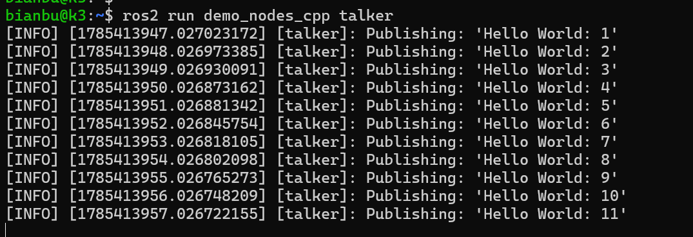
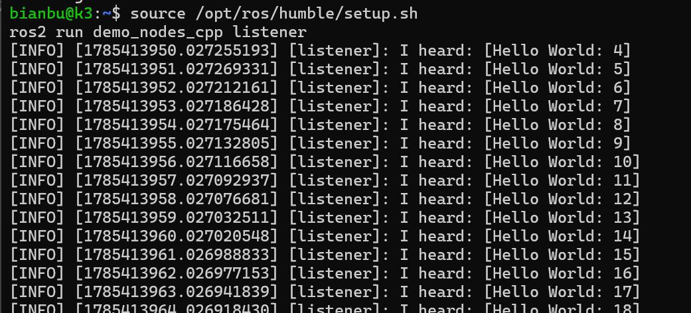

# ROS2安装


## 平台要求

硬件：SpacemiT K3 RISC-V

操作系统：Bianbu 4.0.1 及以上版本

## 关于软件源

进迭时空 Bianbu 4.0.1 及以上版本固件默认包含了 ros2 的软件源，无需额外的源配置

当前支持较完善的为 humble、jazzy 版本，两者均可安装 ros-$ROS_DISTRO-desktop。建议使用 humble

保证执行：

```bash
sudo apt update
```

注意不要按照 ros2 官方文档去进行源的配置！

## 安装

### 安装开发工具（推荐）

如需编译 ROS2 功能包或进行二次开发，建议安装开发工具集：

```bash
sudo apt update && sudo apt install ros-dev-tools
```

这会安装 colcon 等必要工具

### 安装 ROS-Base

基础版包含 ROS 通信库、消息接口、命令行工具等核心组件，不包含 GUI 工具：

建议使用 humble 版本

```bash
sudo apt install ros-humble-ros-base
```


### 加载 ROS2 环境变量

```bash
source /opt/ros/humble/setup.sh
```


## 发布/订阅示例

```bash
sudo apt install ros-humble-demo-nodes-cpp
```

终端1

```bash
source /opt/ros/humble/setup.sh
ros2 run demo_nodes_cpp talker
```

打印：



终端2：

```bash
source /opt/ros/humble/setup.sh
ros2 run demo_nodes_cpp listener
```

打印



## rviz2 使用说明

```bash
sudo apt install ros-humble-desktop
```

启动：

```bash
source /opt/ros/humble/setup.bash
rviz2
```

**humble 版本若启动失败，终端尝试导入:**

```bash
export QT_QPA_PLATFORM=xcb
```

**jazzy 版本若启动失败，终端尝试导入:**

```bash
export __GLX_VENDOR_LIBRARY_NAME=mesa
```

rviz2 资源占用较大，建议仅在板端做验证时使用

## DDS 的说明

k3 ros2 humble 默认使用 `fastdds`

**Humble**

Fast DDS / Fast RTPS：2.6.11
Fast CDR：1.0.29

```bash
ls -l /opt/ros/humble/lib/libfastrtps.so* /opt/ros/humble/lib/libfastcdr.so*
```


若要定制 fastdds，需注意版本对应
